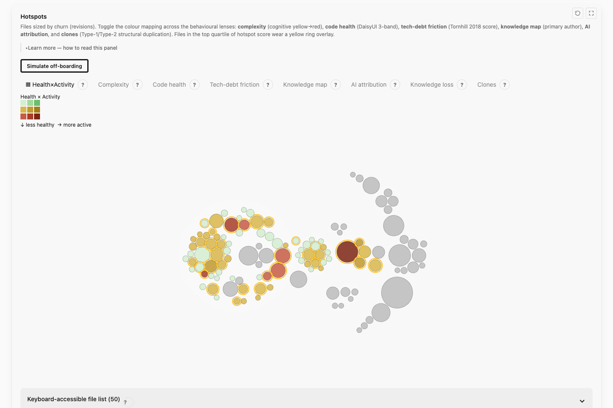

# CodeLore

<!-- Primary topic discovery row (mirrors code-maat's own GitHub topics). -->
[](https://github.com/topics/behavioral-code-analysis)
[](https://github.com/topics/code-analysis-tool)
[](https://github.com/topics/repository-mining)
[](https://github.com/topics/technical-debt)
[](https://github.com/topics/code-maat)

<!-- Tech-stack + secondary discovery row -->
[](https://github.com/topics/rust)
[](https://github.com/topics/sarif)
[](https://github.com/topics/clone-detection)
[](https://github.com/topics/hotspot-analysis)
[](https://github.com/topics/developer-tools)

<!-- Live status + release + license meta -->
[](https://github.com/emrecdr/codelore/actions/workflows/ci.yml)
[](https://github.com/emrecdr/codelore/releases/latest)
[](LICENSE)
[](https://www.rust-lang.org/)

> **Read the lore of your codebase.**

Behind every codebase is a human narrative your linter cannot see: who wrote this, who still understands it, which corners hide tribal knowledge nobody's written down, and where the historical scars are buried. Every commit is a piece of this **lore**.

**CodeLore** mines your repository's git history and projects it into a full catalogue of **behavioral analyses** — hotspots, change-coupling, ownership maps, knowledge-island bus-factor risk, code-health scores, live clones (copy-paste blocks × Fisher-significant co-change), dependency tangles ranked by churn heat, modularity violations (co-change without imports), refactoring-targets ROI ranking, and dozens more — fused with the static import graph, calibrated against a reference corpus so you know whether a number is actually bad, and surfaced as SARIF for your existing CI dashboard, a single-file interactive dashboard, and a local MCP server for AI agents. The socio-technical signal your linter cannot see, with the methodological honesty your team can audit.

A Rust **drop-in successor** to Adam Tornhill's [code-maat](https://github.com/adamtornhill/code-maat) — every published code-maat analysis is supported under the same `--analysis NAME` flag, with modern improvements: deterministic tiebreaks, Fisher exact significance gates, SARIF output, persistent cache, PR-mode diffing, and a SQL-queryable fact store. Built on [gix](https://github.com/GitoxideLabs/gitoxide) (pure-Rust git), [DuckDB](https://duckdb.org) (embedded analytics), [fancy-regex](https://github.com/fancy-regex/fancy-regex) (lookaround support for architectural grouping), and a vendored fork of Mozilla's [rust-code-analysis](https://github.com/mozilla/rust-code-analysis) (tree-sitter complexity).

[](https://emrecdr.github.io/codelore/demo/)

<p align="center"><strong><a href="https://emrecdr.github.io/codelore/demo/">Live demo →</a></strong> codelore analyzing its own repository, regenerated on every push to main.</p>

<p align="center"><a href="#quick-start">Quick start</a> · <a href="#the-analyses">The analyses</a> · <a href="#interactive-dashboard---format-spa">Interactive dashboard</a> · <a href="#agent-integration">MCP / agent integration</a> · <a href="#migrating-from-code-maat">Migrating from code-maat</a> · <a href="https://emrecdr.github.io/codelore/">Project site</a></p>

---

## Why you need this

Static analyzers (SonarQube, ESLint, Clippy) read code at a single point in time. CodeLore reads its **history**, and that history answers questions static tools can't:

- **Bus-factor risk** — *"Which complex hotspots are owned by a single contributor — what happens when they go on leave?"*
- **Hidden architectural debt** — *"Which files are implicitly coupled — always modified together — but live in different subsystems?"*
- **Refactoring ROI** — *"Which highly complex files are actively changing (refactor!) vs stable (leave alone)?"*
- **Live clones** — *"Which copy-pasted blocks keep being edited in lockstep (real debt) vs which are dead patterns nobody touches (noise)?"*
- **Modernization scope** — *"Which files do my AI-coding-assistant commits touch most heavily?"* (`ai_attribution` column on every commit; auto-detects Claude / Copilot / Cursor / Aider / Cody / Continue / Codeium / Windsurf / Devin / Tabnine / Amazon Q)

CodeLore focuses on the **socio-technical dimension** — the legends your codebase tells about itself — so you can focus refactor effort where it actually pays off.

---

## What makes CodeLore different

What separates CodeLore from code-maat, CodeScene, and jscpd:

- **🎯 Live-clone × co-change intersection.** Every clone detector finds copy-pasted blocks. CodeLore intersects clones with Fisher-significant change-coupling — flagging only the clones whose copies actually evolve together. Dead clones (look-alike code nobody touches) are filtered out as noise; live clones (real debt) are surfaced with a `combined_score` ranking. We're not aware of another OSS tool that ships this intersection.
- **🧬 Structure × history fusion.** The import graph and the change-coupling graph are analyzed *together*, not side by side: `modularity-violations` flags file pairs that always change together with **no** import edge between them, `unstable-interface` and `crossing` find dependency shapes that drag their dependents, `cycle-health` ranks every import tangle by behavioral heat — live vs fossil, with a suggested extraction point and its predicted propagation-cost drop — and the dashboard's dependency matrix has a Fusion mode that classifies every cell by structure×history agreement.
- **📋 Behavioral SARIF.** Findings land natively in **SARIF 2.1.0**: `CODELORE-HOTSPOT`, `CODELORE-CLONE`, and `CODELORE-LIVE-CLONE` in analyze mode, `CODELORE-MISSING-COCHANGE` and `CODELORE-DELTA-HEALTH` on PR diffs, and per-gate rules with commit evidence chains from `codelore check`. Drop them straight into GitHub Code Scanning, GitLab security dashboards, or Defectdojo and alerts appear inline on pull requests.
- **🔍 Transparency over opaque ML.** CodeScene's hotspot ranking is a closed ML model. CodeLore ranks with a **published deterministic formula**: `percentile_rank(revisions) × percentile_rank(cognitive_complexity) × (100 − cognitive_health) / 4`. Every input is emitted alongside the score; anyone can reproduce it.
- **🗣️ Grounded LLM narratives (opt-in, local-first).** `codelore explain <path>` prints a deterministic per-file evidence dossier — free, offline, no LLM. Add `--llm` (or `diff --llm` for a PR narrative) and a model turns that dossier into a diagnosis and refactoring direction, with a **citation check** verifying every number it quotes against the evidence and stamping the result `grounded ✓` or `⚠ contains uncited claims`. Local-first: the default endpoint is a local ollama, keys are env-only and never persisted, and the advisory layer can never touch a score, gate verdict, or exit code. The check's accuracy is measured, not asserted — labelled-corpus and model-study evidence lives in [`docs/narrative-evidence-v1.md`](docs/narrative-evidence-v1.md).
- **🧾 Provenance manifest.** Every run emits a `.provenance.json` sidecar recording every config knob (auto-derived via canonical Options serialization — adding a new field auto-propagates), version pin, and timestamp. Reproducibility receipt for the run; eliminates the "we got different numbers because we silently used different thresholds" failure mode.
- **💾 SQL-queryable fact store.** No proprietary format lock-in. Export the full DuckDB store as Parquet or SQLite and query your git history as a database from the command line.
- **⚡ Persistent cache.** Second invocation on the same `(repo, HEAD, options)` opens read-only in ~10 ms instead of re-walking history — typically a 10-100× speedup on the dev inner loop depending on repo size, and the foundation of the `codelore diff` PR-mode subcommand.
- **📊 Corpus-relative percentiles.** A code-health score of 78 means nothing without a reference point. An embedded reference corpus — built from permissive-license OSS projects across five languages — answers "is this complex for the ecosystem?" with per-language percentile breakpoints on `code-health` and corpus percentiles on repo-level architecture metrics (propagation cost, cycle file share), fully offline and shipped in the binary. Every corpus percentile carries a **Wilson 95% confidence interval** — a percentile against a finite reference pool is a sample estimate, and the bounds make that uncertainty visible instead of implying false precision. `codelore calibrate` builds a private org corpus — each pinned repo is fetched shallow and ingested HEAD-only, so corpus builds are fast — letting you compare against your own codebase portfolio instead of the public world. Going one step further, `codelore calibrate-defects` mines *this* repository's own fix-commit history — with tangled mega-commits and rename-only ghost changes excluded from the evidence, and the exclusion counts disclosed — and reports whether the health score actually predicts where its defects land — the ROC AUC and precision@k of HEAD structural risk against the defect-implicated files, printed at the end of the run and flattened by `codelore analyze --analysis defect-validation` — and, when that evidence clears an honesty floor, retunes the smell weights to your repo. Association, not causation; every figure carries its sample size.
- **🚦 Quality gate inside the agent loop.** `codelore gate` — and its MCP twin `gate_changes` — evaluate your **uncommitted working tree** against HEAD *before you commit*: projected per-file code-health delta (with a floor on each newly added file's own score) and newly-introduced import cycles, gated by the same `.codelore-thresholds.toml` and optional defect-calibrated weights; it also surfaces duplicated functions introduced only in the working tree and reports coupling blast radius. The companion `change_context` tool briefs an AI coding agent on a file's ownership, co-change partners, and calibrated risk *before* it writes. The behavioral, temporal signal a static pre-commit gate can't see — fully local, no account, in the loop. The same thresholds file drives `codelore check` in CI, where the red-effort ceiling can exempt health-*improving* churn — so a remediation campaign refactoring its worst files doesn't trip the very gate that guards them.
- **🔒 Fully local, including the agent surface.** No account, no server, no telemetry: analysis, quality gates, the dashboard, and the `codelore mcp` server all run against the repository on your disk. The dashboard is one self-contained HTML file; the reference corpus is embedded in the binary; nothing phones home. The one deliberate exception is the opt-in `--llm` layer above — and even that defaults to a local endpoint.
- **🔗 Drop-in code-maat compatibility.** Every published code-maat analysis is supported under the same `--analysis NAME`. The `--code-maat-compat` flag flips internal defaults (`min-revs` pivot, CSV column headers for `summary` / `code-age` / `communication` / `ownership` / `authors`, `--min-soc` overload) back to legacy semantics for users with dashboards that parse code-maat CSV verbatim — see the [migration table](#migrating-from-code-maat) below.

### How it compares to GitHub Code Quality

GitHub Code Quality brings native PR integration, zero setup on GitHub-hosted repos, and CodeQL's rule depth to point-in-time static analysis. CodeLore's angle is different — and complementary:

| Axis | GitHub Code Quality | CodeLore |
|---|---|---|
| **Analysis signal** | Point-in-time static findings | Git-history behavioral signal: hotspots, change coupling, ownership, defect-calibrated risk |
| **Where it runs** | Hosted CI on GitHub's infrastructure | A single portable binary, offline-capable — the same one gates this repository's own CI |
| **Cost model** | Per-committer subscription plus metered CI compute and AI credits | Free and open source |
| **Agent surface** | None | Local MCP server exposing every analysis as an agent tool |
| **In-agent-loop gate** | None | `gate_changes` + `change_context` MCP tools and the `codelore gate` CLI: a defect-calibrated behavioral verdict on uncommitted changes *before* they are committed |
| **Data residency** | Code analyzed in GitHub's cloud | Nothing leaves the machine |

This is a comparison with the Code Quality product, not the Code Scanning integration described above — CodeLore's SARIF output feeds GitHub Code Scanning directly; the two sit side by side rather than competing.

---

## The analyses

Run `codelore analyze --analysis NAME` for any of the analyses below. They are grouped by the question you bring, not by how each one is built.

### Hotspots & change coupling

*Where is the risk concentrated, and what changes together?*

| Analysis | Output | Why it matters |
|---|---|---|
| `summary` | one-page repo overview | First slide of any review |
| `revisions` | per-file commit count | First-look hotspot proxy |
| `hotspots` | files ranked by `percentile_rank(revs) × percentile_rank(cognitive) × (100 − cognitive_health) / 4` | Published formula transparency; CodeScene-equivalent signal |
| `hotspot-velocity` | files *accelerating* in churn — recent vs baseline change rate | Early warning: a file becoming a hotspot before its all-time count shows it |
| `coupling` | file pairs with Fisher-significant co-change | Hidden architectural debt |
| `soc` | sum of coupling per file (centrality measure) | Network-level coupling outliers |
| `centrality` | per-file degree / PageRank on the Fisher-significant coupling graph | Network-centrality lens on behavioural coupling (Newman 2010 §7) |
| `communities` | Leiden algorithm partitions on the coupling graph | Conway's-law cluster auto-detection (Traag, Waltman, van Eck 2019) |
| `abs-churn` | LOC added/deleted per date | Trend dashboards |
| `author-churn` | LOC added/deleted per author | Effort distribution |
| `entity-churn` | LOC added/deleted per file | Refactor-target ranking |
| `code-age` | months since last modification per file | Find dead code + recently-volatile areas |

### Knowledge & team

*Who knows this code, and where is the staffing risk?*

| Analysis | Output | Why it matters |
|---|---|---|
| `authors` | per-file count of distinct authors (humans / bots / AI broken out) | Bird et al. 2011 defect-risk indicator |
| `top-committers` | per-author leaderboard (commits, LoC, first/last commit, bot flag) | Release notes / contributor recognition |
| `ownership` | Fractal Value (1-HHI) per file + main-author | Bus-factor / knowledge-loss risk |
| `entity-effort` | per-(file, author) revision counts | "Who's doing the work on this file?" |
| `entity-ownership` | per-(file, author) added/deleted breakdown | Fine-grained ownership view |
| `main-dev` | top author per file by lines added | Onboarding / handoff |
| `main-dev-by-revs` | top author per file by revision count | Stewardship view |
| `main-dev-by-deletions` (alias: `refactoring-main-dev`) | top author per file by lines removed | Refactoring authorship |
| `communication` | author pairs by shared-file work | Conway's law signals |
| `knowledge-islands` | per-file bus-factor risk from departed primary authors | Auto-detects knowledge loss vs CodeScene's required manual Ex-Developer marking |
| `code-familiarity` | SLOC-weighted mean team familiarity + knowledge-islands ratio | One-number coverage question: "What fraction of this codebase is actively understood?" |
| `team-composition` | per-author tenure bucket (onboarded / experienced / veteran) with `veteran_breadth_ok` gate, `active` flag, commit count, `files_touched`, and `onboarding_weeks`; a `__summary__` row carries bucket-percentage breakdown | Onboarding throughput + veteran over-concentration at a glance |
| `coordination-needs` | per-file authorship fragmentation × interleave × co-change entropy, tiered single→high | Strongest predictors of merge friction and review delays |
| `marginal-owner-risk` | ownership concentration × code-health: files where the most knowledgeable active author holds a low share | Predicts where the on-call person has the least context when a red-band file breaks |
| `bus-factor` | per-module Filatov 2010 bus factor | Lifts CodeScene's file-level "Key Personnel" to actionable module-level granularity |
| `pair-programming` | per-pair commit count from `Co-Authored-By:` trailers | Surfaces who pair-programs with whom across the project |

### Architecture & dependencies

*How is the system structured, and where is it tangling?*

| Analysis | Output | Why it matters |
|---|---|---|
| `architecture-violations` | imports crossing forbidden layer boundaries per `.codelore-arch-rules.toml` | Layered-architecture enforcement at CI time |
| `dependency-cycles` | strongly-connected components (tangles) of the import graph | Tarjan SCC — the cyclic-dependency smell a DSM shows as a red diagonal block (Fontana et al. 2017) |
| `cycle-health` | per-cycle churn heat, live/fossil verdict, best extraction candidate + predicted propagation-cost drop | Ranks tangles by behavioral urgency — untangle the live, hot cycles first, starting at the suggested cut point |
| `architecture-roles` | per-file Core / Shared / Control / Periphery from import-graph reachability | Baldwin & MacCormack "hidden structure" — maps the architecture + per-file blast radius (propagation cost) |
| `instability` | per-file afferent/efferent coupling + Instability `I = Ce/(Ca+Ce)` | Robert C. Martin's package metrics — find unstable files that too much depends on |
| `architecture-metrics` | repo-level propagation cost, Lakos ACD/NCCD, cycle count, architecture type, plus an import-resolution disclosure that separates first-party coverage from third-party imports | One trendable structural-health summary (Lakos 1996; MacCormack/Baldwin) |
| `architecture-trend` | propagation cost / cycles / largest tangle recomputed at sampled historical revs | Is the architecture decaying, and when did it start? Structure × history over *time* |
| `cycle-origins` | bisects history to find the commit each HEAD dependency cycle first formed | Commit-level archaeology: "this tangle started here" — actionable blame for cycles |
| `modularity-violations` | co-change pairs (Fisher-significant) with **no** import edge between them | The structure×history fusion — implicit cross-module dependencies (Mo, Cai & Kazman 2015 *Hotspot Patterns*) no import-only graph can see |
| `unstable-interface` | widely-imported files that change often AND drag their dependents | DV8 "Unstable Interface" — instability that propagates through the dependency graph |
| `crossing` | structural "X" files (high fan-in AND fan-out) that co-change in both directions | DV8 "Crossing" — couples upstream and downstream through itself; hardest shape to change safely |
| `god-classes` | files combining high cognitive × fan-in × fan-out | Brown et al. 1998 AntiPatterns §3.1 — surfaces files where every dimension pulls up |

### Code health & quality

*Which files are unhealthy, and where should refactoring go first?*

| Analysis | Output | Why it matters |
|---|---|---|
| `code-health` | biomarker composite score 0..100 per file: `100 × (1 − 0.50·structural_risk − 0.30·churn − 0.20·ownership_fv)`; `structural_risk` is a weighted sum of eight biomarkers (Complex Method 0.22, God Class 0.18, Large Method 0.12, DRY 0.12, Shotgun Surgery 0.12, Deep Nesting 0.10, Many Args 0.07, Complex Conditional 0.07); each row carries a `band` (red ≥ 0.55 / yellow ≥ 0.28 / green) and per-language `percentile` of structural risk; also **corpus-relative percentiles** — how each file's raw complexity compares to a reference corpus, or to your own organization's | Multi-dimensional file-quality score with explicit biomarker breakdown |
| `health-trend` | code-health score series per file at sampled historical revisions; feeds the health-trend sparklines and improvements feed on the SPA dashboard | Distinguishes files that are genuinely improving from those that briefly recovered before deteriorating again |
| `defect-validation` | reads a `codelore calibrate-defects` artifact and flattens its evidence: where mined defects landed by code-health band at the time, plus AUC / precision@k of HEAD structural risk against the defect-implicated file labels | Validates whether *this* repo's health score predicts its own defects — association, not causation; reads the artifact only (zero rows + a hint without one) |
| `clones` | Type 1 + Type 2 clone families via AST structural hashing | Function-level copy-paste detection across Rust/Python/Java/JS/TS |
| `clone-coupling` | clones intersected with Fisher-significant co-change | **The strategic differentiator** — separates live debt from dead noise |
| `stale-code` | files alive at HEAD untouched ≥12 months AND low cognitive | The intersection minimises false-positive deletion candidates |
| `refactoring-targets` | files ranked by refactoring ROI: `priority = (structural_risk × hotspot_score) / max(loc, 25)`; each row annotated with `dominant_type` (highest-intensity biomarker) and `manual_up_rank` (ascending-size ManualUp baseline) | Effort-aware Popt/PofB20-style ranking — a small, dense, churning, unhealthy file outranks a large one with the same raw risk |
| `function-xray` | per-function hunk-overlap attribution: counts revisions where at least one diff hunk overlaps the function's line span at `--target <path>`; requires `--target` | Gall et al. ICSM 2003 HistoryFinder — per-function change-frequency leaderboard with LOC, cyclomatic, and cognitive complexity; more precise than file-level churn |
| `function-coupling` | per-function-pair co-change frequency with two-tailed Fisher exact significance at `--target <path>`; emits pairs with co-change count ≥ 2, sorted by p-value ascending | Adams et al. ICSM 2006 — function-level logical coupling within a file; low-p pairs are candidates for extract-and-share refactoring |
| `messages` | per-file count of commits matching `--expression-to-match` regex | Bug/refactor archaeology |

### Delivery & process

*How is work flowing from commit to release?*

| Analysis | Output | Why it matters |
|---|---|---|
| `lead-time` | per-commit author-date → committer-date delta (DORA metric) | In-flight review time without GitHub PR metadata |
| `delivery-friction` | composite of `percent_rank(revs) × percent_rank(median lead-time) × percent_rank(cognitive)` per file | Counters CodeScene v7.4's Delivery Analysis surface; lights up only files elevated on all three axes (churn × review-time × complexity), with p95 lead-time + WIP-age side columns |
| `delivery-metrics` | p50/p75/p90 distributions of five flow-metric proxies (batch size, branch duration, rework %, lead-time proxy); requires `--include-merges`; each row carries a plain-text caveat | Git-only flow-metric sampling; drives the Delivery factor tile on the SPA dashboard. Not a DORA replacement |
| `release-cadence` | per-release-tag inter-release gap (days) plus a `__summary__` row with median, IQR, OLS trend (`accelerating` / `stable` / `slowing`); tags filtered by `--release-tag-glob` (default `v*`) | Release-velocity monitoring without a deployment system; drives the cadence number on the Delivery factor tile |
| `effort-exposure` | per-band (red/yellow/green) breakdown of commit share and LOC share over the trailing window | Answers whether engineering effort is concentrated in healthy or unhealthy code; drives the effort-exposure share bars on the SPA dashboard |

### External-signal fusion

*Where does outside scanner signal land on your riskiest code?*

| Analysis | Output | Why it matters |
|---|---|---|
| `finding-hotspot-overlap` | files where external scanner findings (via `ingest-sarif`) overlap the most-churned, least-healthy code — reports finding count, engines, worst level, hotspot score, revision percentile, health band, and an `act-now` / `plan` / `note` priority | Behavioral×static fusion: surfaces the intersection of scanner signal and behavioral evidence; drives the `max_findings_in_hot_files` gate and the `finding_hotspot_overlap` MCP tool |

### CLI subcommands

In addition to `codelore analyze` and `codelore diff`, the CLI exposes:

```bash
codelore explain <metric>           # formula + citation + SQL source for any metric
codelore explain <path>             # per-file evidence dossier; --llm adds a grounded advisory narrative
codelore check                      # quality-gate validation against .codelore-thresholds.toml
codelore gate                       # working-tree quality gate: uncommitted changes vs HEAD (pre-commit / agent loop)
codelore diff base..head            # PR-mode diff and quality gate
codelore mcp --repo <path>          # MCP server over stdio for AI agent integration
codelore ingest-sarif --repo . scan.sarif   # ingest external scanner findings (CodeQL, Semgrep, …)
codelore profile                    # operational telemetry (version, schema, deps, cache root)
codelore docs                       # markdown analysis catalogue
codelore calibrate --repos corpus.toml --output org.calib.json   # build an org-specific reference corpus
codelore completions <shell>        # bash | zsh | fish | powershell | elvish
codelore schema <row-type>          # JSON Schema 2020-12 emit
```

`codelore check` writes `result=pass|fail` + `violations=N` to `$GITHUB_OUTPUT` when the env var is set — direct GitHub Actions step-output integration. It also works as a git hook: `codelore check --repo . --quiet` exits 0/1 and suppresses per-violation noise for hook scripts. `codelore check --format sarif` emits SARIF 2.1.0 with a commit evidence chain (top-5 contributing commits per violated file) to stdout — pipe it into the `github/codeql-action/upload-sarif` step and findings appear inline on PRs with reviewer-facing commit lineage. See [§11.8 of the advanced-usage guide](docs/advanced-usage.md) for a ready-to-paste `.git/hooks/pre-push` script, exit-code contract, warm-cache performance notes, `--ratchet` + `--history` in hook workflows, and the full GitHub Actions upload snippet.

`codelore gate` extends the same `.codelore-thresholds.toml` to the **uncommitted working tree**: it re-parses only the changed files and projects each one's code-health delta against HEAD (with a separate floor on each newly added file's own projected score), detects newly-introduced import cycles (by membership, not just count), surfaces duplicated functions introduced only in the working tree, and reports coupling blast radius — with check-parity exit codes (0 pass / 1 violation) so it drops straight into a `pre-commit` hook. Its MCP twin `gate_changes` hands an AI coding agent the same verdict *in the loop*, before the change is committed, and the companion `change_context` tool briefs the agent on a file's ownership, co-change partners, and calibrated risk *before* it edits — the behavioral, temporal signal a static pre-commit gate cannot see. See [§11.9 of the advanced-usage guide](docs/advanced-usage.md#gate_changes) for the `check` / `gate` / `diff` comparison table and the full working-tree gate reference.

This repository is gated by its own product: the `self-gate` CI job runs `codelore check` against the committed [`.codelore-thresholds.toml`](.codelore-thresholds.toml) on every push and pull request, and blocks the merge on a violation — the gates in this repo are the product's own output.

**Behavioral×static fusion:** `codelore ingest-sarif --repo . scan.sarif` ingests findings from any SARIF 2.1.0 producer (CodeQL, Semgrep, clippy-sarif) into a per-repo sidecar that survives fact-store cache eviction. `codelore analyze --analysis finding-hotspot-overlap` then joins those findings with the hotspot and code-health signal, producing a priority label (`act-now` / `plan` / `note`) for each flagged file. The `max_findings_in_hot_files` gate in `.codelore-thresholds.toml` enforces a ceiling on `act-now` count in CI; the `finding_hotspot_overlap` MCP tool exposes the same table to AI agents.

---

## Quick start

Pick whichever fits your machine:

```bash
# Homebrew (macOS or Linuxbrew, arm64 or x86_64):
brew install emrecdr/codelore/codelore

# Prebuilt binary via cargo-binstall (any Rust dev environment):
cargo binstall codelore

# From crates.io (Rust 1.96+ toolchain required). Compiles the bundled
# DuckDB from source, so it's slower than Homebrew or cargo-binstall
# above — those stay the recommended fast path:
cargo install codelore

# ...WITH the optional interactive dashboard emitter (`--format spa` —
# Apache ECharts + d3-hierarchy fetched once at build time, SHA-pinned).
# Requires internet on first build:
cargo install codelore --features spa

# Development build straight from the repo (same from-source compile):
cargo install --git https://github.com/emrecdr/codelore codelore

# Container (distroless; the entrypoint is the codelore binary):
docker run --rm -v "$PWD":/repo ghcr.io/emrecdr/codelore:latest \
    analyze --analysis hotspots --repo /repo
```

Or grab a prebuilt archive straight from a [GitHub Release](https://github.com/emrecdr/codelore/releases/latest) — five targets ship per tag (macOS arm64/x86_64, Linux arm64/x86_64-gnu, Windows x86_64-msvc), each with SLSA Build L3 provenance attached.

Verify a download before trusting it. Pinning `--signer-workflow` is what makes the check meaningful — it asserts the attestation came from the dedicated signing workflow, which runs no build code, rather than from anywhere in the repository:

```bash
gh attestation verify codelore-<tag>-<target>.tar.gz \
  --owner emrecdr \
  --signer-workflow emrecdr/codelore/.github/workflows/attest-artifact.yml
```

The rest of this README assumes `codelore` is on your PATH — substitute `./target/release/codelore` if you skipped the install step.

```bash
# Your first analysis: the top 10 hotspots in any git repo
codelore analyze --analysis hotspots --repo . --min-revs 5 --rows 10
```

Before the analysis runs, codelore prints a pre-flight banner to stderr (auto-suppressed when piped; suppress explicitly with `--no-banner`):

```
────────────────────────────────────────────────────────────────────────
 codelore                                 gix · duckdb
────────────────────────────────────────────────────────────────────────
 Repo:     /Users/you/code/your-project
 Branch:   main @ a891295
 Analysis: hotspots  (min-revs=5, rows=10)
 Status:   ✓ ready
────────────────────────────────────────────────────────────────────────
```

The banner doubles as a fail-fast gate: if the path isn't a git repo, the repo has no commits, or `--output` points at a directory that doesn't exist, the banner renders `Status: ✗ <reason>` with a one-line `Hint:` and codelore exits non-zero — before spending 5–30 seconds on ingest you'd have to abort anyway.

Output (CSV, the default, on stdout — pipeable into other tools):

```
entity,revisions,cognitive,cognitive-health,hotspot-score,mi,mi-rank,mi-band,ai-pct
src/auth/session.rs,87,42.00,60.00,9.1837,-12.40,0.0312,low,18.39
src/db/migrate.rs,54,28.00,71.20,4.6125,24.85,0.4157,moderate,0.00
src/api/handlers.rs,38,18.00,80.36,2.4310,58.11,0.7982,high,4.17
```

- `cognitive-health ∈ [60, 100]` — higher = healthier (60 is the floor because the cognitive-complexity term contributes at most 40 points of deduction). This is the hotspots analysis's own inline proxy, distinct from the `code-health` analysis's composite score.
- `hotspot-score ∈ [0, 10]` — higher = more pressing refactor candidate. `9.18` means "near the top of the curve on revisions × complexity × poor health" — the canonical "on fire" file.
- `mi` / `mi-rank` / `mi-band` — Maintainability Index with a repo-relative percentile rank and band (`low` / `moderate` / `high`); banding is percentile-based because the literature's absolute MI thresholds misclassify real-world file sizes.
- `ai-pct` — share of the file's revisions coming from AI-assistant-attributed commits.

The top row is the file to look at first: high churn × high complexity × low code health = highest score.

When the analysis completes, codelore prints a footer summary to stderr (same TTY suppression rules):

```
────────────────────────────────────────────────────────────────────────
 ✓ hotspots completed in 4.3s
────────────────────────────────────────────────────────────────────────
```

---

## Your first 5 minutes with CodeLore

Four commands that build intuition:

**1. What does the repo look like?**

```bash
codelore analyze --analysis summary --repo .
```

One-page snapshot: commits, files, authors. Confirms you're pointed at the right git history.

**2. Where's the technical debt?**

```bash
codelore analyze --analysis hotspots --repo . --min-revs 5 --rows 10
```

Top 10 files ranked by hotspot score. Usually 2-3 names jump out as "I've been meaning to refactor that".

**3. Who owns the risky code?**

```bash
codelore analyze --analysis ownership --repo . --rows 10
```

Files sorted by ownership fragmentation (Fractal Value). High FV = many contributors share the file; low FV = bus-factor risk.

**4. Which copy-pasted code is actually hurting you?**

```bash
codelore analyze --analysis clone-coupling --repo . --format markdown
```

Live clones — function-level copy-paste families whose copies co-change at Fisher-significant rates. Real code-duplication debt: every change has to be made in N places, every bug has N variants. Dead clones (filtered out) are noise.

Once you've run those four, you have enough signal to triage. To watch these numbers over time rather than inspect them once, continue to the next section; for the full flag and analysis reference, see [the advanced guide](docs/advanced-usage.md).

---

## Tracking health over time

Those four commands are snapshots. To *watch* a codebase rather than inspect it once, chain four shipped features into a loop that tightens as you improve.

**1. Baseline — where are you now?**

```bash
codelore analyze --analysis health-trend --repo .
codelore analyze --analysis architecture-trend --repo .
```

`health-trend` returns a per-commit series of `arch-health`, `code-health` and `combined-health` with green/yellow/red bands. `architecture-trend` tracks propagation cost, cycle count and largest cycle across the same history. Both run with no configuration and no flags — this is your before picture.

**2. Write the bounds down**

Gates live in `.codelore-thresholds.toml` at the repo root. The numbers are repo-specific, so derive them rather than copying them: **measure today's worst value, set the bound just past it, and record the measurement in a comment above it.**

```toml
[gates]
# Worst file today: src/legacy/parser.rs at 41.2. The floor sits below it so
# routine churn doesn't trip the gate — only real decay does.
code_health_min = 38.0
# Exactly one import cycle exists today. A second one fails the gate.
max_dependency_cycles = 1
# Share of recent churn landing in red-band files, counted against
# health-scored churn only and exempting churn that improves a file's health.
# ~29% today while a refactor campaign is in flight; the ceiling tracks that
# with margin. See docs/advanced-usage.md for the full definition.
max_red_effort_pct = 30.0
```

A bound that tracks today's worst gates on *regression*, not on the status quo. [This repository's own thresholds file](.codelore-thresholds.toml) is a worked example — every gate carries the measurement it came from and why its margin exists.

**3. Enforce it in CI**

```yaml
- uses: emrecdr/codelore@v1
  with:
    command: check
    args: '--thresholds-file .codelore-thresholds.toml'
```

`codelore check` exits non-zero on any violation, which fails the step and the build. With no thresholds file it passes vacuously — configured gates are what make it bind.

**4. Ratchet, so the bar rises with you**

```bash
codelore check --repo . --ratchet
```

Commit the generated `.codelore-ratchet.toml`. The ratchet records today's measured values and tightens automatically when they improve, so a regression fails even when it stays inside the original threshold. It tracks a metric only when the matching gate is configured, so step 2 comes first.

---

## Interactive dashboard (`--format spa`)

**[Live demo →](https://emrecdr.github.io/codelore/demo/)** — codelore analyzing its own repository, regenerated on every push to main.

Emit a single self-contained HTML file you can open in any browser,
share via Slack, attach to a CI run, or install as a PWA. Runs
fully offline — no server, no CDN, no JavaScript bundles to host.

```bash
codelore analyze --format spa --output codelore.html --repo .
```

### What's inside

Interactive widgets driven by a single embedded JSON blob, organised into **six titled sections** — a sticky nav bar tracks your scroll position and jumps to any section, each section collapses behind its heading chevron, and below 1280px everything renders single-column so the dashboard stays readable on a laptop half-screen:

- **Overview** — four composite factor tiles (Code / Architecture / Knowledge / Delivery) with XmR attention badges that fire only on statistically unlikely trends (the tiles double as section jump links); repo KPIs (files, commits, contributors, median code-health, complexity peaks, MI band breakdown); a four-step guided tour; and the hero **hotspot circle-pack** — files sized by churn, coloured by default as a **bivariate health×activity map** (the unhealthy-and-churning danger quadrant reads at a glance), with seven single-signal lenses one tab away: complexity, code health, tech-debt friction, knowledge map, AI attribution, clones, and knowledge loss under your off-boarding scenario
- **Hotspots & Risk** — sortable/filterable hotspot table, strict-area treemap of the same data, and the function-level cognitive-complexity sunburst
- **Code Health** — repo health timeline, monthly revision trends for the top-N hotspots, effort-by-band share bars (what fraction of churn lands in red/yellow/green code), a health improvements & regressions feed, cognitive-complexity distribution boxplot, and a parallel-coordinates comparison across five behavioural axes with drag-filtering
- **Architecture** — resolved-import force-graph vs change-coupling chord (agreement = healthy modularity; disagreement = signal worth investigating); a dependency structure matrix with a **Fusion cell-mode** that classifies every cell by structure×history agreement — imports that co-change, imports that never do, and co-change with no import edge at all (a modularity violation); architecture trend at sampled historical revisions; and a Fisher-significant change-coupling sankey
- **Knowledge** — knowledge surfaces (team familiarity, tenure mix, coordination needs) and auto-detected knowledge islands: files whose primary author has departed and where no other substantial owner exists (no manual ex-developer marking required)
- **Delivery** — git-only delivery-flow proxies (rework %, branch duration, release cadence), per-commit risk (Kamei JIT-SDP) with the dominant risk dimension annotated, and a GitHub-style commit-activity calendar heatmap
- **File detail drawer** (everywhere) — click any file in any widget to slide in a tabbed side panel (Overview / Coupling / People / Health / X-Ray) with its full profile; the X-Ray tab shows a per-function change-frequency leaderboard for the top-10 hotspot paths

### What you can do with it

- **Tune every chart in place.** Depth selectors on the coupling chord / arch graph / sankey; Top-N tabs on Trends / Multi-metric / Delivery risk. Selections survive reload and sync to the URL hash so a pasted link reproduces the exact view your teammate is looking at.
- **Simulate off-boarding.** Tick departing authors → the hotspot circle-pack recolours, the hotspot table flags affected rows, and the file drawer flags every coupling partner and contributor owned by a departing author. See the bus-factor exposure before it becomes an incident.
- **Click any file.** The right-side drawer slides in with its full profile organised into **Overview / Coupling / People** tabs — a 6-axis behavioural radar, hotspot metrics, knowledge-island data, top contributors with `+added/-deleted` LoC, coupling partners + their authors, top complex functions with line numbers, and clone-group membership. Non-modal — click another row and the content swaps in place.
- **Linked brushing everywhere.** Select a file in *any* view — the hotspot map, table, coupling sankey, architecture DSM, trends, or multi-metric plot — and it lights up across all of them at once (and is announced to screen readers). Click a cell in the health×activity legend to brush every file in that quadrant. One shared focus; highlight, not hide.
- **See what's coupled to what.** Selecting a file on the hotspot map outlines it and its change-coupling partners in blue and lists those partners (with co-change %) in its tooltip — so implicit "always changed together" relationships across subsystems are legible at a glance, not just implied by arcs.
- **Self-explanatory.** Every widget has a *Learn more* disclosure: what it measures, how to read it, what signal to watch for, recommended action, and citation. Hover the `?` icons on tabs for one-line explanations.
- **Fullscreen any panel.** Top-right corner toggle. The hotspots and architecture graphs also have wheel-zoom + drag-pan and a reset button.
- **Share the exact view.** URL hash carries depth, Top-N, and off-boarding picks. Works on air-gapped CI artefacts too — the link is just a fragment in a file URL.

### Differentiation

Signals CodeScene doesn't expose: **auto-detected knowledge
islands** (no manual ex-developer marking), **AI-attribution
filtering** as a hotspot colour mode, **clone-detection overlay**
on the same hotspot view, and **auditable per-metric formulas**
(every number links back to the SQL query that produced it via
the provenance sidecar).

The `spa` Cargo feature gates the visualisation deps. Pre-built
binaries (Homebrew, ghcr, GitHub Releases) enable it, so the
dashboard works out of the box.

---

## In CI: PR-mode delta analysis

```bash
codelore diff origin/main...HEAD \
  --analysis all \
  --format markdown \
  --output - >> "$GITHUB_STEP_SUMMARY"
```

Four signal families per PR, surfaced via SARIF or human-readable Markdown:

- **Hotspot deltas** — files newly entering the top-N or worsening their score (`CODELORE-HOTSPOT` SARIF rule)
- **Missing co-changes** — "you changed `auth/login.rs` but historically `auth/session.rs` always changes with it — did you forget?" (`CODELORE-MISSING-COCHANGE` SARIF rule, the CodeScene-signature signal)
- **New clone families** — copy-paste debt introduced by the PR (`CODELORE-CLONE` SARIF rule); the text/Markdown/JSON output additionally lists existing clone families the PR touched
- **Delta health** — per-function health verdict on every function added, modified, or removed by the PR (`CODELORE-DELTA-HEALTH` SARIF rule)

Quality-gate options:

```bash
# Block PRs that promote any file into the top-N hotspots:
codelore diff origin/main...HEAD --fail-on rank-entrant

# Block PRs that worsen an existing hotspot:
codelore diff origin/main...HEAD --fail-on score-increase

# Block on any finding (rank entrant, score increase, new clone
# family, or missing co-change):
codelore diff origin/main...HEAD --fail-on any
```

See [`examples/.github/workflows/codelore-pr.yml`](examples/.github/workflows/codelore-pr.yml) for the full template with the critical configuration gotchas (`fetch-depth: 0`, three-dot merge-base, SARIF upload permissions).

Cache the base-rev analysis with `--base-cache PATH` to halve dual-analysis cost across PRs that share the same base SHA.

---

## Agent integration

`codelore mcp --repo <path>` starts a Model Context Protocol server over stdio, giving AI agents (Claude, Cursor, and any MCP-compatible client) direct access to behavioral code analysis, quality gating, and an in-the-loop working-tree verdict — no account, no telemetry, fully local (the only network path is the opt-in LLM narrative, when you configure one).

**Client config** (add to your `claude_desktop_config.json` or Cursor `mcp.json`):

```json
{
  "mcpServers": {
    "codelore": {
      "command": "codelore",
      "args": ["mcp", "--repo", "/path/to/your/repo"]
    }
  }
}
```

**Available tools:**

| Tool | Purpose |
|---|---|
| `repo_overview` | Repository summary (commit count, authors, files, date range) plus active options snapshot |
| `hotspots` | Top hotspot files ranked by revision count; optional `limit` parameter |
| `code_health` | Per-file composite health scores (red / yellow / green band); optional `path` filter |
| `delta_health` | Function-level health delta between two revisions (`base`, `head` — any `git rev-parse` string) |
| `refactoring_targets` | Highest-priority refactoring candidates ranked by risk÷LOC; optional `limit` |
| `function_xray` | Per-function change-frequency and complexity for a given file `path` |
| `check_gates` | Evaluates `.codelore-thresholds.toml` quality gates at HEAD; returns verdict + violations |
| `finding_hotspot_overlap` | Behavioral×static fusion: external SARIF findings joined with hotspot rank and code-health band; each row carries an `act-now` / `plan` / `note` priority. Returns a structured `note` when the sidecar is absent |
| `explain_file` | Per-file evidence dossier (`fact_sheet`, always returned) plus — only when the server environment configures an LLM via `CODELORE_LLM_*` — a grounded advisory `narrative` with a citation-check verdict; without one, `narrative_error` is set and the call still succeeds |
| `change_context` | Pre-write briefing for 1–20 `paths`: per file, the code-health band, hotspot standing, top co-change partners, dominant-owner share with departed-owner and knowledge-concentration flags, calibrated defect risk, and recent churn — with honest "inconclusive" / "no history" forms when the signal is thin |
| `gate_changes` | Working-tree verdict for the agent loop (no parameters): evaluates uncommitted changes vs HEAD against `.codelore-thresholds.toml`, returning pass/fail plus per-finding advisories and a projected code-health delta table — the same verdict `codelore gate` prints |

**Fully local — no account, no telemetry, and no network beyond the optional `CODELORE_LLM_*` endpoint you configure.** The server reads the repository at the path you configure and answers tool calls using the same fact store that powers the CLI. The first call on a cold cache pays the one-time ingest cost (a few seconds to a couple of minutes depending on repo size); subsequent calls in the same session use the warm cache and return in milliseconds.

See [§11.9 of the advanced-usage guide](docs/advanced-usage.md) for the full tool reference, parameter details, return shape descriptions, and troubleshooting.

---

## Architectural grouping

For monorepos, treat groups of files as logical components. Drop a `groups.txt` at the repo root:

```text
# CodeLore architectural grouping. One rule per line; `<path-or-regex> => <group-name>`.
src/auth                   => Auth
src/db                     => DB
src/api                    => API
^src\/.*\/tests\/.*\.rs$   => Tests
^src\/((?!.*test.*).).*$   => Production
```

Run with `--group-file groups.txt`:

```bash
codelore analyze --group-file groups.txt --analysis revisions
```

Analyses then operate at the **group** level — `Auth`, `DB`, etc. — instead of raw paths. Plain-text LHS is matched as a prefix (anchored + slash-bound); regex LHS (starting with `^`) supports **full lookaround** via `fancy-regex` (code-maat's own test fixtures use this).

Default: **non-strict** (unmapped paths keep their raw names; safer than silent drop). Pass `--strict-grouping` to drop unmapped paths instead (code-maat's behavior).

---

## How it works (the 30-second version)

```
   Your git repo
        │  [gix walks history]
        ▼
   ┌─────────────────────┐
   │  codelore-lib        │
   │  ┌──────────────┐    │   tree-sitter parses each Tier-1 source
   │  │ codelore-rca │    │   file → cyclomatic, cognitive, Halstead,
   │  └──────────────┘    │   MI metrics, AST structural hash
   └────────┬────────────┘
            │ Stream<CommitEvent>
            ▼  + Kamei 14-feature enrichment
   ┌─────────────────────┐
   │   DuckDB Fact Store  │  commits · changes · hunks · entities ·
   │                     │  complexity_metrics · clones · imports ·
   │                     │  author_aliases · provenance
   └────────┬────────────┘
            │ SQL queries (bind-parameterized) + Rust orchestrators
            ▼
   ┌─────────────────────┐
   │  Analyses            │  → 11 output formats (CSV/JSON/NDJSON/
   │                     │     SARIF/Markdown/GHA/HTML/Parquet/
   │                     │     SQLite/SPA/Step-Summary)
   │                     │  → persistent cache (10-100× speedup)
   │                     │  → provenance.json sidecar
   │                     │
   │                     │  * SPA = single-HTML interactive
   │                     │    dashboard (opt-in `spa` feature)
   └─────────────────────┘
```

Every commit becomes a `CommitEvent` projected onto a DuckDB fact store. Each analysis is a SQL query over that store plus a thin Rust orchestrator (the historical `architecture-trend` additionally re-reads source at sampled past revisions). Outputs flow through eleven format emitters. Every run is cached and audit-trail-stamped with a provenance sidecar.

For deeper architecture, see the [design specification](docs/superpowers/specs/2026-06-06-codelore-design.md) (~1100 lines, covers every threshold and identity rule).

---

## Why these tools?

| Why this | Why not the alternative |
|---|---|
| **gix** (gitoxide, pure-Rust git) | libgit2 has LGPL friction and a C build dep; gix is pure-Rust and natively `Send + Sync` |
| **DuckDB** (embedded columnar analytics) | SQLite isn't columnar; rolling-your-own gives up the SQL surface that's a power-user feature. Polars works for in-memory but doesn't expose embedded SQL the way DuckDB does |
| **tree-sitter** via vendored `rust-code-analysis` | Hand-rolled per-language parsers don't scale; tree-sitter gives us Rust + Python + Java + JS/TS for free and AST hashing for clones falls out naturally |
| **`fancy-regex`** for architectural grouping | The standard `regex` crate doesn't support lookaround; code-maat's own test fixtures use it. fancy-regex wraps regex with a backtracking engine |
| **Rayon** + crossbeam-channel | Workload is CPU-bound batch; an async runtime would add binary bloat for no measurable gain |
| **`fishers_exact`** for change-coupling | Approximate chi-square fails at small N; exact test is methodologically defensible and the crate has zero transitive dependencies |

What we deliberately don't ship: no async runtime, no libgit2 binding, no LLM-based scoring, no web UI, **no non-git VCS support** (git-only by design — see [`docs/github-topics.md`](docs/github-topics.md) and the project memory for the rationale). See the [advanced guide](docs/advanced-usage.md#7-tool-stack-why-these-choices) for the long version.

---

## Status

Released and under active development (pre-1.0; SemVer policy in [`docs/RELEASING.md`](docs/RELEASING.md)). **A full behavioral-analysis catalogue × 11 output formats × `codelore diff` PR-mode × `codelore check` + `codelore gate` quality gates × an 11-tool local MCP server × 5 SARIF rules.** Full test suite (`codelore-lib` unit + integration, CLI-crate integration, differential `GixRepo` vs `GitCliRepo` cross-walker parity, headless-browser SPA smoke) passes on Rust 1.96.0 on Linux and macOS in CI, and the Windows MSVC target runs a curated platform-sensitive test subset (path handling, process spawning, git-backend parity, filesystem semantics) plus full compile-and-link verification on every push (hosted Windows runners cannot fit the full suite's per-test process overhead inside a practical CI ceiling, so the subset targets where Windows can actually diverge); `clippy -D warnings`, `rustfmt --check`, and `cargo deny check` all gate every push. Each tagged release ships prebuilt binaries for five targets (macOS arm64/x86_64, Linux arm64/x86_64-gnu, Windows x86_64-msvc), each with SLSA Build L3 provenance attached (signed by a dedicated trusted-signer workflow that holds the token no build job can reach), a distroless OCI container at `ghcr.io/emrecdr/codelore`, an auto-regenerated formula in the `emrecdr/codelore` Homebrew tap, and a `cargo binstall`-compatible asset layout — all produced by `.github/workflows/release.yml` on every `v*` tag push, gated by the `protect-release-tags` ruleset that requires green CI on the target commit before the tag is accepted.

Known limitations (the honest list, validated against the current codebase):

- **Code-maat sliding-window `--temporal-period N`** is intentionally **not** emulated under `--code-maat-compat` — the modern `--time-bucket DAY|WEEK|MONTH` (non-overlapping buckets, no commit-duplication artifact) is the recommended surface and what ships; the legacy sliding-window-with-duplication is an opt-in future-work item if migration users hit it

Full backlog: [`docs/roadmap-v1.x-and-beyond.md`](docs/roadmap-v1.x-and-beyond.md).

---

## Building & testing

CodeLore is a Cargo workspace; the toolchain is pinned in `rust-toolchain.toml`. The task runner is [`just`](https://github.com/casey/just) (`cargo install just`) — every recipe below is a thin wrapper over the exact command shown, so you can run the raw `cargo` line instead if you prefer.

```bash
just build          # cargo build --workspace
just release        # cargo build --workspace --release
just test           # cargo test --workspace --features test-support,spa   (CI's non-browser scope)
just test-browser   # headless-Chrome SPA smoke test — needs Chrome/Chromium on PATH; skips gracefully without one
just lint           # cargo clippy --workspace --all-targets --all-features -- -D warnings
just fmt-check      # cargo fmt --all --check
just deny           # cargo deny check   (licenses + advisories)
just ci             # fmt-check + lint + deny + test — the full local gate CI runs
```

Run the CLI against any repository:

```bash
just codelore -- analyze --analysis hotspots --repo /path/to/repo
```

The interactive dashboard (`--format spa`) needs the optional `spa` feature, which inlines Apache ECharts + d3-hierarchy at build time. `just codelore` does **not** enable it, so build/run the CLI with the feature explicitly:

```bash
cargo run --release -p codelore --features spa -- \
    analyze --format spa --output codelore.html --repo .
# then open codelore.html in a browser
```

> **Recent macOS:** if the `spa`-feature link step fails with a deployment-target mismatch, prefix cargo commands with `MACOSX_DEPLOYMENT_TARGET=15.0`.

---

## Documentation

| If you want… | Read |
|---|---|
| All analyses + every flag + CI patterns + troubleshooting | [`docs/advanced-usage.md`](docs/advanced-usage.md) |
| The full 27-feature implementation plan + validation | [`docs/maximum-feature-plan.md`](docs/maximum-feature-plan.md) |
| CodeScene visual parity strategy + design decisions | [`docs/codescene-parity-plan.md`](docs/codescene-parity-plan.md) |
| The architecture overview (workspace shape, pipeline data flow, threading model) | [`docs/codebase_analysis.md`](docs/codebase_analysis.md) |
| The full design specification (~1100 lines) | [`docs/superpowers/specs/2026-06-06-codelore-design.md`](docs/superpowers/specs/2026-06-06-codelore-design.md) |
| The prioritized roadmap (near-term and long-term backlog) | [`docs/roadmap-v1.x-and-beyond.md`](docs/roadmap-v1.x-and-beyond.md) |
| Release-blocker performance numbers | [`docs/perf-evidence-v1.md`](docs/perf-evidence-v1.md) |
| The release procedure + SemVer policy | [`docs/RELEASING.md`](docs/RELEASING.md) |
| GitHub topic tags (canonical set + `gh repo edit` command) | [`docs/github-topics.md`](docs/github-topics.md) |
| Drop-in CI integration templates | [`examples/`](examples/) |
| The version-by-version release log | [`CHANGELOG.md`](CHANGELOG.md) |
| Every implementation plan, executed task-by-task | [`docs/superpowers/plans/`](docs/superpowers/plans/) |

---

## Migrating from code-maat

CodeLore is a **drop-in successor**. Every published code-maat analysis works under the same `--analysis NAME`:

```bash
# code-maat (Clojure, JVM, log-file based)
java -jar code-maat.jar -l logfile.log -c git -a coupling

# CodeLore (Rust, native, direct git read — no log preprocessing)
codelore analyze --analysis coupling --repo /path/to/repo
```

### Modern defaults vs code-maat compatibility

CodeLore's default surface reflects modern stack capabilities; code-maat compatibility is opt-in via `--code-maat-compat`. The divergences below are intentional — see the *Modernise, don't migrate* framing in `docs/reports/deep_analysis_report.md`.

| Surface | Code-maat | CodeLore default | Reachable via `--code-maat-compat` |
|---|---|---|---|
| Default `-a` | `authors` | `revisions` | Pass `-a authors` explicitly under compat to get the per-entity Bird et al. risk indicator. |
| `-a authors` columns | `[entity, n-authors, n-revs]` | `[entity, n_authors, n_humans, n_bots, n_revs, last_author, last_modified]` — exploits CodeLore's identity layers (humans / bots / AI-author classification) | ✓ — CSV writer emits the legacy three columns under compat. |
| Per-author leaderboard | Approximated via `-a author-churn` + sort | First-class `-a top-committers` with `commits / loc_added / loc_deleted / first_commit / last_commit / is_bot` | (n/a — distinct analysis; no code-maat equivalent.) |
| `code-age` columns | `[entity, age-months]` | `[entity, age_months, age_days, last_modified]` — second-precision back-test, recency triage | ✓ — CSV writer emits `entity,age-months` under compat. |
| Column casing | `n-authors`, `age-months`, `loc-added` (hyphens) | `n_authors`, `age_months`, `added` (snake_case — Rust idiom, also matches JSON/SARIF/parquet) | ✓ — compat-mode CSV writers (`summary`, `code-age`, `communication`, `ownership`, `authors`) emit code-maat's hyphenated names. |
| Tie-break | Arbitrary | Secondary sort on canonical author name; cross-run reproducibility | (n/a — modernisation, no code-maat equivalent worth restoring.) |
| Short flags | 13 single-letter flags (`-n -m -i -x -s -t -d -l -c -r`) | Long flags only (4 surviving shorts: `-a -o -g -p -e`) | (n/a — modern CLI convention; migration map below.) |

### Short-flag migration map

Modern CLI design favours long flags; CodeLore does not restore code-maat's 2013-era cryptic shorts. The one-time script rewrite:

| code-maat | CodeLore |
|---|---|
| `-l <log>` | (no analog — CodeLore reads git directly) |
| `-c <vcs>` | (no analog — CodeLore is git-only by design) |
| `-r N` | `--rows N` |
| `-n N` | `--min-revs N` |
| `-m N` | `--min-shared-revs N` |
| `-i N` | `--min-coupling N` |
| `-x N` | `--max-coupling N` |
| `-s N` | `--max-changeset-size N` |
| `-d <date>` | `--age-time-now <date>` |
| `-t N` | `--time-bucket DAY|WEEK|MONTH` (cleaner non-overlapping buckets; code-maat's sliding window is not propagated — see the deep-analysis report in `docs/reports/`) |

---

## Why "CodeLore"?

The technical category is "behavioral code analysis." The metaphor is reading the **legends** a codebase tells about itself.

Every commit is tribal lore: who knew this code, who burned themselves on it, where the workarounds calcified, which functions are quietly cloned across a dozen files because everyone fixed the same bug in their corner. The word *lore* captures that human narrative more honestly than "metrics" or "telemetry" — it acknowledges that the most important signal about your codebase isn't in the code, it's in the people who wrote it.

CodeLore surfaces that lore as data you can act on, without pretending the methodology is more scientific than it is. Every formula is published, every threshold is documented, and every run leaves a provenance receipt. Read the lore. Act on what it tells you.

---

## License

**GPL-3.0-only.** Bundles a vendored fork of Mozilla's `rust-code-analysis` under **MPL-2.0** — see [`crates/codelore-rca/LICENSE-MPL`](crates/codelore-rca/LICENSE-MPL) and [`crates/codelore-rca/UPSTREAM.md`](crates/codelore-rca/UPSTREAM.md) for vendoring history.

---

## Acknowledgments

CodeLore stands on the shoulders of:
- **Adam Tornhill** for [code-maat](https://github.com/adamtornhill/code-maat) and the books *Your Code as a Crime Scene* and *Software Design X-Rays* — every behavioral analysis we ship was named, validated, or hinted at in his work.
- The **gitoxide** team for proving pure-Rust git reads can outperform libgit2.
- **DuckDB Labs** for shipping an embeddable columnar SQL engine that just works.
- The **tree-sitter** project + Mozilla's `rust-code-analysis` for cross-language AST parsing.
