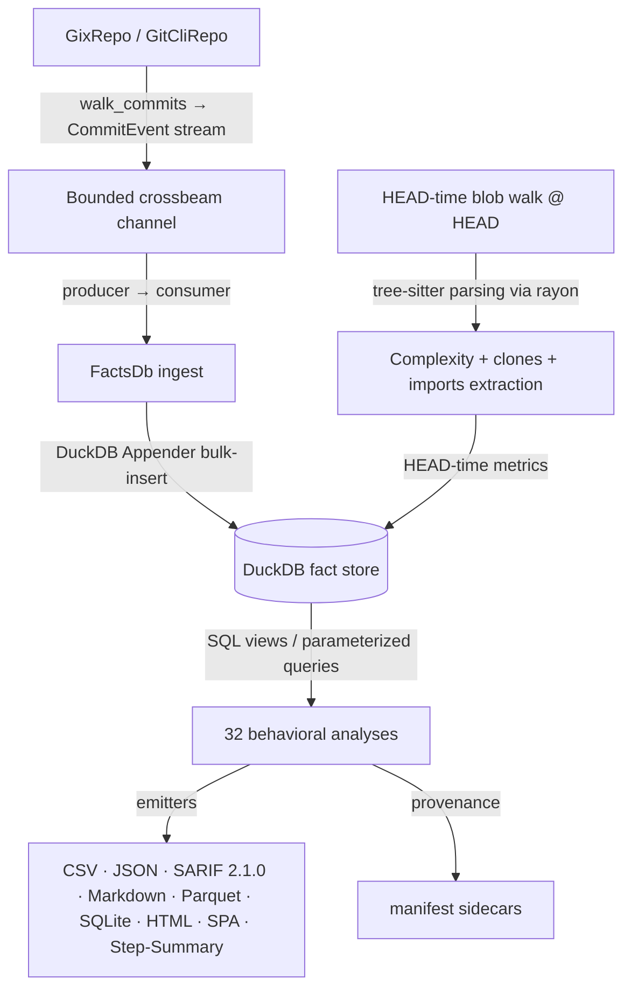

# CodeLore — Codebase Analysis

A descriptive technical overview of the CodeLore codebase: what it is, how it's structured, and how data flows through it. Companion document to [`docs/improvement_suggestions.md`](improvement_suggestions.md), which catalogs forward-looking enhancements.

## 1. What CodeLore is

CodeLore is a Rust-based behavioral code analyzer — a modernization of Adam Tornhill's [code-maat](https://github.com/adamtornhill/code-maat), inspired by [CodeScene](https://codescene.com). Its core value proposition is identifying socio-technical signals (hotspots, change-coupling, clone-coupling, ownership maps, Conway's-law alignment) that traditional static linters cannot see.

The tool stack is deliberately pragmatic:

- **gix** (gitoxide) for fast, pure-Rust repository traversal — no shelling out to `git` in the default code path
- **DuckDB** as an embedded, event-sourced fact store; SQL views are the analysis layer
- **tree-sitter** + a vendored, MPL-2.0 fork of Mozilla's **rust-code-analysis** for per-language AST structural hashing and complexity metrics (cyclomatic, cognitive, Halstead, Maintainability Index)
- **fancy-regex** for `--group-file` regex rules with full lookaround support (matching code-maat's own grouping test fixtures)
- **rayon** for parallel complexity extraction during HEAD-time ingest

## 2. Workspace shape

CodeLore is a 3-crate Cargo workspace:

| Crate | Responsibility |
|---|---|
| `codelore-rca` | Vendored + modified fork of Mozilla's `rust-code-analysis` (MPL-2.0). Provides cyclomatic / cognitive / Halstead / MI complexity metrics. Isolated as its own crate so the vendored license stays cleanly separated. |
| `codelore-lib` | Core library: the `Repo` trait (`GixRepo` default, `GitCliRepo` oracle for differential tests), the DuckDB-backed `FactsDb` fact store, the 32 analyses, the persistent cache, the multi-format output emitters, identity resolution (mailmap + bot + AI-attribution), and the Kamei change-feature enrichment. |
| `codelore-cli` | Clap CLI binary: `analyze` and `diff` subcommands, ignore-file parsing, `Options` construction, output routing. |

## 3. Pipeline data flow



### Producer / consumer split

DuckDB's `Connection` is `!Send + !Sync` (interior mutability via `RefCell`). To get parallelism without violating that constraint, the ingest path is event-sourced:

- The **producer** walks the repo on a background thread and posts `CommitEvent` messages to a bounded `crossbeam-channel`. The walk reads metadata + per-commit changed-file lists; it does not touch DuckDB.
- The **consumer** runs on the main connection-owning thread, draining the channel and batch-inserting via DuckDB's `Appender` API.
- The **complexity pass** is the one place CPU-bound parallelism is exposed: `rayon::par_iter().map_init` over the HEAD file walk, with per-file tree-sitter parsing in parallel. Results are collected into a `Vec` then drained serially into the Appender. `tree_sitter::Parser` is `Send + Sync`, so no thread-local pool is needed.

### Persistent fact-store cache

After successful ingest, the `FactsDb` is persisted to `$XDG_CACHE_HOME/codelore/<repo-hash>/<options-hash>.duckdb`. The repo hash is a SHA of the absolute repo path; the options hash is `sha256(Options::canonical_json())` so any flag change invalidates the cache. Cache hits skip the entire walk + complexity pass — the speedup is 10–100× on real repos.

### Output formats

Seven emitters share a single source of truth (the analysis's `Row` struct), plus one composite emitter for the SPA:

- `csv` — code-maat-compatible headers; hand-rolled writer with `quote_if_needed` escaping
- `json` — serde-derived pretty-printed JSON
- `sarif` — SARIF 2.1.0 with 4 rule IDs (`CODELORE-HOTSPOT`, `CODELORE-CLONE`, `CODELORE-LIVE-CLONE`, `CODELORE-MISSING-COCHANGE`); versioned `partialFingerprints` for cross-run identity
- `markdown` — GFM tables, targeted at `$GITHUB_STEP_SUMMARY`
- `parquet` — DuckDB `COPY … TO … (FORMAT PARQUET)`; binary, columnar
- `sqlite` — `INSTALL sqlite; ATTACH 'x.db' AS sink (TYPE SQLITE); CREATE TABLE sink.* AS SELECT * FROM …` — dumps the whole fact store
- `spa` — single-HTML interactive dashboard. Eight widgets (`kpi-tiles`, `knowledge-islands`, `hotspot-circle-pack`, `hotspot-table`, `coupling-sankey`, `trends`, `calendar-heatmap`, `xray-sunburst`) plus a click-target file detail drawer. The circle-pack supports four colour modes (Complexity, Knowledge map, AI attribution, Clones). Multi-analysis composite emitter that runs `hotspots`, `summary`, `code_health`, `coupling`, `knowledge_islands`, `xray`, `daily_commits`, `trends`, and a clone summary internally; bypasses `--analysis`. Stack: Tailwind v4 + DaisyUI 5 (theme system with OS `prefers-color-scheme` first-paint via DaisyUI's `--prefersdark` plugin config), Alpine.js 3.15 + persist plugin (cross-widget filter state, persisted theme toggle, detail-drawer state), Apache ECharts, d3-hierarchy. All vendored CDN bytes SHA-pinned by `build.rs` at compile time when the `spa` Cargo feature is enabled (default OFF for offline-clean source builds; ON in released binaries).

Every file output (except SQLite, where reproducibility metadata lives inside the database) writes a `{output}.provenance.json` sidecar capturing the full `Options` snapshot, repo SHA, tool versions, mailmap state, and UTC timestamp.

## 4. The `Repo` trait dual-backend pattern

```rust
pub trait Repo {
    fn walk_commits<'a>(
        &'a self,
        opts: &'a Options,
    ) -> Result<Box<dyn Iterator<Item = Result<CommitEvent>> + Send + 'a>>;
    fn changed_files(&self, rev: &str) -> Result<Vec<FileChange>>;
    fn diff_hunks(&self, rev: &str, path: &str) -> Result<Vec<Hunk>>;
    fn resolve_alias(&self, name: &str, email: &str) -> String;
    fn is_worktree_dirty(&self) -> bool;
    fn commit_metadata(&self, rev: &str) -> Result<CommitMetadata>;
    fn head_sha(&self) -> Result<String>;
}
```

Two implementations:

- **`GixRepo`** — production default. Pure-Rust, no `git` binary required. Used in CI containers, the distroless image, and Homebrew installs.
- **`GitCliRepo`** — shells out to `git`. Acts as the differential-test oracle (we verify both backends emit the same `CommitEvent` stream for the same fixture) and as a fallback for git features `gix` doesn't yet expose.

The differential test suite (`tests/differential_repo_test.rs`) is the load-bearing correctness check: any divergence between backends fails CI.

## 5. The 32 analyses

| Tier | Surface | What they share |
|---|---|---|
| Code-maat parity (17) | revisions, summary, authors, code-age, abs-churn, author-churn, entity-churn, entity-effort, entity-ownership, communication, code-ownership, main-dev, main-dev-by-revs, main-dev-by-deletions (alias `refactoring-main-dev`), change-coupling, soc, messages | Output schemas match code-maat's CSV headers under `--code-maat-compat`; the modern default emits richer columns (identity layers, day-precision age, last-modified context) — see `docs/research-foundations.md` |
| Modern signals (1) | top-committers | Per-author leaderboard with LoC + first/last commit + bot flag — code-maat approximated this with `-a author-churn` + sort; CodeLore exposes it first-class |
| Modern foundations ★ (4) | hotspots, code-health, clones, clone-coupling | The behavioral-SARIF differentiators — not in code-maat, not opaque-ML like CodeScene; published deterministic formulas |
| Graph-analytics ★ (3) | knowledge-islands, centrality, communities | Leiden-algorithm community detection + PageRank centrality + auto-detected bus-factor risk on the Fisher-significant coupling graph |
| Architecture-analytics ★★ (6) | god-classes, architecture-violations, stale-code, pair-programming, lead-time, bus-factor | Consume the `imports` table for structural fan-in/fan-out; `architecture-violations` reads `.codelore-arch-rules.toml`; `lead-time` is a DORA Accelerate metric |

All 32 are pure SQL views over the DuckDB fact store with a thin Rust orchestrator each (except `pair-programming`, which extracts Co-Authored-By trailers in Rust for case-insensitive matching). Adding a new analysis = adding one SQL string + one row-struct + entries in the dispatch ladder. Each carries a `Research basis: see docs/research-foundations.md entry "<name>"` rustdoc cross-link.

## 6. Identity resolution

Three layers, applied in order:

1. **`.mailmap`** — gix's `try_resolve` on `(name, email)`. Canonicalizes aliases via the standard git convention.
2. **Bot patterns** — `DEFAULT_BOT_PATTERNS` const (Dependabot, GitHub Actions, etc.) + extensible `.codelorebots` file in the repo root. Case-insensitive, lowercased substring match.
3. **AI attribution** — checks the commit message body and `Co-Authored-By` trailers for a curated list of AI assistants (Claude, Copilot, Cursor, Sourcegraph Cody, Continue, Codeium, Windsurf, Devin, Tabnine, Amazon Q, Aider via `(aider)`). Output: `ai_attribution = "ai-assisted" | "ai-authored" | "human"`.

## 7. Kamei change-feature vector

Spec §3.1 + Kamei et al. 2013 (TSE). Implemented as five SQL UPDATE passes after the main commit/changes ingest:

1. **Diffusion**: `nf`, `ns`, `nd`, `entropy`
2. **Size**: `la`, `ld`, `lt` (LT stubbed to 0 — historical blob LOC is a follow-up)
3. **Fix**: regex match on bug/fix keywords in commit message
4. **History**: `ndev`, `nuc`, `age` — hash-joined UPDATE…FROM passes (O(N²) correlated-subquery has been rewritten)
5. **Experience**: `exp`, `rexp`, `sexp` — same pattern

## 8. Quality posture

- **MSRV**: Rust 1.96+
- **`unsafe_code = "forbid"`** in `clippy.toml` (forbidden across the whole workspace)
- **`RUSTFLAGS = "-Dwarnings"`** in CI (all warnings are errors)
- **CI matrix**: Linux + macOS + Windows on `dtolnay/rust-toolchain@1.96.0` (pinned to match `rust-toolchain.toml`)
- **Gates**: `cargo fmt --check`, `cargo clippy -D warnings`, `cargo test --workspace --all-features`, `cargo deny check`
- **Release pipeline** (`.github/workflows/release.yml`): hand-rolled multi-target `cargo build --release` matrix (5 targets — macOS arm64+x86_64, Linux arm64+x86_64-gnu, Windows x86_64-msvc), SLSA L3 build provenance via `actions/attest-build-provenance`, distroless OCI container at `ghcr.io/emrecdr/codelore` (separate `container.yml`), Homebrew formula regenerated and pushed to `emrecdr/homebrew-codelore` via SSH deploy key, `cargo binstall` falls back to the standard GitHub-Release scan — all fire on `v*` tag push

## 9. Related documents

- [`docs/advanced-usage.md`](advanced-usage.md) — the 30-minute developer manual (every flag explained, every output format documented)
- [`docs/improvement_suggestions.md`](improvement_suggestions.md) — forward-looking improvement backlog
- [`docs/roadmap-v1.x-and-beyond.md`](roadmap-v1.x-and-beyond.md) — prioritized roadmap of larger initiatives
- [`docs/RELEASING.md`](RELEASING.md) — SemVer policy + release procedure
- [`docs/superpowers/specs/2026-06-06-codelore-design.md`](superpowers/specs/2026-06-06-codelore-design.md) — original design spec
