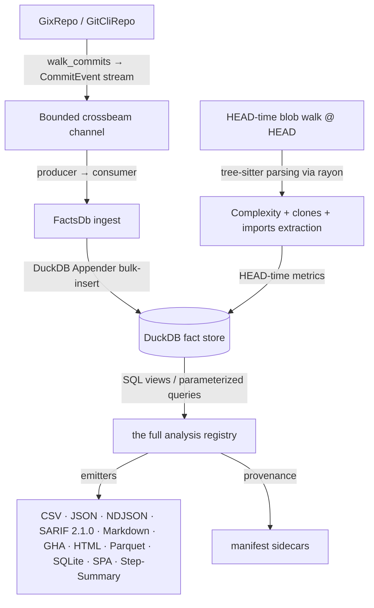

# CodeLore — Codebase Analysis

A descriptive technical overview of the CodeLore codebase: what it is, how it's structured, and how data flows through it.

## 1. What CodeLore is

CodeLore is a Rust-based behavioral code analyzer — a modernization of Adam Tornhill's [code-maat](https://github.com/adamtornhill/code-maat), inspired by [CodeScene](https://codescene.com). Its core value proposition is identifying socio-technical signals (hotspots, change-coupling, clone-coupling, ownership maps, Conway's-law alignment) that traditional static linters cannot see.

The tool stack is deliberately pragmatic:

- **gix** (gitoxide) for fast, pure-Rust repository traversal — no shelling out to `git` in the default code path
- **DuckDB** as an embedded, event-sourced fact store; SQL views are the analysis layer
- **tree-sitter** + a vendored, MPL-2.0 fork of Mozilla's **rust-code-analysis** for per-language AST structural hashing and complexity metrics (cyclomatic, cognitive, Halstead, Maintainability Index)
- **fancy-regex** for `--group-file` regex rules with full lookaround support (matching code-maat's own grouping test fixtures)
- **rayon** for parallel complexity extraction during HEAD-time ingest

## 2. Workspace shape

CodeLore is a 3-crate Cargo workspace:

| Crate | Responsibility |
|---|---|
| `codelore-rca` | Vendored + modified fork of Mozilla's `rust-code-analysis` (MPL-2.0). Provides cyclomatic / cognitive / Halstead / MI complexity metrics. Isolated as its own crate so the vendored license stays cleanly separated. |
| `codelore-lib` | Core library: the `Repo` trait (`GixRepo` default, `GitCliRepo` oracle for differential tests), the DuckDB-backed `FactsDb` fact store, the full analysis registry (enumerated by `AnalysisName::all()`), the persistent cache, the multi-format output emitters, identity resolution (mailmap + bot + AI-attribution), and the Kamei change-feature enrichment. |
| `codelore` | Clap CLI binary: `analyze` and `diff` are the load-bearing subcommands, plus the supporting surface (`check`, `gate`, `mcp`, `explain`, `schema`, `profile`, `docs`, `completions`, `ingest-sarif`, `calibrate`, `calibrate-defects`); ignore-file parsing, `Options` construction, output routing. |

### The MCP surface

`codelore mcp` starts a read-only Model Context Protocol server over stdio — no network, no account, no telemetry — exposing the analyses as tools for AI assistants and agent frameworks: `repo_overview`, `hotspots`, `code_health`, `delta_health`, `refactoring_targets`, `function_xray`, `check_gates`, `finding_hotspot_overlap`, `explain_file`, `change_context`, and `gate_changes`. Warm-cache calls are cheap; the first call on a cold cache pays the ingest cost. Startup is fail-fast: the repository is opened and HEAD resolved before serving, and the flags mirror the CLI's calibration surface (`--calibration`, `--defect-calibration`, `--allow-foreign-calibration`) plus `--cache-dir` / `--temp-dir` for containerized roots — a bad repo path or a missing, malformed, or foreign artifact is a hard error at server startup, not at first tool call. All tools return rendered text except `check_gates`, which returns typed JSON (`Json<GateSummary>`) — the one tool that advertises an `outputSchema`.

## 3. Pipeline data flow



### Producer / consumer split

DuckDB's `Connection` is `!Sync` (interior mutability via `RefCell`), and the `Appender`/`Statement` handles borrow it, making them `!Send` — so the connection and everything prepared on it stay on one thread by design. To get parallelism around that single-threaded core, the ingest path is event-sourced:

- The **producer** walks the repo on a background thread and posts `CommitEvent` messages to a bounded `crossbeam-channel`. The walk reads metadata + per-commit changed-file lists; it does not touch DuckDB.
- The **consumer** runs on the main connection-owning thread, draining the channel and batch-inserting via DuckDB's `Appender` API.
- The **HEAD-time scans** (complexity, clone fingerprinting, import extraction — `complexity_head.rs`, `clones_head.rs`, `imports_head.rs`) are where CPU-bound parallelism is exposed: each uses the same `rayon` `into_par_iter().map_init` pattern over the HEAD file list, building one warm `BlobReader` per worker thread (rev→root-tree resolved once per worker, then reused for every file that worker reads), with per-file tree-sitter parsing in parallel. Results are collected into a `Vec` then drained serially into the Appender.
- Each scan tallies per-file outcomes into a shared coverage accounting (`ScanOutcome` / `ScanCoverage`, `facts/ingest/coverage.rs`): per-file failures don't abort the pass, and when fewer than 90% of eligible files scan cleanly an aggregate `warn!` names the pass and its dominant failure mode — a thin scan is disclosed rather than silent.
- **Rename-aware lineage**: a recursive CTE (`facts/ingest/lineage.rs::materialize_path_lineage`) builds a chronology-bounded rename map — the date constraints keep recycled filenames from conflating unrelated files — and materializes a `changes_lineage` view that folds each file's pre-rename history onto its canonical HEAD path. The path-aggregating analyses opt in through `analyses/lineage.rs::rewrite`, which redirects their `FROM changes` reads to that view. Default on; `--no-canonical-lineage` and `--code-maat-compat` keep raw paths.

### Persistent fact-store cache

After successful ingest, the `FactsDb` is persisted to `<cache_root>/codelore/<repo_hash_8>/<cache_key_16>.duckdb` (the root defaults to the platform cache directory, e.g. `$XDG_CACHE_HOME`; `--cache-dir` overrides). The cache key is `SHA-256(canonical_repo_path ‖ head_sha ‖ crate_version ‖ opts_hash ‖ CACHE_EPOCH)`. The options hash covers only the ingest-affecting options — analysis-only thresholds deliberately do not split the key — and folds in content digests of the ingest-shaping repo files (`.mailmap`, `.codelorebots`, `.codelore-teams`, the ignore files, and the `--group-file` / `--team-map-file` inputs) so editing them invalidates the cache. `CACHE_EPOCH` is a manual cache-buster, deliberately independent of the on-disk schema version: it is bumped for correctness fixes that must orphan previously-cached fact stores. Cache hits skip the entire walk + HEAD-time scans — the speedup is 10–100× on real repos.

### Output formats

The emitters share a single source of truth (the analysis's `Row` struct); the full `--format` catalogue:

- `csv` — code-maat-compatible headers; hand-rolled writer with `quote_if_needed` escaping
- `json` — serde-derived pretty-printed JSON
- `ndjson` — newline-delimited JSON, one row per line for stream consumers (`jq -c`, CI pipelines)
- `sarif` — SARIF 2.1.0; `analyze` emits `CODELORE-HOTSPOT` / `CODELORE-CLONE` / `CODELORE-LIVE-CLONE`, and `codelore diff` adds `CODELORE-MISSING-COCHANGE` + `CODELORE-DELTA-HEALTH`; versioned `partialFingerprints` for cross-run identity
- `markdown` — GFM tables, targeted at `$GITHUB_STEP_SUMMARY`
- `gha` — GitHub Actions workflow commands (`::error::` / `::warning::` / `::notice::` on stdout), surfaced as inline PR annotations
- `html` — self-contained per-analysis HTML report
- `parquet` — DuckDB `COPY … TO … (FORMAT PARQUET)`; binary, columnar
- `sqlite` — `INSTALL sqlite; ATTACH 'x.db' AS sink (TYPE SQLITE); CREATE TABLE sink.* AS SELECT * FROM …` — dumps the whole fact store
- `spa` — single-HTML interactive dashboard. Widgets, named by their mount-point ids (`kpi-tiles`, `knowledge-islands`, `knowledge-surfaces`, `hotspot-circle-pack`, `hotspot-table`, `hotspot-treemap`, `coupling-sankey`, `module-chord`, `arch-graph`, `arch-matrix`, `arch-trend`, `health-trend`, `trends`, `parallel-coords`, `delivery-card`, `cognitive-boxplot`, `calendar-heatmap`, `xray-sunburst`, `kamei-risk`, `share-bars`, `improvements-feed`, plus the `factor-header` and `guided-tour` chrome) plus a tabbed (Overview / Coupling / People, plus Health and X-Ray when available) click-target file detail drawer. The circle-pack defaults to a bivariate health×activity colour mode, with single-signal modes (Cognitive, Code Health, Friction, Author, AI attribution, Knowledge-loss, Clones) available as tabs. Cross-widget **linked brushing** (a shared `selection` bus) highlights a selected file across every widget; a parallel `brush` bus drives the legend-quadrant set-brush; selecting a file names its coupling partners on the map. Multi-analysis composite emitter that runs `hotspots`, `summary`, `code_health`, `coupling`, `knowledge_islands`, `xray`, `daily_commits`, `trends`, the architecture-analytics set, and a clone summary internally; bypasses `--analysis`. Stack: Tailwind + DaisyUI (theme system with OS `prefers-color-scheme` first-paint via DaisyUI's `--prefersdark` plugin config), Alpine.js + persist plugin (cross-widget filter state, persisted theme toggle, detail-drawer state), Apache ECharts, d3-hierarchy. All vendored CDN bytes SHA-pinned by `build.rs` at compile time when the `spa` Cargo feature is enabled (default OFF for offline-clean source builds; ON in released binaries).
- `step-summary` — GFM summary for `$GITHUB_STEP_SUMMARY`, streamed to stdout

Every file output (except SQLite, where reproducibility metadata lives inside the database) writes a `{output}.provenance.json` sidecar capturing the full `Options` snapshot, repo SHA, tool versions, mailmap state, and UTC timestamp.

## 4. The `Repo` trait dual-backend pattern

```rust
pub trait Repo: Send + Sync {
    fn walk_commits<'a>(
        &'a self,
        opts: &'a Options,
    ) -> Result<Box<dyn Iterator<Item = Result<CommitEvent>> + Send + 'a>>;
    fn changed_files(&self, rev: &str) -> Result<Vec<FileChange>>;
    fn diff_hunks(&self, rev: &str, path: &str) -> Result<Vec<Hunk>>;
    fn resolve_alias(&self, name: &str, email: &str) -> String;
    fn head_sha(&self) -> Result<String>;
    fn is_worktree_dirty(&self) -> bool;
    fn merge_or_rebase_in_progress(&self) -> bool;
    fn is_shallow(&self) -> bool;
    fn read_blob_at(&self, rev: &str, path: &str) -> Result<Option<Vec<u8>>>;
    fn read_blob_at_head(&self, path: &str) -> Result<Option<Vec<u8>>>;
    fn blob_reader_at<'a>(&'a self, rev: &str) -> Box<dyn BlobReader + 'a>;
    fn worktree_changes(&self) -> Result<Vec<WorktreeChange>>;
    fn tracked_paths_at_head(&self) -> Result<Vec<String>>;
    fn tags(&self) -> Result<Vec<TagInfo>>;
}
```

The small `BlobReader` companion trait (`fn read(&mut self, path: &str) -> Result<Option<Vec<u8>>>`) reads many blobs at one revision without re-resolving rev→commit→root-tree per call — the HEAD-time scans build one per rayon worker via `map_init`.

Two implementations:

- **`GixRepo`** — production default. Pure-Rust, no `git` binary required. Used in CI containers, the distroless image, and Homebrew installs.
- **`GitCliRepo`** — shells out to `git`. The differential-test oracle, and nothing else: it is constructed only by the test suites (we verify both backends emit the same `CommitEvent` stream for the same fixture); there is no production fallback path and no `--backend` flag.

The differential test suite (`tests/differential_repo_test.rs`) is the load-bearing correctness check: any divergence between backends fails CI.

## 5. The analysis registry

| Tier | Surface | What they share |
|---|---|---|
| Code-maat parity | revisions, summary, authors, code-age, abs-churn, author-churn, entity-churn, entity-effort, entity-ownership, communication, ownership (alias `code-ownership`), main-dev, main-dev-by-revs, main-dev-by-deletions (alias `refactoring-main-dev`), coupling, soc, messages | Output schemas match code-maat's CSV headers under `--code-maat-compat`; the modern default emits richer columns (identity layers, day-precision age, last-modified context) — see `docs/research-foundations.md` |
| Modern signals | top-committers, stale-code | First-class views code-maat lacked: a per-author leaderboard with LoC + first/last commit + bot flag (code-maat approximated it with `-a author-churn` + sort), and a stale-code surfacer (files alive at HEAD, untouched ≥N months AND trivially low cognitive — the intersection minimises false positives) |
| Modern foundations ★ | hotspots, hotspot-velocity, code-health, clones, clone-coupling, refactoring-targets | The behavioral-SARIF differentiators — not in code-maat, not opaque-ML like CodeScene; published deterministic formulas. `code-health` is a biomarker composite: `100 × (1 − 0.50·structural_risk − 0.30·churn − 0.20·ownership_fv)` with eight named biomarkers (Complex Method 0.22, God Class 0.18, Large Method 0.12, DRY 0.12, Shotgun Surgery 0.12, Deep Nesting 0.10, Many Args 0.07, Complex Conditional 0.07). `refactoring-targets` ranks files by `priority = (structural_risk × hotspot_score) / max(loc, 25)`. |
| Graph-analytics ★ | knowledge-islands, centrality, communities | Leiden-algorithm community detection + PageRank centrality + auto-detected bus-factor risk on the Fisher-significant coupling graph |
| Architecture-analytics ★★ | god-classes, architecture-violations, dependency-cycles, architecture-roles, instability, architecture-metrics, architecture-trend, cycle-origins | Consume the `imports` table for structural fan-in/fan-out; `architecture-violations` reads `.codelore-arch-rules.toml`; `dependency-cycles` (Tarjan SCC), `architecture-roles` (Core/Shared/Control/Periphery), `instability` (Martin Ca/Ce/I) and `architecture-metrics` (Lakos ACD/NCCD + propagation cost) share the import-graph kernel (`analyses/import_graph.rs`); `architecture-trend` reruns that kernel at sampled historical revs (via `Repo::read_blob_at`) to show decay over time; `cycle-origins` bisects history for each HEAD cycle's formation commit |
| Structure×history fusion ★★ | modularity-violations, unstable-interface, crossing, cycle-health | Fuse the structural `imports` graph with the temporal Fisher-significant co-change graph — the DV8 hotspot-pattern trilogy: modularity violations (co-change without an import edge), unstable interfaces (churning hubs that drag their dependents), crossings (structural "X" that co-changes both ways) — plus cycle-health, which ranks each import tangle by its share of repo LOC churn, calls a live/fossil verdict, and names the cheapest extraction candidate. Mo, Cai & Kazman 2015 *Hotspot Patterns* / DV8 |
| Health timeline & external evidence | health-trend, finding-hotspot-overlap, defect-validation | Track and validate the health signal: `health-trend` recomputes arch, code, and combined health (each 0–100) at sampled historical revs; `finding-hotspot-overlap` joins the external-scanner sidecar (populated by `codelore ingest-sarif`) with hotspot + code-health signal; `defect-validation` reports the evidence inside an own-repo defect-calibration artifact (band table, AUC / precision@k, weight-tuning decision) |
| Delivery analytics | lead-time, delivery-friction, delivery-metrics, release-cadence | Measure the process rather than the code: `lead-time` (DORA; committer time − author time per commit), `delivery-friction` (product of three percentile ranks — revisions × median lead-time × cognitive), `delivery-metrics` (repo-level batch-size / branch-duration / rework distributions, percentile-first), `release-cadence` (inter-release gap statistics from git tags) |
| Team & knowledge analytics | pair-programming, bus-factor, effort-exposure, code-familiarity, team-composition, coordination-needs, marginal-owner-risk | The people axis: `Co-Authored-By` pairing, per-module bus factor, effort share per code-health band, decayed-knowledge familiarity + islands percentage, contribution-span composition with onboarding velocity, per-file coordination overhead, and ownership-concentration × health risk tiers |
| Function-level | function-xray, function-hotspots, function-coupling | Drop from file to function granularity via the tree-sitter span extractor + hunk-overlap attribution: per-function change frequency for one `--target` file, repo-wide function-level hotspot ranking, and per-function-pair co-change with Fisher significance |

The tier grouping is editorial; the drift-proof source of truth for the registry is `AnalysisName::all()` (`crates/codelore-lib/src/analysis.rs`), which `codelore profile` prints live.

Nearly all are SQL-driven over the DuckDB fact store with a thin Rust orchestrator each (`pair-programming` extracts Co-Authored-By trailers in Rust; `dependency-cycles`, `architecture-roles`, `instability` and `architecture-metrics` run on an iterative-Tarjan SCC + reachability kernel; `modularity-violations`, `unstable-interface` and `crossing` fuse the import graph with the co-change graph via Rust set logic; `refactoring-targets` joins the output of `code-health` + `hotspots` in Rust and divides combined risk by per-file LOC). The exceptions are `architecture-trend`, `health-trend` and `cycle-origins`, which re-read + re-parse source at historical revisions (via `Repo::read_blob_at`) — the first two to recompute structural and health metrics over time, the last to bisect history for each cycle's formation commit — so all three need repository access and are computed on demand, never cached. Adding a new analysis = adding one SQL string + one row-struct + entries in the dispatch ladder. The code-maat-parity and modern-foundations analyses carry a `Research basis: see docs/research-foundations.md entry "<name>"` rustdoc cross-link; for the rest the citation chain lives in that document alone.

## 6. Identity resolution

Four layers, applied in order:

1. **`.mailmap`** — gix's `try_resolve` on `(name, email)`. Canonicalizes aliases via the standard git convention.
2. **Bot patterns** — `DEFAULT_BOT_PATTERNS` const (Dependabot, GitHub Actions, etc.) + extensible `.codelorebots` file in the repo root. Case-insensitive, lowercased substring match.
3. **Team-map projection** — optional `author,team` CSV (`--team-map-file`, or a discovered `.codelore-teams` at the repo root) aliasing already-canonical author emails to logical teams at ingest time (`identity/team_map.rs`); unmatched authors pass through unchanged.
4. **AI attribution** — checks the commit message body and `Co-Authored-By` trailers for a curated list of AI assistants (Claude, Copilot, Cursor, Sourcegraph Cody, Continue, Codeium, Windsurf, Devin, Tabnine, Amazon Q, Aider via `(aider)`). Output: `ai_attribution = "ai-assisted" | "ai-authored" | "human"`.

## 7. Kamei change-feature vector

Spec §3.1 + Kamei et al. 2013 (TSE). Implemented as five SQL UPDATE passes after the main commit/changes ingest:

1. **Diffusion**: `nf`, `ns`, `nd`, `entropy`
2. **Size**: `la`, `ld`, `lt` (LT stubbed to 0 — historical blob LOC is a follow-up)
3. **Fix**: regex match on bug/fix keywords in commit message
4. **History**: `ndev`, `nuc`, `age` — hash-joined UPDATE…FROM passes (O(N²) correlated-subquery has been rewritten)
5. **Experience**: `exp`, `rexp`, `sexp` — same pattern

## 8. Advisory enrichment layer

Opt-in (`--llm`) narrative layer over the deterministic dossiers — strictly outside the scoring path: no module in `analyses`, `quality_gates`, or `facts` imports it, and the `enrichment_isolation_test` integration test guards that one-way arrow.

- **`enrichment/fact_sheet.rs`** — deterministic per-file and per-diff fact sheets: ordered sections of pre-formatted values; the canonical text is both the model's prompt input and the narrative-cache key, and `numeric_values()` extracts the fact set the citation check matches against
- **`enrichment/client.rs`** — two-dialect chat client (Anthropic-native + OpenAI-compatible), configured through the environment only (`CODELORE_LLM_*`); the default endpoint is a local OpenAI-compatible server, so nothing leaves the machine without an explicit configuration change
- **`enrichment/engine.rs::narrate`** — cache-or-generate orchestration over a sidecar narrative cache; cached narratives are re-verified with the *current* checker on read, so checker improvements reach warm caches
- **`enrichment/citation.rs::check_citations`** — the deterministic numeric citation check behind the `grounded ✓` / `⚠ contains uncited claims` stamp, with diagnostics surfacing its two numeric blind spots (`exempt_small_ints`, `percent_fallback_only`)
- **Evidence**: the check's false-positive/false-negative behavior is measured on a labelled corpus replayed in CI (`enrichment_citation_corpus_test`), plus a first model study of a pinned 3B local model — [`docs/narrative-evidence-v1.md`](narrative-evidence-v1.md)

## 9. Quality posture

- **MSRV**: Rust 1.96+
- **`unsafe_code = "forbid"`** in the root `Cargo.toml`'s `[workspace.lints.rust]` — and declared directly on `codelore-rca`, which declines workspace lints, so the guarantee covers all three crates (`clippy.toml` carries only `msrv`, the cognitive-complexity threshold, and `doc-valid-idents`)
- **`RUSTFLAGS = "-Dwarnings"`** in CI (all warnings are errors)
- **CI matrix**: Linux + macOS + Windows, every job pinned to the exact patch release named by `rust-toolchain.toml`'s `channel` (the version is deliberately not repeated here — it is a patch-granularity pin that moves on point releases, and duplicating it is how this line went stale)
- **Gates**: `cargo fmt --check`, `cargo clippy -D warnings`, `cargo test --workspace --features test-support,spa` (browser tests gate in a separate job), `cargo deny check`, `zizmor`
- **Release pipeline** (`.github/workflows/release.yml`): hand-rolled multi-target `cargo build --release` matrix (5 targets — macOS arm64+x86_64, Linux arm64+x86_64-gnu, Windows x86_64-msvc), SLSA Build L3 provenance via `actions/attest` running in a separate trusted-signer job (`.github/workflows/attest-artifact.yml`) so the signing token is unreachable from the jobs that execute `build.rs`, distroless OCI container at `ghcr.io/emrecdr/codelore` (separate `container.yml`), Homebrew formula regenerated and pushed to `emrecdr/homebrew-codelore` via SSH deploy key, `cargo binstall` falls back to the standard GitHub-Release scan — all fire on `v*` tag push

## 10. Related documents

- [`docs/advanced-usage.md`](advanced-usage.md) — the 30-minute developer manual (every flag explained, every output format documented)
- [`docs/narrative-evidence-v1.md`](narrative-evidence-v1.md) — measured evidence for the advisory layer's citation check and model behavior
- [`docs/roadmap-v1.x-and-beyond.md`](roadmap-v1.x-and-beyond.md) — prioritized roadmap of larger initiatives
- [`docs/RELEASING.md`](RELEASING.md) — SemVer policy + release procedure
- [`docs/superpowers/specs/2026-06-06-codelore-design.md`](superpowers/specs/2026-06-06-codelore-design.md) — original design spec
