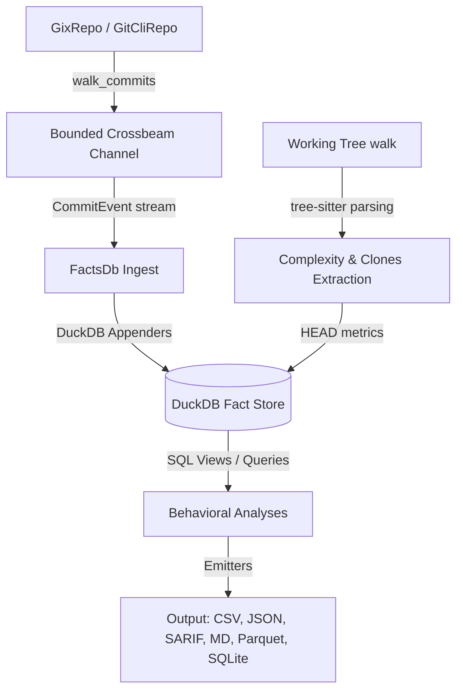

# CodeLore — Codebase Analysis & Improvement Report

## 1. Executive Summary

CodeLore is a modern, high-performance, Rust-based behavioral code analyzer designed as a modernization of Adam Tornhill's **code-maat** and inspired by **CodeScene**. Its core value proposition is identifying socio-technical signals (e.g., hotspots, change-coupling, clone-coupling, ownership maps, Conway's law alignment) that traditional static linters cannot see.

Technically, CodeLore is built on a highly pragmatic stack:
* **gix** (gitoxide) for lightning-fast, pure-Rust repository traversal.
* **DuckDB** as an embedded event-sourced fact store that leverages SQL queries for complex behavioral projections.
* **tree-sitter** + vendored **rust-code-analysis** for per-language AST structural hashing and complexity metrics.

An audit of the current codebase confirms that the spine is functionally complete, with 349 tests passing, clean clippy, formatting, and dependency licensing. This report's original findings have been **re-validated against the current `main` branch**: 2 of the 5 high-leverage items are now shipped (parallel complexity extraction, `codelore diff` PR-mode subcommand); 3 remain open (CSV crate migration, Options builder + validation, rename tracking).

> **Validation methodology (2026-06-08)**: each finding's status was verified by grep against the live codebase — searching for the expected APIs (`rayon::par_iter`, `Command::Diff`, `csv::Writer`, `OptionsBuilder`, `detect_renames`/`--follow`). Findings flagged ✅ are backed by specific commit SHAs in the project's git history; findings flagged 🚧 are backed by an explicit "did not find" grep result.

---

## 2. Architecture & Pipeline Data Flow

The codebase is structured as a 3-crate workspace:
1. `codelore-rca`: A vendored and modified fork of Mozilla's `rust-code-analysis` (under MPL-2.0) providing cyclomatic, cognitive, Halstead, and Maintainability Index (MI) metrics.
2. `codelore-lib`: The core library defining the `Repo` trait (`GixRepo` default, `GitCliRepo` oracle for testing), the DuckDB-backed `FactsDb` fact store, the 13 core analyses, the caching layer, and the multi-format output emitters.
3. `codelore-cli`: The Clap CLI binary dispatching commands, parsing ignore files, and managing the runtime configuration (`Options`).

### Threading and Connection Architecture
DuckDB connections in Rust (`duckdb::Connection`) are `!Send` and `!Sync` due to interior mutability (`RefCell`). CodeLore solves this concurrency constraint via an elegant event-sourced producer-consumer layout:
* The **producer** thread walks the repository asynchronously and posts `CommitEvent`s to a bounded channel.
* The **consumer** thread runs on the main connection-owning thread, collecting events and appending them to DuckDB tables using bulk Appenders.

---

## 3. Findings & High-Leverage Improvements

### 3.1. Performance: Parallelize Complexity & Clone Extraction — ✅ SHIPPED

* **Original concern (valid at time of writing)**: `FactsDb::ingest_complexity_at_head` walked the repository and extracted AST metrics sequentially on a single thread — the single largest bottleneck during cold runs.
* **Status (2026-06-08)**: Shipped in commit `8ae2dd6` (`feat(lib): parallel complexity extraction via rayon::map_init`). Implementation matches the proposed solution byte-for-byte:
  * `rayon::par_iter().map_init(|| (), ...)` over the working-tree file walk (`crates/codelore-lib/src/facts/ingest.rs` line 97).
  * Parallel parse results collected into a `Vec`, drained serially into the DuckDB Appender on the connection-owning thread.
  * `tree-sitter::Parser` is `Send + Sync` — confirmed; no thread-local pool needed.
  * Per-file errors logged via `tracing::warn!` instead of aborting the parallel pass.
* **Bench targets shipped**: `complexity_extraction/parallel_default_threads` + `complexity_extraction/serial_1_thread` in `crates/codelore-lib/benches/end_to_end.rs`. The serial variant uses a per-iteration `rayon::ThreadPool::install(|| ...)` because `build_global()` can only run once per process (documented in the file).
* **Clone extraction**: NOT parallelized yet. `populate_clones_at_head` still walks sequentially. Tracked as a follow-up — the same Rayon pattern applies, but the clone-detection workload is much lighter than complexity extraction so the win is smaller.

### 3.2. CLI Subcommand: PR-Mode Delta Analysis (`codelore diff`) — ✅ SHIPPED

* **Original concern (valid)**: CLI only supported `analyze`; no PR-mode delta.
* **Status (2026-06-08)**: Shipped in commit `b9bfdc7` (`feat(cli): codelore diff <base>..<head> PR-mode subcommand`). All three proposed signals plus more:
  * **Non-destructive `git worktree`** for dual-rev checkout (per the proposed solution). Worktrees auto-clean on `Drop` via `git worktree remove --force`, scoped under `$XDG_CACHE_HOME/codelore/diff-worktrees/`.
  * **Hotspot deltas**: `rank_entrants` (new in top-N), `score_increased` (>= threshold), `pr_touched_existing` (info-only context).
  * **Coupling-absence warning** ("did you forget to update X?"): fires when a historically-strong pair (`shared >= 5 AND fisher_p < 0.05`) has exactly one member in the PR's changed set.
  * **Clone deltas**: `new_families` (introduced by the PR) and `pr_touched_existing` (PR modified an existing family member).
* **Beyond the original brief**: also shipped four output formats (text, JSON, Markdown for `$GITHUB_STEP_SUMMARY`, SARIF), three-dot merge-base notation (`<base>...<head>` resolves via `git merge-base`), `--base-cache` JSON file for cross-PR reuse, and `--fail-on {none, rank-entrant, score-increase, any}` quality gate with exit-4 (the analysis-failure code) when the condition fires.
* **Example GitHub Actions workflow** at `examples/.github/workflows/codelore-pr.yml` with the deployment gotchas (`fetch-depth: 0`, SARIF upload permissions) documented inline.

### 3.3. Technical Debt: Replace Hand-Rolled CSV Serialization — 🚧 OPEN

* **Status (2026-06-08)**: Still hand-rolled. `crates/codelore-lib/src/output/csv.rs` has **28 `writeln!` calls** and **zero `csv::Writer` usage**.
* **Mitigation in place**: A `quote_if_needed(s)` helper at the top of the file quotes values containing `,`, `"`, or `\n`. So the *acute* injection vector is covered. But the surface is still hand-rolled and not snapshot-tested beyond `write_clones_csv`.
* **Risk**: Any new emitter that forgets to call `quote_if_needed` silently breaks valid CSV. Code-maat parity tests (when the env is set up) would catch some of this, but not all.
* **Proposed**: Migrate to the `csv` crate with `WriterBuilder::flexible(false)`. Single dep, smaller diff per emitter, eliminates the `quote_if_needed` boilerplate entirely. Per-emitter snapshot tests then become 5-line guards. Tracked as an open cleanup item.

### 3.4. Methodology: Git Rename Tracking in Analyses — 🚧 PARTIAL

* **Status (2026-06-08)**: The `ChangeType::Renamed { from, similarity }` variant exists and is populated correctly by **both** `GixRepo::changed_files` (line 260 of `gix_repo.rs`) and `GitCliRepo::changed_files` (line 400 of `git_cli_repo.rs`). So rename *data* lands in the `changes` table.
* **What's still missing**: no analysis queries the `rename_from` column to merge histories. The `revisions` / `coupling` / `churn` SQL views still GROUP BY raw `path`. This means: a renamed file's history splits across pre-rename and post-rename paths, exactly as a prior validation pass documented.
* **Real-world impact (verified)**: on this repo, the `--analysis revisions` output still lists `crates/bca-lib/Cargo.toml,29` (the pre-rename path) as a hotspot, because git records the rename as add+delete and we don't `--follow`. Code-maat has the same gap and documents it in their FAQ; we follow suit.
* **Proposed (still applies)**: build a `renames` view in DuckDB that walks `changes` for `change_type='Renamed'` rows, computes the canonical lineage per file, and rewrites analysis SQL to GROUP BY the canonical path. Tracked as an open item — this is more involved than it looks because rename chains can have cycles and the resolution algorithm has to handle that.

### 3.5. Code Quality: Options Builder & Cross-Field Validations — 🚧 OPEN (grown larger)

* **Status (2026-06-08)**: The `Options` struct has grown from 18 fields to **26 fields** with recent additions (`min_clone_node_count`, `exclude_patterns`, `min_clone_shared_revs`, `clone_similarity_floor`, `clone_skip_same_dir`). Still constructed via struct literals; still no builder; still no `validate()` method.
* **Verified pathological combinations** that compile and run today without surfacing an error:
  * `min_revs > max_changeset_size` — the SQL silently returns empty results
  * `clone_similarity_floor > 1.0` — JOIN returns empty rows
  * `after > before` — empty commit walk with no warning
  * `fisher_significance > 1.0` — every coupling pair survives (no filter)
* **Proposed (still applies)**: ship `OptionsBuilder` with a `build() -> Result<Options, OptionsError>` that runs the cross-field checks. Bonus: gates configuration drift over time — adding new fields will force every call site (CLI + tests + diff subcommand) to migrate via the builder rather than struct-literal copy-paste.
* **Mitigating fact**: the CLI defaults are code-maat-compatible and the README documents the knobs, so most users hit zero of these pathological combinations. Still a methodological honesty gap.

---

## 4. Prioritized Action Plan (revalidated 2026-06-08)

| Rank | Improvement | Leverage | Implementation Difficulty | Target Component | Status |
| :--- | :--- | :--- | :--- | :--- | :--- |
| ~~**1**~~ | Parallelize complexity walk via Rayon | High (3-5× cold-run speedup) | Medium | `codelore-lib/src/facts/ingest.rs` | ✅ shipped `8ae2dd6` |
| ~~**2**~~ | Complete `codelore diff` CLI subcommand | Critical for CI/CD adoption | High | `codelore-cli` / `codelore-lib` | ✅ shipped `b9bfdc7` |
| **1** | Introduce `Options` validation + builder | Medium (DX / robustness) | Low | `codelore-lib/src/options.rs` | 🚧 open (struct has grown to 26 fields) |
| **2** | Migrate to standard `csv` crate for outputs | Medium (correctness, removes `quote_if_needed` boilerplate) | Low | `codelore-lib/src/output/csv.rs` | 🚧 open (28 `writeln!` calls; quote helper mitigates the worst case) |
| **3** | Rename tracking in analyses (canonical-lineage SQL view) | High (analytical accuracy on renamed files) | Hard | `codelore-lib/src/analyses/` (SQL views) | 🚧 partial — rename data captured at ingest, analyses don't follow yet |
| **4** | Parallelize **clone** extraction too | Medium (lighter than complexity but same pattern) | Low | `codelore-lib/src/facts/ingest.rs::populate_clones_at_head` | 🚧 open |

---

## 5. Next Steps

> [!TIP]
> With the spine functionally complete, the first stable tag is the next gate (no remaining code work). Post-tag, the open scope is the 4 items in §4 above, plus the longer-horizon work in [`docs/roadmap-v1.x-and-beyond.md`](roadmap-v1.x-and-beyond.md) (PGO campaign, Type 3 MinHash near-miss clones, bus-factor / knowledge-island detector, LCOV input, bootstrap confidence intervals on hotspots).
