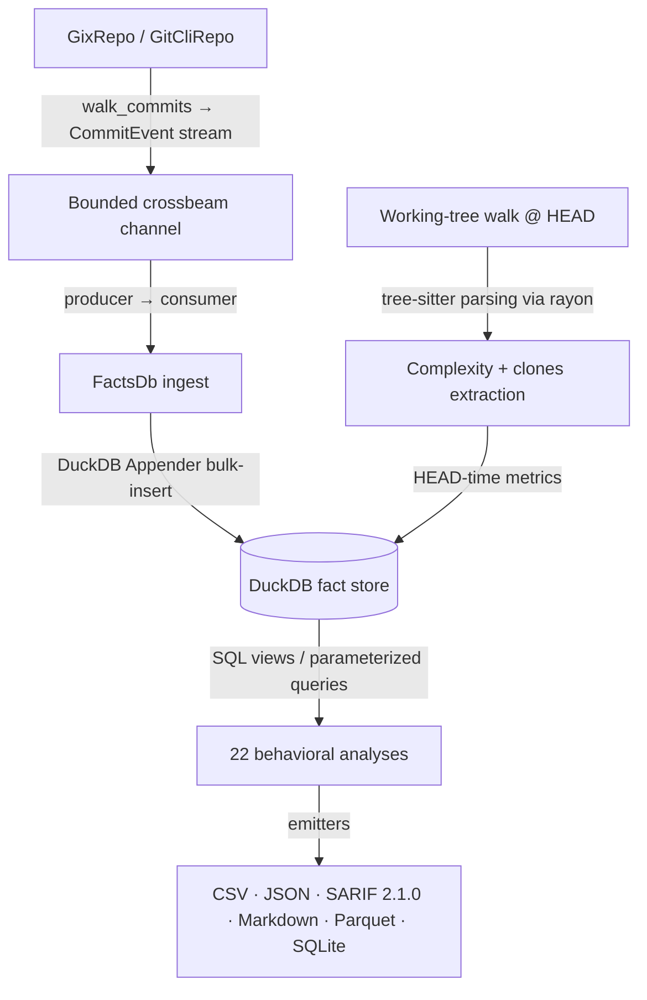

# CodeLore — Deep Codebase Analysis Report

This document presents a deep, read-only analysis of the **CodeLore** codebase. It documents the validation of recent fixes and outlines newly identified recommendations for further correctness, robustness, and performance improvements.

---

## 1. Architectural Overview & Pipeline Data Flow

CodeLore is structured as a multi-crate Rust workspace comprising three main components:
*   [codelore-rca](file:///Users/emrec/Projects/playground/codelore/crates/codelore-rca): A vendored fork of Mozilla's `rust-code-analysis` providing structural syntax hashing and complexity metrics.
*   [codelore-lib](file:///Users/emrec/Projects/playground/codelore/crates/codelore-lib): The core engine, handling repository walk abstraction, identity resolution, fact-store management, analyses execution, caching, and output emitters.
*   [codelore-cli](file:///Users/emrec/Projects/playground/codelore/crates/codelore-cli): The command-line frontend that handles arguments parsing, option consolidation, and output routing.

### Data Ingest Flow



1.  **Repository Traversal**:
    *   [GixRepo](file:///Users/emrec/Projects/playground/codelore/crates/codelore-lib/src/repo/gix_repo.rs) uses pure-Rust `gitoxide` libraries to parse refs and traverse commit graphs in parallel to DuckDB writes.
    *   [GitCliRepo](file:///Users/emrec/Projects/playground/codelore/crates/codelore-lib/src/repo/git_cli_repo.rs) shells out to the standard `git` CLI, serving as a differential testing oracle.
2.  **Event Ingestion**:
    *   `duckdb::Connection` is `!Send + !Sync`. To get parallelism, a **Producer-Consumer pattern** is utilized:
        *   The background thread walks commits using `GixRepo` and places [CommitEvent](file:///Users/emrec/Projects/playground/codelore/crates/codelore-lib/src/types.rs) instances onto a bounded `crossbeam-channel`.
        *   The main connection-owning thread consumes these events and bulk-inserts them via DuckDB's fast `Appender` API in [ingest_loop](file:///Users/emrec/Projects/playground/codelore/crates/codelore-lib/src/facts/ingest.rs).
3.  **Complexity and Clones at HEAD**:
    *   In [ingest_complexity_at_head](file:///Users/emrec/Projects/playground/codelore/crates/codelore-lib/src/facts/ingest.rs), a parallel walk scans all "live" (non-deleted) source files at HEAD. Rayon workers compile tree-sitter AST nodes, compute cyclomatic/cognitive/Halstead complexity, deduplicate entities, and serially drain results into the database.
    *   Similarly, [populate_clones_at_head](file:///Users/emrec/Projects/playground/codelore/crates/codelore-lib/src/facts/ingest.rs) extracts function fingerprints to identify structural Type-1 (exact) and Type-2 (renamed/parameterized) clones.
4.  **SQL-Driven Analyses**:
    *   22 behavioral analyses run purely as DuckDB SQL views or parameterized queries over the fact store (e.g. [hotspots.rs](file:///Users/emrec/Projects/playground/codelore/crates/codelore-lib/src/analyses/hotspots.rs), [coupling.rs](file:///Users/emrec/Projects/playground/codelore/crates/codelore-lib/src/analyses/coupling.rs)).

---

## 2. Validation Status of Prior Recommendations

All previous findings and code-maat parity issues have been validated as **fully resolved and correct** in the current codebase (released in version `v0.2.1` and `v0.2.2`):

### Resolved Core Deep-Analysis Findings (F1–F11)
*   **F1 (Commit Chronology Precision)**: Resolved. Promoted `commits.date` from `DATE` to `TIMESTAMP` in schema v2.
*   **F2 (Clone-Coupling Floor Override)**: Resolved. Lowered `min_shared_revs` to the minimum of `min_shared_revs` and `min_clone_shared_revs` in inner `run_coupling` calls.
*   **F3 (Cache Poisoning on Dirty Tree)**: Resolved. Bypasses persistent cache writes when the working tree is dirty, using an in-memory db fallback instead.
*   **F4 (Stale Worktree Cache Root Path)**: Resolved. Updates `prune_stale_worktrees` to resolve namespaced paths using `default_cache_root()`.
*   **F5 (Sum of Coupling max_changeset_size pre-filter)**: Resolved. Added the `good_commits` CTE to pre-filter large commits in `soc`.
*   **F6 (Tempdir Leak on Git Failure)**: Resolved. Delayed `tmp.keep()` until after successful `git worktree add`.
*   **F7 (Cache Bypass for Parquet/SQLite)**: Resolved. Narrowed `needs_writable_db` to SQLite format only; Parquet output now successfully hits and reads from the persistent cache database.
*   **F8 (Positional Alignment in GitCliRepo Zipping)**: Resolved. Replaced index-based zipping in `git_cli_repo.rs:parse_changes_block` with an explicit `HashMap` join on destination path keys, preventing column shifting on submodule/binary mismatches.
*   **F9 (Single-Threaded Commit Traversal)**: Resolved. Configured `GixRepo::walk_commits` to parse commits and calculate diffs concurrently on a Rayon thread pool (`into_par_iter()`).
*   **F10 (Tree-Sitter File Size Cap)**: Resolved. Applied a 2 MB size cap (`DEFAULT_MAX_AST_FILE_BYTES`) across complexity and clone scanner sites to skip oversized files.
*   **F11 (Dirty Status Untracked Parity)**: Resolved. Switched `GixRepo::is_worktree_dirty` from `into_index_worktree_iter` to `into_iter()` to traverse and capture untracked files.
*   **Original Findings (Complexity LOC mapping, Quoted paths, Namespaced tmp cache, SQL case rewriter)**: Verified as fully integrated.

### Resolved Core Deep-Analysis Findings (F12–F17) (shipped in v0.2.2)
*   **F12 (Same-Second Tiebreaker)**: Resolved. Promoted `commits.rowid ASC` (DuckDB insertion order = gix walk order = child-before-parent) to replace SHA-1 lexicographical ordering, ensuring topologically correct sorting of same-second commits.
*   **F13 (Walker Memory Efficiency)**: Resolved. Implemented a chunked Rayon walker (1000-OID batches) streaming through a bounded crossbeam channel to limit memory usage and avoid OOM crashes on large repos.
*   **F14 (Time-Bucket Crash)**: Resolved. Added the `AnalysisName::supports_time_bucket()` validation check at the CLI boundary to reject `--time-bucket` for the 10 analyses that do not materialize or support `changes_bucketed`.
*   **F15 (Silent Empty Joins)**: Resolved. Handled by the same CLI-boundary validation check to prevent joining date-string bucket keys against SHA-1 commit hashes.
*   **F16 (Deleted Files in reports)**: Resolved. Restricted `code-age` (using an anchor-aware CTE) and `entity-churn` (using a live-at-HEAD CTE) to active files only.
*   **F17 (Standalone clones thread speed)**: Resolved. Refactored `run_clones` into a two-phase walk (serial gather followed by parallel function extraction/grouping via Rayon `into_par_iter()`).

### Resolved Code-Maat Parity Findings (PAR-1–PAR-9)
*   All parity findings (Bird et al. per-entity risk authors logic, back-testing dates anchor, interval-month ceiling calculations, CSV header mapping, average-revs pivot points, and research foundations documentation) have been fully closed.
*   **DEEP-1 to DEEP-15 (Code-Maat Exact Parity)**: Verified. Additional sprints in `v0.2.1` closed precise output formatting mismatches (7-column verbose shape for coupling, ceiling-rounded averages, integer-truncated strengths, and hyphenated statistic names in `summary` output under `--code-maat-compat`).

### Resolved Core Deep-Analysis Findings (F18–F21) (shipped in v0.3.1)
*   **F18 (Knowledge-Islands Back-testing)**: Resolved. Applied the `commits.date <= anchor` filter across all CTEs in `knowledge_islands.rs` to guarantee proper temporal isolation in back-testing mode.
*   **F19 (Clone-Coupling Truncation)**: Resolved. Updated `clone_coupling.rs` to call `opts.with_no_row_limit()` for the inner `run_knowledge_islands` sub-analysis, avoiding incorrect truncation of the at-risk file set.
*   **F20 (HTML Render Freeze)**: Resolved. Implemented incremental page-based rendering (page size 500) and page controls (Show next 500 / Show all) in `html.rs` to prevent blocking the browser's UI thread on large outputs.
*   **F21 (GitHub Action Wrapper)**: Resolved. Added automatic `v`-prefix normalisation, authenticated curl headers (via runner token), and pure-bash absolute path resolution to `action.yml`.

---

## 3. Newly Identified Gaps & Recommendations

### F22: Correctness / Chronology — Same-Second Rename Chaining Failure in `path_lineage` CTE

**The Problem**:
In [ingest.rs:814](file:///Users/emrec/Projects/playground/codelore/crates/codelore-lib/src/facts/ingest.rs#L814), `materialize_path_lineage` walks rename paths recursively using a CTE that links rename steps chronologically. To prevent cycles or incorrect future links, it requires `co.date > l.current_date` in the recursive step. However, if two sequential renames (e.g., file `A` renamed to `B`, and then `B` renamed to `C`) occur in different commits that share the exact same second timestamp, the strictly-greater-than condition `co.date > l.current_date` evaluates to false.

**The Impact**:
The recursive walk will terminate prematurely, failing to map the full rename history. This leads to broken lineage resolution where older changes are not correctly merged onto the final canonical name.

**Recommended Fix**:
Select and carry `commits.rowid` through the recursive CTE. When dates are equal, resolve the parent-to-child sequence by comparing `co.rowid < l.current_rowid` (since `gix` walks reverse-chronologically, child commits get smaller rowids than their parents during ingestion).

---

### F23: Robustness — Concurrent Database Cache Write Collision

**The Problem**:
In [mod.rs:181](file:///Users/emrec/Projects/playground/codelore/crates/codelore-lib/src/facts/mod.rs#L181), when `open_or_ingest_with_cache_root` creates a new persistent database cache, it uses a hardcoded temporary file path:
```rust
        let tmp = cache_p.with_extension("duckdb.tmp");
```
If multiple instances of `codelore` run concurrently on the same cache key (for example, concurrent workflow jobs in a CI environment or multiple developer terminals), they will collide on this fixed path. One process may remove or write to the `.tmp` file while another is active, or DuckDB will fail to set a write lock on the file.

**The Impact**:
Parallel runs will fail with database lock errors, crash the ingestion process, or lead to partially-written corrupt cache databases.

**Recommended Fix**:
Use a process-unique temporary database file path (e.g. by appending the process ID `std::process::id()` or a unique identifier to the filename) during ingestion, and atomically rename it to the final destination on completion.

---

### F24: Robustness — Cache Directory Eviction Abort on Access Error

**The Problem**:
In [cache.rs:207](file:///Users/emrec/Projects/playground/codelore/crates/codelore-lib/src/cache.rs#L207), `collect_duckdb_files_inner` recursively walks directory paths to gather cache files for size-based LRU pruning. It uses the `?` operator on `fs::read_dir`, `entry.metadata()`, and `duration_since` operations.

**The Impact**:
If any single subdirectory under the global cache root has permission issues, contains a broken symbolic link, or experiences a temporary file system read failure, the entire collection walk aborts. The global cache size pruner (`prune_global_cache`) will exit early and fail to run, leading to unchecked cache disk space growth.

**Recommended Fix**:
Refactor the recursive walking function to log a warning and proceed with the remaining directories and files upon encountering access or metadata retrieval errors, rather than returning an error.

---

### F25: Robustness — Leftover Write-Ahead Log (.wal) Cache Storage Leak

**The Problem**:
DuckDB creates a write-ahead log (`.wal`) file alongside the `.duckdb` database during writes. If a `codelore` process is aborted, terminated, or crashes mid-ingestion, the `.wal` file remains on disk. In [cache.rs:121](file:///Users/emrec/Projects/playground/codelore/crates/codelore-lib/src/cache.rs#L121), the cache pruner only scans for and deletes files with a `.duckdb` extension.

**The Impact**:
Evicted database files leave behind their corresponding `.wal` files. These orphaned files accumulate indefinitely in the cache directory, causing a silent storage leak.

**Recommended Fix**:
Update `prune_repo_cache` and `prune_global_cache` to check for and delete the companion `.wal` file (e.g. `path.with_extension("duckdb.wal")`) when deleting a `.duckdb` file, and clean up orphaned `.wal` files during the sweep.

---

## 4. Summary of Active Findings

Below is the register of active improvement opportunities and bugs:

| ID | Category | Finding / Improvement Point | Priority / Risk | Impact | Status |
|---|---|---|---|---|---|
| **F22** | Correctness | Same-second sequential renames fail to chain in `path_lineage` CTE. | **High** / Medium | Incomplete file lineage history mapping for same-second parent/child commit splits. | **Fixed (Unreleased)** — Recursive CTE now carries `commits.rowid` and breaks date-ties via `co.rowid < l.current_rowid`. Regression test in `same_second_rename_test.rs`. |
| **F23** | Robustness | Concurrent database cache writes collide on the same `.tmp` path. | **High** / Low | Database file lock errors and potential cache corruption in parallel/CI environments. | **Fixed (Unreleased)** — Tmp filename now suffixed with `std::process::id()`; stale `.tmp.<pid>` artifacts swept by the pruner. |
| **F24** | Robustness | Cache directory collection walk aborts completely on a single access error. | **Medium** / Low | Directory permissions or broken symlinks stop LRU eviction, leading to unchecked cache growth. | **Fixed (Unreleased)** — `collect_duckdb_files_inner` now log-and-skips per directory/entry instead of propagating errors. |
| **F25** | Robustness | Leftover DuckDB Write-Ahead Log (`.wal`) files are never pruned. | **Medium** / Low | Orphans from crashed runs bypass `.duckdb`-only cache sweep, leaking disk space. | **Fixed (Unreleased)** — `delete_duckdb_with_companion` also removes `.wal`; `cleanup_stale_tmp_files` age-gates `.tmp.<pid>` artifacts (1h). |

---

## 5. Proposed Verification Plan for New Findings

### F22 (same-second rename chaining)
*   **Verification**: Create a mock repository with two commits made at the exact same timestamp: the first renaming `A → B`, and the second renaming `B → C`. Run any lineage-aware analysis (e.g. revisions) and verify that changes for original file `A` are mapped to the final canonical name `C`.

### F23 (concurrent cache writes)
*   **Verification**: Launch multiple parallel runs of `codelore` ingesting the same repository commit under the same options. Verify that they all run and exit successfully without encountering DuckDB lock errors.

### F24 (cache walk directory error handling)
*   **Verification**: Create a directory with read-only/no-access permissions or a broken symlink inside the cache root. Run cache pruning and verify that other cache files under the root are still scanned and pruned.

### F25 (WAL file cleanup)
*   **Verification**: Place a dummy `.duckdb.wal` file inside the cache directory. Trigger a cache pruning run and verify that the `.wal` file is successfully cleaned up.
