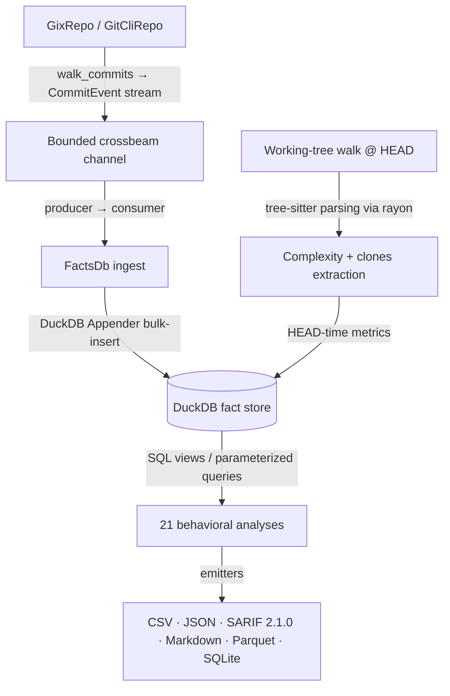

# CodeLore — Deep Codebase Analysis Report

This document presents a deep, read-only analysis of the **CodeLore** codebase. It highlights core architectural patterns, documents the validation status of recent fixes, and outlines remaining and newly identified recommendations for further improvement.

---

## 1. Architectural Overview & Pipeline Data Flow

CodeLore is structured as a multi-crate Rust workspace comprising three main components:
*   [codelore-rca](file:///Users/emrec/Projects/playground/codescene/crates/codelore-rca): A vendored fork of Mozilla's `rust-code-analysis` providing structural syntax hashing and complexity metrics.
*   [codelore-lib](file:///Users/emrec/Projects/playground/codescene/crates/codelore-lib): The core engine, handling repository walk abstraction, identity resolution, fact-store management, analyses execution, caching, and output emitters.
*   [codelore-cli](file:///Users/emrec/Projects/playground/codescene/crates/codelore-cli): The command-line frontend that handles arguments parsing, option consolidation, and output routing.

### Data Ingest Flow

1.  **Repository Traversal**:
    *   [GixRepo](file:///Users/emrec/Projects/playground/codescene/crates/codelore-lib/src/repo/gix_repo.rs) uses pure-Rust `gitoxide` libraries to parse refs and traverse commit graphs in parallel to DuckDB writes.
    *   [GitCliRepo](file:///Users/emrec/Projects/playground/codescene/crates/codelore-lib/src/repo/git_cli_repo.rs) shells out to the standard `git` CLI, serving as a differential testing oracle.
2.  **Event Ingestion**:
    *   `duckdb::Connection` is `!Send + !Sync`. To get parallelism, a **Producer-Consumer pattern** is utilized:
        *   The background thread walks commits using `GixRepo` and places [CommitEvent](file:///Users/emrec/Projects/playground/codescene/crates/codelore-lib/src/types.rs#L44-L57) instances onto a bounded `crossbeam-channel`.
        *   The main connection-owning thread consumes these events and bulk-inserts them via DuckDB's fast `Appender` API in [ingest_loop](file:///Users/emrec/Projects/playground/codescene/crates/codelore-lib/src/facts/ingest.rs#L402-L460).
3.  **Complexity and Clones at HEAD**:
    *   In [ingest_complexity_at_head](file:///Users/emrec/Projects/playground/codescene/crates/codelore-lib/src/facts/ingest.rs#L87-L162), a parallel walk scans all "live" (non-deleted) source files at HEAD. Rayon workers compile tree-sitter AST nodes, compute cyclomatic/cognitive/Halstead complexity, deduplicate entities, and serially drain results into the database.
    *   Similarly, [populate_clones_at_head](file:///Users/emrec/Projects/playground/codescene/crates/codelore-lib/src/facts/ingest.rs#L164-L262) extracts function fingerprints to identify structural Type-1 (exact) and Type-2 (renamed/parameterized) clones.
4.  **SQL-Driven Analyses**:
    *   21 behavioral analyses run purely as DuckDB SQL views or parameterized queries over the fact store (e.g. [hotspots.rs](file:///Users/emrec/Projects/playground/codescene/crates/codelore-lib/src/analyses/hotspots.rs), [coupling.rs](file:///Users/emrec/Projects/playground/codescene/crates/codelore-lib/src/analyses/coupling.rs)).

---

## 2. Validation Status of Previously Documented Findings

### 1. Lines Added/Deleted (`loc_added`/`loc_deleted`) are Stubbed to 0
*   **Status**: **FULLY FIXED** ([commit `54040de`](file:///Users/emrec/Projects/playground/codescene/commit/54040de14a04d8bd8a4eb5c1cca60330620aad9a))
    *   `GitCliRepo` now issues `git log --raw --numstat` to extract exact added and deleted lines.
    *   `GixRepo` fetches parent and current blobs and uses `gix_diff::blob::diff_with_slider_heuristics` to run standard histogram diffs and calculate line counts.

### 2. Propagated `rows_limit` Parameter Distorting Composite / Derived Analyses
*   **Status**: **FULLY FIXED** ([commit `6414aa0`](file:///Users/emrec/Projects/playground/codescene/commit/6414aa0))
    *   The `Options` struct exposes a `with_no_row_limit()` helper.
    *   `run_code_health` and `run_clone_coupling` now invoke the nested `run_coupling` call with a row-unlimited options bag, ensuring calculations like `coupling_centrality` are done on the complete graph.

### 3. Unused `max_coupling_pct` Filter
*   **Status**: **FULLY FIXED** ([commit `6414aa0`](file:///Users/emrec/Projects/playground/codescene/commit/6414aa0))
    *   `run_coupling`'s SQL query was updated to bind and restrict the maximum threshold: `AND degree <= ?`.

### 4. Discrepancy in Rename/Copy Tracking between Repository Walkers
*   **Status**: **FULLY FIXED** ([commit `06a21b5`](file:///Users/emrec/Projects/playground/codescene/commit/06a21b5))
    *   `GixRepo`'s diff options were configured to enable rewrite tracking matching git defaults (`diff_opts.track_rewrites(Some(gix::diff::Rewrites::default()))`), ensuring parity with `GitCliRepo`.

### 5. History Splitting due to Renames
*   **Status**: **PARTIALLY FIXED** ([commit `4c1c3b7`](file:///Users/emrec/Projects/playground/codescene/commit/4c1c3b7))
    *   A recursive CTE was introduced to build `path_lineage` mappings, and a temporary `changes_lineage` table resolves old paths to canonical post-rename paths.
    *   **The Remaining Gap**: This has only been wired into **3** out of 12 path-aggregating analyses (`revisions`, `hotspots`, `coupling`). The remaining **9** analyses (`churn`, `code_health`, `code_age`, `entity_ownership`, `main_dev`, `ownership`, `entity_effort`, `messages`, `soc`) still query literal paths from `changes` directly and suffer from split-history aggregation errors.

### 6. `.mailmap` Edits Do Not Invalidate Persistent Cache (Stale / Poisoned Cache)
*   **Status**: **FULLY FIXED** ([commit `4503d4b`](file:///Users/emrec/Projects/playground/codescene/commit/4503d4bbc1d9246464d2fd3a51dfb2e6a52774c2))
    *   The cache key computation `Options::canonical_json()` now reads and digests the `.mailmap` file (or falls back to the auto-discovered `<repo>/.codelore-teams` team mapping) and integrates the hash into the cache key. Edits to `.mailmap` now invalidate the cache key.

### 7. `.codeloreignore` Edits Do Not Invalidate Persistent Cache
*   **Status**: **FULLY FIXED** ([commit `4503d4b`](file:///Users/emrec/Projects/playground/codescene/commit/4503d4bbc1d9246464d2fd3a51dfb2e6a52774c2))
    *   The cache key computation `Options::canonical_json()` now digests `.codeloreignore` contents and incorporates the digest into the cache key hash, ensuring edits immediately trigger cache invalidation.

### 8. Missing Indexes on the Temporary `changes_lineage` Table
*   **Status**: **FULLY FIXED** ([commit `4503d4b`](file:///Users/emrec/Projects/playground/codescene/commit/4503d4bbc1d9246464d2fd3a51dfb2e6a52774c2))
    *   Added `idx_changes_lineage_path` and `idx_changes_lineage_rev` to `materialize_changes_lineage` immediately after table creation to avoid full-table scans.

### 9. Redundant `count_loc` for Bit-Identical Blobs in `GixChange::Rewrite`
*   **Status**: **FULLY FIXED** ([commit `4503d4b`](file:///Users/emrec/Projects/playground/codescene/commit/4503d4bbc1d9246464d2fd3a51dfb2e6a52774c2))
    *   Correctly checks for a `None` diff during rewrites (representing 100% similarity/bit-identical blobs) and returns `(100u8, 0, 0)` immediately, saving redundant disk I/O and CPU diff cycles.

---

## 3. Newly Identified Critical Gaps & Recommendations

### 🚨 Critical Defect: Extensible Bot Detection (`.codelorebots`) is Dead Code

**The Problem**:
While `.codelorebots` is parsed in unit tests and its content hash is correctly verified in the cache key, the production code completely bypasses it. Specifically:
- Inside the ingestion loop ([ingest.rs:447](file:///Users/emrec/Projects/playground/codescene/crates/codelore-lib/src/facts/ingest.rs#L447)), the code calls `identity::is_bot(&event.author_email, &event.author_name)`.
- Inside `GixRepo::walk_commits` ([gix_repo.rs:125](file:///Users/emrec/Projects/playground/codescene/crates/codelore-lib/src/repo/gix_repo.rs#L125)), the code calls `identity::ai_attribution(&event.author_email, &event.author_name, &event.message)`.
Both of these calls target the free functions defined in `identity::bots`, which strictly query the hardcoded `DEFAULT_BOT_PATTERNS` block. The extensible `BotPatterns` struct is never initialized or consulted in production. Consequently, user-configured internal/custom bots are classified as `human` rather than `ai-authored`.

**Suggested Fix**:
Construct and pass the `BotPatterns::from_repo(&opts.repo_path)` instance into the ingestion and repository walk phases, and utilize `BotPatterns::is_bot` / `BotPatterns::ai_attribution` rather than calling the static free functions.

---

### 🚨 Correctness Bug: JIT-SDP Kamei History Metrics (`ndev`, `nuc`, `age`) Severed by Renames

**The Problem**:
The JIT-SDP Kamei feature calculations in `enrich_history` perform SQL `UPDATE`s by joining the current changes with historical changes on literal paths (`pchg.path = cchg.path`). If a file is renamed, all historical revisions, developer counts, and age tracking before the rename are completely lost/severed for that file.

**Suggested Fix**:
Route the history queries through the lineage-resolved path mapping (`changes_lineage`) so that history is aggregated across renames.

---

### ⚡ Feature Gap: Time-Bucket and Canonical Lineage Composition Conflict

**The Problem**:
In `run_coupling`'s `source_table` helper, if `--time-bucket` is active, it takes precedence and selects `"changes_bucketed"`. However, `"changes_bucketed"` is always materialized from the raw `changes` table, completely ignoring the rename lineage. This means rename canonicalization is silently disabled when temporal bucketing is requested.

**Suggested Fix**:
Support composing lineage and bucketing by materializing bucketing over the lineage-resolved view when both options are set.

---

### ⚠️ Defect: Discrepancy in `.mailmap` Resolution between Repository Walkers

**The Problem**:
While `GixRepo` resolves mailmap aliases at walk time, the `GitCliRepo` fallback/testing oracle does not resolve them at walk time and sets `canonical_author` to `None`. This means when ingesting with `GitCliRepo` (e.g. during differential tests), mailmap aliases are not resolved in the database.

**Suggested Fix**:
Implement mailmap resolution for `GitCliRepo` in `walk_commits`.

---

### 🚨 Major Issue: Parquet Output Emitters Bypass Rename Lineage (Correctness Bug)

**The Problem**:
In [parquet.rs](file:///Users/emrec/Projects/playground/codescene/crates/codelore-lib/src/output/parquet.rs), the `write_hotspots_parquet` and `write_revisions_parquet` functions query the raw `changes` table directly. If the user requests `--format parquet` combined with `--use-canonical-lineage` (default true), the output Parquet files will completely ignore the rename-lineage mapping and output split histories.

**Suggested Fix**:
Re-route the Parquet SQL builders to respect `opts.use_canonical_lineage`. Instead of duplicating the SQL string inline in `parquet.rs`, invoke the public `build_sql` helper from `hotspots` or build equivalent schema tables over the canonical `changes_lineage` table.

---

### ⚡ Performance Bottleneck: Double `find_commit` per Commit Event

**The Problem**:
In `GixRepo::walk_commits` ([gix_repo.rs](file:///Users/emrec/Projects/playground/codescene/crates/codelore-lib/src/repo/gix_repo.rs#L51-L98)), the walker performs `repo.find_commit(oid)` once during the initial OID collection phase, and then performs a second `find_commit(oid)` inside the mapped iterator step to parse the full commit event metadata.

**Suggested Fix**:
Parse the commit metadata in the first pass where `repo` is in scope, and collect a list of events. The mapped iterator step then only needs to populate the `changes` field via `compute_changed_files`. This cuts commit object parsing overhead by **50%**.

---

### ⚙️ DX/Feature Gap: Unwired `--explain` Query Plans

**The Problem**:
The new `--explain` flag is only wired into `run_hotspots` ([hotspots.rs](file:///Users/emrec/Projects/playground/codescene/crates/codelore-lib/src/analyses/hotspots.rs#L106-L109)). The remaining 20 queries cannot output their DuckDB optimizer plan to stderr.

**Suggested Fix**:
Wire the general `FactsDb::explain_sql` helper into all analyses run functions.

---

## 4. General Codebase Health & Roadmap Recommendations

### ⚠️ Concern: Hand-rolled CSV Quoting in `output/csv.rs`
Instead of using the standard `csv` crate, [csv.rs](file:///Users/emrec/Projects/playground/codescene/crates/codelore-lib/src/output/csv.rs) relies on 28 hand-rolled `writeln!` calls and a custom [quote_if_needed](file:///Users/emrec/Projects/playground/codescene/crates/codelore-lib/src/output/csv.rs#L18-L26) escaping utility.

### ⚠️ Concern: Hardcoded Dependency Metadata
Provenance generation in [provenance/mod.rs](file:///Users/emrec/Projects/playground/codescene/crates/codelore-lib/src/provenance/mod.rs) and [arrow_facade.rs](file:///Users/emrec/Projects/playground/codescene/crates/codelore-lib/src/arrow_facade.rs) hardcodes version tags (e.g. `gix_version: "0.84.0"`, `duckdb_version: "1.10503.1"`, `ARROW_RUNTIME_VERSION: "58.3.0"`). Querying DuckDB's version dynamically at runtime (`SELECT version();`) and dependencies' versions via Cargo environment variables/build-scripts would be more robust.

### ⚡ Parallelize Clones Ingest
HEAD-time complexity metrics extraction is parallelized using Rayon, but fingerprint extraction in `populate_clones_at_head` remains sequential. Parallelizing this walk using `rayon::par_iter` would match the speedups achieved in the complexity pass.

---

## Summary of Findings

| Category | Finding / Improvement Point | Priority / Risk | Impact | Status / Fix |
|---|---|---|---|---|
| **Defect** | `loc_added` / `loc_deleted` are always `0` on walks. Churn analyses return zeroed lines. | **High** / Medium | Distorts churn, main-dev, and Kamei vectors. | **Fixed** in `54040de` |
| **Defect** | Propagated `rows_limit` parameter caps nested query results in composite/derived analyses (`code-health` & `clone-coupling`). | **High** / High | Corrupts coupling centrality and clone-coupling matches when `--rows` is set. | **Fixed** in `6414aa0` |
| **Defect** | `.mailmap` edits do not invalidate persistent cache key, leading to stale author aggregations. | **High** / High | Stale cache hit bypasses updated alias associations. | **Fixed** in `4503d4b` |
| **Defect** | `.codeloreignore` edits do not invalidate persistent cache key. | **High** / High | Stale cache hit returns metrics for ignored files. | **Fixed** in `4503d4b` |
| **Defect** | Extensible Bot Detection (`.codelorebots`) is Dead Code in production. | **High** / High | Custom bots are classified as human instead of `ai-authored`. | **Active** (New) |
| **Defect** | JIT-SDP Kamei history metrics (`ndev`, `nuc`, `age`) are severed by file renames. | **High** / High | Corrupts SDP predictions for files with commit history across renames. | **Active** (New) |
| **Defect** | Parquet output emitters bypass rename lineage, outputting raw split histories. | **High** / High | Parquet formats mismatch stdout/CSV/Markdown when lineage is active. | **Active** |
| **Defect** | `max_coupling_pct` option is ignored in `run_coupling` queries. | **Medium** / Low | High-coupling pairs are not filtered out when specified. | **Fixed** in `6414aa0` |
| **Defect** | Discrepancy in rename/copy tracking config between `GixRepo` (disabled) and `GitCliRepo` (enabled). | **Medium** / High | Leads to inconsistent analysis outputs depending on repo walker. | **Fixed** in `06a21b5` |
| **Defect** | Rename tracking splits file histories in SQL aggregation queries. | **Medium** / High | Split history leads to incorrect Revision and Coupling statistics. | **Partially Fixed** in `4c1c3b7` (Wired for 3/12 analyses) |
| **Defect** | Time-Bucket and Canonical Lineage options ignore each other when both are set. | **Medium** / High | Temporal bucketing bypasses rename lineage mapping. | **Active** (New) |
| **Defect** | Discrepancy in walk-time `.mailmap` resolution between `GixRepo` (enabled) and `GitCliRepo` (disabled). | **Medium** / Medium | Ingestion with Git CLI fails to canonicalize authors in tests. | **Active** (New) |
| **Performance** | Missing index on `changes_lineage` temporary table. | **Medium** / High | Forces full table scans on path-aggregating queries when lineage is active. | **Fixed** in `4503d4b` |
| **Performance** | Redundant `count_loc` call for bit-identical blobs in imperfect `GixChange::Rewrite`. | **Medium** / Low | Overhead reading/diffing identical blobs. | **Fixed** in `4503d4b` |
| **Performance** | Double `find_commit` lookup/parsing per commit during `GixRepo::walk_commits`. | **Medium** / Low | Double lookup overhead on repositories with large history. | **Active** |
| **Refactor** | SQL queries are duplicated in `output/parquet.rs` instead of being shared. | **Low** / Low | Risk of silent drift between Parquet outputs and standard emitters. | **Active** |
| **Refactor** | Dependency metadata versions are hardcoded in the codebase instead of queried dynamically. | **Low** / Low | Desynchronized provenance reports during dependency upgrades. | **Active** |
| **Refactor** | Hand-rolled CSV writing in `output/csv.rs` instead of standard `csv` crate. | **Low** / Low | Potential CSV injection or formatting bugs on new features. | **Active** |
| **Feature** | `--explain` is only wired into `run_hotspots`, bypassing other 20 queries. | **Low** / Low | Cannot query other analyses plans for optimization checks. | **Active** |
| **Feature** | Sequential filesystem walk for Clones extraction at HEAD. | **Low** / Low | Lower ingestion throughput on large repositories. | **Active** |
| **DX** | Absence of strict validation for option constraints at CLI boundaries. | **Low** / Low | Silently invalid runs return empty results instead of parsing errors. | **Active** |
