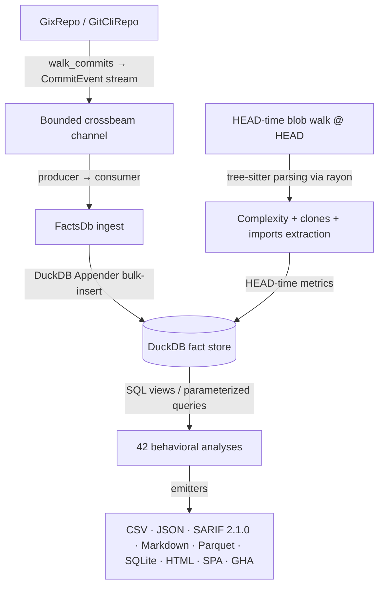

# CodeLore — Deep Codebase Analysis Report

Read-only audit log. Findings are immutable F-IDs; the status field tracks state.
Shipped/fixed findings are condensed to a one-line closure row once validated against `main` (full history in `CHANGELOG.md` + git); refuted findings stay documented to prevent rediscovery.

**Last pass: 2026-07-02.** The 2026-07-01 validation + 5-dimension discovery pass added **F200–F230**; the 2026-07-02 implementation pass landed 28 of them on `main` (PRs #71, #74) and refuted F188/F202. See §3 "Implemented" tables + §5 for the current disposition.

---

## 1. Architectural Overview & Pipeline Data Flow

CodeLore is a multi-crate Rust workspace:
*   **codelore-rca**: Vendored fork of Mozilla `rust-code-analysis` — structural syntax hashing + complexity metrics. Hands-off (MPL); out of audit scope.
*   **codelore-lib**: Core engine — repository walk abstraction, identity resolution, fact-store management, analyses, caching, output emitters.
*   **codelore-cli**: Argument parsing, option consolidation, dispatch, output routing.

### Data Ingest Flow

1.  **Repository Traversal**: `GixRepo` (pure-Rust `gitoxide`, hot path) + `GitCliRepo` (differential-testing oracle).
2.  **Event Ingestion**: `duckdb::Connection` is `!Send + !Sync`. Producer-consumer: background thread walks commits → bounded `crossbeam-channel` → connection-owning thread runs DuckDB Appender (`facts/ingest/consumer.rs::ingest_loop`).
3.  **HEAD-time work**: complexity, clones, imports extraction read blobs from the gix ODB, parse via tree-sitter on a rayon pool, drain serially into the DuckDB Appender.
4.  **SQL-Driven Analyses**: 42 behavioral analyses run as parameterised DuckDB queries. Path-aggregating analyses opt into rename-aware aggregation via the `changes_lineage` CTE rewriter.

---

## 2. Historical Findings (F1–F87) — Shipped

All prior findings (F1–F87) shipped and were validated against `main`. Per-finding evidence is in `CHANGELOG.md`. Audit-trail summary:

| Batch | Scope | Outcome |
|---|---|---|
| **F1–F17** | Schema timestamps, chunked walker, rename-aware aggregation, CLI-boundary validation | Shipped |
| **PAR-1–PAR-9, DEEP-1–DEEP-15** | Code-maat parity sweep | Shipped |
| **F18–F28** | Back-test isolation, HTML pagination, cache-write concurrency, parallel filtering | Shipped |
| **F29–F34** | Time-bucket changeset semantics, path-relative skip checks, binary diff guards | Shipped |
| **F35–F42** | Numstat brace expansion, explain-mode params, quadratic Kamei rewrite | Shipped |
| **F43–F56** | Blob clone elision, single-pass templating, COUNT(DISTINCT) elimination, SPA X-Ray join | Shipped |
| **F57–F67** | ECharts theme reload, prefix matching, ODB blob reads, hash aggregation sweep, SIMD line counting | Shipped |
| **F68–F76** | AI attribution rollup, lockstep rev equality, lineage rename-index, NULL-safe distinct elimination | Shipped |
| **F77–F87** | Bare-repo clone discovery, theme-controller migration, multi-column SPA grid, cognitive-color sunburst, JSX/TSX grammar coverage | Shipped |
| **F84, F88** | Refuted at source-quote level | Refuted (preserved) |

---

## 3. Findings F89–F199 — closure log (validated 2026-07-01)

Every row below was re-verified against `main` HEAD by read-only source inspection on 2026-07-01. Fixed rows are condensed to one line (details in `CHANGELOG.md` / git). Rows still open carry forward to §4.

| F-ID | Subject | Status |
|---|---|---|
| F89 | Producer-thread `.expect` panic mapping | Fixed (`8e52984`) |
| F90 | SPA X-Ray sunburst hardcoded ring colors | Fixed (`7f36a7f`) |
| F91 | Markdown emitter unescaped `\|` in cells | Fixed (`7f36a7f`+`49196ad`) |
| F92 | Provenance sidecar atomicity gap | Fixed (`38df3d0`) |
| F93 | `cache_key` silent canonicalize fallback | Fixed (`8e52984`) |
| F94 | `ingest.rs` monolithic → `facts/ingest/` module split | Fixed |
| F95 | `communication.rs` window filter | Refuted (filter at ingest level) |
| F96 | ECharts mount + dispose duplicated | Fixed (`7f36a7f`) |
| F97 | SPA boot-time render storm blocks first paint | Fixed (async `bootWidgets`) |
| F98 | Chart-click drawer no keyboard equivalent | Fixed |
| F99 | Container OCI label `<owner>` placeholder | Fixed (`f6848e6`) |
| F100 | `cut-release.sh` trap hang on stuck `gh api` | Fixed (`f6eb953`) |
| F101 | CI cache keys omit `rust-toolchain.toml` | Fixed (`f204088`) |
| F102 | `bench.yml` kernel-snapshot no error handling | Fixed (`957b3dd`) |
| F103 | `softprops/action-gh-release@v3` mutable | Fixed (`dc6ec60`) |
| F104 | Fisher-exact contingency degenerate cells | Fixed (`b15da46`) |
| F105 | `ureq = "2"` maintenance-only | Fixed (`ec33cf9`; now `ureq 3`) |
| F106 | Provenance manifest no schema-version | Fixed (`7f36a7f`) |
| F107/F108 | SPA runtime errors hotfix | Shipped (v0.5.1) |
| F109 | `diff_output.rs` missed by F91 sweep | Shipped (PR #53) |
| F110 | Differential test only 4 of 8 trait methods | Fixed (PR #57) |
| F111 | `FactsDb::conn()` leaks `&Connection` | Fixed (`pub(crate)` + safe methods) |
| F112 | Provenance manifest missing reproducibility fields | Fixed (PR #57) |
| F113 | CLI reaches into many lib submodules — no façade | Fixed (`cli_api`) |
| F114 | Single-CDN dependence for SPA assets | Fixed (`url_fallbacks`) |
| F115 | Container base images use mutable tags | Fixed (`@sha256:` pins) |
| F116 | Renovate AND Dependabot duplicate ecosystems | Refuted (partitioned by ecosystem) |
| F117 | First-party GHA credential actions use floating tags | Fixed (SHA-pinned) |
| F118 | gix walker thread panic silently swallowed | Fixed (PR #62) |
| F120 | SARIF schema URL on legacy host | Fixed (canonical schemastore URL) |
| F121 | `fishers_exact` crate unmaintained | Fixed (in-tree `stats::fisher_two_tail_pvalue`) |
| F122 | `toml = "0.8"` one major behind | Fixed (`toml = "1"`) |
| F123 | codelore-rca crossbeam/num-format stale | Refuted (both are current releases) |
| F124 | MSRV pin has zero buffer | Fixed (documented policy) |
| F125 | Redundant queries fire 4× per ingest | Fixed (PR #58, hoisted once) |
| F126 | N single-row UPDATEs in resolve_imports | Fixed (PR #58, bulk UPDATE…FROM) |
| F127 | Kamei `enrich_diffusion` correlated subqueries | Fixed (full, incl. entropy block) |
| F128 | Kamei `enrich_size` correlated subqueries | Fixed (PR #64) |
| F129 | `arch_violations` materialise-then-truncate | Fixed (direct-iterate + early-break) |
| F130 | `pair_programming` O(P²) with `String::clone` | Fixed (integer-interned keys) |
| F131 | Provenance tooltip 14×14 px target | Fixed (24×24, WCAG 2.5.5) |
| F132 | Hardcoded hex in widgets.js breaks light theme | Fixed (CSS tokens) |
| F133 | No responsive layout < ~1280px | Fixed (`md:grid-cols-2`) |
| F134 | Hotspot 'Show all' synchronous HTML build | Fixed (chunked + `yieldToMain`) |
| F135 | Theme toggle re-runs full d3.pack layout | Fixed (yield between rerenderers) |
| F136 | Color-mode tablist mismatches WAI-ARIA | Fixed (`aria-selected`) |
| F137 | Knowledge-islands rows not keyboard-activable | Fixed (`wireRowKbActivation`) |
| F138 | `startViewTransition` ignores reduced-motion | Fixed (PR #62) |
| F139 | `DiffGates` parsed but never evaluated | Fixed (`549c460`) |
| F140 | Six new analyses lack integration tests | Fixed (`7b43593`) |
| F141 | `imports_factsdb_test` only asserts unresolved | Fixed (`7b43593`) |
| F142 | Sparse tracing across `analyses/` | Fixed — **residual: 6 `dashboard.rs` fns still uninstrumented → new F224** |
| F143 | SPA headless-browser smoke test | Fixed (PR #56) |
| F144 | No CI dogfooding of `codelore` on itself | Fixed (`dogfood` job) |
| F145 | `main.rs` dispatch boilerplate | Fixed (1-D dispatch fns) |
| F146 | `json.rs` trivial `write_*_json` shims | Fixed (generic `write_json`) |
| F147 | `AnalysisName` 3-way sync no exhaustiveness guard | Fixed (`registry!` macro) |
| F149 | `hunks` table lacks PK + NOT NULL + index | Fixed (schema + full ingest wiring) |
| F150 | Schema version disjoint, no startup validation | Fixed (PR #61) |
| F151 | Leiden communities non-deterministic | Fixed (PR #61, `LEIDEN_SEED`) |
| F152 | `clone_group_id` non-deterministic | Fixed (PR #61, `BTreeMap`) |
| F153 | `--team-map` config IO error exits 5 not 3 | Fixed (`RepoIo`) — **residual: other config readers still wrong → new F211** |
| F154 | `codelore diff` base==head empty SARIF | Fixed (PR #62) |
| F155 | `DiffOutput` medians default silent 0.0 | Fixed (PR #60, `Option<f64>`) |
| F156 | Thresholds/Gates/DiffGates no `deny_unknown_fields` | Fixed (PR #60) |
| F157 | F147 guard wraps the wrong list | Fixed (PR #60) |
| F158 | SARIF `informationUri` wrong project URL | Fixed (PR #63) |
| F159 | SARIF `artifactLocation.uri` not percent-encoded | Fixed (PR #63) |
| F160 | Kamei NDEV/EXP same-second `<` vs `<=` | Fixed (PR #64) |
| F162 | Parquet column types drift from CSV row-type | Fixed (shared SQL generators) |
| F163 | SARIF `automationDetails.id` static | Fixed (PR #63) |
| F164 | Task-ID (`F<NN>`) refs in code comments | Fixed — **residual: `Plan 1/4` markers in gix_repo.rs → new F205** |
| F165 | `--format ndjson`/`gha` panics `unreachable!` | Fixed (clean `bail!`) |
| F166 | `codelore schema` row-type list drifted | Fixed (derives from `AnalysisName::all()`) |
| F167 | stale-code/delivery-friction wall-clock anchor | Fixed (`MAX(commits.date)` + `age_time_now`) |
| F168 | `lead-time` ORDER BY lacks tiebreaker | Fixed (`, rev ASC`) |
| F169 | Treemap breadcrumb undefined `--bg-elev-1` | Fixed (`--bg-elev`) |
| F170 | CSV emitter no formula-injection guard | Fixed (`'` prefix + force-quote) |
| F171 | `bus-factor` drops root files + not rename-aware | Fixed (`<root>` bucket + lineage) |
| F172 | Calendar heatmap `Math.min.apply` RangeError | Fixed (single-pass loop) |
| F174 | `run_coupling` recomputed 2–5×, no memoization | Fixed (per-`FactsDb` `Rc` memo) |
| F175 | SPA detail drawer no focus management | Fixed (focus enter/return + `aria-labelledby`) |
| F176 | Six SQL analyses in `output/spa.rs`, exit-5 leak | Fixed (moved to `analyses/dashboard.rs`, exit-4) — **residual: no tests/tracing → new F223/F224** |
| F178 | `query_map_collect` under-adopted | Fixed (~73% adoption) |
| F179 | Tablists lack arrow-key nav / roving tabindex | Fixed (full WAI-ARIA tabs pattern) |
| F180 | Charts expose no text alternative | Fixed (`role=img`+`aria-label` at 12 sites) |
| F181 | No `prefers-reduced-motion` CSS block | Fixed |
| F182 | Dynamic updates silent to screen readers | Fixed (`aria-live` summary) |
| F183 | Selection-listener stale-closure leak | Fixed (dedup-by-source) |
| F184 | `changes_lineage` rebuilt every analysis call | Fixed (build-once guard) |
| F185 | Clone `Fingerprint` retains unused `sequence` | Fixed (field removed) |
| F187 | `just test` diverges from CI invocation | Fixed (feature scope matches CI) |
| F189 | `vendor-duckdb-rs.sh` no retry / mutable-tag TOFU | Fixed (retry + SHA pin + stamp) |
| F190 | `explain` covers 15/32; no anti-drift test | Fixed (31 topics + enforced coverage test) |
| F192 | mi/communities/centrality no `run_*` tests | Fixed (3 integration tests) |
| F193 | `resolve_imports_at_head` builds path set twice | Fixed (built once, shared) |
| F194 | Kamei `enrich` re-materializes `changes_lineage` | Fixed (subsumed by F184 guard) |
| F195 | `deny.toml` multiple-versions, no skip-list | Fixed (explicit skip-list) |
| F196 | `release.yml` no sccache warm-cache reuse | Fixed (sccache wired) |
| F198 | Two SQL source-swap mechanisms, false-symmetry doc | Fixed (doc corrected; both intentional) |
| F199 | `Options::validate()` reports `Provenance` variant | Fixed (`InvalidOptions` + test) |

### Implemented 2026-07-01 (this session — CI-exact gate green: fmt + clippy `--all-features -D warnings` + `test --features test-support,spa` (75 binaries) + `cargo deny`)

| F-ID | Subject | Fix |
|---|---|---|
| F191 | Usage errors (`--complexity-sample`) exit 1 | Typed `CodeLoreError::InvalidOptions` (exit 2); leaked `Plan` markers dropped from the user-facing message |
| F201 | `read_blob_at` directory-path divergence | `GitCliRepo` uses `git cat-file blob` (errors on non-blob → `Ok(None)`, matching `GixRepo`); differential test `read_blob_at_returns_none_for_a_directory_path` |
| F203 | Dead `Options.commit_range` knob | Field + `Default` + two doc refs removed; cache key auto-updates via the serde derive |
| F204 | Dead `CodeLoreError::Provenance` variant | Variant removed; exit-code test re-anchored on `InvalidOptions` |
| F205 | Stale banned `Plan 1/4` markers on `compute_changed_files` | Comment rewritten to the current contract (real loc + hunks). Broader `Plan N` sweep → new F231 |
| F207 | `cycle-origins` no rev-keyed graph memo | `HashMap<rev, Rc<ImportGraph>>` shared across bisections via `graph_at_rev_cached` |
| F208 | Structural import graph rebuilt per arch analysis | Per-`FactsDb` `Rc<ImportGraph>` memo; `build_import_graph` returns the shared handle |
| F209 | `apply_grouping` row-by-row INSERT | DuckDB Appender + `flush()` |
| F210 | `clone-coupling` 4 `String` clones/edge | Borrowed `(&str, &str)` probe-map keys — zero clones |
| F211 | Config file-reads → `Analysis` not `RepoIo` | arch-rules / thresholds / group-file read failures → `RepoIo` (exit 3); parse failures stay `Analysis` (exit 4). Finishes the F153 job |
| F212 | `unwrap_or_default` masks head-rev read error | Typed `map_err` (consistent with the surrounding plumbing) |
| F213 | `pair_programming` dead `params!` lint-defeat | `use duckdb::params;` + throwaway `let _ = params![…]` removed |
| F214 | `is_bot` allocates 2 `String`s/commit | Non-allocating ASCII `contains_ignore_ascii_case`; both `is_bot` sites |
| F216 | SPA coupling Sankey/drawer read non-existent fields | Read real `shared`/`degree`; band width, "top 30" sort, and drawer label all corrected |
| F217 | Reset-zoom buttons never installed (async-boot race) | Idempotent installer re-run at end of `bootWidgets()` |
| F219 | Trends `shortPath` label collisions | Collision falls back to the unique full path; series keyed by the disambiguated label |
| F220 | Calendar `visualMap` degenerate at `min===max` | Anchor low end at 0 so the single value paints a visible band |
| F221 | Tooltip `?` in `<th>` triggers sort | Sort handler skips clicks originating from `.tooltip-trigger` |
| F222 | Hotspot zero-filter-match blank body | Inline "No paths match '…'" empty-state row |
| F223 | Six `dashboard.rs` fns no integration test | New `tests/dashboard_test.rs` drives all six over the ingested fixture |
| F224 | Six `dashboard.rs` fns lack tracing spans | `#[tracing::instrument]` on all six (matches every sibling analysis) |
| F225 | No exit-2 CLI test | `invalid_options_exit_with_code_2` (`--min-coupling` > `--max-coupling` → exit 2) |
| F226 | `build_import_graph_from_edges` HashSet iteration order | Sorted edge list before adjacency build (removes per-process nondeterminism) |
| F227 | `ANY_VALUE()` nondeterministic in bucketed/grouped ingest | `arg_max(…, ROW(m.date, -m.rowid))` (bucketed) / `arg_max(…, c.path)` (grouped) |
| F228 | hotspot-velocity window consts doc-only | SQL is now a `{recent}/{baseline}/{boundary}` template resolved from the consts (byte-identical) |

### Implemented + validated 2026-07-02 (validate-then-implement over the deferred backlog)

Deep validation of the deferred backlog: one clean win shipped, two findings refuted as intentional designs, one confirmed ready-to-execute.

| F-ID | Subject | Outcome |
|---|---|---|
| F200 | `commit_metadata` stub divergence + vacuous differential test | **Fixed** — deleted the unused `commit_metadata` trait method (both backends) + the `CommitMetadata` type + the vacuous `commit_metadata_match` test + two other dead references. **Kept** `changed_files`/`diff_hunks` (their differential tests are *real* cross-checks, not vacuous). Narrower than "delete all three oracle-only methods" — only `commit_metadata` was both divergent (gix stub vs cli-real) and vacuously tested. Gate green: fmt + clippy `--all-features -D warnings` + test (75 binaries) + deny. |
| F188 | `cut-release.sh` ruleset body omits spa-browser/dogfood | **Refuted** — the omission is *intentional + documented*. `cut-release.sh:230-232` explicitly names spa-browser/dogfood as known-excluded; `dogfood` is `continue-on-error` (correctly not a required gate); and a live-vs-hardcoded drift-detector (`:250`) guards against divergence. Adding spa-browser would be a *policy* change (make it gate release tags), not a bug fix — the maintainer's call. |
| F202 | Fan-in/out computed three inconsistent ways | **Refuted (mostly)** — god-classes fan_out *intentionally* counts external (npm/pypi/std) imports (documented as "total dependency breadth"), while crossing/instability measure *internal* coupling. That divergence is by design. The only genuine gap is crossing-vs-instability self-loop handling (a rare re-export edge case) — low value, output-changing, needs a semantics decision. Not the broad "three different numbers" defect the finding implied. |
| F229 | Vendored `libduckdb-sys` fork (duckdb-rs#786) | **Fixed (merged to main via #71 — full CI matrix green incl. `test (windows-latest)`)** — bumped `duckdb → =1.10504.0` (upstream #786 fix; the released `build.rs:66` emits `rustc-link-lib=dylib=rstrtmgr`) and removed the whole vendoring apparatus: the `[patch.crates-io]` block, `vendor/duckdb-rs/` + tracked stubs, `scripts/vendor-duckdb-rs.sh`, `patches/duckdb-rs-msvc-1940.patch`, the `.gitignore` stub-path handling, and the "Vendor patched libduckdb-sys" step at all 9 sites across ci/release/container/bench. No arrow-version conflict; a version-drift guard caught + forced `provenance::DUCKDB_VERSION` + banner test refs to `1.10504.0`. The MSVC build (the whole reason the fork existed) is confirmed green on the Windows runner. |

### Refuted findings (preserved to prevent rediscovery)

F84, F88 (silent ODB skip rationale), F95 (window filter at ingest level), F116 (Renovate/Dependabot partitioned by ecosystem — Renovate owns `cargo`, Dependabot owns `github-actions`), F123 (crossbeam 0.8.4 + num-format 0.4.4 are current releases), plus the earlier-report set: apply_grouping JOIN shape, renderHeader listener leak, parquet/SQLite backslash escape, hotspots CTE leak, color-mode aria-label, Kamei SEXP `<` vs `<=`, tree-sitter `kind_id` ABI, AI-assist false positives, NULL-conflated AI attribution, DuckDB pinning speculation, code-health weights citation, SoC inclusive thresholds. Rationale in `f1aa0e7` (PR #36) + `13fefcb` (PR #38).

---

## 4. Active Findings

### 4.1 Carried forward from prior passes (re-validated 2026-07-01)

#### F173 — Same HEAD blobs read + tree re-walked up to 3× across complexity/clones/imports
*   **Location**: `facts/ingest/mod.rs:145,158,165` (three sequential passes); each `*_head.rs:55` independently calls `read_blob_at_head`
*   **Severity**: HIGH · **Category**: performance (redundant I/O) · **Status**: Active
*   **State on main**: Still three sequential HEAD passes each re-reading live blobs. Only `head_rev`/`live_paths` were hoisted once (SQL path-queries no longer repeated); blob reads + tree walks still happen 3×. Deepened by the newly-found per-file re-resolution cost in **F206** — even a single deduped pass keeps paying F206's per-file HEAD/commit/tree decode.
*   **Deferral blocker**: divergent extractor error contracts (clones aborts ingest via `collect::<Result>>?`; complexity/imports warn-and-skip) + the memory-regression risk of hoisting all live blobs into one map. Needs a bounded shared-blob LRU or unified error contracts first.

#### F119 — Hand-rolled CSV emitter (now 1122 LOC) instead of the `csv` crate
*   **Location**: `output/csv.rs`
*   **Severity**: MED · **Category**: tool replacement · **Status**: Active (re-scoped)
*   **State on main**: Still hand-rolled (`wc -l` = 1122, up from ~826; no `csv` dep). **Re-scope note**: no longer a clean byte-identical swap — the emitter now carries a deliberate formula-injection guard (F170) and `\n` line endings; the `csv` crate would change both. Any migration must preserve the injection guard + line-ending contract, or the swap is rejected.

#### F148 — `csv.rs` + `markdown.rs` per-analysis emitters, no shared row abstraction
*   **Location**: `output/csv.rs` (~34 KB, 43 `write_*` fns), `output/markdown.rs` (~36 KB)
*   **Severity**: LOW · **Category**: copy-paste drift · **Status**: Active
*   **State on main**: Both grew past the previously-noted ~25 KB; still one `write_*` fn per analysis, no `TabularEmit`/row trait. Coupled to F119 (csv-crate) + F161 (streaming) — treat as one output-layer cluster.

#### F161 — Every emitter materializes the full `Vec<Row>` — no streaming path
*   **Location**: `output/json.rs:29`, `sarif.rs:90`, `markdown.rs` — all `rows: &[T]`
*   **Severity**: LOW · **Category**: memory architecture · **Status**: Active
*   **State on main**: All emitters still take a fully-materialized slice; no `EmitterStream`. Peak memory grows with row count; a 200k-path monorepo CSV export can spike multi-GB. SARIF stays batch (needs run-level totals); CSV/JSON/markdown are the streamable targets.

#### F177 — Three schema-version sentinels still coexist
*   **Location**: `facts/schema.rs:10` (`CURRENT_SCHEMA_VERSION="3"`), `cache.rs:25` (`CACHE_EPOCH="schema_v5"`), `schema_v1.sql` filename literal; stray `"schema_v3"` help-text at `main.rs:373`
*   **Severity**: MED · **Category**: duplicated source-of-truth · **Status**: PARTIAL
*   **State on main**: Both named sub-fixes landed — CLI `profile` now derives the schema string from `CURRENT_SCHEMA_VERSION`, and the cache sentinel was renamed to the honest `CACHE_EPOCH` (matches CLAUDE.md). But three version constants remain structurally disjoint (none derived from another) and a stray `"schema_v3"` help literal persists. Residual: unify or cross-reference the three; fix the stray literal.

#### F186 — Bench regression gate never runs on PRs (advisory-only weekly cron)
*   **Location**: `.github/workflows/bench.yml:3` (`schedule` + `workflow_dispatch`, no `pull_request`), `:116` (`fail-on-alert: false`)
*   **Severity**: MED · **Category**: CI coverage / design tradeoff · **Status**: Active (design decision)
*   **State on main**: Unchanged and explicitly documented as intentional post-merge advisory behavior. Kept as a design-review item, not a plain bug: a perf regression can merge unflagged until the Monday cron. Decision point — leave advisory, or add a non-gating PR-triggered bench comment.

#### F197 — `dogfood` job: per-PR `--release` build, advisory-only, separate cache
*   **Location**: `.github/workflows/ci.yml:210` (`continue-on-error: true`), `:231` (`shared-key: release-dogfood`), `:235` (`cargo build --release`)
*   **Severity**: LOW · **Category**: CI cost · **Status**: PARTIAL
*   **State on main**: The "cold" aspect is mitigated (sccache warms release objects cross-workflow), but the job is still a per-PR `--release` build, advisory-only, on a deliberately separate cache slot. Residual (deliberate bake-in): decide when to gate + whether to share the CI cache slot.

---

### 4.2 Discovery pass — 2026-07-01 (deferred remainder)

The 5-dimension fan-out logged F200–F230; 25 landed in the 2026-07-01 pass and F200 (+ F188/F202 refutations) in the 2026-07-02 pass (see the §3 "Implemented" tables). The entries below are the deferred remainder — each is a large refactor with regression surface, a dependency-migration needing CI validation, or a low-value mechanical sweep, not a quick safe change.

#### Backend performance

##### F206 — `read_blob_at` re-resolves HEAD→commit→root-tree per file and discards the gix object cache each call
*   **Location**: `repo/gix_repo.rs:293-329` (`to_thread_local()` per call → `rev_parse_single` → `find_commit` → `commit.tree()` → `lookup_entry_by_path`); default wrapper `repo/mod.rs:99-101`
*   **Severity**: HIGH · **Category**: blob I/O / redundant recomputation · **Status**: Deferred (own perf pass)
*   **Description**: Every HEAD-time blob read mints a fresh thread-local `Repository` (cold object cache), re-resolves `HEAD`, re-decodes the commit + root tree, and re-walks + re-decodes every intermediate directory tree — for *each* file. A file at depth `d` re-decodes `d` tree objects; every sibling re-decodes its parent tree again. Three HEAD passes × F live files = 3F redundant resolves. This is distinct from and **deeper than** F173 (which only dedups the blob across passes — the per-file HEAD/commit/tree re-decode remains even in one deduped pass). Dominant cost of HEAD scans on large deep-nested monorepos.
*   **Suggested improvement**: Resolve HEAD → root tree once per pass and reuse it (batch `read_blobs_at_head(paths)` walking a single cached tree), or hold one `to_thread_local()` repo with `object_cache_size` enabled across the file loop. Same bytes returned — output-neutral, faster.
*   **Deferral reason**: Restructures the hot HEAD-scan loop and overlaps the F173 blocker (divergent extractor error contracts); wants its own focused perf pass rather than riding this batch.

#### Rust idioms / error handling

##### F215 — Stringly-typed `format: &str` re-matched with `unreachable!()` in ~11 dispatchers
*   **Location**: `codelore-cli/src/main.rs:705` + sibling dispatch fns; also `args.output…expect("validated above")` at `:751/757`
*   **Severity**: LOW · **Category**: type-safety / simplification (optional) · **Status**: Deferred (large refactor)
*   **Description**: `--format` is validated once then re-matched in many dispatchers, each carrying an `unreachable!("format validated…")` arm — a hand-maintained invariant a parse-once `enum Format` would make compile-time-total, deleting the arms + the "validated above" coupling.
*   **Suggested improvement**: Parse `--format` into a `Format` enum at the boundary and thread it through dispatch. A non-trivial refactor across ~11 dispatchers — flagged, not forced.

#### SPA / UI / UX

##### F218 — Any single layout-selector change re-renders every widget (full-dashboard cascade)
*   **Location**: `output/spa/template.html:2155-2191` (one `Alpine.effect` subscribing to all layout knobs → all `_codeloreRerenderers`); double-render at `:2072-2075`
*   **Severity**: MED-HIGH · **Category**: render performance · **Status**: Deferred (perf refactor)
*   **Description**: Bumping the Kamei window 30→60 (one sparkline) re-runs `d3.pack` over the whole hotspot tree, rebuilds every ECharts instance, and re-lays-out the arch graph + DSM. The code yields between rerenderers to stay responsive — treating the symptom. The scenario toggle also auto-clicks the knowledge-loss tab, double-rendering the circle-pack on the first pick.
*   **Suggested improvement**: Split the monolithic effect into per-store effects that re-run only the affected widget(s); key the rerenderer registry by which store fields each entry depends on.
*   **Deferral reason**: Reworks the Alpine reactivity graph — a render-perf polish with regression surface. Its own pass, validated by the SPA + browser tests, rather than riding this batch.

#### Code hygiene

##### F231 — Comprehensive `Plan N` version-phase marker sweep (comment rule violation)
*   **Location**: **62 comment sites across 25 files** (validated 2026-07-02 via `grep -rn "Plan [0-9]" crates/codelore-lib/src crates/codelore-cli/src` → 62; files include `types.rs`, `analysis.rs`, `constants.rs`, `options.rs`, `output/{mod,sarif,parquet}.rs`, `provenance/mod.rs`, `clones/*`, `complexity/*`, `repo/{mod,git_cli_repo,gix_repo}.rs`, `facts/{schema_v1.sql,ingest/*}`, `arrow_facade.rs`, `codelore-cli/src/{args,diff,diff_output,main}.rs`)
*   **Severity**: LOW · **Category**: comment rule violation (no version/task markers) · **Status**: Active (deferred — dedicated scripted sweep)
*   **Description**: F164 swept `F<NN>` finding-IDs out of comments but left `Plan N` phase markers, which are the same banned class under the project's no-version/task-markers-in-comments hard rule. F205 fixed the one *factually-wrong* instance (`gix_repo.rs:355-356`); 62 more remain, several also stale (e.g. `repo/mod.rs:1-2` "the default impl is `gix` in Plan 1; a `GitCliRepo` … lands in Plan 6"). Deferred as a dedicated scripted sweep (like F164) rather than 62 hand-edits riding an unrelated branch — mixing prefixes, parentheticals, and stale future-tense claims, so a blind `sed` would mangle grammar.
*   **Suggested improvement**: A mechanical comment-only sweep like F164's — drop each `Plan N` marker, keep or correct the surrounding rationale (some are false future-tense claims, e.g. "Plan 4 will add X" for X already shipped). Leave vendored `codelore-rca` (MPL fork) untouched.

#### Dependency currency (verify latest before acting — assessed offline from declared/resolved versions)

Overall hygiene is strong: `thiserror 2`, `toml 1`, `ureq 3`, `anyhow`/`serde`/`clap`/`rayon`/`time`/`percent-encoding` all current. `tree-sitter*` + `petgraph` are deliberately pinned (CLAUDE.md) — out of scope. Two items worth active tracking:

##### F230 — `gix` 0.84 → 0.85 bump
*   **Location**: `crates/codelore-lib/Cargo.toml`
*   **Severity**: LOW · **Category**: dependency currency (routine) · **Status**: **Fixed (merged via #74)**
*   **Outcome (2026-07-02)**: bumped `gix 0.84 → 0.85` (latest, published 2026-06-22) with `provenance::GIX_VERSION` + banner refs. API-compatible — the two-backend differential harness (`differential_repo_test.rs`) passed unchanged, so `GixRepo` still matches the `git`-CLI oracle. Consolidated Dependabot #68 (whose only failure was the drift guard) into #74; full CI matrix green. Related closed dep PRs: #69 (arrow 58→59 — deferred, would desync from duckdb's pinned arrow 58), #70 (duckdb group — superseded by F229).

### 4.3 Code-health composite score — design observation (2026-07-02)

#### F232 — Coupling centrality counted twice in the composite code-health score

*   **Location**: `analyses/code_health.rs` — `SHOTGUN_INSERT` (reads `coupling_centrality_v1`, writes `shotgun-surgery` biomarker) + `normalized` CTE `n_cp` term (also reads `coupling_centrality_v1` directly)
*   **Severity**: LOW · **Category**: scoring design / weight calibration · **Status**: Active
*   **State on main**: `coupling_centrality_v1` (the per-file count of Fisher-significant coupling partners) feeds the composite score via two independent paths simultaneously: (1) the `shotgun-surgery` biomarker written by `SHOTGUN_INSERT` (`intensity = PERCENT_RANK(ORDER BY centrality)`) which flows into `structural_risk` (weight 0.40 via `w_sr`); and (2) directly as `n_cp = normalize(centrality)` (weight 0.20 via `w_cp`). A file with high coupling centrality therefore receives a penalty through both paths at the same time — a double-count of the same underlying signal in the current weight assignments. This is a known characteristic of the initial weight constants, not a code defect; the weights were always intended to be validated against real fixtures before being treated as final.
*   **Recommended action**: Validate biomarker/behavioral orthogonality on a representative fixture (e.g. the `tiny_repo` integration fixture extended with a coupling-heavy file) before the 0.40 (`w_sr`) / 0.20 (`w_cp`) constants are treated as final. If the shotgun-surgery biomarker contribution is the intended mechanism for penalizing high-centrality files, `n_cp` may need to weight a decoupled signal or the weights recalibrated to reflect the shared lineage intentionally. See the design specification's composite-weight orthogonality section for the governing decision criteria.

---

## 5. Next Audit Cycle

**State after the 2026-07-01 + 2026-07-02 implementation sessions (all merged to `main`):**

- **Implemented + merged (28)**: 2026-07-01 (25) — F191, F201, F203, F204, F205, F207–F214, F216, F217, F219–F228 (PR #71); 2026-07-02 (3) — **F200** (deleted the divergent+vacuous `commit_metadata` + `CommitMetadata`, kept the real `changed_files`/`diff_hunks` cross-checks; #71), **F229** (dropped the vendored `libduckdb-sys` fork; `duckdb → =1.10504.0`; #71), **F230** (`gix 0.84 → 0.85`; #74). Full CI matrix green on every merge, including `test (windows-latest)`.
- **Refuted on validation (2026-07-02)**: F188 (ruleset omission is intentional + drift-guarded), F202 (fan-out divergence is mostly by design — god-classes externals vs internal coupling).
- **Deferred — large refactor / focused pass**: F206 (HEAD-scan I/O restructure — wants a benchmark), F215 (`enum Format`), F218 (render-cascade split), F231 (62-site `Plan N` scripted sweep).
- **Carried-forward Active (output/blob cluster)**: F119 (csv-crate), F148 (`TabularEmit` dedup), F161 (`EmitterStream`), F173 (HEAD blob dedup) — byte-identical-critical (F206 is the deeper lever for F173).
- **Carried-forward Partial / design**: F177 (schema sentinels), F186 (bench PR gate — design), F197 (dogfood advisory/separate-cache).

**Highest-leverage work remaining:**
1. **HEAD-scan I/O** (F206 + F173) — resolve HEAD→tree once per pass with a per-worker cached repo; benchmark via `ingest_capacity_sweep`. Biggest large-repo wall-clock lever.
2. **Output-emitter cluster** (F119 / F148 / F161) — csv-crate migration (preserve the F170 injection guard + `\n` endings), `TabularEmit` dedup, `EmitterStream` streaming, in one coordinated byte-identical pass.
3. **`Plan N` marker sweep** (F231) — 62-site scripted comment cleanup (a hard-rule violation).

The next sweep should re-open with F-IDs starting at **F233**.
