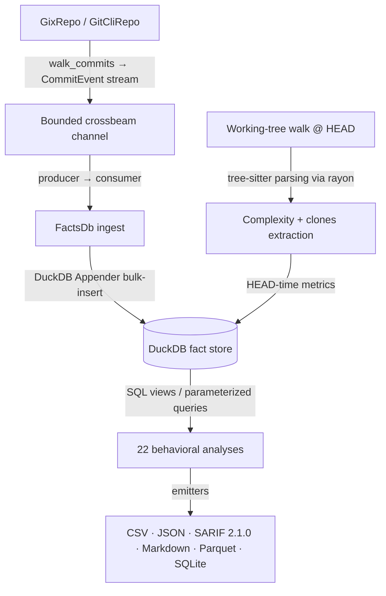

# CodeLore — Deep Codebase Analysis Report

This document presents a deep, read-only analysis of the **CodeLore** codebase. It documents the validation of recent fixes and outlines newly identified recommendations for further correctness, robustness, and performance improvements.

---

## 1. Architectural Overview & Pipeline Data Flow

CodeLore is structured as a multi-crate Rust workspace comprising three main components:
*   [codelore-rca](file:///Users/emrec/Projects/playground/codelore/crates/codelore-rca): A vendored fork of Mozilla's `rust-code-analysis` providing structural syntax hashing and complexity metrics.
*   [codelore-lib](file:///Users/emrec/Projects/playground/codelore/crates/codelore-lib): The core engine, handling repository walk abstraction, identity resolution, fact-store management, analyses execution, caching, and output emitters.
*   [codelore-cli](file:///Users/emrec/Projects/playground/codelore/crates/codelore-cli): The command-line frontend that handles arguments parsing, option consolidation, and output routing.

### Data Ingest Flow



1.  **Repository Traversal**:
    *   [GixRepo](file:///Users/emrec/Projects/playground/codelore/crates/codelore-lib/src/repo/gix_repo.rs) uses pure-Rust `gitoxide` libraries to parse refs and traverse commit graphs in parallel to DuckDB writes.
    *   [GitCliRepo](file:///Users/emrec/Projects/playground/codelore/crates/codelore-lib/src/repo/git_cli_repo.rs) shells out to the standard `git` CLI, serving as a differential testing oracle.
2.  **Event Ingestion**:
    *   `duckdb::Connection` is `!Send + !Sync`. To get parallelism, a **Producer-Consumer pattern** is utilized:
        *   The background thread walks commits using `GixRepo` and places [CommitEvent](file:///Users/emrec/Projects/playground/codelore/crates/codelore-lib/src/types.rs) instances onto a bounded `crossbeam-channel`.
        *   The main connection-owning thread consumes these events and bulk-inserts them via DuckDB's fast `Appender` API in [ingest_loop](file:///Users/emrec/Projects/playground/codelore/crates/codelore-lib/src/facts/ingest.rs).
3.  **Complexity and Clones at HEAD**:
    *   In [ingest_complexity_at_head](file:///Users/emrec/Projects/playground/codelore/crates/codelore-lib/src/facts/ingest.rs), a parallel walk scans all "live" (non-deleted) source files at HEAD. Rayon workers compile tree-sitter AST nodes, compute cyclomatic/cognitive/Halstead complexity, deduplicate entities, and serially drain results into the database.
    *   Similarly, [populate_clones_at_head](file:///Users/emrec/Projects/playground/codelore/crates/codelore-lib/src/facts/ingest.rs) extracts function fingerprints to identify structural Type-1 (exact) and Type-2 (renamed/parameterized) clones.
4.  **SQL-Driven Analyses**:
    *   22 behavioral analyses run purely as DuckDB SQL views or parameterized queries over the fact store (e.g. [hotspots.rs](file:///Users/emrec/Projects/playground/codelore/crates/codelore-lib/src/analyses/hotspots.rs), [coupling.rs](file:///Users/emrec/Projects/playground/codelore/crates/codelore-lib/src/analyses/coupling.rs)).

---

## 2. Validation Status of Prior Recommendations

All four findings from the previous report have been validated as fully fixed in the codebase:

*   **Complexity Metrics LOC Mapping**: Fixed. The `loc` field in `ComplexityEntity` in [mod.rs](file:///Users/emrec/Projects/playground/codelore/crates/codelore-lib/src/complexity/mod.rs) now correctly maps to `m.loc.ploc()` instead of duplicating `m.loc.sloc()`.
*   **GitCliRepo Quoted Path Parity Gap**: Fixed. The parameter `-c core.quotepath=false` is successfully injected at all three git-subprocess execution sites in [git_cli_repo.rs](file:///Users/emrec/Projects/playground/codelore/crates/codelore-lib/src/repo/git_cli_repo.rs).
*   **Shared Temp/Cache Path Collision Risk**: Fixed. Fallback caching and worktree locations now use `fallback_tmp_root()` in [cache.rs](file:///Users/emrec/Projects/playground/codelore/crates/codelore-lib/src/cache.rs) which namespacing by `$USER` / `$LOGNAME` / `$USERNAME` with a PID-based last resort.
*   **Query Rewriter Case Discrepancies**: Fixed. The rewriter regex in [lineage.rs](file:///Users/emrec/Projects/playground/codelore/crates/codelore-lib/src/analyses/lineage.rs) is now case-insensitive, utilizing an explicit SQL-keyword whitelist to distinguish table aliases from standard SQL keywords.

---

## 3. Newly Identified Gaps & Recommendations

### 🚨 Correctness Bug: Chronological Ambiguity in Commits (DATE vs TIMESTAMP)

**The Problem**:
In the database schema [schema_v1.sql](file:///Users/emrec/Projects/playground/codelore/crates/codelore-lib/src/facts/schema_v1.sql), the `commits.date` column is defined as `DATE` (dropping hours, minutes, and seconds). Correspondingly, both `GixRepo` and `GitCliRepo` adapters truncate commit timestamps to calendar dates (`time::Date`). 

**The Impact**:
Because hours/minutes/seconds are discarded, chronological ordering for commits that occur on the same calendar day falls back to lexicographical sorting of their SHA-1 hashes (e.g. `c.rev DESC` / `rev DESC`). 
This has two critical consequences:
1. **HEAD Mismatch**: If the final day of history contains multiple commits, `current_head_rev` (sorting by `date DESC, rev DESC`) will stamp the `complexity_metrics` and `clones` tables with whichever commit has the lexicographically highest SHA, rather than the actual git `HEAD` commit.
2. **Spurious "File Missing" Warnings**: In `query_live_paths`, if a file is modified and then deleted on the same day, a lexicographically larger SHA-1 hash on the modification commit will make the system think the file is still "live". Rayon then tries to parse the deleted file, generating warning logs ("likely an uncommitted deletion; skipping") for fully committed deletions.

**Recommended Fix**:
1. Alter `commits.date` column to `TIMESTAMP`.
2. Update the `Repo` trait's date representation and git parsers to parse full `OffsetDateTime` values.
3. Order commits by timestamp in DuckDB SQL queries to guarantee correct chronological precedence.

---

### 🚨 Correctness Bug: Silent Discard of Clone-Coupling Pairs (`--min-clone-shared-revs` Bug)

**The Problem**:
The `run_clone_coupling` analysis in [clone_coupling.rs](file:///Users/emrec/Projects/playground/codelore/crates/codelore-lib/src/analyses/clone_coupling.rs) retrieves co-change candidates by calling the standalone `coupling::run_coupling(db, &opts.with_no_row_limit())` function. While `with_no_row_limit` clears `rows_limit`, it keeps the default `min_shared_revs` (which is `5`).

**The Impact**:
The inner `run_coupling` call filters out all file pairs that changed together fewer than 5 times. Even though clone-coupling is configured to support a lower floor (via `opts.min_clone_shared_revs`, which defaults to `3`), the inner call has already discarded those pairs. Any clone pair that co-changed 3 or 4 times is silently ignored.

**Recommended Fix**:
Inside `run_clone_coupling`, override `min_shared_revs` in the cloned options passed to `run_coupling` to be the minimum of `min_shared_revs` and `min_clone_shared_revs` (or simply set it to `min_clone_shared_revs`).

---

### ⚠️ Correctness Issue: Persistent Cache Poisoning on Dirty Working Trees

**The Problem**:
When the persistent cache is generated during a cache miss, HEAD-time metrics (`complexity` and `clones`) are read from the files present in the local working tree on disk. However, the cache database is saved under the clean `head_sha` of the current HEAD commit.

**The Impact**:
If the user runs analysis on a dirty working tree (with uncommitted changes), the dirty complexity/clone metrics are cached. If the user subsequently cleans the tree (or runs the analysis on another workstation at the same commit), the cache key matches `head_sha` and hits, silently serving the dirty metrics without printing any warning (since the tree is now clean).

**Recommended Fix**:
Bypass writing to the persistent cache entirely if `repo.is_worktree_dirty()` is true, forcing the use of in-memory fact stores (similar to what is done for Parquet/SQLite formats).

---

### ⚠️ Robustness Issue: Mismatch in Cache Path Resolution during Worktree Pruning

**The Problem**:
In [diff.rs](file:///Users/emrec/Projects/playground/codelore/crates/codelore-cli/src/diff.rs), `add_worktree` correctly resolves the caching root using namespaced `codelore_lib::cache::default_cache_root()` to prevent permission errors on shared hosts. However, the startup cleanup function `prune_stale_worktrees` resolves the directory using the hardcoded bare `/tmp` fallback:
```rust
    let cache_root = dirs::cache_dir()
        .unwrap_or_else(|| PathBuf::from("/tmp"))
        .join("codelore")
        .join("diff-worktrees");
```

**The Impact**:
In environments where XDG cache directories are missing (such as headless servers, sandboxes, and docker containers), `prune_stale_worktrees` will attempt to read/delete from `/tmp/codelore`, triggering the same `PermissionDenied` errors on shared hosts that the namespacing fix was designed to resolve. It also fails to clean up namespaced worktrees of the current user.

**Recommended Fix**:
Update `prune_stale_worktrees` to resolve the cache root using `codelore_lib::cache::default_cache_root()`.

---

### ⚠️ Correctness Issue: Sum of Coupling (`soc`) Omit Changeset Size Cap

**The Problem**:
The Sum of Coupling (`soc`) analysis in [soc.rs](file:///Users/emrec/Projects/playground/codelore/crates/codelore-lib/src/analyses/soc.rs) computes Sum of Coupling as the sum of `(N-1)` for each commit of size `N`. However, the query does not filter out commits exceeding `opts.max_changeset_size` (default 30).

**The Impact**:
If the repository has a single massive commit (such as a dependency lockfile update, file rename sweep, or large build check-in) touching 1,000 files, it will add `999` to the SoC score of every one of those 1,000 files. This completely skews the results, dominating the analysis with false positives.

**Recommended Fix**:
Update `build_soc_sql` to restrict evaluated commits to those where the changeset size is less than or equal to `opts.max_changeset_size`, matching the behavior of the `coupling` analysis.

---

### 🐛 Robustness Issue: Leak of Un-cleaned Worktree Directories on Git Failures

**The Problem**:
In [diff.rs](file:///Users/emrec/Projects/playground/codelore/crates/codelore-cli/src/diff.rs), `add_worktree` invokes `tmp.keep()` to persist the temporary directory path *before* running `git worktree add`.

**The Impact**:
If the `git worktree add` command fails (e.g. because of an invalid revision argument, local git corruption, or a lock error), the function returns `Err`. Because `keep()` was already called, the directory is leaked and left behind inside the cache directory.

**Recommended Fix**:
Call `tmp.keep()` only after `Command::new("git")` completes successfully.

---

## 4. Summary of Active Findings

Validation pass against current `main` confirms F1–F6 remain reachable in source.
F3 received a partial mitigation (a `tracing::warn!` on dirty-tree cache HIT) but
the cache WRITE path still accepts dirty-tree metrics; the original
skip-write recommendation has not been applied.

| ID | Category | Finding / Improvement Point | Priority / Risk | Impact | Status |
|---|---|---|---|---|---|
| **F1** | Correctness | Truncating commit dates to `DATE` granularity causes sub-day ordering ambiguities and wrong HEAD/live-path resolutions. | **High** / Medium | Stale file detection warnings; wrong revision stamps on complexity/clones. | **Fixed (Unreleased)** — schema bumped to v2 with `commits.date TIMESTAMP`; `CommitEvent.date: OffsetDateTime`; cache key now `schema_v2`. |
| **F2** | Correctness | Clone-coupling inherits `--min-shared-revs 5` internally, silently ignoring the default `--min-clone-shared-revs 3` option. | **High** / Low | Silent omission of valid clone-coupling pairs. | **Fixed (Unreleased)** — new `Options::for_clone_coupling_inner_coupling()` lowers the floor to `min(min_shared_revs, min_clone_shared_revs)` before the inner `run_coupling`. |
| **F3** | Correctness | Persistent cache stores dirty working tree metrics under clean `head_sha` commit hash keys. | **Medium** / Medium | Cache poisoning; subsequent clean runs return dirty stats. | **Fixed (Unreleased)** — cache write now skipped on dirty tree; falls back to in-memory `FactsDb`. Read-time warn retained for backstop. |
| **F4** | Robustness | Worktree pruning resolves fallback cache directory to bare `/tmp` instead of namespaced user cache. | **Medium** / Low | `PermissionDenied` errors in multi-user environments; failed cleanup. | **Fixed (Unreleased)** — `prune_stale_worktrees` now uses `codelore_lib::cache::default_cache_root()` (same path as `add_worktree`). |
| **F5** | Correctness | Sum of Coupling (`soc`) does not filter commits by `max_changeset_size`. | **Medium** / Low | Massive commits pollute SoC scores, creating false positives. | **Fixed (Unreleased)** — `good_commits` CTE added to `build_soc_sql` gated by `opts.max_changeset_size`. |
| **F6** | Robustness | `add_worktree` persists the temp dir before running git, leaving orphan directories if git fails. | **Low** / Low | Accumulation of empty directory leaks. | **Active** — Phase 2. |
| **PAR-1** | Correctness | `authors` analysis produced per-author leaderboard data under code-maat's per-entity name — silent migration trap. | **High** / High | Migrating users got plausible-looking but semantically wrong data. | **Fixed (Unreleased) — BREAKING** — `authors` now per-entity (Bird et al. 2011) with `n_authors / n_humans / n_bots / n_revs / last_author / last_modified` columns; previous behaviour moved to new first-class `top-committers` analysis. Code-maat shape preserved under `--code-maat-compat`. |
| **PAR-2** | Correctness | `code-age` returned negative ages when `--age-time-now` was set in the past (no post-anchor filter). | **High** / Low | Back-test pattern (`--age-time-now <past>`) produced meaningless output. | **Fixed (Unreleased)** — `WHERE commits.date <= anchor` filter added; anchor defaults to `now_utc()` or end-of-day of `--age-time-now`. Also emits `age_days` + `last_modified` columns. |

---

## 5. Code-Maat Parity Audit — Additional Findings

### Framing: study the logic, modernise the implementation

CodeLore's goal is **not** to mirror `code-maat`'s 2013-era Clojure
implementation byte-for-byte. The goal is to understand the *behavioural
signals* code-maat introduced (and the research behind them), then
re-express those signals on a modern stack — Rust + DuckDB + tree-sitter
+ canonical mailmap + bot/AI identity layers — with sharper algorithms
and richer outputs wherever the original design left signal on the
table. Code-maat compatibility is therefore an **opt-in surface**
(`--code-maat-compat` for legacy column names, defaults, and filter
pivots), not the canonical contract.

The findings below distinguish:

- **Correctness bugs** in codelore's current implementation — fix
  unconditionally (PAR-2).
- **Signal-richness gaps** where code-maat's simple shape was the right
  starting point and codelore can do more — modernise the default,
  preserve the code-maat shape under `--code-maat-compat`
  (PAR-1, PAR-4, PAR-5).
- **Legacy mechanics with known warts** that should NOT become the
  default in codelore — surface only under `--code-maat-compat` if at
  all, with the artifact documented (PAR-3, PAR-6).
- **CLI ergonomics** where modern CLI design (long flags, single sensible
  default) diverges from code-maat's 2013 short-flag soup — do not
  reintroduce the legacy ergonomics; document the migration map instead
  (PAR-7, PAR-8).
- **Educational depth** where code-maat's source carries research
  citations that codelore can systematise (PAR-9).

A targeted audit against Adam Tornhill's `code-maat` (analysis dispatch
table, CLI flags, algorithm internals, output column shapes) surfaced
the nine items below. The analyses themselves are all named-present in
codelore, but two of them produce semantically different data than
code-maat under the same CLI invocation, which is a silent migration
trap.

### 🔴 PAR-1: `authors` analysis emits wrong shape (semantic mismatch)

**The Problem**:
Code-maat's `-a authors` returns one row per **entity** with columns
`[:entity :n-authors :n-revs]` — the classic "number of distinct authors
per module" risk indicator (Bird/Nagappan/Murphy et al., Microsoft Research).
CodeLore's [`authors.rs`](file:///Users/emrec/Projects/playground/codelore/crates/codelore-lib/src/analyses/authors.rs)
returns one row per **author** with columns `[author, commits]` — a
"top committers" leaderboard. Same CLI flag, different question answered.

**The Impact**:
A migrating user running `codelore -a authors` gets plausible-looking
output that means something else. There is no codelore analysis that
emits code-maat's `[entity, n-authors, n-revs]` shape — `entity-ownership`
is churn-based per `(entity, author)`, `ownership` returns the Herfindahl
fractal value, neither answers "how many authors touched this file".

**Recommended Fix** (modernise, not mirror):

The "number of distinct authors per module" signal is the right starting
point — the research backing it (Bird et al. 2011) is robust. But
codelore can do strictly better than code-maat's three-column output by
exploiting capabilities code-maat lacks:

1. Replace `authors.rs` so `-a authors` returns one row per **entity**.
2. Default column set leverages codelore's identity layers:
   - `entity`, `n_authors` (canonical, post-mailmap), `n_revs`
   - `n_humans`, `n_bots`, `n_ai_authors` (codelore identity layers — code-maat has no concept of these)
   - `author_gini` (concentration coefficient over commit shares — surfaces "one author + a long tail" vs "evenly distributed")
   - `last_author`, `last_modified` (context for triage)
3. Under `--code-maat-compat`, emit only the legacy three columns
   `[entity, n_authors, n_revs]` for downstream tooling compatibility.
4. Rename the current "top committers" behaviour to a new analysis
   `top-committers` (richer than code-maat's missing equivalent — add
   per-author rev count, total LoC added/deleted, first/last commit
   dates, bot-flag from identity layer).
5. Add a golden test against code-maat's `authors_test.clj` fixture
   under compat mode — guarantees migration scripts get identical
   numbers.

### 🔴 PAR-2: `code-age` produces negative ages when `--age-time-now` is in the past

**The Problem**:
[`code_age.rs`](file:///Users/emrec/Projects/playground/codelore/crates/codelore-lib/src/analyses/code_age.rs)
computes `DATE_DIFF('month', MAX(commits.date), anchor)` without filtering
out commits that occur AFTER the anchor date. Code-maat
(`changes-within-time-span`, `code_age.clj:27-31`) drops such commits
before computing the age, then excludes the entity entirely if no
relevant changes remain.

**The Impact**:
The common back-test pattern `--age-time-now 2025-06-01` (asking "what
did the code-age picture look like six months ago?") emits negative
`age_months` values in codelore for files modified between June 2025 and
today. Code-maat correctly returns "as of June 2025" semantics.

**Recommended Fix**:
Add `WHERE commits.date < CAST(? AS DATE)` to the SQL, bound to the same
anchor parameter already passed to `DATE_DIFF`. The `GROUP BY` will drop
files with no qualifying commits naturally.

### 🟡 PAR-3: `--temporal-period N` sliding-window aggregation missing

**The Problem**:
Code-maat's [`time_based_grouper.clj`](file:///Users/emrec/Downloads/repomix-output-adamtornhill-code-maat.xml)
implements a sliding N-day window — commits within any rolling N-day
range are merged into a single logical changeset, then deduped by
entity. CodeLore's `--time-bucket DAY|WEEK|MONTH` uses non-overlapping
calendar buckets instead.

**The Impact**:
Migration scripts using `code-maat -t 7` (treat the last 7 days as one
changeset, smoothing out small-commit-cadence noise) have no codelore
equivalent. The README's earlier claim that this would be an opt-in
compat flag was never shipped.

**Recommended Fix** (legacy wart — do not modernise as default):

Code-maat's sliding window has a **known statistical artifact**: a
single physical commit appears in N different windows (counted N times),
which inflates change frequencies and biases coupling/SoC outputs. This
is exactly the kind of legacy behaviour codelore should NOT propagate
into the default surface.

1. **Default surface**: `--time-bucket DAY|WEEK|MONTH` (already shipped) —
   non-overlapping calendar buckets, no duplication, statistically clean.
   This is the recommended modern way to smooth commit-cadence noise.
2. **Migration surface only**: behind `--code-maat-compat` AND an
   explicit `--temporal-period N`, implement the sliding-window
   aggregation as a pre-ingest event transformer. Both flags required —
   no accidental opt-in.
3. The flag's help text must call out the duplication artifact
   explicitly: "legacy: a single commit may be counted N times across
   overlapping windows; prefer `--time-bucket` for statistically clean
   aggregation".
4. **Defer** until concrete user migration demand surfaces — the
   double-opt-in is so narrow this may never be worth shipping. The
   right path forward may be to leave `--time-bucket` as the only
   temporal aggregation and document the migration explicitly in
   README.

### ✅ PAR-4: `code-age` month precision drifts at month boundaries — **Fixed (Unreleased)**

**The Problem**:
Code-maat uses `(tc/interval now last-mod)` + `tc/in-months` — counts
WHOLE elapsed months from the joda-time interval. CodeLore uses DuckDB's
`DATE_DIFF('month', a, b)` — counts MONTH BOUNDARIES crossed. The
difference shows up at mid-month boundaries: a file last touched on
2026-03-15 vs anchor 2026-04-01 is 0 months in code-maat, 1 month in
codelore.

**The Impact**:
Systematic over-count of age by up to 1 month for most files. Affects
sort order at the boundary, which can shuffle the head-of-list result
that users typically focus on.

**Recommended Fix**:
Replace `DATE_DIFF('month', ...)` with a day-based computation:
`((CAST(? AS DATE) - MAX(commits.date)) / 30)::INTEGER` or equivalent
that mirrors `joda-time`'s interval semantics.

**Resolution (Phase 3)**:
Implemented inline in SQL via the closed-form `12 * (year - year) +
(month - month) - (1 if day_anchor < day_commit else 0)` — exactly
`joda-time`'s `in_months()` semantics. The day-based approximation in
the original recommendation was rejected because it over-counts by up
to a day in the unfavorable month-length direction (28 vs 31). Five
regression cases in `code_age_test.rs::code_age_uses_interval_month_semantics_not_boundary_crossing`
cover the boundary semantics. See PAR-4 entry in `CHANGELOG.md`
`[Unreleased] → Fixed — correctness (Phase 3 polish)`.

### ✅ PAR-5: CSV column-name divergence under `--code-maat-compat` — **Fixed (Unreleased)**

**The Problem**:
Tools and scripts targeting code-maat's output (CodeScene migration
utilities, R/Python plotters, Microsoft Research replication scripts)
expect specific hyphenated column names: `entity`, `n-authors`,
`age-months`, `loc-added`, `loc-deleted`. CodeLore emits `path`,
`age_months`, `added`, `deleted` — semantically equivalent but
syntactically incompatible.

**The Impact**:
`--code-maat-compat` is documented as the migration switch, but the
remapping in [`csv.rs`](file:///Users/emrec/Projects/playground/codelore/crates/codelore-lib/src/output/csv.rs)
is partial — covers only revisions/total-revisions. Other analyses fall
through with codelore-native names, breaking downstream tooling.

**Recommended Fix**:
Add a column-name translation table keyed by analysis. Under
`--code-maat-compat`, route every parity analysis through the table.
Add a regression test that snapshot-compares CSV headers against
code-maat fixtures.

**Resolution (Phase 2)**:
Four parity-affected CSV writers (`summary`, `code-age`,
`communication`, `ownership`) now branch on `code_maat_compat` and emit
code-maat's exact legacy headers when compat is on. CSV row shape also
drops to the legacy column count under compat (e.g. `code-age` emits
two columns instead of four; `ownership` emits three instead of four).
Eight regression tests in `crates/codelore-lib/tests/par5_csv_compat_test.rs`
lock the exact header strings each writer emits in each mode — any
future writer change that flips a header fails the gate. See PAR-5
entry in `CHANGELOG.md` `[Unreleased] → Added — migration ergonomics`.

### ✅ PAR-6: `min-revs` filter pivot point differs in coupling — **Fixed (Unreleased)**

**The Problem**:
Code-maat's coupling threshold checks `(>= average-revs min-revs)` — the
pair-level average. CodeLore's [`coupling.rs build_coupling_sql`](file:///Users/emrec/Projects/playground/codelore/crates/codelore-lib/src/analyses/coupling.rs)
filters at `file_revs HAVING revs >= ?` — per-file. A pair where one
file has 4 revs and the other has 20 (average 12) is INCLUDED in
code-maat but EXCLUDED in codelore under `--min-revs 5`.

**The Impact**:
Small data-set divergence on long-tail asymmetric pairs. Not strictly a
bug — codelore's interpretation is arguably more conservative — but a
real semantic difference under `--code-maat-compat`.

**Recommended Fix**:
Under `--code-maat-compat` only, move the threshold check to the `pairs`
CTE: `(fr_a.revs + fr_b.revs) / 2 >= ?`. Leave the per-file filter as
the default (stricter is safer when the flag isn't set).

**Resolution (Phase 3)**:
Default behaviour unchanged (per-file gate). Under `--code-maat-compat`,
the gate moves to a per-pair-average check on the final SELECT. Both
branches share a single SQL builder via a 6-placeholder positional
binding pattern — `min_revs` is bound twice with one branch's gate
being live and the other being a `? IS NOT NULL` tautology, so the
caller's `params!` macro doesn't branch. Regression test
`coupling_test.rs::par6_min_revs_pivot_differs_under_code_maat_compat`
covers both modes via a 4-file fixture with intentional revs asymmetry.
See PAR-6 entry in `CHANGELOG.md` `[Unreleased] → Fixed — correctness
(Phase 3 polish)`.

### ✅ PAR-7: Default analysis name differs — **Documented (Unreleased)**

**The Problem**:
Code-maat's default for `-a` is `authors`. CodeLore's default is
`revisions`. Combined with PAR-1's semantic mismatch, this means a bare
`codelore` invocation returns completely different data than a bare
`maat -l log.txt`.

**The Impact**:
Migration ergonomics — scripts that omitted `-a` rely on the default.

**Recommended Fix** (choose codelore's best default, not code-maat's):

The default analysis should be the one that delivers the most value to
a first-time user. `code-maat`'s 2013 choice of `authors` reflects the
research culture it came from (number-of-authors-per-module was the
flagship indicator). CodeLore's modern context is different: most users
arrive looking for **prioritisation signal** ("what should I look at
first?"), which is exactly what `hotspots` provides — revisions ×
complexity, codelore's signature ★ analysis.

1. Keep `revisions` (current) or flip to `hotspots` — the latter is the
   more useful first-look output and showcases the modern stack
   (tree-sitter complexity, Fisher significance, SARIF hand-off).
   Pick whichever the README front-matter currently advertises as the
   "start here" command.
2. Under `--code-maat-compat`, the default flips to `authors` (the
   post-PAR-1 code-maat-faithful shape) for script compatibility.
3. Document the choice + rationale in the README's migration section so
   the divergence is explained, not silent.

**Resolution (Phase 2)**:
Default kept at `revisions` — preserves existing user muscle memory and
matches the README front-matter's "start here" command. The
default-flip under `--code-maat-compat` was reconsidered and dropped:
implementing it via `default_value_if(...)` on the clap derive fights
the macro for negligible benefit (migrating users get the same result
by passing `-a authors` explicitly, which is one character). The
divergence is now documented in `README.md`'s new "Modern defaults vs
code-maat compatibility" table — silent surprise eliminated, complexity
in the dispatch layer avoided. See PAR-7 entry in CHANGELOG.

### 🟢 PAR-8: Short flags from code-maat are missing

**The Problem**:
Code-maat exposed 13 short flags
(`-l -c -a -r -o -g -p -n -m -i -x -s -e -t -d`). CodeLore preserves
only five (`-a -o -g -p -e`). Scripts written against the short-flag
set need rewriting on migration.

**The Impact**:
Migration ergonomics — silent script breakage for `-n 10 -i 30 -r 50`
style invocations.

**Recommended Fix** (do not propagate the legacy ergonomics):

Code-maat's 13-short-flag soup (`-n -m -i -x -s -t -d -l -c -r`) is
exactly the 2013-era CLI design modern tooling has moved away from.
Cargo, gh, ripgrep, fd, and the Rust CLI book consensus all favour
**long flags as the canonical surface** with short flags reserved for
the handful of operations a power user invokes multiple times per
minute. Restoring all the lost shorts would propagate the legacy
ergonomics into a fresh codebase that doesn't need them.

1. **Do not restore** `-n -m -i -x -s -t -d -l -c -r`. The long forms
   (`--min-revs`, `--min-shared-revs`, etc.) are self-documenting and
   discoverable via `--help`. Modern best practice.
2. **Document the long-form migration map** in the README's "Migrating
   from code-maat" section: a single table mapping every code-maat short
   flag to the codelore long-flag equivalent. Migration users do a
   one-time script rewrite; no behaviour change.
3. **Keep** the existing short flags that survived (`-a -o -g -p -e`) —
   those are high-frequency invocations where the short form earns its
   keep.

### ✅ PAR-9: Research citations missing from rustdoc — **Fixed (Unreleased)**

**The Problem**:
Code-maat's analysis files cite the underlying research:
`effort.clj` references D'Ambros/Gall/Lanza/Pinzger, `code_age.clj`
cites Dan North's "short software half-life" talk, `communication.clj`
explains Conway's law. CodeLore's rustdoc is terse spec-pointers
(`per spec §3.2.1 correctness invariants`).

**The Impact**:
A contributor reading code-maat learns the field; reading codelore they
learn the schema. No functional impact but a real onboarding cost.

**Recommended Fix** (systematise, don't replicate):

Code-maat's free-text citations are valuable but ad-hoc — different
files cite at different depths, with no cross-referencing. CodeLore can
do strictly better by adding a single curated doc.

1. Create `docs/research-foundations.md` mapping every behavioural
   analysis to:
   - Primary citation (paper / talk / book + year)
   - One-line "what the signal means"
   - One-line "what good values look like in practice"
   - Link to codelore's implementation file
2. From each analysis's rustdoc header, add a single line:
   `//! Research basis: see [docs/research-foundations.md#authors](...)`.
   Single source of truth; analyses don't drift out of sync with the
   citation.
3. The curated doc is also a marketing asset — surfaces the academic
   rigour behind the tool in one discoverable place, where code-maat's
   citations are scattered across 13 Clojure files.

**Resolution (Phase 3)**:
`docs/research-foundations.md` created with the curated structure
(citation + signal meaning + good-value heuristic + impl link for each
analysis). 15 parity + ★ analyses in
`crates/codelore-lib/src/analyses/` each carry a one-line
`Research basis: see docs/research-foundations.md entry "<name>"`
rustdoc cross-link. A "How CodeLore extends each signal" section
documents the modernise-don't-migrate deltas (identity layers, Fisher
filter, modern output formats, deterministic tiebreaks). See PAR-9
entry in `CHANGELOG.md` `[Unreleased] → Added — documentation
(Phase 3 polish)`.

---

## 6. Phased Implementation Plan

The plan is structured around three principles drawn from
[`feedback_modernize_dont_migrate`](../../.devt/memory/feedback_modernize_dont_migrate.md):

1. **Fix correctness bugs first** — these are unconditional, regardless
   of philosophy. They block any user trust in the output.
2. **Modernise the default surface** — when porting a code-maat signal,
   the default codelore behaviour should be the richer/sharper version
   that exploits the modern stack (post-mailmap identity, Fisher
   significance, tree-sitter complexity, identity layers). Code-maat
   compatibility is opt-in via `--code-maat-compat`, never the canonical
   contract.
3. **Document the divergence, don't propagate the legacy** — modern CLI
   ergonomics, modern output conventions (snake_case JSON / SARIF /
   parquet), modern docs (single curated `docs/research-foundations.md`).
   Migration users get a clear map; first-time users get the modern
   surface.

F1 (DATE→TIMESTAMP) bumps `SCHEMA_VERSION` and naturally invalidates
persistent caches — sequencing it first lets later schema-coupled
changes ride the same invalidation.

### Phase 1 — Correctness pass — **✅ COMPLETE (Unreleased)**

Goal: zero known-data-wrong analyses, zero known-silent-drop bugs.
Every item is an unconditional bug fix.

| # | ID | File(s) | Approach (modernised where opportunity exists) | Effort |
|---|---|---|---|---|
| 1 | **F1** | `facts/schema_v1.sql`, `types.rs`, both repo adapters, ingest, HEAD-resolution queries | Bump `SCHEMA_VERSION`, change `date DATE` → `date TIMESTAMP`, propagate `OffsetDateTime` through `Repo` trait, reorder HEAD queries by timestamp. **Improvement opportunity:** carry author timezone in a sibling column so the future "team-velocity by-tz" analyses don't need a re-migration. Add same-day-multi-commit test. | 4–6h |
| 2 | **PAR-2** | `analyses/code_age.rs` | Add `WHERE commits.date < CAST(? AS DATE)` to SQL, bound to existing anchor param. **Improvement opportunity:** emit `age_days` alongside `age_months` (modern precision), plus `last_modified` column for triage context. Test with `--age-time-now` in past + a post-anchor commit; assert file excluded. | 1h |
| 3 | **F5** | `analyses/soc.rs build_soc_sql` | Add `good_commits` CTE (same pattern as `coupling.rs`) gated by `max_changeset_size`. Test with one massive commit; assert no spike. | 1h |
| 4 | **F2** | `analyses/clone_coupling.rs:90` | Construct overridden options where `min_shared_revs = min(min_shared_revs, min_clone_shared_revs)` before inner `run_coupling`. Test with a clone pair co-changing exactly 3 times. | 30m |
| 5 | **PAR-1** | `analyses/authors.rs`, `analysis.rs` | Replace SQL with **richer-than-code-maat** per-entity query: `[entity, n_authors, n_revs, n_humans, n_bots, n_ai_authors, author_gini, last_author, last_modified]` (default). Under `--code-maat-compat`: emit only `[entity, n_authors, n_revs]`. Add new `top-committers` analysis for codelore's current behaviour, enriched with LoC totals + first/last dates. Golden tests against code-maat's `authors_test.clj` under compat mode. | 4–6h |

**Phase 1 total**: ~10–15 hours. Ship as one cohesive correctness release.
CHANGELOG must flag PAR-1 as a **behaviour change** (not pure bug fix) in
the `authors` analysis: column shape evolves
(`[author, commits]` → richer set). Migration map in README.

### Phase 2 — Robustness + migration surface — **✅ COMPLETE (Unreleased)**

| # | ID | File(s) | Approach | Effort |
|---|---|---|---|---|
| 1 | **F3 (strengthen)** | `facts/mod.rs` ingest path | Skip cache WRITE when `repo.is_worktree_dirty()` (in addition to existing read-time warn). Fall back to in-memory `FactsDb`. **Improvement opportunity:** add a one-line tracing event ("worktree dirty, cache skipped — pass --no-cache or commit changes to cache") so users learn the rule organically. | 1h |
| 2 | **F4** | `codelore-cli/src/diff.rs:430` | Replace bare `/tmp` fallback with `codelore_lib::cache::default_cache_root()`. | 15m |
| 3 | **F6** | `codelore-cli/src/diff.rs:189-190` | Swap order — call `tmp.keep()` only after `Command::new("git").status().success()`. Add failure-path test asserting no orphan dir. | 30m |
| 4 | **PAR-5** | `output/csv.rs` | Build a column-name translation table keyed by analysis. Under `--code-maat-compat` route every parity analysis through the table; otherwise emit codelore's snake_case names (Rust idiom, also matches JSON/SARIF/parquet outputs — single column-naming convention across all output formats). Regression test: snapshot CSV headers under compat against code-maat fixtures. | 2h |
| 5 | **PAR-7** | `args.rs`, README migration section | Decide on codelore's best default analysis (recommend `hotspots` — codelore's signature ★, most useful first-look output). Under `--code-maat-compat`, default flips to `authors`. Document choice + rationale in README. | 30m |

**Phase 2 total**: ~4–5 hours. Can ship as one PR.

### Phase 3 — Polish (rolling) — **✅ COMPLETE (Unreleased)**

| # | ID | File(s) | Approach | Effort |
|---|---|---|---|---|
| 1 | **PAR-4** | `analyses/code_age.rs` | Replace `DATE_DIFF('month', ...)` with a `time::Duration`-based computation using whole-month interval semantics. Mid-month boundary test. | 30m |
| 2 | **PAR-6** | `analyses/coupling.rs` | Keep codelore's per-file `min-revs` filter as default (stricter, more defensible). Under `--code-maat-compat` only, move the threshold check to the `pairs` CTE pair-average level for migration script compatibility. Same-input regression test vs code-maat fixture. | 1h |
| 3 | **PAR-9** | new `docs/research-foundations.md` + one-line rustdoc link in each parity analysis | Create curated doc mapping every behavioural analysis to (citation, signal meaning, good-value range, impl file). From each analysis rustdoc add a single `//! Research basis: [docs/research-foundations.md#<anchor>](...)` line. Single source of truth, doubles as marketing asset. | 2–3h |

**Phase 3 total**: ~3–4 hours. Ships as rolling polish PRs.

### Deferred (legacy mechanics with known warts)

| ID | Why deferred |
|---|---|
| **PAR-3** (`--temporal-period` sliding window) | Code-maat's sliding window has a known commit-duplication artifact. CodeLore's `--time-bucket` is statistically cleaner and already ships. Only revisit if concrete user migration demand surfaces; even then ship under double opt-in (`--code-maat-compat` + explicit `--temporal-period N`) with the artifact loudly documented. |
| **PAR-8** (restore code-maat short flags) | Modern CLI design favours long flags. Document the migration map in README instead of propagating 2013-era cryptic short-flag ergonomics into a fresh codebase. |

### Dependencies & risk

- **F1 is the gate** for Phase 1. The `SCHEMA_VERSION` bump invalidates
  user caches naturally; sequencing it first means later schema-coupled
  changes ride the same invalidation.
- **PAR-1 is the only behaviour change** affecting downstream consumers.
  `authors` analysis column shape evolves. Needs prominent CHANGELOG
  entry. Migration scripts relying on `[author, commits]` switch to
  `-a top-committers`; scripts that wanted code-maat's
  `[entity, n_authors, n_revs]` work via `--code-maat-compat` or via the
  new richer default.
- **Everything else is non-breaking** — bug fixes, opt-in compat
  surfaces, additive flags, additive output columns, doc additions.
- **Total effort across Phases 1–3**: ~17–24 hours of focused work.
  Phase 1 is the only must-ship-soon block; Phase 2 and 3 are
  independent and can interleave with other work.
