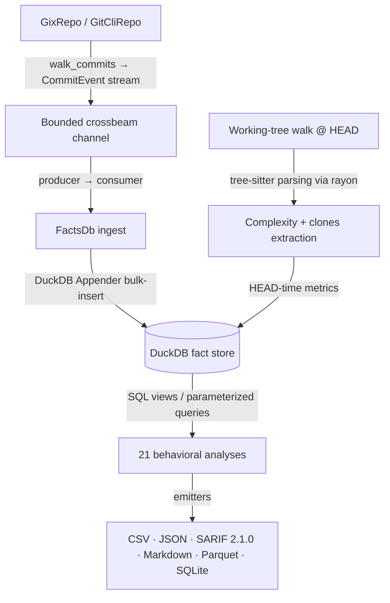

# CodeLore — Deep Codebase Analysis Report

This document presents a deep, read-only analysis of the **CodeLore** codebase. It highlights core architectural patterns, documents the validation status of recent fixes, and outlines remaining and newly identified recommendations for further improvement.

---

## 1. Architectural Overview & Pipeline Data Flow

CodeLore is structured as a multi-crate Rust workspace comprising three main components:
*   [codelore-rca](file:///Users/emrec/Projects/playground/codescene/crates/codelore-rca): A vendored fork of Mozilla's `rust-code-analysis` providing structural syntax hashing and complexity metrics.
*   [codelore-lib](file:///Users/emrec/Projects/playground/codescene/crates/codelore-lib): The core engine, handling repository walk abstraction, identity resolution, fact-store management, analyses execution, caching, and output emitters.
*   [codelore-cli](file:///Users/emrec/Projects/playground/codescene/crates/codelore-cli): The command-line frontend that handles arguments parsing, option consolidation, and output routing.

### Data Ingest Flow



1.  **Repository Traversal**:
    *   [GixRepo](file:///Users/emrec/Projects/playground/codescene/crates/codelore-lib/src/repo/gix_repo.rs) uses pure-Rust `gitoxide` libraries to parse refs and traverse commit graphs in parallel to DuckDB writes.
    *   [GitCliRepo](file:///Users/emrec/Projects/playground/codescene/crates/codelore-lib/src/repo/git_cli_repo.rs) shells out to the standard `git` CLI, serving as a differential testing oracle.
2.  **Event Ingestion**:
    *   `duckdb::Connection` is `!Send + !Sync`. To get parallelism, a **Producer-Consumer pattern** is utilized:
        *   The background thread walks commits using `GixRepo` and places [CommitEvent](file:///Users/emrec/Projects/playground/codescene/crates/codelore-lib/src/types.rs#L44-L57) instances onto a bounded `crossbeam-channel`.
        *   The main connection-owning thread consumes these events and bulk-inserts them via DuckDB's fast `Appender` API in [ingest_loop](file:///Users/emrec/Projects/playground/codescene/crates/codelore-lib/src/facts/ingest.rs#L402-L460).
3.  **Complexity and Clones at HEAD**:
    *   In [ingest_complexity_at_head](file:///Users/emrec/Projects/playground/codescene/crates/codelore-lib/src/facts/ingest.rs#L87-L162), a parallel walk scans all "live" (non-deleted) source files at HEAD. Rayon workers compile tree-sitter AST nodes, compute cyclomatic/cognitive/Halstead complexity, deduplicate entities, and serially drain results into the database.
    *   Similarly, [populate_clones_at_head](file:///Users/emrec/Projects/playground/codescene/crates/codelore-lib/src/facts/ingest.rs#L164-L262) extracts function fingerprints to identify structural Type-1 (exact) and Type-2 (renamed/parameterized) clones.
4.  **SQL-Driven Analyses**:
    *   21 behavioral analyses run purely as DuckDB SQL views or parameterized queries over the fact store (e.g. [hotspots.rs](file:///Users/emrec/Projects/playground/codescene/crates/codelore-lib/src/analyses/hotspots.rs), [coupling.rs](file:///Users/emrec/Projects/playground/codescene/crates/codelore-lib/src/analyses/coupling.rs)).

---

## 2. Newly Identified Gaps & Recommendations

### 🚨 Correctness Bug: `complexity_metrics` LOC Column Maps to `sloc()` Instead of `ploc()`

**The Problem**:
In the complexity collection logic inside [mod.rs](file:///Users/emrec/Projects/playground/codescene/crates/codelore-lib/src/complexity/mod.rs#L113-L114), the `ComplexityEntity` maps the `loc` field to source lines of code:
```rust
        loc: f_to_u32(m.loc.sloc()),
        sloc: f_to_u32(m.loc.sloc()),
```
This maps both fields to `sloc()` (Source Lines of Code), completely ignoring `ploc()` (Physical Lines of Code, which includes comments and blank lines).

**The Impact**:
The `loc` column in the database's `complexity_metrics` table is filled with duplicate `sloc` data, and the actual physical LOC count is discarded.

**Recommended Fix**:
Update `loc` mapping to `f_to_u32(m.loc.ploc())` so that `loc` correctly represents physical lines of code, matching the database schema intent and ensuring parity with other analysis tools.

---

### 🚨 Correctness / Parity Bug: `GitCliRepo` Non-ASCII / Quoted Path Parity Gap

**The Problem**:
When walking commits or listing changed files, `GitCliRepo` executes `git log` and other commands without disabling `core.quotepath`. When git encounters paths with spaces or non-ASCII characters, it wraps them in double quotes and escapes non-ASCII characters using octal notation (e.g. `"caf\303\251.rs"`).
Conversely, `GixRepo` (gitoxide-backed) parses raw byte arrays and yields unquoted, unescaped raw paths (e.g. `café.rs`).

**The Impact**:
In repositories with non-ASCII filenames or paths containing spaces, the two repository backends will mismatch on the `path` column, causing differential testing to fail and producing inaccurate analytics for those files (such as hotspots and churn).

**Recommended Fix**:
Pass `-c core.quotepath=false` to git commands inside [git_cli_repo.rs](file:///Users/emrec/Projects/playground/codescene/crates/codelore-lib/src/repo/git_cli_repo.rs#L36) to force the git CLI to output unescaped raw UTF-8 paths, aligning its output with `GixRepo`.

---

### ⚠️ Usability / Robustness Issue: Shared Temp/Cache Path Collision Risk in Multi-User Environments

**The Problem**:
The persistent cache path fallback (`/tmp/codelore/` in [cache.rs](file:///Users/emrec/Projects/playground/codescene/crates/codelore-lib/src/cache.rs#L72)) and the temporary worktree checkout path (`/tmp/codelore/diff-worktrees/` in [diff.rs](file:///Users/emrec/Projects/playground/codescene/crates/codelore-cli/src/diff.rs#L178)) are hardcoded to shared temporary paths without user namespace partitioning.

**The Impact**:
In shared multi-user systems (like headless build servers or shared developer workstations), the first user to run `codelore` creates the directory `/tmp/codelore` under their own user ownership. Any subsequent users running `codelore` will run into `PermissionDenied` errors when trying to create databases or checkout temporary worktrees inside that folder, causing commands to fail.

**Recommended Fix**:
Namespace the fallback folders under a user-specific subdirectory by checking the `USER` / `USERNAME` environment variables or using a user-owned temporary directory path.

---

### ⚠️ Robustness Issue: Query Rewriter Heuristics Vulnerable to Case Discrepancies

**The Problem**:
The regex-based query rewriter in [lineage.rs](file:///Users/emrec/Projects/playground/codescene/crates/codelore-lib/src/analyses/lineage.rs#L93) identifies table aliases using a case-based heuristic:
```rust
let needs_alias = next.is_empty() || next.chars().next().is_some_and(char::is_uppercase);
```
It assumes that keywords following `FROM changes` (e.g. `GROUP BY`, `WHERE`) are capitalized.

**The Impact**:
If any SQL query uses lowercase keywords (e.g., `from changes group by`), the rewriter will classify `group` as a table alias, rewriting the query to `FROM changes_lineage group BY ...`, which leads to DuckDB parsing/syntax errors.

**Recommended Fix**:
Improve the rewriter heuristic by explicitly matching against known SQL keywords case-insensitively, rather than relying on character case rules.

---

## Summary of Active Findings

| Category | Finding / Improvement Point | Priority / Risk | Impact | Status |
|---|---|---|---|---|
| **Correctness** | `complexity_metrics` `loc` field maps to `sloc()` instead of `ploc()`, discarding physical lines of code. | **High** / Low | Loss of true physical LOC count; duplicate sloc values stored. | **Fixed** (Unreleased — `loc` now maps to `m.loc.ploc()`; one-char change in `complexity/mod.rs`) |
| **Correctness** | `GitCliRepo` does not disable `core.quotepath`, causing non-ASCII/space paths to be quoted/escaped. | **High** / Medium | Divergence in paths between Gix/GitCli backends on non-ASCII paths. | **Fixed** (Unreleased — `-c core.quotepath=false` injected at the three git-subprocess sites: `open()`, `run_git()`, `resolve_alias()`) |
| **Robustness** | `/tmp/codelore` caching/worktree fallbacks lack user-namespacing, leading to permission conflicts. | **Medium** / Low | Cache/worktree generation crashes on multi-user shared machines. | **Fixed** (Unreleased — `fallback_tmp_root()` reads `$USER`/`$LOGNAME`/`$USERNAME` with PID last-resort; `diff.rs` routes through the same helper) |
| **Robustness** | Query rewriter regex assumes uppercase SQL keywords, breaking on lowercase syntax. | **Low** / Low | Potential parser/syntax errors for lowercase queries. | **Fixed** (Unreleased — regex switched to case-insensitive; alias-vs-keyword disambiguator replaced by an explicit SQL-keyword whitelist; 2 new regression tests cover lowercase keyword + lowercase alias) |
