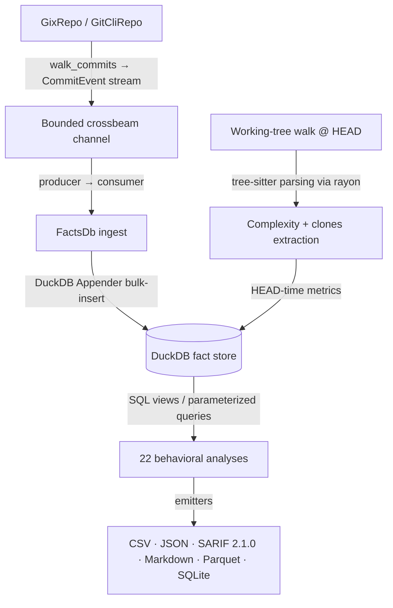

# CodeLore — Deep Codebase Analysis Report

This document presents a deep, read-only analysis of the **CodeLore** codebase. It documents the validation of recent fixes and outlines newly identified recommendations for further correctness, robustness, and performance improvements.

---

## 1. Architectural Overview & Pipeline Data Flow

CodeLore is structured as a multi-crate Rust workspace comprising three main components:
*   [codelore-rca](file:///Users/emrec/Projects/playground/codelore/crates/codelore-rca): A vendored fork of Mozilla's `rust-code-analysis` providing structural syntax hashing and complexity metrics.
*   [codelore-lib](file:///Users/emrec/Projects/playground/codelore/crates/codelore-lib): The core engine, handling repository walk abstraction, identity resolution, fact-store management, analyses execution, caching, and output emitters.
*   [codelore-cli](file:///Users/emrec/Projects/playground/codelore/crates/codelore-cli): The command-line frontend that handles arguments parsing, option consolidation, and output routing.

### Data Ingest Flow

1.  **Repository Traversal**:
    *   [GixRepo](file:///Users/emrec/Projects/playground/codelore/crates/codelore-lib/src/repo/gix_repo.rs) uses pure-Rust `gitoxide` libraries to parse refs and traverse commit graphs in parallel to DuckDB writes.
    *   [GitCliRepo](file:///Users/emrec/Projects/playground/codelore/crates/codelore-lib/src/repo/git_cli_repo.rs) shells out to the standard `git` CLI, serving as a differential testing oracle.
2.  **Event Ingestion**:
    *   `duckdb::Connection` is `!Send + !Sync`. To get parallelism, a **Producer-Consumer pattern** is utilized:
        *   The background thread walks commits using `GixRepo` and places [CommitEvent](file:///Users/emrec/Projects/playground/codelore/crates/codelore-lib/src/types.rs) instances onto a bounded `crossbeam-channel`.
        *   The main connection-owning thread consumes these events and bulk-inserts them via DuckDB's fast `Appender` API in [ingest_loop](file:///Users/emrec/Projects/playground/codelore/crates/codelore-lib/src/facts/ingest.rs).
3.  **Complexity and Clones at HEAD**:
    *   In [ingest_complexity_at_head](file:///Users/emrec/Projects/playground/codelore/crates/codelore-lib/src/facts/ingest.rs), a parallel walk scans all "live" (non-deleted) source files at HEAD. Rayon workers compile tree-sitter AST nodes, compute cyclomatic/cognitive/Halstead complexity, deduplicate entities, and serially drain results into the database.
    *   Similarly, [populate_clones_at_head](file:///Users/emrec/Projects/playground/codelore/crates/codelore-lib/src/facts/ingest.rs) extracts function fingerprints to identify structural Type-1 (exact) and Type-2 (renamed/parameterized) clones.
4.  **SQL-Driven Analyses**:
    *   22 behavioral analyses run purely as DuckDB SQL views or parameterized queries over the fact store (e.g. [hotspots.rs](file:///Users/emrec/Projects/playground/codelore/crates/codelore-lib/src/analyses/hotspots.rs), [coupling.rs](file:///Users/emrec/Projects/playground/codelore/crates/codelore-lib/src/analyses/coupling.rs)).

---

## 2. Validation Status of Prior Recommendations

All previous findings and code-maat parity issues have been validated as **fully resolved and correct** in the current codebase (released in version `v0.2.1` up to `v0.3.2`):

### Resolved Core Deep-Analysis Findings (F1–F11)
*   **F1 (Commit Chronology Precision)**: Resolved. Promoted `commits.date` from `DATE` to `TIMESTAMP` in schema v2.
*   **F2 (Clone-Coupling Floor Override)**: Resolved. Lowered `min_shared_revs` to the minimum of `min_shared_revs` and `min_clone_shared_revs` in inner `run_coupling` calls.
*   **F3 (Cache Poisoning on Dirty Tree)**: Resolved. Bypasses persistent cache writes when the working tree is dirty, using an in-memory db fallback instead.
*   **F4 (Stale Worktree Cache Root Path)**: Resolved. Updates `prune_stale_worktrees` to resolve namespaced paths using `default_cache_root()`.
*   **F5 (Sum of Coupling max_changeset_size pre-filter)**: Resolved. Added the `good_commits` CTE to pre-filter large commits in `soc`.
*   **F6 (Tempdir Leak on Git Failure)**: Resolved. Delayed `tmp.keep()` until after successful `git worktree add`.
*   **F7 (Cache Bypass for Parquet/SQLite)**: Resolved. Narrowed `needs_writable_db` to SQLite format only; Parquet output now successfully hits and reads from the persistent cache database.
*   **F8 (Positional Alignment in GitCliRepo Zipping)**: Resolved. Replaced index-based zipping in `git_cli_repo.rs:parse_changes_block` with an explicit `HashMap` join on destination path keys, preventing column shifting on submodule/binary mismatches.
*   **F9 (Single-Threaded Commit Traversal)**: Resolved. Configured `GixRepo::walk_commits` to parse commits and calculate diffs concurrently on a Rayon thread pool (`into_par_iter()`).
*   **F10 (Tree-Sitter File Size Cap)**: Resolved. Applied a 2 MB size cap (`DEFAULT_MAX_AST_FILE_BYTES`) across complexity and clone scanner sites to skip oversized files.
*   **F11 (Dirty Status Untracked Parity)**: Resolved. Switched `GixRepo::is_worktree_dirty` from `into_index_worktree_iter` to `into_iter()` to traverse and capture untracked files.
*   **Original Findings (Complexity LOC mapping, Quoted paths, Namespaced tmp cache, SQL case rewriter)**: Verified as fully integrated.

### Resolved Core Deep-Analysis Findings (F12–F17) (shipped in v0.2.2)
*   **F12 (Same-Second Tiebreaker)**: Resolved. Promoted `commits.rowid ASC` (DuckDB insertion order = gix walk order = child-before-parent) to replace SHA-1 lexicographical ordering, ensuring topologically correct sorting of same-second commits.
*   **F13 (Walker Memory Efficiency)**: Resolved. Implemented a chunked Rayon walker (1000-OID batches) streaming through a bounded crossbeam channel to limit memory usage and avoid OOM crashes on large repos.
*   **F14 (Time-Bucket Crash)**: Resolved. Added the `AnalysisName::supports_time_bucket()` validation check at the CLI boundary to reject `--time-bucket` for the 10 analyses that do not materialize or support `changes_bucketed`.
*   **F15 (Silent Empty Joins)**: Resolved. Handled by the same CLI-boundary validation check to prevent joining date-string bucket keys against SHA-1 commit hashes.
*   **F16 (Deleted Files in reports)**: Resolved. Restricted `code-age` (using an anchor-aware CTE) and `entity-churn` (using a live-at-HEAD CTE) to active files only.
*   **F17 (Standalone clones thread speed)**: Resolved. Refactored `run_clones` into a two-phase walk (serial gather followed by parallel function extraction/grouping via Rayon `into_par_iter()`).

### Resolved Code-Maat Parity Findings (PAR-1–PAR-9)
*   All parity findings (Bird et al. per-entity risk authors logic, back-testing dates anchor, interval-month ceiling calculations, CSV header mapping, average-revs pivot points, and research foundations documentation) have been fully closed.
*   **DEEP-1 to DEEP-15 (Code-Maat Exact Parity)**: Verified. Additional sprints in `v0.2.1` closed precise output formatting mismatches (7-column verbose shape for coupling, ceiling-rounded averages, integer-truncated strengths, and hyphenated statistic names in `summary` output under `--code-maat-compat`).

### Resolved Core Deep-Analysis Findings (F18–F21) (shipped in v0.3.1)
*   **F18 (Knowledge-Islands Back-testing)**: Resolved. Applied the `commits.date <= anchor` filter across all CTEs in `knowledge_islands.rs` to guarantee proper temporal isolation in back-testing mode.
*   **F19 (Clone-Coupling Truncation)**: Resolved. Updated `clone_coupling.rs` to call `opts.with_no_row_limit()` for the inner `run_knowledge_islands` sub-analysis, avoiding incorrect truncation of the at-risk file set.
*   **F20 (HTML Render Freeze)**: Resolved. Implemented incremental page-based rendering (page size 500) and page controls (Show next 500 / Show all) in `html.rs` to prevent blocking the browser's UI thread on large outputs.
*   **F21 (GitHub Action Wrapper)**: Resolved. Added automatic `v`-prefix normalisation, authenticated curl headers (via runner token), and pure-bash absolute path resolution to `action.yml`.

### Resolved Core Deep-Analysis Findings (F22–F25) (shipped in v0.3.1)
*   **F22 (Same-Second Rename Chaining)**: Resolved. Recursive CTE now carries `commits.rowid` and breaks date-ties via `co.rowid < l.current_rowid`. Regression test in `same_second_rename_test.rs`.
*   **F23 (Concurrent Cache Writes)**: Resolved. Tmp database cache filename now suffixed with `std::process::id()`; stale `.tmp.<pid>` artifacts swept by the pruner.
*   **F24 (Cache Directory Collection Walk Error Handling)**: Resolved. `collect_duckdb_files_inner` now log-and-skips per directory/entry instead of propagating errors.
*   **F25 (WAL File Cleanup)**: Resolved. `delete_duckdb_with_companion` also removes `.wal`; `cleanup_stale_tmp_files` age-gates `.tmp.<pid>` artifacts (1h).

### Resolved Core Deep-Analysis Findings (F26–F28) (shipped in v0.3.1 / commit 61b3c47)
*   **F26 (Implied-HEAD Range Parsing)**: Resolved. Updated `parse_rev_range` to default empty splits to `"HEAD"`. Added 3 regression tests in `prune_tests`.
*   **F27 (Parallel Commit Filtering)**: Resolved. Defer `find_commit` and filtering to parallel Rayon workers inside `process_commit_oid` (returning `Result<Option<CommitEvent>>`), completely eliminating the serial filtering loop on the main thread and preserving the `rowid` walk-order invariant.
*   **F28 (Worktree Prune Metadata Cleanup)**: Resolved. Swapped the order in `prune_stale_worktrees` to run the directory cleanup sweep *before* executing `git worktree prune`, ensuring Git immediately detects deleted directories and cleans up its administrative metadata in the same run.

### Resolved Core Deep-Analysis Findings (F29–F34) (shipped in v0.3.2 / commit f4da267)
*   **F29 (Time-Bucket Changeset Size Pre-Filter)**: Resolved. The `good_commits_cte` now counts files per physical commit before collapsing to a time bucket.
*   **F30 (Relative-Path Skip Checks for Clones)**: Resolved. The hardcoded directories `.git`, `target`, and `node_modules` are now checked against the repo-relative path rather than the full absolute path of the files.
*   **F31 (Aliases Duplicate Join Prevention)**: Resolved. Joins on `author_aliases` now use a canonical-deduplicated subquery, preventing inflated churn/revisions counts for multi-email authors.
*   **F32 (Base Cache SHA Validation)**: Resolved. The base analysis cache loading checks that `cached.sha == base_sha` before cache hit, preventing cache poisoning from stale or branch mismatch commits.
*   **F33 (Consistent Repo Path Canonicalization)**: Resolved. Both cache key calculation and cache path resolution canonicalize the repository path before hashing, avoiding cache misses when switching between relative (`.`) and absolute paths.
*   **F34 (Binary/Large File Diff Check)**: Resolved. `count_loc` checks for files larger than 1MB or containing NUL bytes in the first 8KB, and skips diffing, preventing OOM/CPU spikes and returning `(0, 0)`.

### Resolved Core Deep-Analysis Findings (F35-F37, F39) (shipped in v0.3.2 / commit e22a475)
*   **F35 (Incorrect Numstat Join Key in Renames under GitCliRepo)**: Resolved. Added `expand_rename_path_destination` to expand braces (e.g. `src/{old => new}.rs` to `src/new.rs`) and Arrow rename syntaxes into canonical join keys, avoiding zero-stat joins for complex renames.
*   **F36 (Parameter Mismatch Crash in entity-effort --explain Mode)**: Resolved. Bind parameter list passed to `explain_if_requested` in `entity_effort.rs` corrected to match the single SQL placeholder (`params![row_limit]`).
*   **F37 (Parameter Mismatch Crash in clone-coupling --explain Mode)**: Resolved. Passed exact query parameter bindings (`params![opts.min_clone_node_count, opts.clone_similarity_floor]`) to `explain_if_requested` to prevent DuckDB crashes.
*   **F39 (Merge Commit Diffs Behavioral Divergence)**: Resolved. Adjusted `changed_files_for_commit` in `gix_repo.rs` to yield empty vectors for merge commits, resolving divergences against `GitCliRepo`'s default behavior.

---

## 3. Newly Identified Gaps & Recommendations

### F38: Performance — Quadratic Complexity in Kamei History and Experience Enrichment

**The Problem**:
In [kamei/mod.rs:130](file:///Users/emrec/Projects/playground/codelore/crates/codelore-lib/src/kamei/mod.rs#L130), [kamei/mod.rs:163](file:///Users/emrec/Projects/playground/codelore/crates/codelore-lib/src/kamei/mod.rs#L163), and [kamei/mod.rs:222](file:///Users/emrec/Projects/playground/codelore/crates/codelore-lib/src/kamei/mod.rs#L222), Kamei features (`ndev`, `nuc`, `age`, `sexp`) are enriched using cross-commit joins on path matching (`pchg.path = cchg.path`) and directory matching. For very active files changed thousands of times (e.g. `package.json`, `Cargo.toml`), or active top-level directories under single-directory projects, the self-joins scale quadratically (`O(changes_per_path^2)`).

**The Impact**:
Analyzing large repositories with highly active files or concentrated top-level paths can lead to severe slowdowns, high CPU/memory overhead, and potential DuckDB temporary file/disk space exhaustion.

**Recommended Fix**:
Optimize the history and experience enrichment logic by utilizing pre-aggregates or staging temporary tables rather than full self-joins on historical changes.

### F40: Correctness — Duplicate Entity Names (Nested/Anonymous/Overloaded Functions) Are Silently Discarded

**The Problem**:
The `entities` database schema uses `PRIMARY KEY (path, name, rev_introduced)` and the `complexity_metrics` table uses `PRIMARY KEY (path, name, rev)`. To prevent DB constraint violation failures on duplicate keys, `ingest_complexity_at_head` in [ingest.rs](file:///Users/emrec/Projects/playground/codelore/crates/codelore-lib/src/facts/ingest.rs) calls `dedup_entities`, which filters out duplicate entities based solely on `seen.insert(ent.name.clone())`.

**The Impact**:
Any entity sharing a name within the same file (e.g., nested functions, overloaded methods in Java, or multiple anonymous closures which all fall back to `"<anonymous>"`) is silently discarded during complexity metric ingestion. Consequently, only the first anonymous function or overloaded method gets parsed/stored, significantly skewing complexity rankings, hotspots, and code health calculations.

**Recommended Fix**:
Incorporate scope-qualification (e.g. `ClassName.methodName` or parent helper hierarchy) or append line numbers/offsets to the entity name (e.g., `name@start_line`) during ingestion to enforce uniqueness without discarding valid distinct entities. Alternatively, extend the Primary Keys in the schema to include line offsets.

### F41: Performance — Sequential Architectural Grouping Over All Paths in History

**The Problem**:
In [ingest.rs:914](file:///Users/emrec/Projects/playground/codelore/crates/codelore-lib/src/facts/ingest.rs#L914), `apply_grouping` fetches all unique paths from the database and maps them against the regex-based `GroupMap` rules sequentially on the main thread.

**The Impact**:
For massive repositories with tens of thousands of paths in history and complex architectural group maps (with multiple regexes containing backtracking lookarounds), sequentially matching every path is a major CPU bottleneck that delays ingestion completion.

**Recommended Fix**:
Parallelize the path-to-group resolution logic using Rayon (`into_par_iter()`) on the `distinct_paths` vector, collecting the computed mapping pairs before doing the database writes.

### F42: Performance — Redundant `COUNT(DISTINCT rev)` on Unique `changes(rev, path)` Tables

**The Problem**:
Multiple SQL views in `ownership.rs`, `code_health.rs`, and `hotspots.rs` use `COUNT(DISTINCT rev)` or `COUNT(DISTINCT c.rev)` over the changes table (or `changes_bucketed` view). Because `(rev, path)` is already the Primary Key (and unique constraint) of the changes table, a path has at most one row per `rev`.

**The Impact**:
Unnecessary performance overhead. The database builds distinct/hash aggregations for `rev` on every file revisions calculation, whereas a direct `COUNT(*)` yields the same semantic results much faster.

**Recommended Fix**:
Replace `COUNT(DISTINCT rev)` with `COUNT(*)` in paths where uniqueness is already structurally guaranteed by the table layout or grouping query constraints.

---

## 4. Summary of Active Findings

Below is the register of active improvement opportunities and bugs:

| ID | Category | Finding / Improvement Point | Priority / Risk | Impact | Status |
|---|---|---|---|---|---|
| **F38** | Performance | Quadratic self-join complexity in Kamei history and experience enrichment. | **Medium** / Medium | Large CPU/disk overhead on massive repositories with highly active files. | Active |
| **F40** | Correctness | Silent drop of duplicate-named entities (nested/overloaded/anonymous fns) in ingestion. | **High** / Medium | Incomplete complexity metrics/hotspots data for files with multiple closures/overloads. | Active |
| **F41** | Performance | Sequential matching of regex rules in architectural grouping. | **Medium** / Low | Single-threaded CPU bottleneck during ingest of massive repositories with large group files. | Active |
| **F42** | Performance | Redundant `COUNT(DISTINCT rev)` operations on unique changes tables. | **Low** / Low | Minor CPU and memory overhead during SQL execution for behavioral analyses. | Active |

---

## 5. Proposed Verification Plan for New Findings

### F38 (Kamei enrichment performance)
*   **Verification**: Run `codelore` JIT Kamei feature enrichment on a repository with a large commit history containing a file modified >5,000 times. Monitor processing time and verify it finishes within acceptable limits without massive memory leaks or disk blowup.

### F40 (Duplicate entity name drop)
*   **Verification**: Run `codelore analyze --analysis hotspots` on a codebase containing multiple nested or anonymous functions in a single file (e.g. a JS file with 10 arrow function closures). Verify that the database stores complexity metrics for all 10 distinct entities instead of only 1.

### F41 (Parallel grouping performance)
*   **Verification**: Profile ingestion time on a repository with 50,000 commits using a complex `--group-file`. Ensure the grouping phase runs concurrently across available CPU cores and shows a reduction in CPU time.

### F42 (Redundant count distinct optimization)
*   **Verification**: Run EXPLAIN on the modified SQL queries and compare execution plans. Verify that DuckDB does not construct a hash-distinct pipeline for `rev` counting. Verify that results of hotspots/ownership remain bit-identical.
