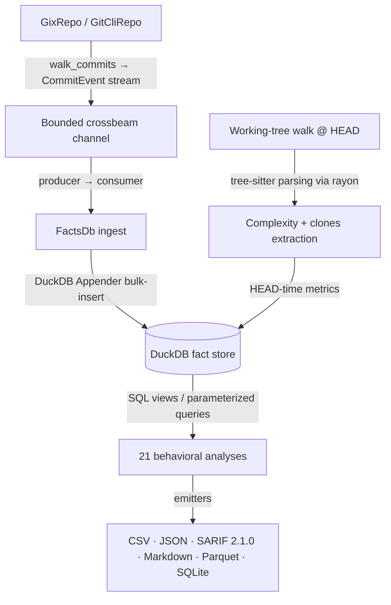

# CodeLore — Deep Codebase Analysis Report

This document presents a deep, read-only analysis of the **CodeLore** codebase. It highlights core architectural patterns, documents the validation status of recent fixes, and outlines remaining and newly identified recommendations for further improvement.

---

## 1. Architectural Overview & Pipeline Data Flow

CodeLore is structured as a multi-crate Rust workspace comprising three main components:
*   [codelore-rca](file:///Users/emrec/Projects/playground/codescene/crates/codelore-rca): A vendored fork of Mozilla's `rust-code-analysis` providing structural syntax hashing and complexity metrics.
*   [codelore-lib](file:///Users/emrec/Projects/playground/codescene/crates/codelore-lib): The core engine, handling repository walk abstraction, identity resolution, fact-store management, analyses execution, caching, and output emitters.
*   [codelore-cli](file:///Users/emrec/Projects/playground/codescene/crates/codelore-cli): The command-line frontend that handles arguments parsing, option consolidation, and output routing.

### Data Ingest Flow

1.  **Repository Traversal**:
    *   [GixRepo](file:///Users/emrec/Projects/playground/codescene/crates/codelore-lib/src/repo/gix_repo.rs) uses pure-Rust `gitoxide` libraries to parse refs and traverse commit graphs in parallel to DuckDB writes.
    *   [GitCliRepo](file:///Users/emrec/Projects/playground/codescene/crates/codelore-lib/src/repo/git_cli_repo.rs) shells out to the standard `git` CLI, serving as a differential testing oracle.
2.  **Event Ingestion**:
    *   `duckdb::Connection` is `!Send + !Sync`. To get parallelism, a **Producer-Consumer pattern** is utilized:
        *   The background thread walks commits using `GixRepo` and places [CommitEvent](file:///Users/emrec/Projects/playground/codescene/crates/codelore-lib/src/types.rs#L44-L57) instances onto a bounded `crossbeam-channel`.
        *   The main connection-owning thread consumes these events and bulk-inserts them via DuckDB's fast `Appender` API in [ingest_loop](file:///Users/emrec/Projects/playground/codescene/crates/codelore-lib/src/facts/ingest.rs#L402-L460).
3.  **Complexity and Clones at HEAD**:
    *   In [ingest_complexity_at_head](file:///Users/emrec/Projects/playground/codescene/crates/codelore-lib/src/facts/ingest.rs#L87-L162), a parallel walk scans all "live" (non-deleted) source files at HEAD. Rayon workers compile tree-sitter AST nodes, compute cyclomatic/cognitive/Halstead complexity, deduplicate entities, and serially drain results into the database.
    *   Similarly, [populate_clones_at_head](file:///Users/emrec/Projects/playground/codescene/crates/codelore-lib/src/facts/ingest.rs#L164-L262) extracts function fingerprints to identify structural Type-1 (exact) and Type-2 (renamed/parameterized) clones.
4.  **SQL-Driven Analyses**:
    *   21 behavioral analyses run purely as DuckDB SQL views or parameterized queries over the fact store (e.g. [hotspots.rs](file:///Users/emrec/Projects/playground/codescene/crates/codelore-lib/src/analyses/hotspots.rs), [coupling.rs](file:///Users/emrec/Projects/playground/codescene/crates/codelore-lib/src/analyses/coupling.rs)).

---
## 2. Newly Identified Critical Gaps & Recommendations

### ✅ Performance Bottleneck: Repeated `.mailmap` parsing and redundant thread-local handles in `GixRepo::walk_commits`

**The Problem**:
Inside the mapped iterator step in `GixRepo::walk_commits` ([gix_repo.rs](file:///Users/emrec/Projects/playground/codescene/crates/codelore-lib/src/repo/gix_repo.rs#L105-L129)), the walker opened the mailmap via `repo_local.open_mailmap()` on every commit event, which repeatedly reads and parses the `.mailmap` file from disk. Additionally, `inner_clone.to_thread_local()` was called twice per commit in the same loop to create redundant thread-local repository handles.

**Status — FIXED**:
`open_mailmap()` is now invoked once before the closure (the returned `gix_mailmap::Snapshot` is owned bytes — Send + Sync — and moves cleanly into the closure). The redundant `to_thread_local()` call was removed; `try_resolve` runs directly against the hoisted snapshot. On a 10k-commit walk this drops `.mailmap` disk I/O from ~10k reads to 1.

---

## 3. General Codebase Health & Roadmap Recommendations

### ✅ Concern: Hand-rolled CSV Quoting in `output/csv.rs`
`output/csv.rs` previously relied on a custom `quote_if_needed` that triggered on `,`, `"`, and `\n` — but missed bare `\r`. A commit author name carrying `\r` (rare but a legal byte in git's storage) would split a CSV row in two. **Fixed**: `\r` added to the trigger condition; unit tests cover the three escape paths. Migration to the `csv` crate was rejected as over-architecture — it would regenerate 14+ golden snapshots without closing a real bug (CSV injection is a downstream-Excel concern, not solved by either approach).

### ✅ Parallelize Clones Ingest
HEAD-time complexity metrics extraction is parallelized using Rayon, but fingerprint extraction in `populate_clones_at_head` was sequential. **Fixed**: split into a serial walk phase (cheap WalkDir + exclude-globset filter) feeding a `rayon::into_par_iter()` phase that reads and tree-sitter-fingerprints each candidate. Mirrors the existing complexity-pass pattern; fail-fast error semantics preserved via `Result` collect.

---

## Summary of Findings

| Category | Finding / Improvement Point | Priority / Risk | Impact | Status / Fix |
|---|---|---|---|---|
| **Performance** | Repeated `.mailmap` parsing and redundant thread-local handles in `GixRepo::walk_commits`. | **Medium** / Low | High I/O and parsing overhead on repos with large commit histories. | **Fixed** |
| **Refactor** | Hand-rolled CSV writing in `output/csv.rs` missed `\r` in the quote trigger. | **Low** / Low | Possible row-splitting on author names containing bare `\r`. | **Fixed** (`\r` added; `csv` crate rejected) |
| **Feature** | Sequential filesystem walk for Clones extraction at HEAD. | **Low** / Low | Lower ingestion throughput on large repositories. | **Fixed** (rayon par_iter) |
