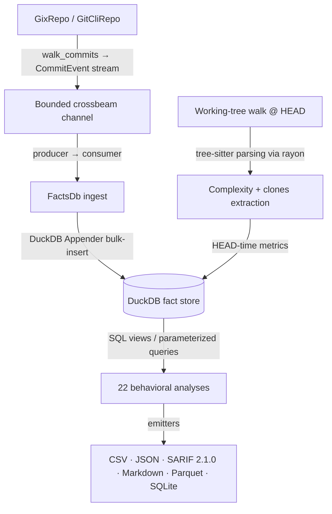

# CodeLore — Deep Codebase Analysis Report

This document presents a deep, read-only analysis of the **CodeLore** codebase. It documents the validation of recent fixes and outlines newly identified recommendations for further correctness, robustness, and performance improvements.

---

## 1. Architectural Overview & Pipeline Data Flow

CodeLore is structured as a multi-crate Rust workspace comprising three main components:
*   [codelore-rca](file:///Users/emrec/Projects/playground/codelore/crates/codelore-rca): A vendored fork of Mozilla's `rust-code-analysis` providing structural syntax hashing and complexity metrics.
*   [codelore-lib](file:///Users/emrec/Projects/playground/codelore/crates/codelore-lib): The core engine, handling repository walk abstraction, identity resolution, fact-store management, analyses execution, caching, and output emitters.
*   [codelore-cli](file:///Users/emrec/Projects/playground/codelore/crates/codelore-cli): The command-line frontend that handles arguments parsing, option consolidation, and output routing.

### Data Ingest Flow



1.  **Repository Traversal**:
    *   [GixRepo](file:///Users/emrec/Projects/playground/codelore/crates/codelore-lib/src/repo/gix_repo.rs) uses pure-Rust `gitoxide` libraries to parse refs and traverse commit graphs in parallel to DuckDB writes.
    *   [GitCliRepo](file:///Users/emrec/Projects/playground/codelore/crates/codelore-lib/src/repo/git_cli_repo.rs) shells out to the standard `git` CLI, serving as a differential testing oracle.
2.  **Event Ingestion**:
    *   `duckdb::Connection` is `!Send + !Sync`. To get parallelism, a **Producer-Consumer pattern** is utilized:
        *   The background thread walks commits using `GixRepo` and places [CommitEvent](file:///Users/emrec/Projects/playground/codelore/crates/codelore-lib/src/types.rs) instances onto a bounded `crossbeam-channel`.
        *   The main connection-owning thread consumes these events and bulk-inserts them via DuckDB's fast `Appender` API in [ingest_loop](file:///Users/emrec/Projects/playground/codelore/crates/codelore-lib/src/facts/ingest.rs).
3.  **Complexity and Clones at HEAD**:
    *   In [ingest_complexity_at_head](file:///Users/emrec/Projects/playground/codelore/crates/codelore-lib/src/facts/ingest.rs), a parallel walk scans all "live" (non-deleted) source files at HEAD. Rayon workers compile tree-sitter AST nodes, compute cyclomatic/cognitive/Halstead complexity, deduplicate entities, and serially drain results into the database.
    *   Similarly, [populate_clones_at_head](file:///Users/emrec/Projects/playground/codelore/crates/codelore-lib/src/facts/ingest.rs) extracts function fingerprints to identify structural Type-1 (exact) and Type-2 (renamed/parameterized) clones.
4.  **SQL-Driven Analyses**:
    *   22 behavioral analyses run purely as DuckDB SQL views or parameterized queries over the fact store (e.g. [hotspots.rs](file:///Users/emrec/Projects/playground/codelore/crates/codelore-lib/src/analyses/hotspots.rs), [coupling.rs](file:///Users/emrec/Projects/playground/codelore/crates/codelore-lib/src/analyses/coupling.rs)).

---

## 2. Validation Status of Prior Recommendations

All previous findings and code-maat parity issues have been validated as **fully resolved and correct** in the current codebase (released in version `v0.2.1` and `v0.2.2`):

### Resolved Core Deep-Analysis Findings (F1–F11)
*   **F1 (Commit Chronology Precision)**: Resolved. Promoted `commits.date` from `DATE` to `TIMESTAMP` in schema v2.
*   **F2 (Clone-Coupling Floor Override)**: Resolved. Lowered `min_shared_revs` to the minimum of `min_shared_revs` and `min_clone_shared_revs` in inner `run_coupling` calls.
*   **F3 (Cache Poisoning on Dirty Tree)**: Resolved. Bypasses persistent cache writes when the working tree is dirty, using an in-memory db fallback instead.
*   **F4 (Stale Worktree Cache Root Path)**: Resolved. Updates `prune_stale_worktrees` to resolve namespaced paths using `default_cache_root()`.
*   **F5 (Sum of Coupling max_changeset_size pre-filter)**: Resolved. Added the `good_commits` CTE to pre-filter large commits in `soc`.
*   **F6 (Tempdir Leak on Git Failure)**: Resolved. Delayed `tmp.keep()` until after successful `git worktree add`.
*   **F7 (Cache Bypass for Parquet/SQLite)**: Resolved. Narrowed `needs_writable_db` to SQLite format only; Parquet output now successfully hits and reads from the persistent cache database.
*   **F8 (Positional Alignment in GitCliRepo Zipping)**: Resolved. Replaced index-based zipping in `git_cli_repo.rs:parse_changes_block` with an explicit `HashMap` join on destination path keys, preventing column shifting on submodule/binary mismatches.
*   **F9 (Single-Threaded Commit Traversal)**: Resolved. Configured `GixRepo::walk_commits` to parse commits and calculate diffs concurrently on a Rayon thread pool (`into_par_iter()`).
*   **F10 (Tree-Sitter File Size Cap)**: Resolved. Applied a 2 MB size cap (`DEFAULT_MAX_AST_FILE_BYTES`) across complexity and clone scanner sites to skip oversized files.
*   **F11 (Dirty Status Untracked Parity)**: Resolved. Switched `GixRepo::is_worktree_dirty` from `into_index_worktree_iter` to `into_iter()` to traverse and capture untracked files.
*   **Original Findings (Complexity LOC mapping, Quoted paths, Namespaced tmp cache, SQL case rewriter)**: Verified as fully integrated.

### Resolved Core Deep-Analysis Findings (F12–F17) (shipped in v0.2.2)
*   **F12 (Same-Second Tiebreaker)**: Resolved. Promoted `commits.rowid ASC` (DuckDB insertion order = gix walk order = child-before-parent) to replace SHA-1 lexicographical ordering, ensuring topologically correct sorting of same-second commits.
*   **F13 (Walker Memory Efficiency)**: Resolved. Implemented a chunked Rayon walker (1000-OID batches) streaming through a bounded crossbeam channel to limit memory usage and avoid OOM crashes on large repos.
*   **F14 (Time-Bucket Crash)**: Resolved. Added the `AnalysisName::supports_time_bucket()` validation check at the CLI boundary to reject `--time-bucket` for the 10 analyses that do not materialize or support `changes_bucketed`.
*   **F15 (Silent Empty Joins)**: Resolved. Handled by the same CLI-boundary validation check to prevent joining date-string bucket keys against SHA-1 commit hashes.
*   **F16 (Deleted Files in reports)**: Resolved. Restricted `code-age` (using an anchor-aware CTE) and `entity-churn` (using a live-at-HEAD CTE) to active files only.
*   **F17 (Standalone clones thread speed)**: Resolved. Refactored `run_clones` into a two-phase walk (serial gather followed by parallel function extraction/grouping via Rayon `into_par_iter()`).

### Resolved Code-Maat Parity Findings (PAR-1–PAR-9)
*   All parity findings (Bird et al. per-entity risk authors logic, back-testing dates anchor, interval-month ceiling calculations, CSV header mapping, average-revs pivot points, and research foundations documentation) have been fully closed.
*   **DEEP-1 to DEEP-15 (Code-Maat Exact Parity)**: Verified. Additional sprints in `v0.2.1` closed precise output formatting mismatches (7-column verbose shape for coupling, ceiling-rounded averages, integer-truncated strengths, and hyphenated statistic names in `summary` output under `--code-maat-compat`).

### Resolved Core Deep-Analysis Findings (F18–F21) (shipped in v0.3.1)
*   **F18 (Knowledge-Islands Back-testing)**: Resolved. Applied the `commits.date <= anchor` filter across all CTEs in `knowledge_islands.rs` to guarantee proper temporal isolation in back-testing mode.
*   **F19 (Clone-Coupling Truncation)**: Resolved. Updated `clone_coupling.rs` to call `opts.with_no_row_limit()` for the inner `run_knowledge_islands` sub-analysis, avoiding incorrect truncation of the at-risk file set.
*   **F20 (HTML Render Freeze)**: Resolved. Implemented incremental page-based rendering (page size 500) and page controls (Show next 500 / Show all) in `html.rs` to prevent blocking the browser's UI thread on large outputs.
*   **F21 (GitHub Action Wrapper)**: Resolved. Added automatic `v`-prefix normalisation, authenticated curl headers (via runner token), and pure-bash absolute path resolution to `action.yml`.

### Resolved Core Deep-Analysis Findings (F22–F25) (shipped in v0.3.1)
*   **F22 (Same-Second Rename Chaining)**: Resolved. Recursive CTE now carries `commits.rowid` and breaks date-ties via `co.rowid < l.current_rowid`. Regression test in `same_second_rename_test.rs`.
*   **F23 (Concurrent Cache Writes)**: Resolved. Tmp database cache filename now suffixed with `std::process::id()`; stale `.tmp.<pid>` artifacts swept by the pruner.
*   **F24 (Cache Directory Collection Walk Error Handling)**: Resolved. `collect_duckdb_files_inner` now log-and-skips per directory/entry instead of propagating errors.
*   **F25 (WAL File Cleanup)**: Resolved. `delete_duckdb_with_companion` also removes `.wal`; `cleanup_stale_tmp_files` age-gates `.tmp.<pid>` artifacts (1h).

---

## 3. Newly Identified Gaps & Recommendations

### F26: Usability / Correctness — `parse_rev_range` Rejects Standard Implied-HEAD Git Range Syntax

**The Problem**:
In [diff.rs:96](file:///Users/emrec/Projects/playground/codelore/crates/codelore-cli/src/diff.rs#L96), `parse_rev_range` splits the range string on `..` or `...` and rejects the input if either the base or the head portion is empty (e.g., `main..` or `..main`). However, in standard Git usage, an omitted revision in a range expression implicitly defaults to `HEAD` (for example, `main..` represents `main..HEAD`).

**The Impact**:
Standard Git-style range shortcuts fail with a validation error (`malformed two-dot rev range: "main.."`). Users are forced to explicitly type `HEAD`, which violates standard Git CLI design expectations.

**Recommended Fix**:
Update `parse_rev_range` to default empty splits to `"HEAD"` instead of returning an error:
```rust
let base_ref = if base_ref.is_empty() { "HEAD" } else { base_ref };
let head_ref = if head_ref.is_empty() { "HEAD" } else { head_ref };
```

---

### F27: Performance — Serial `find_commit` Filtering on Main Thread and Redundant Lookups

**The Problem**:
In [gix_repo.rs:74](file:///Users/emrec/Projects/playground/codelore/crates/codelore-lib/src/repo/gix_repo.rs#L74), `walk_commits` performs a serial `find_commit` lookup on the main thread for *every* commit OID to apply merge and date-range filters. Later, the matching commit IDs are batched and processed in parallel by Rayon workers in `process_commit_oid`, which calls `find_commit` a *second* time for the exact same commits.

**The Impact**:
For repositories with tens or hundreds of thousands of commits, the serial commit object parsing loop on the main thread creates a significant performance bottleneck. In addition, doing a redundant double lookup on matching commits wastes I/O and deserialization cycles.

**Recommended Fix**:
Defer commit parsing and filtering logic to the parallel Rayon workers. The main thread should collect all OIDs directly using `rev_walk.all()`, which is extremely fast and doesn't parse commit objects. The chunks can then be processed in parallel, where each worker opens the commit *once*, checks filters (yielding `None` if the commit is filtered out), and processes `CommitEvent` metadata.

---

### F28: Robustness / Leaks — Git Worktree Administrative Metadata "One-Run Lag" Cleanup

**The Problem**:
In [diff.rs:420](file:///Users/emrec/Projects/playground/codelore/crates/codelore-cli/src/diff.rs#L420), `prune_stale_worktrees` runs `git worktree prune` *before* sweeping and deleting stale directory folders.

**The Impact**:
Any worktree directory deleted during the current sweep will not have its corresponding administrative metadata cleaned up from Git until the *next* time `codelore diff` is invoked. This leaves orphaned metadata folders inside `.git/worktrees/` indefinitely if no subsequent runs are executed, causing a resource leak.

**Recommended Fix**:
Swap the order: execute the stale directory removal sweep *first*, and run `git worktree prune` *afterward*. This ensures Git immediately detects the deleted directories and prunes their administrative metadata in the same invocation.

---

## 4. Summary of Active Findings

Below is the register of active improvement opportunities and bugs:

| ID | Category | Finding / Improvement Point | Priority / Risk | Impact | Status |
|---|---|---|---|---|---|
| **F26** | Usability / Correctness | `parse_rev_range` rejects standard implied-HEAD ranges (e.g., `main..`). | **Medium** / Low | Breaks compatibility with Git CLI ergonomics; fails on valid ranges. | **Fixed (Unreleased)** — Empty base/head strings now default to `"HEAD"` for two-dot and three-dot forms. 3 regression tests added. |
| **F27** | Performance | Serial `find_commit` filtering on main thread and redundant double lookups. | **Medium** / Medium | Unnecessary serialization overhead and single-threaded bottlenecks on large repos. | **Fixed (Unreleased)** — Filtering moved into `process_commit_oid` (returns `Result<Option<CommitEvent>>`); main thread only gathers OIDs; F12 rowid invariant preserved. |
| **F28** | Robustness | `prune_stale_worktrees` has a "one-run lag" when pruning Git metadata. | **Low** / Low | Orphaned worktree metadata directory remains in `.git/worktrees/` until next run. | **Fixed (Unreleased)** — Directory sweep now runs BEFORE `git worktree prune`, so metadata is cleaned up in the same invocation. |

---

## 5. Proposed Verification Plan for New Findings

### F26 (implied-HEAD range parsing)
*   **Verification**: Run `codelore diff main..` and verify that it parses successfully and executes the diff analysis against HEAD without throwing a validation error.

### F27 (parallel commit filtering)
*   **Verification**: Run the test suite and benchmark on a large repository (e.g., codelore itself or a larger open-source project) and verify that walk time is reduced and all commits are correctly filtered.

### F28 (worktree prune metadata cleanup)
*   **Verification**: Force-abort a run to leak a worktree directory. Trigger another run after the stale age threshold (or mock the threshold) and verify that both the temporary directory and Git's internal metadata for the worktree are immediately cleaned up.
