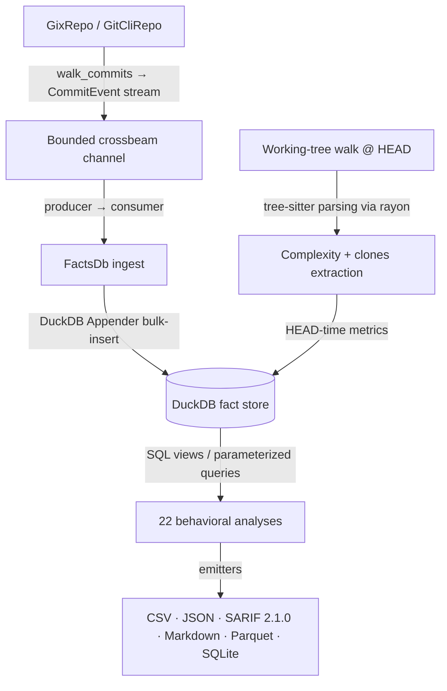

# CodeLore — Deep Codebase Analysis Report

This document presents a deep, read-only analysis of the **CodeLore** codebase. It documents the validation of recent fixes and outlines newly identified recommendations for further correctness, robustness, and performance improvements.

---

## 1. Architectural Overview & Pipeline Data Flow

CodeLore is structured as a multi-crate Rust workspace comprising three main components:
*   [codelore-rca](file:///Users/emrec/Projects/playground/codelore/crates/codelore-rca): A vendored fork of Mozilla's `rust-code-analysis` providing structural syntax hashing and complexity metrics.
*   [codelore-lib](file:///Users/emrec/Projects/playground/codelore/crates/codelore-lib): The core engine, handling repository walk abstraction, identity resolution, fact-store management, analyses execution, caching, and output emitters.
*   [codelore-cli](file:///Users/emrec/Projects/playground/codelore/crates/codelore-cli): The command-line frontend that handles arguments parsing, option consolidation, and output routing.

### Data Ingest Flow



1.  **Repository Traversal**:
    *   [GixRepo](file:///Users/emrec/Projects/playground/codelore/crates/codelore-lib/src/repo/gix_repo.rs) uses pure-Rust `gitoxide` libraries to parse refs and traverse commit graphs in parallel to DuckDB writes.
    *   [GitCliRepo](file:///Users/emrec/Projects/playground/codelore/crates/codelore-lib/src/repo/git_cli_repo.rs) shells out to the standard `git` CLI, serving as a differential testing oracle.
2.  **Event Ingestion**:
    *   `duckdb::Connection` is `!Send + !Sync`. To get parallelism, a **Producer-Consumer pattern** is utilized:
        *   The background thread walks commits using `GixRepo` and places [CommitEvent](file:///Users/emrec/Projects/playground/codelore/crates/codelore-lib/src/types.rs) instances onto a bounded `crossbeam-channel`.
        *   The main connection-owning thread consumes these events and bulk-inserts them via DuckDB's fast `Appender` API in [ingest_loop](file:///Users/emrec/Projects/playground/codelore/crates/codelore-lib/src/facts/ingest.rs).
3.  **Complexity and Clones at HEAD**:
    *   In [ingest_complexity_at_head](file:///Users/emrec/Projects/playground/codelore/crates/codelore-lib/src/facts/ingest.rs), a parallel walk scans all "live" (non-deleted) source files at HEAD. Rayon workers compile tree-sitter AST nodes, compute cyclomatic/cognitive/Halstead complexity, deduplicate entities, and serially drain results into the database.
    *   Similarly, [populate_clones_at_head](file:///Users/emrec/Projects/playground/codelore/crates/codelore-lib/src/facts/ingest.rs) extracts function fingerprints to identify structural Type-1 (exact) and Type-2 (renamed/parameterized) clones.
4.  **SQL-Driven Analyses**:
    *   22 behavioral analyses run purely as DuckDB SQL views or parameterized queries over the fact store (e.g. [hotspots.rs](file:///Users/emrec/Projects/playground/codelore/crates/codelore-lib/src/analyses/hotspots.rs), [coupling.rs](file:///Users/emrec/Projects/playground/codelore/crates/codelore-lib/src/analyses/coupling.rs)).

---

## 2. Validation Status of Prior Recommendations

All previous findings and code-maat parity issues have been validated as **fully resolved and correct** in the current codebase (released in version `v0.2.1` and `v0.2.2`):

### Resolved Core Deep-Analysis Findings (F1–F11)
*   **F1 (Commit Chronology Precision)**: Resolved. Promoted `commits.date` from `DATE` to `TIMESTAMP` in schema v2.
*   **F2 (Clone-Coupling Floor Override)**: Resolved. Lowered `min_shared_revs` to the minimum of `min_shared_revs` and `min_clone_shared_revs` in inner `run_coupling` calls.
*   **F3 (Cache Poisoning on Dirty Tree)**: Resolved. Bypasses persistent cache writes when the working tree is dirty, using an in-memory db fallback instead.
*   **F4 (Stale Worktree Cache Root Path)**: Resolved. Updates `prune_stale_worktrees` to resolve namespaced paths using `default_cache_root()`.
*   **F5 (Sum of Coupling max_changeset_size pre-filter)**: Resolved. Added the `good_commits` CTE to pre-filter large commits in `soc`.
*   **F6 (Tempdir Leak on Git Failure)**: Resolved. Delayed `tmp.keep()` until after successful `git worktree add`.
*   **F7 (Cache Bypass for Parquet/SQLite)**: Resolved. Narrowed `needs_writable_db` to SQLite format only; Parquet output now successfully hits and reads from the persistent cache database.
*   **F8 (Positional Alignment in GitCliRepo Zipping)**: Resolved. Replaced index-based zipping in `git_cli_repo.rs:parse_changes_block` with an explicit `HashMap` join on destination path keys, preventing column shifting on submodule/binary mismatches.
*   **F9 (Single-Threaded Commit Traversal)**: Resolved. Configured `GixRepo::walk_commits` to parse commits and calculate diffs concurrently on a Rayon thread pool (`into_par_iter()`).
*   **F10 (Tree-Sitter File Size Cap)**: Resolved. Applied a 2 MB size cap (`DEFAULT_MAX_AST_FILE_BYTES`) across complexity and clone scanner sites to skip oversized files.
*   **F11 (Dirty Status Untracked Parity)**: Resolved. Switched `GixRepo::is_worktree_dirty` from `into_index_worktree_iter` to `into_iter()` to traverse and capture untracked files.
*   **Original Findings (Complexity LOC mapping, Quoted paths, Namespaced tmp cache, SQL case rewriter)**: Verified as fully integrated.

### Resolved Core Deep-Analysis Findings (F12–F17) (shipped in v0.2.2)
*   **F12 (Same-Second Tiebreaker)**: Resolved. Promoted `commits.rowid ASC` (DuckDB insertion order = gix walk order = child-before-parent) to replace SHA-1 lexicographical ordering, ensuring topologically correct sorting of same-second commits.
*   **F13 (Walker Memory Efficiency)**: Resolved. Implemented a chunked Rayon walker (1000-OID batches) streaming through a bounded crossbeam channel to limit memory usage and avoid OOM crashes on large repos.
*   **F14 (Time-Bucket Crash)**: Resolved. Added the `AnalysisName::supports_time_bucket()` validation check at the CLI boundary to reject `--time-bucket` for the 10 analyses that do not materialize or support `changes_bucketed`.
*   **F15 (Silent Empty Joins)**: Resolved. Handled by the same CLI-boundary validation check to prevent joining date-string bucket keys against SHA-1 commit hashes.
*   **F16 (Deleted Files in reports)**: Resolved. Restricted `code-age` (using an anchor-aware CTE) and `entity-churn` (using a live-at-HEAD CTE) to active files only.
*   **F17 (Standalone clones thread speed)**: Resolved. Refactored `run_clones` into a two-phase walk (serial gather followed by parallel function extraction/grouping via Rayon `into_par_iter()`).

### Resolved Code-Maat Parity Findings (PAR-1–PAR-9)
*   All parity findings (Bird et al. per-entity risk authors logic, back-testing dates anchor, interval-month ceiling calculations, CSV header mapping, average-revs pivot points, and research foundations documentation) have been fully closed.
*   **DEEP-1 to DEEP-15 (Code-Maat Exact Parity)**: Verified. Additional sprints in `v0.2.1` closed precise output formatting mismatches (7-column verbose shape for coupling, ceiling-rounded averages, integer-truncated strengths, and hyphenated statistic names in `summary` output under `--code-maat-compat`).

---

## 3. Newly Identified Gaps & Recommendations

### F18: Correctness / Back-testing — `knowledge-islands` Analysis Ignores `--age-time-now` (Anchor Date) in Data Ingest and CTEs

**The Problem**:
When the `--age-time-now` flag is provided to the `knowledge-islands` analysis to perform historical back-testing (e.g., "what were the knowledge island risks in June 2024?"), the Rust wrapper parses and passes the anchor date correctly. However, the SQL query fails to apply the anchor filter (`commits.date <= CAST(? AS TIMESTAMP)`) across the intermediate CTEs:
1. `author_last_commit` computes the `MAX(date)` of authors over the entire repository history (up to today/2026), rather than as of the anchor date.
2. `live_paths` selects files that are live today at HEAD, rather than files that were live at the anchor date.
3. `per_path_author` sums file contribution lines (`loc_added`) from commits made after the anchor date.

**The Impact**:
This completely invalidates historical reports:
- Authors who returned and committed after the anchor will have a future `last_at` date, resulting in negative `days_since_main_active` calculations.
- Clones and ownership ratios are calculated based on future commits, violating the closed-world temporal isolation required for back-testing.
- Files deleted after the anchor but live at the anchor time will be incorrectly excluded, while files introduced after the anchor will be incorrectly included.

**Recommended Fix**:
Add a `WHERE commits.date <= CAST(? AS TIMESTAMP)` filter inside the `author_last_commit`, `live_paths` (joining commits table inside the subquery), and `per_path_author` CTEs, and bind the anchor timestamp parameters accordingly.

---

### F19: Correctness / Integration — `clone-coupling` Truncates Knowledge Islands to `rows_limit`

**The Problem**:
The `clone-coupling` analysis intersects Fisher-significant coupled clone pairs with the `knowledge-islands` results to flag clones at risk of knowledge loss (setting `row.at_risk = true`). To fetch these islands, `run_clone_coupling` calls:
```rust
    let islands_paths: std::collections::HashSet<String> =
        match crate::analyses::knowledge_islands::run_knowledge_islands(db, opts) {
```
It passes the original `opts` object. If the user runs the command with a cosmetic row limit (e.g. `codelore analyze -a clone-coupling --rows 10`), the option is propagated directly to the inner `run_knowledge_islands` call. This limits the fetched list of knowledge island files to at most the top 10.

**The Impact**:
If there are 50 knowledge island files in the repository, any coupled clone that involves a file ranking outside the top 10 (from 11 to 50) will fail the `islands_paths.contains(...)` lookup. It will be incorrectly marked as `at_risk = false` in the final output.

**Recommended Fix**:
Pass a modified options object that clears `rows_limit` to the inner `run_knowledge_islands` call:
```rust
    let islands_paths: std::collections::HashSet<String> =
        match crate::analyses::knowledge_islands::run_knowledge_islands(db, &opts.with_no_row_limit()) {
```

---

### F20: Robustness / Performance — HTML Exporter Lacks Pagination or Pagination Safety, Freezing the Browser on Large Repositories

**The Problem**:
The HTML report emitter (`html.rs`) is designed to generate single-file static HTML reports by embedding the raw data slice in JSON format inside a `<script type="application/json">` block. At page load, the inline vanilla JavaScript parses the block and builds the entire table dynamically:
```javascript
    for (const row of rows) {
      html += '<tr>';
      for (const col of columns) {
        const val = row[col];
        html += `<td class="${cellClass(col, val)}">${formatCell(val)}</td>`;
      }
      html += '</tr>';
    }
    html += '</tbody></table>';
    container.innerHTML = html;
```
For large analyses (e.g., running `hotspots` or `revisions` on a repo with 30,000+ files or commits without specifying a `--rows` cap), this script generates and inserts a massive DOM tree containing hundreds of thousands of table cells in a single synchronous task.

**The Impact**:
Doing so blocks the browser's UI thread, freezing the tab or triggering the browser's "Page Unresponsive" warning. It makes large reports practically unviewable.

**Recommended Fix**:
Implement lightweight pagination or incremental rendering (e.g., render the first 100 rows, then load more dynamically as the user scrolls, or add simple page navigation controls) in the embedded JavaScript template in `html.rs`.

---

### F21: Robustness / Portability — GitHub Action (`codelore-action@v1`) Shell Script Issues (Version Parsing, API Rate Limits, macOS `readlink`)

**The Problem**:
Several shell script details in `action.yml` limit the action's reliability:
1. **Version Pinning**: If the user inputs a pinned version without a leading `v` (e.g., `0.2.2`), the tag resolution logic does not prepend it. The download URL becomes `.../download/0.2.2/codelore-...`, which fails with a HTTP 404 since GitHub release tags are named `v0.2.2`.
2. **GitHub API Rate Limits**: Resolving the `latest` version sends an unauthenticated `curl` request to the GitHub API. This is prone to rate-limiting failures on GitHub Actions shared runner IPs.
3. **macOS `readlink`**: The script uses `readlink -f` to compute the absolute path of the output file. macOS's standard `readlink` does not support `-f`, resulting in an error exit (meaning python3 fallback is always triggered on macOS runners).

**The Impact**:
1. Workflows pinning version numbers like `0.2.2` will crash with download failures.
2. High-volume workflows or standard runs on busy days will fail randomly due to API rate limits.
3. Reliance on Python fallback on macOS will fail if Python is not pre-installed or structured differently on the runner.

**Recommended Fix**:
1. Check if the version input starts with `v`, and if not, prepend it.
2. Authenticate the curl request using `github.token`:
   ```bash
   curl -fsSL -H "Authorization: Bearer ${{ github.token }}" https://api.github.com/repos/emrecdr/codelore/releases/latest
   ```
3. Use a pure Bash absolute path fallback:
   ```bash
   if [[ "$OUTPUT" = /* ]]; then
     ABS_OUTPUT="$OUTPUT"
   else
     ABS_OUTPUT="$PWD/$OUTPUT"
   fi
   ```

---

## 4. Summary of Active Findings

Below is the register of active improvement opportunities and bugs:

| ID | Category | Finding / Improvement Point | Priority / Risk | Impact | Status |
|---|---|---|---|---|---|
| **F18** | Correctness | `knowledge-islands` back-testing misses date filters on CTEs under `--age-time-now`. | **High** / High | Broken historical reports (incorrect/negative days since active, wrong active files, future LOC sums included). | **Fixed (Unreleased)** — Anchor filter applied inside `author_last_commit`, `live_paths`, and `per_path_author` CTEs; bind site now has 8 placeholders. |
| **F19** | Correctness | `clone-coupling` truncates knowledge islands list to cosmetic `rows_limit`. | **High** / Medium | At-risk clones are incorrectly marked safe if the file falls outside the top `--rows N` islands. | **Fixed (Unreleased)** — Inner `run_knowledge_islands` call now receives `opts.with_no_row_limit()` (matches F2 pattern). |
| **F20** | Performance | HTML exporter lacks DOM pagination/virtualization, freezing browser tab on large outputs. | **Medium** / High | UI thread freezes or tab crashes on larger repositories without a `--rows` cap. | **Fixed (Unreleased)** — Page size 500, incremental `renderNextPage()` via `insertAdjacentHTML`, "Show next 500" + "Show all" controls. |
| **F21** | Robustness | GitHub Action wrapper lacks version normalization, rate-limit authentication, and has macOS issues. | **Medium** / Medium | Action failure on version pinning without `v`, API rate limits on public runners, or missing python3 on macOS. | **Fixed (Unreleased)** — `v`-prefix normalisation, authenticated `Authorization: Bearer` header, pure-bash absolute-path resolution. |

---

## 5. Proposed Verification Plan for New Findings

### F18 (knowledge-islands back-testing)
*   **Verification**: Create a mock repository with commits spanning multiple years, where the primary author departs early but makes a commit years later. Query `knowledge-islands` with `--age-time-now` anchored to the early period. Verify that days active are calculated correctly (no negative numbers) and the file is classified as a knowledge island at that point in history.

### F19 (clone-coupling rows_limit truncation)
*   **Verification**: Set up a repository with more than 10 knowledge island files. Query `clone-coupling` with `--rows 2` and check if at-risk clones coupling with the 11th knowledge island file are still correctly flagged as `at_risk = true`.

### F20 (HTML pagination safety)
*   **Verification**: Execute an analysis producing >10,000 rows (e.g. revisions on a large repo) outputting to HTML. Verify the file size and verify that opening the file in a browser renders the page instantly without freezing the UI thread.

### F21 (GitHub Action wrapper robustness)
*   **Verification**: Run a local simulation or test runner on the action script with inputs `version: 0.2.2` (no `v`) and verify that it downloads the release successfully. Verify that path resolution works on macOS without throwing a `readlink` error.
