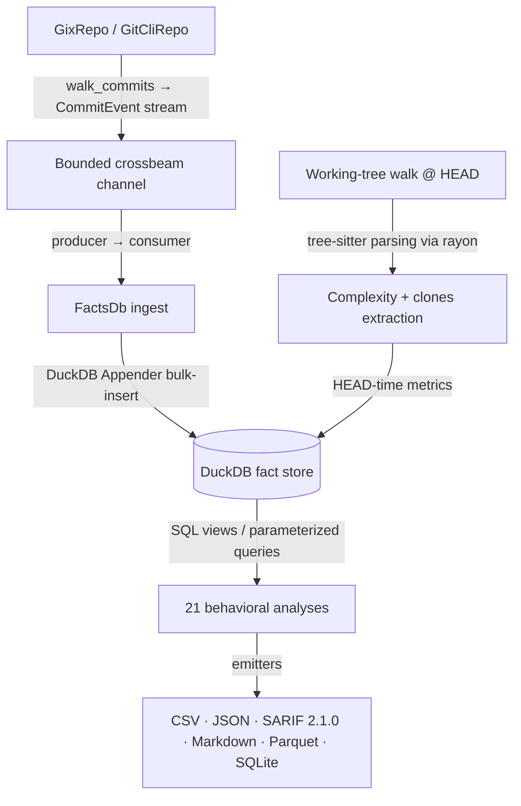

# CodeLore — Deep Codebase Analysis Report

This document presents a deep, read-only analysis of the **CodeLore** codebase. It highlights core architectural patterns, documents the validation status of recent fixes, and outlines remaining and newly identified recommendations for further improvement.

---

## 1. Architectural Overview & Pipeline Data Flow

CodeLore is structured as a multi-crate Rust workspace comprising three main components:
*   [codelore-rca](file:///Users/emrec/Projects/playground/codescene/crates/codelore-rca): A vendored fork of Mozilla's `rust-code-analysis` providing structural syntax hashing and complexity metrics.
*   [codelore-lib](file:///Users/emrec/Projects/playground/codescene/crates/codelore-lib): The core engine, handling repository walk abstraction, identity resolution, fact-store management, analyses execution, caching, and output emitters.
*   [codelore-cli](file:///Users/emrec/Projects/playground/codescene/crates/codelore-cli): The command-line frontend that handles arguments parsing, option consolidation, and output routing.

### Data Ingest Flow



1.  **Repository Traversal**:
    *   [GixRepo](file:///Users/emrec/Projects/playground/codescene/crates/codelore-lib/src/repo/gix_repo.rs) uses pure-Rust `gitoxide` libraries to parse refs and traverse commit graphs in parallel to DuckDB writes.
    *   [GitCliRepo](file:///Users/emrec/Projects/playground/codescene/crates/codelore-lib/src/repo/git_cli_repo.rs) shells out to the standard `git` CLI, serving as a differential testing oracle.
2.  **Event Ingestion**:
    *   `duckdb::Connection` is `!Send + !Sync`. To get parallelism, a **Producer-Consumer pattern** is utilized:
        *   The background thread walks commits using `GixRepo` and places [CommitEvent](file:///Users/emrec/Projects/playground/codescene/crates/codelore-lib/src/types.rs#L44-L57) instances onto a bounded `crossbeam-channel`.
        *   The main connection-owning thread consumes these events and bulk-inserts them via DuckDB's fast `Appender` API in [ingest_loop](file:///Users/emrec/Projects/playground/codescene/crates/codelore-lib/src/facts/ingest.rs#L402-L460).
3.  **Complexity and Clones at HEAD**:
    *   In [ingest_complexity_at_head](file:///Users/emrec/Projects/playground/codescene/crates/codelore-lib/src/facts/ingest.rs#L87-L162), a parallel walk scans all "live" (non-deleted) source files at HEAD. Rayon workers compile tree-sitter AST nodes, compute cyclomatic/cognitive/Halstead complexity, deduplicate entities, and serially drain results into the database.
    *   Similarly, [populate_clones_at_head](file:///Users/emrec/Projects/playground/codescene/crates/codelore-lib/src/facts/ingest.rs#L164-L262) extracts function fingerprints to identify structural Type-1 (exact) and Type-2 (renamed/parameterized) clones.
4.  **SQL-Driven Analyses**:
    *   21 behavioral analyses run purely as DuckDB SQL views or parameterized queries over the fact store (e.g. [hotspots.rs](file:///Users/emrec/Projects/playground/codescene/crates/codelore-lib/src/analyses/hotspots.rs), [coupling.rs](file:///Users/emrec/Projects/playground/codescene/crates/codelore-lib/src/analyses/coupling.rs)).

---

## 2. Validation Status of Previously Documented Findings

### 1. Lines Added/Deleted (`loc_added`/`loc_deleted`) are Stubbed to 0
*   **Status**: **FULLY FIXED** ([commit `54040de`](file:///Users/emrec/Projects/playground/codescene/commit/54040de14a04d8bd8a4eb5c1cca60330620aad9a))
    *   `GitCliRepo` now issues `git log --raw --numstat` to extract exact added and deleted lines.
    *   `GixRepo` fetches parent and current blobs and uses `gix_diff::blob::diff_with_slider_heuristics` to run standard histogram diffs and calculate line counts.

### 2. Propagated `rows_limit` Parameter Distorting Composite / Derived Analyses
*   **Status**: **FULLY FIXED** ([commit `6414aa0`](file:///Users/emrec/Projects/playground/codescene/commit/6414aa0))
    *   The `Options` struct exposes a `with_no_row_limit()` helper.
    *   `run_code_health` and `run_clone_coupling` now invoke the nested `run_coupling` call with a row-unlimited options bag, ensuring calculations like `coupling_centrality` are done on the complete graph.

### 3. Unused `max_coupling_pct` Filter
*   **Status**: **FULLY FIXED** ([commit `6414aa0`](file:///Users/emrec/Projects/playground/codescene/commit/6414aa0))
    *   `run_coupling`'s SQL query was updated to bind and restrict the maximum threshold: `AND degree <= ?`.

### 4. Discrepancy in Rename/Copy Tracking between Repository Walkers
*   **Status**: **FULLY FIXED** ([commit `06a21b5`](file:///Users/emrec/Projects/playground/codescene/commit/06a21b5))
    *   `GixRepo`'s diff options were configured to enable rewrite tracking matching git defaults (`diff_opts.track_rewrites(Some(gix::diff::Rewrites::default()))`), ensuring parity with `GitCliRepo`.

### 5. History Splitting due to Renames
*   **Status**: **PARTIALLY FIXED** ([commit `4c1c3b7`](file:///Users/emrec/Projects/playground/codescene/commit/4c1c3b7))
    *   A recursive CTE was introduced to build `path_lineage` mappings, and a temporary `changes_lineage` table resolves old paths to canonical post-rename paths.
    *   **The Remaining Gap**: This has only been wired into **3** out of 12 path-aggregating analyses (`revisions`, `hotspots`, `coupling`). The remaining **9** analyses (`churn`, `code_health`, `code_age`, `entity_ownership`, `main_dev`, `ownership`, `entity_effort`, `messages`, `soc`) still query literal paths from `changes` directly and suffer from split-history aggregation errors.

---

## 3. Newly Identified Critical Gaps & Recommendations

### 🚨 Major Issue: `.mailmap` Edits Do Not Invalidate Persistent Cache (Stale / Poisoned Cache)

**The Problem**:
CodeLore uses the repository's `.mailmap` file during commit ingestion to resolve author names and emails to canonical identities. However, `Options::canonical_json()` (which computes the persistent cache key) does not hash the contents of the `.mailmap` file.
As a result, if a user edits `.mailmap` to canonicalize or merge author identities, subsequent runs of CodeLore will hit the cache, returning stale, unmapped historical data.

**Suggested Fix**:
Include the content digest of the repository's `.mailmap` file in `Options::canonical_json()`'s hash calculations:
```rust
let mailmap_digest = digest_of(&self.repo_path.join(".mailmap"));
map.insert("mailmap_digest".to_string(), json!(mailmap_digest));
```

---

### 🚨 Major Issue: `.codeloreignore` Edits Do Not Invalidate Persistent Cache

**The Problem**:
Similar to the mailmap issue, `.codeloreignore` is parsed dynamically from disk in `build_clones_exclude_set` to filter out files during the clones extraction pass. However, the `.codeloreignore` file's content hash is not included in the cache key computed by `Options::canonical_json()`. If a user modifies `.codeloreignore` to exclude directories from analysis, they will get a stale cache hit and see outdated metrics.

**Suggested Fix**:
Include the content digest of the repository's `.codeloreignore` file in the cache key:
```rust
let codeloreignore_digest = digest_of(&self.repo_path.join(".codeloreignore"));
map.insert("codeloreignore_digest".to_string(), json!(codeloreignore_digest));
```

---

### 🚨 Major Issue: Parquet Output Emitters Bypass Rename Lineage (Correctness Bug)

**The Problem**:
In [parquet.rs](file:///Users/emrec/Projects/playground/codescene/crates/codelore-lib/src/output/parquet.rs), the `write_hotspots_parquet` and `write_revisions_parquet` functions query the raw `changes` table directly. If the user requests `--format parquet` combined with `--use-canonical-lineage` (default true), the output Parquet files will completely ignore the rename-lineage mapping and output split histories, despite standard CSV/Markdown queries resolving them correctly.

**Suggested Fix**:
Re-route the Parquet SQL builders to respect `opts.use_canonical_lineage`. Instead of duplicating the SQL string inline in `parquet.rs`, invoke the public `build_sql` helper from `hotspots` or build equivalent schema tables over the canonical `changes_lineage` table.

---

### ⚡ Performance Bottleneck: Missing Indexes on the Temporary `changes_lineage` Table

**The Problem**:
When `--use-canonical-lineage` is enabled, the system constructs a temporary table called `changes_lineage` to map old paths to their canonical names. This temporary table is created using `CREATE TEMPORARY TABLE changes_lineage AS SELECT ...` and has no primary key or indexes.
Because of this, downstream aggregation queries on `changes_lineage` (like those in `revisions`, `hotspots`, and `coupling`) must perform full table scans instead of leveraging the indexes on `changes(path)` and `changes(rev)` (`idx_changes_path` and `idx_changes_rev`). On large repositories, this will lead to a query performance regression.

**Suggested Fix**:
After materializing `changes_lineage` in `materialize_changes_lineage`, explicitly create indexes on it:
```sql
CREATE INDEX IF NOT EXISTS idx_changes_lineage_path ON changes_lineage(path);
CREATE INDEX IF NOT EXISTS idx_changes_lineage_rev ON changes_lineage(rev);
```

---

### ⚡ Performance Bottleneck: Redundant `count_loc` for Bit-Identical Blobs

**The Problem**:
In [gix_repo.rs](file:///Users/emrec/Projects/playground/codescene/crates/codelore-lib/src/repo/gix_repo.rs#L320-L329), when processing `GixChange::Rewrite`, if `diff` is `None` (representing a perfect 100% rename with identical blob hashes), the code still executes `count_loc(repo, Some(source_id), Some(id))` (which reads both blobs and runs a histogram diff).

**Suggested Fix**:
If `diff` is `None`, directly return `(100u8, 0, 0)` rather than invoking `count_loc`. This eliminates redundant disk reads and diff computations.

---

### ⚡ Performance Bottleneck: Double `find_commit` per Commit Event

**The Problem**:
In `GixRepo::walk_commits` ([gix_repo.rs](file:///Users/emrec/Projects/playground/codescene/crates/codelore-lib/src/repo/gix_repo.rs#L51-L98)), the walker performs `repo.find_commit(oid)` once during the initial OID collection phase (to check merge status and author date), and then performs a second `find_commit(oid)` inside the mapped iterator step to parse the full commit event metadata.

**Suggested Fix**:
Parse the commit metadata (constructing a Send-able `CommitEvent` without changes) in the first pass where `repo` is in scope, and collect a list of events. The mapped iterator step then only needs to populate the `changes` field via `compute_changed_files`. This cuts commit object parsing overhead by **50%**.

---

### ⚙️ DX/Feature Gap: Unwired `--explain` Query Plans

**The Problem**:
The new `--explain` flag is only wired into `run_hotspots` ([hotspots.rs](file:///Users/emrec/Projects/playground/codescene/crates/codelore-lib/src/analyses/hotspots.rs#L106-L109)). The remaining 20 queries cannot output their DuckDB optimizer plan to stderr.

**Suggested Fix**:
Wire the general `FactsDb::explain_sql` helper into all analyses run functions.

---

## 4. General Codebase Health & Roadmap Recommendations

### ⚠️ Concern: Hand-rolled CSV Quoting in `output/csv.rs`
Instead of using the standard `csv` crate, [csv.rs](file:///Users/emrec/Projects/playground/codescene/crates/codelore-lib/src/output/csv.rs) relies on 28 hand-rolled `writeln!` calls and a custom [quote_if_needed](file:///Users/emrec/Projects/playground/codescene/crates/codelore-lib/src/output/csv.rs#L18-L26) escaping utility.

### ⚠️ Concern: Hardcoded Dependency Metadata
Provenance generation in [provenance/mod.rs](file:///Users/emrec/Projects/playground/codescene/crates/codelore-lib/src/provenance/mod.rs) and [arrow_facade.rs](file:///Users/emrec/Projects/playground/codescene/crates/codelore-lib/src/arrow_facade.rs) hardcodes version tags (e.g. `gix_version: "0.84.0"`, `duckdb_version: "1.10503.1"`, `ARROW_RUNTIME_VERSION: "58.3.0"`). Querying DuckDB's version dynamically at runtime (`SELECT version();`) and dependencies' versions via Cargo environment variables/build-scripts would be more robust.

### ⚡ Parallelize Clones Ingest
HEAD-time complexity metrics extraction is parallelized using Rayon, but fingerprint extraction in `populate_clones_at_head` remains sequential. Parallelizing this walk using `rayon::par_iter` would match the speedups achieved in the complexity pass.

---

## Summary of Findings

| Category | Finding / Improvement Point | Priority / Risk | Impact | Status / Fix |
|---|---|---|---|---|
| **Defect** | `loc_added` / `loc_deleted` are always `0` on walks. Churn analyses return zeroed lines. | **High** / Medium | Distorts churn, main-dev, and Kamei vectors. | **Fixed** in `54040de` |
| **Defect** | Propagated `rows_limit` parameter caps nested query results in composite/derived analyses (`code-health` & `clone-coupling`). | **High** / High | Corrupts coupling centrality and clone-coupling matches when `--rows` is set. | **Fixed** in `6414aa0` |
| **Defect** | `.mailmap` edits do not invalidate persistent cache key, leading to stale author aggregations. | **High** / High | Stale cache hit bypasses updated alias associations. | **Active** (New) |
| **Defect** | `.codeloreignore` edits do not invalidate persistent cache key. | **High** / High | Stale cache hit returns metrics for ignored files. | **Active** (New) |
| **Defect** | Parquet output emitters bypass rename lineage, outputting raw split histories. | **High** / High | Parquet formats mismatch stdout/CSV/Markdown when lineage is active. | **Active** |
| **Defect** | `max_coupling_pct` option is ignored in `run_coupling` queries. | **Medium** / Low | High-coupling pairs are not filtered out when specified. | **Fixed** in `6414aa0` |
| **Defect** | Discrepancy in rename/copy tracking config between `GixRepo` (disabled) and `GitCliRepo` (enabled). | **Medium** / High | Leads to inconsistent analysis outputs depending on repo walker. | **Fixed** in `06a21b5` |
| **Defect** | Rename tracking splits file histories in SQL aggregation queries. | **Medium** / High | Split history leads to incorrect Revision and Coupling statistics. | **Partially Fixed** in `4c1c3b7` (Wired for 3/12 analyses) |
| **Performance** | Missing index on `changes_lineage` temporary table. | **Medium** / High | Forces full table scans on path-aggregating queries when lineage is active. | **Active** (New) |
| **Performance** | Redundant `count_loc` call for bit-identical blobs in imperfect `GixChange::Rewrite`. | **Medium** / Low | Overhead reading/diffing identical blobs. | **Active** |
| **Performance** | Double `find_commit` lookup/parsing per commit during `GixRepo::walk_commits`. | **Medium** / Low | Double lookup overhead on repositories with large history. | **Active** |
| **Refactor** | SQL queries are duplicated in `output/parquet.rs` instead of being shared. | **Low** / Low | Risk of silent drift between Parquet outputs and standard emitters. | **Active** |
| **Refactor** | Dependency metadata versions are hardcoded in the codebase instead of queried dynamically. | **Low** / Low | Desynchronized provenance reports during dependency upgrades. | **Active** |
| **Refactor** | Hand-rolled CSV writing in `output/csv.rs` instead of standard `csv` crate. | **Low** / Low | Potential CSV injection or formatting bugs on new features. | **Active** |
| **Feature** | `--explain` is only wired into `run_hotspots`, bypassing other 20 queries. | **Low** / Low | Cannot query other analyses plans for optimization checks. | **Active** |
| **Feature** | Sequential filesystem walk for Clones extraction at HEAD. | **Low** / Low | Lower ingestion throughput on large repositories. | **Active** |
| **DX** | Absence of strict validation for option constraints at CLI boundaries. | **Low** / Low | Silently invalid runs return empty results instead of parsing errors. | **Active** |
