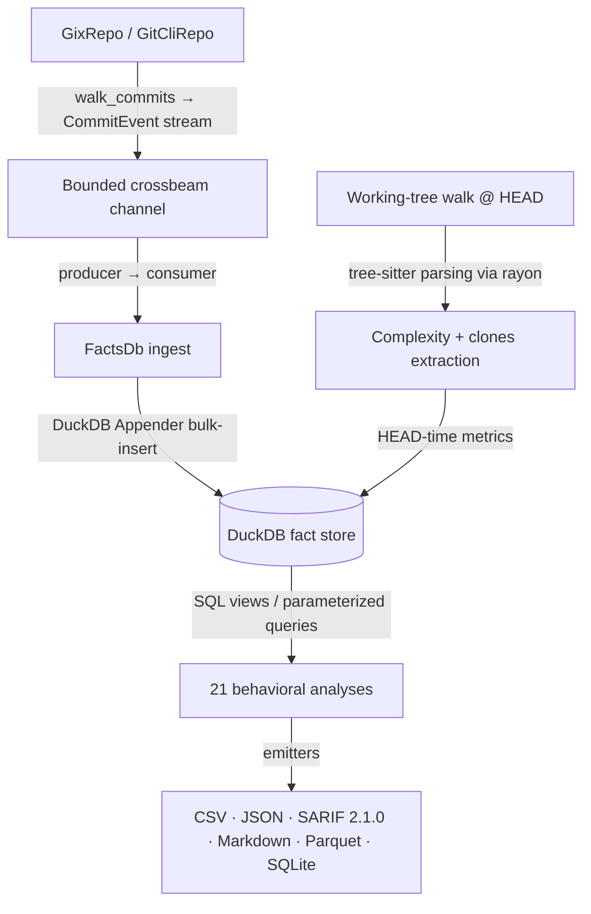

# CodeLore — Deep Codebase Analysis Report

This document presents a deep, read-only analysis of the **CodeLore** codebase. It highlights core architectural patterns, identifies implementation gaps and potential bugs, and outlines concrete recommendations for improvements.

---

## 1. Architectural Overview & Pipeline Data Flow

CodeLore is structured as a multi-crate Rust workspace comprising three main components:
*   [codelore-rca](file:///Users/emrec/Projects/playground/codescene/crates/codelore-rca): A vendored fork of Mozilla's `rust-code-analysis` providing structural syntax hashing and complexity metrics.
*   [codelore-lib](file:///Users/emrec/Projects/playground/codescene/crates/codelore-lib): The core engine, handling repository walk abstraction, identity resolution, fact-store management, analyses execution, caching, and output emitters.
*   [codelore-cli](file:///Users/emrec/Projects/playground/codescene/crates/codelore-cli): The command-line frontend that handles arguments parsing, option consolidation, and output routing.

### Data Ingest Flow



1.  **Repository Traversal**:
    *   [GixRepo](file:///Users/emrec/Projects/playground/codescene/crates/codelore-lib/src/repo/gix_repo.rs) uses pure-Rust `gitoxide` libraries to parse refs and traverse commit graphs in parallel to DuckDB writes.
    *   [GitCliRepo](file:///Users/emrec/Projects/playground/codescene/crates/codelore-lib/src/repo/git_cli_repo.rs) shells out to the standard `git` CLI, serving as a differential testing oracle.
2.  **Event Ingestion**:
    *   `duckdb::Connection` is `!Send + !Sync`. To get parallelism, a **Producer-Consumer pattern** is utilized:
        *   The background thread walks commits using `GixRepo` and places [CommitEvent](file:///Users/emrec/Projects/playground/codescene/crates/codelore-lib/src/types.rs#L44-L57) instances onto a bounded `crossbeam-channel`.
        *   The main connection-owning thread consumes these events and bulk-inserts them via DuckDB's fast `Appender` API in [ingest_loop](file:///Users/emrec/Projects/playground/codescene/crates/codelore-lib/src/facts/ingest.rs#L402-L460).
3.  **Complexity and Clones at HEAD**:
    *   In [ingest_complexity_at_head](file:///Users/emrec/Projects/playground/codescene/crates/codelore-lib/src/facts/ingest.rs#L87-L162), a parallel walk scans all "live" (non-deleted) source files at HEAD. Rayon workers compile tree-sitter AST nodes, compute cyclomatic/cognitive/Halstead complexity, deduplicate entities, and serially drain results into the database.
    *   Similarly, [populate_clones_at_head](file:///Users/emrec/Projects/playground/codescene/crates/codelore-lib/src/facts/ingest.rs#L164-L262) extracts function fingerprints to identify structural Type-1 (exact) and Type-2 (renamed/parameterized) clones.
4.  **SQL-Driven Analyses**:
    *   21 behavioral analyses run purely as DuckDB SQL views or parameterized queries over the fact store (e.g. [hotspots.rs](file:///Users/emrec/Projects/playground/codescene/crates/codelore-lib/src/analyses/hotspots.rs), [coupling.rs](file:///Users/emrec/Projects/playground/codescene/crates/codelore-lib/src/analyses/coupling.rs)).

---

## 2. Critical Implementation Gaps & Potential Bugs

### 🚨 Major Issue: Lines Added/Deleted (`loc_added`/`loc_deleted`) are Stubbed to 0

**The Problem**:
Several behavioral analyses rely on line-based churn metrics:
*   `abs-churn`, `author-churn`, and `entity-churn` in [churn.rs](file:///Users/emrec/Projects/playground/codescene/crates/codelore-lib/src/analyses/churn.rs) sum `loc_added` and `loc_deleted`.
*   `main-dev` in [main_dev.rs](file:///Users/emrec/Projects/playground/codescene/crates/codelore-lib/src/analyses/main_dev.rs) ranks developers by `SUM(loc_added)`.
*   `entity-ownership` in [entity_ownership.rs](file:///Users/emrec/Projects/playground/codescene/crates/codelore-lib/src/analyses/entity_ownership.rs) calculates added and deleted lines per author.
*   `code-health` in [code_health.rs](file:///Users/emrec/Projects/playground/codescene/crates/codelore-lib/src/analyses/code_health.rs) uses churn rate as a penalty metric.
*   `kamei` in [mod.rs](file:///Users/emrec/Projects/playground/codescene/crates/codelore-lib/src/kamei/mod.rs) calculates diffusion entropy, size (`la`, `ld`), and experience features based on lines changed.

However, during repository traversal:
1.  In [gix_repo.rs](file:///Users/emrec/Projects/playground/codescene/crates/codelore-lib/src/repo/gix_repo.rs#L237-L312), [gix_change_to_file_change](file:///Users/emrec/Projects/playground/codescene/crates/codelore-lib/src/repo/gix_repo.rs#L239) sets both `loc_added` and `loc_deleted` to **`0`** for all change events (additions, modifications, renames, copies).
2.  In [git_cli_repo.rs](file:///Users/emrec/Projects/playground/codescene/crates/codelore-lib/src/repo/git_cli_repo.rs), [walk_commits](file:///Users/emrec/Projects/playground/codescene/crates/codelore-lib/src/repo/git_cli_repo.rs#L47) constructs the change event stream using `git log --name-status`, which only yields file path and status, setting `loc_added` and `loc_deleted` to **`0`** in [parse_name_status_line](file:///Users/emrec/Projects/playground/codescene/crates/codelore-lib/src/repo/git_cli_repo.rs#L384).

Because these fields are always zero, **every churn-based metric, size score, and code health churn penalty in the default production flow evaluates to 0**.

**Suggested Fix**:
*   **For `GixRepo`**: Obtain raw blob diffs for modified files. Fetch the parent and current blob objects from the database and use `gix_diff::blob::platform` or similar `gitoxide` APIs to count added and deleted lines. For additions/deletions, count the total lines in the single referenced blob.
*   **For `GitCliRepo`**: Use `git log --numstat` instead of `--name-status` to extract exact added/deleted line counts directly from git CLI logs.

---

### 🚨 Major Issue: Propagated `rows_limit` Parameter Distorting Composite / Derived Analyses

**The Problem**:
The `Options.rows_limit` field restricts the maximum number of rows returned in the final output (e.g. `--rows 10`). However, both [run_code_health](file:///Users/emrec/Projects/playground/codescene/crates/codelore-lib/src/analyses/code_health.rs#L159) and [run_clone_coupling](file:///Users/emrec/Projects/playground/codescene/crates/codelore-lib/src/analyses/clone_coupling.rs#L77) call `coupling::run_coupling(db, opts)` internally.
Since the parent `opts` structure is passed down directly:
1.  The query in `run_coupling` receives `rows_limit` and applies `LIMIT ?` to the SQL query.
2.  Thus, `run_coupling` only returns the top 10 coupling pairs in the entire repository.
3.  In `code_health`, the `coupling_centrality` term (which counts the number of Fisher-significant coupling partners for each file) is computed over this truncated subset of 10 pairs instead of the entire coupled pair space, rendering the metric completely incorrect/spurious.
4.  In `clone_coupling`, clone pairs are only matched against the top 10 coupled pairs, causing other valid coupled clone pairs to be discarded.

**Suggested Fix**:
In both `run_code_health` and `run_clone_coupling`, clone/construct a modified version of the `Options` struct with `rows_limit` set to `None` before invoking `coupling::run_coupling`. The original `rows_limit` should only be applied to the final result set of the parent analysis.

---

### 🐛 Bug: Unused `max_coupling_pct` Filter

**The Problem**:
The `max_coupling_pct` option (represented in CLI as `--max-coupling` and parsed into [Options.max_coupling_pct](file:///Users/emrec/Projects/playground/codescene/crates/codelore-lib/src/options.rs#L63)) is completely ignored. 

In [run_coupling](file:///Users/emrec/Projects/playground/codescene/crates/codelore-lib/src/analyses/coupling.rs#L143-L220), only `min_coupling_pct` is bound and filtered:
```rust
         WHERE 100.0 * p.shared / NULLIF((fr_a.revs + fr_b.revs) / 2.0, 0) >= ?
```
No condition exists in the SQL view or the Rust post-filtering loop to check if the coupling degree exceeds `max_coupling_pct`. Thus, pairs exceeding the upper threshold are incorrectly returned.

**Suggested Fix**:
Modify the SQL query built by [build_coupling_sql](file:///Users/emrec/Projects/playground/codescene/crates/codelore-lib/src/analyses/coupling.rs#L64-L104) to bound the degree range on both sides:
```sql
         WHERE degree >= ? AND degree <= ?
```
And bind `opts.max_coupling_pct` alongside `opts.min_coupling_pct`.

---

### 🐛 Bug: Discrepancy in Rename/Copy Tracking between Repository Walkers

**The Problem**:
In [gix_repo.rs](file:///Users/emrec/Projects/playground/codescene/crates/codelore-lib/src/repo/gix_repo.rs#L221-L223), the Pure-Rust `gitoxide` walker disables rewrite tracking completely:
```rust
    let mut diff_opts = gix::diff::Options::default();
    diff_opts.track_rewrites(None);
```
Consequently, `GixRepo` (the default engine) never generates `ChangeType::Renamed` or `ChangeType::Copied` events. A rename will always show up as a `Deleted` event for the old path and an `Added` event for the new path.
However, `GitCliRepo` (the CLI-based fallback) walks commits via `git log --name-status`, which detects renames and copies based on Git's defaults or user configurations. It then parses these into `ChangeType::Renamed` and `ChangeType::Copied`.
This creates a significant discrepancy in the database ingestion depending on the chosen repo walker, leading to silent splits in file revision history under `GixRepo`.

**Suggested Fix**:
Enable and configure rewrite tracking in `GixRepo`'s `diff_opts` (e.g. `diff_opts.track_rewrites(Some(gix::diff::rewrites::Options::default()))` or equivalent settings matching Git defaults) so both walker backends emit consistent rename events.

---

### ⚠️ Concern: Hand-rolled CSV Quoting in `output/csv.rs`

**The Problem**:
Instead of using the standard `csv` crate, [csv.rs](file:///Users/emrec/Projects/playground/codescene/crates/codelore-lib/src/output/csv.rs) relies on 28 hand-rolled `writeln!` calls and a custom [quote_if_needed](file:///Users/emrec/Projects/playground/codescene/crates/codelore-lib/src/output/csv.rs#L18-L26) escaping utility.

While this helper covers basic characters like commas, double quotes, and newlines, hand-rolling CSV formatting is error-prone. If a developer introduces a new emitter function and forgets to wrap a string with `quote_if_needed`, it can lead to malformed CSV outputs, parser crashes, or security/injection vulnerabilities.

**Suggested Fix**:
Refactor `csv.rs` to use standard writers from the `csv` crate:
```rust
let mut wtr = csv::WriterBuilder::new().flexible(false).from_writer(w);
```
This is already recognized on the roadmap as a Tier 2 hygiene target and should be scheduled.

---

### ⚠️ Concern: Parquet SQL Duplication in `output/parquet.rs`

**The Problem**:
[parquet.rs](file:///Users/emrec/Projects/playground/codescene/crates/codelore-lib/src/output/parquet.rs) contains duplicate inline SQL queries of [hotspots.rs](file:///Users/emrec/Projects/playground/codescene/crates/codelore-lib/src/analyses/hotspots.rs#L44-L87) and [revisions.rs](file:///Users/emrec/Projects/playground/codescene/crates/codelore-lib/src/analyses/revisions.rs). If the calculation details or columns change in the analyses, the Parquet outputs will silently drift.

**Suggested Fix**:
Extract the SQL query templates as package-internal constants (e.g. `pub(crate) const SQL`) inside the respective analysis modules, or export a query builder function that can be shared between the analysis logic and the Parquet emitter.

---

### ⚠️ Concern: Hardcoded Dependency Metadata

**The Problem**:
Provenance generation in [provenance/mod.rs](file:///Users/emrec/Projects/playground/codescene/crates/codelore-lib/src/provenance/mod.rs) and [arrow_facade.rs](file:///Users/emrec/Projects/playground/codescene/crates/codelore-lib/src/arrow_facade.rs) hardcodes version tags (e.g. `gix_version: "0.84.0"`, `duckdb_version: "1.10503.1"`, `ARROW_RUNTIME_VERSION: "58.3.0"`). Utilizing hardcoded strings will lead to desynchronization when dependencies are upgraded.

**Suggested Fix**:
*   **For DuckDB**: Query `SELECT version();` dynamically at runtime on the connection to retrieve the actual DuckDB runtime version.
*   **For `gix`/`arrow`**: Utilize compile-time environment variables or generate constant definitions using a custom build script (`build.rs`) that parses dependency configurations from Cargo workspace metadata.

---

### ⚠️ Functional Gap: History Splitting due to Renames

**The Problem**:
Ingestion logs capture file renames via `ChangeType::Renamed { from, similarity }` and save the origin path under `changes.rename_from` in the DB.

However, all aggregation queries in the 21 analyses (such as `revisions`, `coupling`, `churn`, etc.) group directly on `changes.path` (e.g. `GROUP BY changes.path`). This means that when a file is renamed, its history splits into two separate file names. Revisions count drops for both, coupling records split, and hotspots detection becomes less accurate.

**Suggested Fix**:
Construct a canonical-lineage view inside DuckDB. Use a recursive common table expression (CTE) to resolve rename chains and map all historical changes to their latest post-rename path. Aggregate analyses should then run over this resolved path mapping instead of the raw `changes.path` column.

---

## 3. General Codebase Health & Roadmap Recommendations

### ⚡ Parallelize Clones Ingest
HEAD-time complexity metrics extraction is parallelized using Rayon, which achieves a major speedup. However, [populate_clones_at_head](file:///Users/emrec/Projects/playground/codescene/crates/codelore-lib/src/facts/ingest.rs#L164) walks the filesystem and extracts fingerprints sequentially. Parallelizing this walk using `rayon::par_iter` would match the speedups achieved in the complexity pass.

### ⚙️ Strict Options Validation
The [Options](file:///Users/emrec/Projects/playground/codescene/crates/codelore-lib/src/options.rs#L48) structure contains 28 fields. Pathological CLI inputs (e.g. `min_revs > max_changeset_size`, `after > before`, or `clone_similarity_floor > 1.0`) are currently accepted and run silently, producing empty outputs without warning.
Introducing a builder pattern (e.g., `OptionsBuilder::build() -> Result<Options, OptionsError>`) to perform cross-field validations at the CLI boundary would improve the developer and user experience.

### 🧪 Hardening with Fuzzing/Mutants
Applying `cargo-mutants` to the query orchestration and adding a `cargo-fuzz` campaign to the tree-sitter AST traversal in [extractor.rs](file:///Users/emrec/Projects/playground/codescene/crates/codelore-lib/src/clones/extractor.rs) would help identify edge cases and harden the clone fingerprint logic.

---

## Summary of Findings

| Category | Finding / Improvement Point | Priority / Risk | Impact |
|---|---|---|---|
| **Defect** | `loc_added` / `loc_deleted` are always `0` on `GixRepo`/`GitCliRepo` walks. Churn analyses return zeroed lines. | **High** / Medium | Distorts churn, main-dev (Added), and Kamei vectors. |
| **Defect** | Propagated `rows_limit` parameter caps nested query results in composite/derived analyses (`code-health` & `clone-coupling`). | **High** / High | Corrupts coupling centrality and clone-coupling matches when `--rows` is set. |
| **Defect** | `max_coupling_pct` option is ignored in `run_coupling` queries. | **Medium** / Low | High-coupling pairs are not filtered out when specified. |
| **Defect** | Discrepancy in rename/copy tracking config between `GixRepo` (disabled) and `GitCliRepo` (enabled). | **Medium** / High | Leads to inconsistent analysis outputs depending on repo walker. |
| **Defect** | Rename tracking splits file histories in SQL aggregation queries. | **Medium** / High | Split history leads to incorrect Revision and Coupling statistics. |
| **Refactor** | SQL queries are duplicated in `output/parquet.rs` instead of being shared constants/builders. | **Low** / Low | Risk of silent drift between Parquet outputs and standard emitters. |
| **Refactor** | Dependency metadata versions are hardcoded in the codebase instead of queried dynamically. | **Low** / Low | Desynchronized provenance reports during dependency upgrades. |
| **Refactor** | Hand-rolled CSV writing in `output/csv.rs` instead of standard `csv` crate. | **Low** / Low | Potential CSV injection or formatting bugs on new features. |
| **Feature** | Sequential filesystem walk for Clones extraction at HEAD. | **Low** / Low | Lower ingestion throughput on large repositories. |
| **DX** | Absence of strict validation for option constraints at CLI boundaries. | **Low** / Low | Silently invalid runs return empty results instead of parsing errors. |
