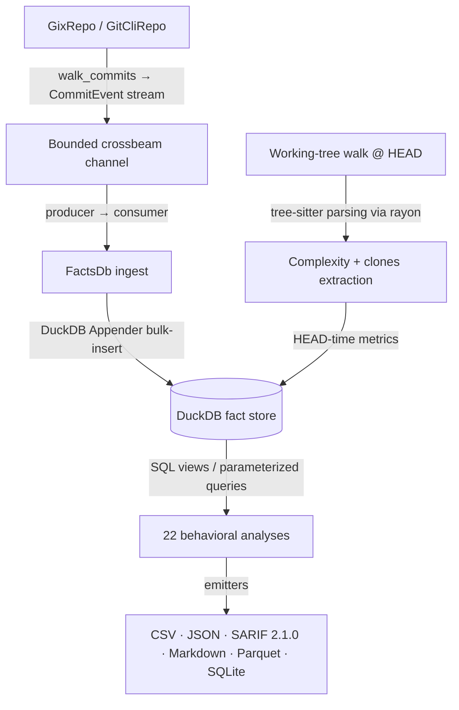

# CodeLore — Deep Codebase Analysis Report

This document presents a deep, read-only analysis of the **CodeLore** codebase. It documents the validation of recent fixes and outlines newly identified recommendations for further correctness, robustness, and performance improvements.

---

## 1. Architectural Overview & Pipeline Data Flow

CodeLore is structured as a multi-crate Rust workspace comprising three main components:
*   [codelore-rca](file:///Users/emrec/Projects/playground/codelore/crates/codelore-rca): A vendored fork of Mozilla's `rust-code-analysis` providing structural syntax hashing and complexity metrics.
*   [codelore-lib](file:///Users/emrec/Projects/playground/codelore/crates/codelore-lib): The core engine, handling repository walk abstraction, identity resolution, fact-store management, analyses execution, caching, and output emitters.
*   [codelore-cli](file:///Users/emrec/Projects/playground/codelore/crates/codelore-cli): The command-line frontend that handles arguments parsing, option consolidation, and output routing.

### Data Ingest Flow

1.  **Repository Traversal**:
    *   [GixRepo](file:///Users/emrec/Projects/playground/codelore/crates/codelore-lib/src/repo/gix_repo.rs) uses pure-Rust `gitoxide` libraries to parse refs and traverse commit graphs in parallel to DuckDB writes.
    *   [GitCliRepo](file:///Users/emrec/Projects/playground/codelore/crates/codelore-lib/src/repo/git_cli_repo.rs) shells out to the standard `git` CLI, serving as a differential testing oracle.
2.  **Event Ingestion**:
    *   `duckdb::Connection` is `!Send + !Sync`. To get parallelism, a **Producer-Consumer pattern** is utilized:
        *   The background thread walks commits using `GixRepo` and places [CommitEvent](file:///Users/emrec/Projects/playground/codelore/crates/codelore-lib/src/types.rs) instances onto a bounded `crossbeam-channel`.
        *   The main connection-owning thread consumes these events and bulk-inserts them via DuckDB's fast `Appender` API in [ingest_loop](file:///Users/emrec/Projects/playground/codelore/crates/codelore-lib/src/facts/ingest.rs).
3.  **Complexity and Clones at HEAD**:
    *   In [ingest_complexity_at_head](file:///Users/emrec/Projects/playground/codelore/crates/codelore-lib/src/facts/ingest.rs), a parallel walk scans all "live" (non-deleted) source files at HEAD. Rayon workers compile tree-sitter AST nodes, compute cyclomatic/cognitive/Halstead complexity, deduplicate entities, and serially drain results into the database.
    *   Similarly, [populate_clones_at_head](file:///Users/emrec/Projects/playground/codelore/crates/codelore-lib/src/facts/ingest.rs) extracts function fingerprints to identify structural Type-1 (exact) and Type-2 (renamed/parameterized) clones.
4.  **SQL-Driven Analyses**:
    *   22 behavioral analyses run purely as DuckDB SQL views or parameterized queries over the fact store (e.g. [hotspots.rs](file:///Users/emrec/Projects/playground/codelore/crates/codelore-lib/src/analyses/hotspots.rs), [coupling.rs](file:///Users/emrec/Projects/playground/codelore/crates/codelore-lib/src/analyses/coupling.rs)).

---

## 2. Validation Status of Prior Recommendations

All previous findings and code-maat parity issues have been validated as **fully resolved and correct** in the current codebase (released in version `v0.2.1` and `v0.2.2`):

### Resolved Core Deep-Analysis Findings (F1–F11)
*   **F1 (Commit Chronology Precision)**: Resolved. Promoted `commits.date` from `DATE` to `TIMESTAMP` in schema v2.
*   **F2 (Clone-Coupling Floor Override)**: Resolved. Lowered `min_shared_revs` to the minimum of `min_shared_revs` and `min_clone_shared_revs` in inner `run_coupling` calls.
*   **F3 (Cache Poisoning on Dirty Tree)**: Resolved. Bypasses persistent cache writes when the working tree is dirty, using an in-memory db fallback instead.
*   **F4 (Stale Worktree Cache Root Path)**: Resolved. Updates `prune_stale_worktrees` to resolve namespaced paths using `default_cache_root()`.
*   **F5 (Sum of Coupling max_changeset_size pre-filter)**: Resolved. Added the `good_commits` CTE to pre-filter large commits in `soc`.
*   **F6 (Tempdir Leak on Git Failure)**: Resolved. Delayed `tmp.keep()` until after successful `git worktree add`.
*   **F7 (Cache Bypass for Parquet/SQLite)**: Resolved. Narrowed `needs_writable_db` to SQLite format only; Parquet output now successfully hits and reads from the persistent cache database.
*   **F8 (Positional Alignment in GitCliRepo Zipping)**: Resolved. Replaced index-based zipping in `git_cli_repo.rs:parse_changes_block` with an explicit `HashMap` join on destination path keys, preventing column shifting on submodule/binary mismatches.
*   **F9 (Single-Threaded Commit Traversal)**: Resolved. Configured `GixRepo::walk_commits` to parse commits and calculate diffs concurrently on a Rayon thread pool (`into_par_iter()`).
*   **F10 (Tree-Sitter File Size Cap)**: Resolved. Applied a 2 MB size cap (`DEFAULT_MAX_AST_FILE_BYTES`) across complexity and clone scanner sites to skip oversized files.
*   **F11 (Dirty Status Untracked Parity)**: Resolved. Switched `GixRepo::is_worktree_dirty` from `into_index_worktree_iter` to `into_iter()` to traverse and capture untracked files.
*   **Original Findings (Complexity LOC mapping, Quoted paths, Namespaced tmp cache, SQL case rewriter)**: Verified as fully integrated.

### Resolved Core Deep-Analysis Findings (F12–F17) (shipped in v0.2.2)
*   **F12 (Same-Second Tiebreaker)**: Resolved. Promoted `commits.rowid ASC` (DuckDB insertion order = gix walk order = child-before-parent) to replace SHA-1 lexicographical ordering, ensuring topologically correct sorting of same-second commits.
*   **F13 (Walker Memory Efficiency)**: Resolved. Implemented a chunked Rayon walker (1000-OID batches) streaming through a bounded crossbeam channel to limit memory usage and avoid OOM crashes on large repos.
*   **F14 (Time-Bucket Crash)**: Resolved. Added the `AnalysisName::supports_time_bucket()` validation check at the CLI boundary to reject `--time-bucket` for the 10 analyses that do not materialize or support `changes_bucketed`.
*   **F15 (Silent Empty Joins)**: Resolved. Handled by the same CLI-boundary validation check to prevent joining date-string bucket keys against SHA-1 commit hashes.
*   **F16 (Deleted Files in reports)**: Resolved. Restricted `code-age` (using an anchor-aware CTE) and `entity-churn` (using a live-at-HEAD CTE) to active files only.
*   **F17 (Standalone clones thread speed)**: Resolved. Refactored `run_clones` into a two-phase walk (serial gather followed by parallel function extraction/grouping via Rayon `into_par_iter()`).

### Resolved Code-Maat Parity Findings (PAR-1–PAR-9)
*   All parity findings (Bird et al. per-entity risk authors logic, back-testing dates anchor, interval-month ceiling calculations, CSV header mapping, average-revs pivot points, and research foundations documentation) have been fully closed.
*   **DEEP-1 to DEEP-15 (Code-Maat Exact Parity)**: Verified. Additional sprints in `v0.2.1` closed precise output formatting mismatches (7-column verbose shape for coupling, ceiling-rounded averages, integer-truncated strengths, and hyphenated statistic names in `summary` output under `--code-maat-compat`).

### Resolved Core Deep-Analysis Findings (F18–F21) (shipped in v0.3.1)
*   **F18 (Knowledge-Islands Back-testing)**: Resolved. Applied the `commits.date <= anchor` filter across all CTEs in `knowledge_islands.rs` to guarantee proper temporal isolation in back-testing mode.
*   **F19 (Clone-Coupling Truncation)**: Resolved. Updated `clone_coupling.rs` to call `opts.with_no_row_limit()` for the inner `run_knowledge_islands` sub-analysis, avoiding incorrect truncation of the at-risk file set.
*   **F20 (HTML Render Freeze)**: Resolved. Implemented incremental page-based rendering (page size 500) and page controls (Show next 500 / Show all) in `html.rs` to prevent blocking the browser's UI thread on large outputs.
*   **F21 (GitHub Action Wrapper)**: Resolved. Added automatic `v`-prefix normalisation, authenticated curl headers (via runner token), and pure-bash absolute path resolution to `action.yml`.

### Resolved Core Deep-Analysis Findings (F22–F25) (shipped in v0.3.1)
*   **F22 (Same-Second Rename Chaining)**: Resolved. Recursive CTE now carries `commits.rowid` and breaks date-ties via `co.rowid < l.current_rowid`. Regression test in `same_second_rename_test.rs`.
*   **F23 (Concurrent Cache Writes)**: Resolved. Tmp database cache filename now suffixed with `std::process::id()`; stale `.tmp.<pid>` artifacts swept by the pruner.
*   **F24 (Cache Directory Collection Walk Error Handling)**: Resolved. `collect_duckdb_files_inner` now log-and-skips per directory/entry instead of propagating errors.
*   **F25 (WAL File Cleanup)**: Resolved. `delete_duckdb_with_companion` also removes `.wal`; `cleanup_stale_tmp_files` age-gates `.tmp.<pid>` artifacts (1h).

### Resolved Core Deep-Analysis Findings (F26–F28) (shipped in v0.3.1 / commit 61b3c47)
*   **F26 (Implied-HEAD Range Parsing)**: Resolved. Updated `parse_rev_range` to default empty splits to `"HEAD"`. Added 3 regression tests in `prune_tests`.
*   **F27 (Parallel Commit Filtering)**: Resolved. Defer `find_commit` and filtering to parallel Rayon workers inside `process_commit_oid` (returning `Result<Option<CommitEvent>>`), completely eliminating the serial filtering loop on the main thread and preserving the `rowid` walk-order invariant.
*   **F28 (Worktree Prune Metadata Cleanup)**: Resolved. Swapped the order in `prune_stale_worktrees` to run the directory cleanup sweep *before* executing `git worktree prune`, ensuring Git immediately detects deleted directories and cleans up its administrative metadata in the same run.

---

## 3. Newly Identified Gaps & Recommendations

### F29: Correctness / Logic — Time-Bucket Aggregation Silently Discards Active Weeks/Months via Incorrect `max_changeset_size` Filter Order

**The Problem**:
In both [coupling.rs:139](file:///Users/emrec/Projects/playground/codelore/crates/codelore-lib/src/analyses/coupling.rs#L139) and [soc.rs:54](file:///Users/emrec/Projects/playground/codelore/crates/codelore-lib/src/analyses/soc.rs#L54), the `good_commits` CTE is built by grouping the source table by `rev` and dropping keys where the count of files exceeds the `max_changeset_size` threshold (default 30). When `--time-bucket` is enabled, the source table is `changes_bucketed` where `rev` is collapsed into time-bucket date strings (e.g. `"2026-06-01 00:00:00"`). As a result, the query evaluates the file count *per time bucket* rather than *per physical commit*.

**The Impact**:
Any week or month where the total number of distinct changed files across all commits exceeds 30 is discarded entirely. In active repositories, virtually every week/month will exceed this threshold, leading to time-bucketed coupling and SoC analyses silently returning empty or severely truncated results.

**Recommended Fix**:
Apply the `max_changeset_size` filter on the original `changes` (or `changes_lineage`) commit sizes *before* temporal bucket collapsing, rather than filtering on the collapsed bucket size.

---

### F30: Robustness — Clones Analysis and Ingestion Silently Yield Empty Results if the Repository Absolute Path Contains `.git`, `target`, or `node_modules`

**The Problem**:
In both [clones.rs:64](file:///Users/emrec/Projects/playground/codelore/crates/codelore-lib/src/analyses/clones.rs#L64) and [ingest.rs:247](file:///Users/emrec/Projects/playground/codelore/crates/codelore-lib/src/facts/ingest.rs#L247), the candidate file walker skips any path where `path.components().any(...)` matches `.git`, `target`, or `node_modules`. Because this is evaluated on the full absolute path of each file, if the parent directory structure of the repository root contains any of these directory names (e.g., `/Users/user/target/my-repo`), every file in the repository will be skipped.

**The Impact**:
Clones detection and ingestion silently return zero results, and `clone-coupling` analysis has no data, without any warning or error.

**Recommended Fix**:
Only inspect path components *relative* to the repository root `opts.repo_path` (e.g., by calling `path.strip_prefix(&opts.repo_path)` first) before applying the skip list.

---

### F31: Correctness — Join Duplication and Inflated Stats via Non-Unique `canonical` Joins on `author_aliases`

**The Problem**:
In [knowledge_islands.rs:155](file:///Users/emrec/Projects/playground/codelore/crates/codelore-lib/src/analyses/knowledge_islands.rs#L155), [authors.rs:116](file:///Users/emrec/Projects/playground/codelore/crates/codelore-lib/src/analyses/authors.rs#L116), and [top_committers.rs:80](file:///Users/emrec/Projects/playground/codelore/crates/codelore-lib/src/analyses/top_committers.rs#L80), the SQL queries join the `author_aliases` table using `ON aa.canonical = commits.canonical_author` (or `pfa.author` / `pa.author`). However, the primary key of `author_aliases` is `email` (the raw email), and `canonical` is non-unique because a developer can commit under multiple email addresses, or multiple developers can map to the same team.

**The Impact**:
If a developer has committed with `N` raw emails in the repository history, their change/commit rows are duplicated `N` times in the join result. This inflates calculated developer commit counts, line churn statistics, and file ownership percentages, leading to distorted bus-factor calculations and leaderboard counts.

**Recommended Fix**:
Join the tables using `aa.email` against the raw email column (`commits.author_email`), or select from a deduplicated subquery `(SELECT DISTINCT canonical, is_bot FROM author_aliases)` when joining on `canonical`.

---

### F32: Correctness / Robustness — Base Cache Cache-Poisoning via Missing SHA Validation in `codelore diff`

**The Problem**:
In [diff.rs:263](file:///Users/emrec/Projects/playground/codelore/crates/codelore-cli/src/diff.rs#L263), the function `run_diff` checks if the `--base-cache` file path exists and eagerly loads it without validating that the SHA in the cache file matches `base_sha`.

**The Impact**:
If the base branch (e.g. `main`) moves, or if different PR branches in a shared CI environment use the same cache file path, a PR run will hit the cache and silently use a stale/unrelated commit's analysis as its base analysis. This poisons the delta computation (yielding wrong hotspot entrants, false coupling absences, and wrong clones delta) without any warning.

**Recommended Fix**:
Verify that the cached `RevAnalyses.sha` matches the resolved `base_sha` before using the cached file. If there is a mismatch, log a warning, discard the cache, and re-compute the analysis.

---

### F33: Robustness — Cache Misses via Inconsistent Repo Path Canonicalization in Cache Path Resolution

**The Problem**:
In [cache.rs:30](file:///Users/emrec/Projects/playground/codelore/crates/codelore-lib/src/cache.rs#L30), `cache_key` canonicalizes `repo_path` using `fs::canonicalize(repo_path)` before hashing it. However, in [cache.rs:58](file:///Users/emrec/Projects/playground/codelore/crates/codelore-lib/src/cache.rs#L58), `cache_path_with_root` hashes `repo_path` directly without canonicalizing it first.

**The Impact**:
If a user runs `codelore` using relative paths (e.g. `codelore analyze .`) vs absolute paths (e.g. `codelore analyze /absolute/path`), `cache_path_with_root` will resolve to different repository subdirectories (e.g., `root/codelore/a1b2c3d4/` vs `root/codelore/e5f6g7h8/`). This leads to cache misses, forcing full database ingestions when switching invocation styles even though the underlying repository is identical.

**Recommended Fix**:
Canonicalize `repo_path` in `cache_path_with_root` before hashing it to derive the subdirectory name.

---

### F34: Performance / Correctness — Missing Binary / Large File Diff Protection in `GixRepo` Line-Counting

**The Problem**:
In [gix_repo.rs:464](file:///Users/emrec/Projects/playground/codelore/crates/codelore-lib/src/repo/gix_repo.rs#L464), `count_loc` loads and diffs the contents of modifying blobs using the histogram algorithm without detecting if the file is binary or exceedingly large. Unlike `GitCliRepo` which leverages Git's built-in binary file heuristic (returning `- -` and skipping diffs), `GixRepo` blindly reads the raw blob bytes and performs line-splitting and diffing.

**The Impact**:
Commits touching large files (e.g., SQLite databases, large images, ZIP archives) will cause the Rayon walker threads to load massive byte arrays into memory and run expensive diff algorithms, causing CPU spikes and potential OOM crashes. Additionally, binary files will be falsely attributed arbitrary `loc_added` and `loc_deleted` based on random newline bytes, polluting hotspots, churn, and code-health analyses.

**Recommended Fix**:
Implement a binary-detection check in `count_loc` (e.g., check for NUL bytes `\0` in the first 8000 bytes) and a size cap (e.g., skip files larger than 1MB). If binary or too large, return `(0, 0)` immediately.

---

## 4. Summary of Active Findings

Below is the register of active improvement opportunities and bugs:

| ID | Category | Finding / Improvement Point | Priority / Risk | Impact | Status |
|---|---|---|---|---|---|
| **F29** | Correctness | Time-Bucket aggregation incorrect `max_changeset_size` filter order. | **High** / Medium | Silently discards active weeks/months where cumulative file changes exceed 30. | **Fixed (Unreleased)** — New `good_commits_cte(bucket, use_lineage)` helper; bucketing-aware `MAX(files) <= ?` semantic. 2 regression tests. |
| **F30** | Robustness | Clones analysis skips all candidate files if root path contains `.git`, `target`, etc. | **High** / Low | Silent empty clones and clone-coupling results under certain user file paths. | **Fixed (Unreleased)** — `path.components().any(...)` now runs on the repo-relative path in both `clones.rs` and `ingest::populate_clones_at_head`. |
| **F31** | Correctness | Duplicate rows and inflated stats in joins on non-unique `canonical` in `author_aliases`. | **High** / Medium | Inflated commit and churn stats, distorted ownership percentages for multi-email authors. | **Fixed (Unreleased)** — All 3 sites (`knowledge_islands.rs`, `authors.rs`, `top_committers.rs`) use a dedup subquery: `LEFT JOIN (SELECT canonical, BOOL_OR(is_bot) AS is_bot FROM author_aliases GROUP BY canonical) aa`. |
| **F32** | Correctness | Base cache cache-poisoning via missing SHA validation in `codelore diff`. | **High** / Medium | Silently uses stale/unrelated base commits, poisoning delta calculations in CI. | **Fixed (Unreleased)** — `run_diff` now validates `cached.sha == base_sha`; on mismatch warns + recomputes + overwrites cache. |
| **F33** | Robustness | Cache path uses non-canonicalized repo path while cache key canonicalizes it. | **Medium** / Low | Causes cache misses when switching between relative (`.`) and absolute path invocations. | **Fixed (Unreleased)** — `cache_path_with_root` now `fs::canonicalize`s `repo_path` before hashing. Regression test. |
| **F34** | Perf/Correct | Missing binary/large file diff protection in `GixRepo::count_loc` walk. | **High** / Medium | Slowdowns/OOMs on large commits, and incorrect line churn statistics for binary files. | **Fixed (Unreleased)** — `count_loc` returns `(0, 0)` for blobs >1 MiB or containing NUL in first 8 KB (matches `git log --numstat`). Regression test with synthetic binary blob. |

---

## 5. Proposed Verification Plan for New Findings

### F29 (time-bucket changeset size pre-filter)
*   **Verification**: Run a time-bucketed coupling analysis on a repository where the cumulative files changed in a week exceeds `--max-changeset-size` but individual commits do not. Verify that the bucket is not dropped.

### F30 (relative-path skip checks for clones)
*   **Verification**: Move a repository to a path containing `target` (e.g. `/tmp/target/repo`), run the clones analysis, and verify that candidates are successfully parsed instead of being skipped.

### F31 (aliases duplicate join prevention)
*   **Verification**: Create a mock repository with a developer who has committed using two different email addresses. Run `top-committers` and `authors` analyses and verify that their commit/change counts are not duplicated or inflated.

### F32 (base cache SHA validation)
*   **Verification**: Run `codelore diff` once with `--base-cache cache.json`. Modify the base branch, run again, and verify that codelore detects the SHA mismatch, ignores the cache, and computes a fresh analysis instead of loading stale cache.

### F33 (consistent repo path canonicalization)
*   **Verification**: Run `codelore analyze .` followed by `codelore analyze $(pwd)`. Verify that both invocations hit the exact same cache directory and file instead of generating two separate cache subdirectories.

### F34 (binary/large file diff check)
*   **Verification**: Commit a 5MB binary/PDF file to a mock repository. Run ingestion with `GixRepo` and verify that traversal does not hang/OOM, and the file gets `loc_added = 0` and `loc_deleted = 0` in the `changes` table.
