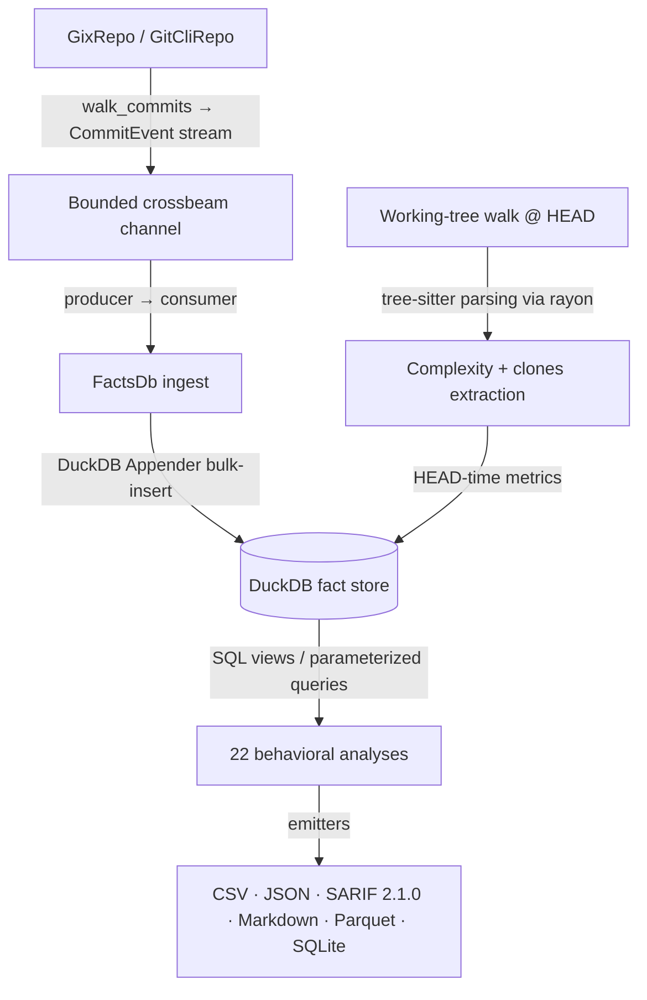

# CodeLore — Deep Codebase Analysis Report

This document presents a deep, read-only analysis of the **CodeLore** codebase. It documents the validation of recent fixes and outlines newly identified recommendations for further correctness, robustness, and performance improvements.

---

## 1. Architectural Overview & Pipeline Data Flow

CodeLore is structured as a multi-crate Rust workspace comprising three main components:
*   [codelore-rca](file:///Users/emrec/Projects/playground/codelore/crates/codelore-rca): A vendored fork of Mozilla's `rust-code-analysis` providing structural syntax hashing and complexity metrics.
*   [codelore-lib](file:///Users/emrec/Projects/playground/codelore/crates/codelore-lib): The core engine, handling repository walk abstraction, identity resolution, fact-store management, analyses execution, caching, and output emitters.
*   [codelore-cli](file:///Users/emrec/Projects/playground/codelore/crates/codelore-cli): The command-line frontend that handles arguments parsing, option consolidation, and output routing.

### Data Ingest Flow



1.  **Repository Traversal**:
    *   [GixRepo](file:///Users/emrec/Projects/playground/codelore/crates/codelore-lib/src/repo/gix_repo.rs) uses pure-Rust `gitoxide` libraries to parse refs and traverse commit graphs in parallel to DuckDB writes.
    *   [GitCliRepo](file:///Users/emrec/Projects/playground/codelore/crates/codelore-lib/src/repo/git_cli_repo.rs) shells out to the standard `git` CLI, serving as a differential testing oracle.
2.  **Event Ingestion**:
    *   `duckdb::Connection` is `!Send + !Sync`. To get parallelism, a **Producer-Consumer pattern** is utilized:
        *   The background thread walks commits using `GixRepo` and places [CommitEvent](file:///Users/emrec/Projects/playground/codelore/crates/codelore-lib/src/types.rs) instances onto a bounded `crossbeam-channel`.
        *   The main connection-owning thread consumes these events and bulk-inserts them via DuckDB's fast `Appender` API in [ingest_loop](file:///Users/emrec/Projects/playground/codelore/crates/codelore-lib/src/facts/ingest.rs).
3.  **Complexity and Clones at HEAD**:
    *   In [ingest_complexity_at_head](file:///Users/emrec/Projects/playground/codelore/crates/codelore-lib/src/facts/ingest.rs), a parallel walk scans all "live" (non-deleted) source files at HEAD. Rayon workers compile tree-sitter AST nodes, compute cyclomatic/cognitive/Halstead complexity, deduplicate entities, and serially drain results into the database.
    *   Similarly, [populate_clones_at_head](file:///Users/emrec/Projects/playground/codelore/crates/codelore-lib/src/facts/ingest.rs) extracts function fingerprints to identify structural Type-1 (exact) and Type-2 (renamed/parameterized) clones.
4.  **SQL-Driven Analyses**:
    *   22 behavioral analyses run purely as DuckDB SQL views or parameterized queries over the fact store (e.g. [hotspots.rs](file:///Users/emrec/Projects/playground/codelore/crates/codelore-lib/src/analyses/hotspots.rs), [coupling.rs](file:///Users/emrec/Projects/playground/codelore/crates/codelore-lib/src/analyses/coupling.rs)).

---

## 2. Validation Status of Prior Recommendations

All previous findings and code-maat parity issues have been validated as **fully resolved and correct** in the current codebase (specifically released in version `v0.2.0`). Below is a summary of the verified resolutions:

### Resolved Core Deep-Analysis Findings (F1–F6)
*   **F1 (Commit Chronology Precision)**: Resolved. Commit date tracking was promoted from `DATE` to `TIMESTAMP` in schema v2. `CommitEvent.date` now uses `time::OffsetDateTime` to guarantee microsecond precision. This resolves sub-day order ambiguity and live-path resolution errors.
*   **F2 (Clone-Coupling Floor Override)**: Resolved. Options passed to the inner `run_coupling` call are now generated using `Options::for_clone_coupling_inner_coupling()`, which correctly sets `min_shared_revs` to the minimum of `min_shared_revs` and `min_clone_shared_revs`.
*   **F3 (Cache Poisoning on Dirty Tree)**: Resolved. In `FactsDb::open_or_ingest_with_cache_root`, the cache write path is now bypassed entirely when the working tree is dirty (`repo.is_worktree_dirty()`), instead falling back to an in-memory `FactsDb` to prevent cache poisoning.
*   **F4 (Stale Worktree Cache Root Path)**: Resolved. `prune_stale_worktrees` now resolves the cache directory using the proper user-namespaced `default_cache_root()` instead of the fallback path `/tmp`.
*   **F5 (Sum of Coupling max_changeset_size pre-filter)**: Resolved. `good_commits` CTE was added to `build_soc_sql` to restrict commits to changeset sizes less than or equal to `opts.max_changeset_size`.
*   **F6 (Tempdir Leak on Git Failure)**: Resolved. `add_worktree` was updated to call `tmp.keep()` only after `git worktree add` succeeds, ensuring automatic cleanup of the directory if the git command fails.
*   **Original Findings (Complexity LOC mapping, Quoted paths, Namespaced tmp cache, SQL case rewriter)**: Verified. All are fully integrated and tested in the codebase.

### Resolved Code-Maat Parity Findings (PAR-1–PAR-9)
*   **PAR-1 (Authors Shape & Top-Committers)**: Resolved. The `authors` analysis was modernized to be per-entity by default, displaying advanced metrics (GINI index, AI/human attribution counts). Legacy three-column format is preserved under `--code-maat-compat`. The previous per-author leaderboard was extracted into a first-class `top-committers` analysis.
*   **PAR-2 (Code-Age anchor filtering)**: Resolved. `code-age` now correctly filters commits to `commits.date <= anchor` before computing age, preventing negative values during back-testing.
*   **PAR-4 (Code-Age interval-month semantics)**: Resolved. Month calculation was changed from boundary-crossing to whole calendar months elapsed using a closed-form SQL formula matching `joda-time`.
*   **PAR-5 (CSV header compatibility)**: Resolved. Parity CSV writers (`summary`, `code-age`, `communication`, `ownership`) translate headers to code-maat's legacy names when `--code-maat-compat` is enabled.
*   **PAR-6 (Coupling min_revs pair-average pivot)**: Resolved. Under `--code-maat-compat`, the coupling analysis shifts from per-file revision filtering to per-pair-average filtering, matching code-maat.
*   **PAR-9 (Research citations in docs & rustdoc)**: Resolved. A central `docs/research-foundations.md` file was created and cross-linked from rustdoc headers across all 15 analysis modules.
*   **PAR-3 & PAR-8 (Sliding windows & Cryptic short flags)**: Addressed. These legacy warts were intentionally deferred and documented in `README.md` as opt-in/migration differences.

---

## 3. Newly Identified Gaps & Recommendations

### F7: Persistent Cache Bypassed Unnecessarily for Parquet/SQLite Exports

**The Problem**:
In the CLI driver [main.rs](file:///Users/emrec/Projects/playground/codelore/crates/codelore-cli/src/main.rs#L224), `needs_writable_db` is set to `true` whenever the output format is `parquet` or `sqlite`. When `needs_writable_db` is `true`, CodeLore bypasses the persistent cache database entirely and spins up a fresh, in-memory DuckDB connection, performing a complete repository walk and commit ingestion on every run:
```rust
        if args.no_cache || needs_writable_db {
            let db = FactsDb::new_in_memory().context("open fact store (in-memory)")?;
            db.ingest(&repo, &opts).context("ingest commits")?;
            db
```
However, DuckDB's `COPY ... TO` (used for Parquet output) and `ATTACH ... (TYPE SQLITE)` (used for SQLite output) only require writing to external target files, not to the source DuckDB database itself. They run perfectly fine on a read-only DuckDB connection (which is how the persistent cache database is opened on hits).

**The Impact**:
For large repositories with long histories, exporting to Parquet or SQLite incurs an enormous, unnecessary performance penalty. Users cannot benefit from caching and must wait for a full git log walk and parsing cycle on every single run.

**Recommended Fix**:
Remove `needs_writable_db` matching on `parquet` and `sqlite` formats. Allow them to use the cached `.duckdb` connection. If a cache miss occurs, the cache writer path will naturally open a writable connection to ingest commits, synchronize, rename, and then reopen it in read-only mode for the export.

---

### F8: Positional Alignment Risk in `GitCliRepo` Raw/Numstat Zipping

**The Problem**:
In [git_cli_repo.rs:475](file:///Users/emrec/Projects/playground/codelore/crates/codelore-lib/src/repo/git_cli_repo.rs#L475), `parse_changes_block` parses the output of `git log --raw --numstat` by pushing `:`-prefixed lines to `raw_entries` and other lines to `numstat_entries`. It then zips these two lists by index:
```rust
    raw_entries
        .into_iter()
        .zip(numstat_entries)
        .filter_map(|(raw, numstat)| parse_raw_numstat_pair(raw, numstat))
```
This logic assumes that both lists are of equal length and represent the exact same files in the same order. However, submodules (which appear in `--raw` but not in `--numstat`) or binary exclusions will cause the lengths of these lists to differ.

**The Impact**:
When a mismatch occurs, the lists go out of alignment. The zipping shifts all subsequent entries in that commit block by one position. This results in the line counts (additions and deletions) of one file being incorrectly paired with the path and status of a completely different file, leading to corrupt statistics. Additionally, the final entries in the longer list are completely dropped due to `zip` termination.

**Recommended Fix**:
Avoid positional zipping. Collect `raw` and `numstat` entries separately, extract the paths (resolving rename expressions in numstat lines like `src/old.rs => src/new.rs` to match the raw paths), and join the entries explicitly by path rather than index.

---

### F9: Single-Threaded Commit Traversal and Diff Processing

**The Problem**:
In `GixRepo::walk_commits` [gix_repo.rs:130](file:///Users/emrec/Projects/playground/codelore/crates/codelore-lib/src/repo/gix_repo.rs#L130), commit traversal and parsing of changed files (which involves running `diff_tree_to_tree` and counting modified line counts via `count_loc`'s histogram diffing) are executed sequentially on a single thread as the OID iterator is consumed.

**The Impact**:
For massive histories, reading git objects, comparing tree entries, and calculating line-by-line diffs is CPU-intensive and acts as the primary bottleneck during repository ingestion. Running this sequentially leaves multi-core CPUs mostly idle.

**Recommended Fix**:
Leverage Rayon or parallel worker channels to map OIDs to processed `CommitEvent`s concurrently. Because `GixRepo` holds `inner: gix::ThreadSafeRepository` (which is `Send + Sync`), worker threads can create independent thread-local `Repository` handles using `.to_thread_local()` and perform diff calculations in parallel.

---

### F10: Lack of File Size Safety Caps for Tree-Sitter AST Parsing

**The Problem**:
When complexity and clones are analyzed at HEAD in [ingest.rs](file:///Users/emrec/Projects/playground/codelore/crates/codelore-lib/src/facts/ingest.rs), the source code of all live files is read via `std::fs::read` and passed to Tree-Sitter parsers. There is no validation on the size of the files being read.

**The Impact**:
If a repository contains extremely large source files (e.g., auto-generated protobuf mappings, minified JavaScript libraries, or raw data arrays checked in with source extensions), Tree-Sitter will attempt to parse them. Parsing deeply nested or highly repetitive structures in massive files can cause massive heap allocation (OOM) or deep call stacks leading to stack overflows, crashing the entire process.

**Recommended Fix**:
Introduce a file size safety cap (e.g., 1MB or 2MB) in `ingest_complexity_at_head` and `populate_clones_at_head`. If a file exceeds this cap, log a warning/debug message and skip AST-based complexity/clones analysis for that file, fallback to recording basic line counts or returning empty results.

---

### F11: `GixRepo` and `GitCliRepo` Disagree on Dirty Status for Untracked Files

**The Problem**:
`GitCliRepo::is_worktree_dirty` checks the output of `git status --porcelain` which captures untracked files, returning `true` if any untracked files exist. In contrast, `GixRepo::is_worktree_dirty` invokes `into_index_worktree_iter` using default options, which ignores untracked files:
```rust
        let Ok(iter) = platform
            .index_worktree_options_mut(|_| {})
            .into_index_worktree_iter(Vec::new())
```

**The Impact**:
This creates a behavior divergence between the two walkers on dirty trees. A repository containing untracked files will be marked as dirty by `GitCliRepo` (preventing persistent cache writes and prompting cache warnings) but as clean by `GixRepo`.

**Recommended Fix**:
Configure the index-worktree iteration options in `GixRepo::is_worktree_dirty` to match `GitCliRepo`'s behavior (either by enabling untracked file traversal or by excluding untracked files from both checks).

---

## 4. Summary of Active Findings

Below is the updated register of active improvement opportunities and bugs:

| ID | Category | Finding / Improvement Point | Priority / Risk | Impact | Status |
|---|---|---|---|---|---|
| **F7** | Performance | Persistent Cache Bypassed Unnecessarily for Parquet/SQLite Exports. | **High** / Low | Slow in-memory ingest on every run for SQLite and Parquet formats. | **Fixed (Unreleased)** — narrowed to sqlite-only bypass; parquet now cached. |
| **F8** | Correctness | Positional Alignment Risk in `GitCliRepo` Raw/Numstat Zipping. | **High** / High | Corrupt change event line counts or dropped entries when submodules/filters mismatch. | **Fixed (Unreleased)** — `HashMap`-by-destination-path join replaces positional zip; 6 new unit tests lock the regression. |
| **F9** | Performance | Single-Threaded Commit Traversal and Diff Processing. | **Medium** / Low | CPU bottleneck on multi-core systems during historical walker runs. | **Fixed (Unreleased)** — Rayon `par_iter` parallelises across cores; order-preserving via `collect::<Vec<_>>`. |
| **F10** | Robustness | Lack of File Size Safety Caps for Tree-Sitter AST Parsing. | **Medium** / Medium | Risk of stack overflow or OOM crash on extremely large or minified files at HEAD. | **Fixed (Unreleased)** — 2 MB cap at 3 read sites (complexity, ingest-time clones, ad-hoc clones). |
| **F11** | Parity Gap | `GixRepo` and `GitCliRepo` Disagree on Dirty Status for Untracked Files. | **Low** / Low | Cache write bypass and warning discrepancies due to ignored untracked files in `GixRepo`. | **Fixed (Unreleased)** — switched from `into_index_worktree_iter` to `into_iter` (full status — includes dirwalk for untracked). |

---

## 5. Proposed Verification Plan for New Findings

To implement and verify fixes for findings F7–F11, the following strategies should be employed:

### F7 (Cache Bypass for Parquet/SQLite)
*   **Verification**: Run exports using `--format parquet` and `--format sqlite` multiple times on a large repository. Verify that subsequent runs execute in sub-second times (confirming cache hits) and that the exported SQLite and Parquet databases match the in-memory baselines exactly.

### F8 (Raw/Numstat Positional Alignment)
*   **Verification**: Add a test fixture repository containing submodule additions/removals and verify that `GitCliRepo` runs successfully and yields identical paths and line counts as `GixRepo` in the differential test suite (`tests/differential_repo_test.rs`).

### F9 (Parallel Walker)
*   **Verification**: Execute `codelore analyze` on a repository with 50,000+ commits. Compare CPU utilization and duration of the ingestion phase between single-threaded and multi-threaded walker implementations.

### F10 (File Size Cap)
*   **Verification**: Create a mock repository containing a 5MB TypeScript file. Verify that the file is safely skipped with a warning, and that the command exits successfully without a stack overflow or OOM crash.

### F11 (Dirty Status Parity)
*   **Verification**: Add a regression test that checks `is_worktree_dirty` when only untracked files are present. Ensure both backends return the same boolean value.
