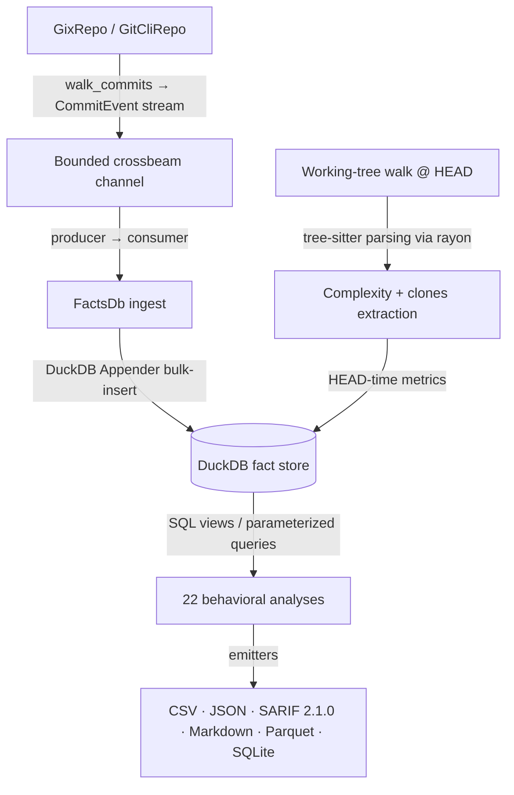

# CodeLore — Deep Codebase Analysis Report

This document presents a deep, read-only analysis of the **CodeLore** codebase. It documents the validation of recent fixes and outlines newly identified recommendations for further correctness, robustness, and performance improvements.

---

## 1. Architectural Overview & Pipeline Data Flow

CodeLore is structured as a multi-crate Rust workspace comprising three main components:
*   [codelore-rca](file:///Users/emrec/Projects/playground/codelore/crates/codelore-rca): A vendored fork of Mozilla's `rust-code-analysis` providing structural syntax hashing and complexity metrics.
*   [codelore-lib](file:///Users/emrec/Projects/playground/codelore/crates/codelore-lib): The core engine, handling repository walk abstraction, identity resolution, fact-store management, analyses execution, caching, and output emitters.
*   [codelore-cli](file:///Users/emrec/Projects/playground/codelore/crates/codelore-cli): The command-line frontend that handles arguments parsing, option consolidation, and output routing.

### Data Ingest Flow



1.  **Repository Traversal**:
    *   [GixRepo](file:///Users/emrec/Projects/playground/codelore/crates/codelore-lib/src/repo/gix_repo.rs) uses pure-Rust `gitoxide` libraries to parse refs and traverse commit graphs in parallel to DuckDB writes.
    *   [GitCliRepo](file:///Users/emrec/Projects/playground/codelore/crates/codelore-lib/src/repo/git_cli_repo.rs) shells out to the standard `git` CLI, serving as a differential testing oracle.
2.  **Event Ingestion**:
    *   `duckdb::Connection` is `!Send + !Sync`. To get parallelism, a **Producer-Consumer pattern** is utilized:
        *   The background thread walks commits using `GixRepo` and places [CommitEvent](file:///Users/emrec/Projects/playground/codelore/crates/codelore-lib/src/types.rs) instances onto a bounded `crossbeam-channel`.
        *   The main connection-owning thread consumes these events and bulk-inserts them via DuckDB's fast `Appender` API in [ingest_loop](file:///Users/emrec/Projects/playground/codelore/crates/codelore-lib/src/facts/ingest.rs).
3.  **Complexity and Clones at HEAD**:
    *   In [ingest_complexity_at_head](file:///Users/emrec/Projects/playground/codelore/crates/codelore-lib/src/facts/ingest.rs), a parallel walk scans all "live" (non-deleted) source files at HEAD. Rayon workers compile tree-sitter AST nodes, compute cyclomatic/cognitive/Halstead complexity, deduplicate entities, and serially drain results into the database.
    *   Similarly, [populate_clones_at_head](file:///Users/emrec/Projects/playground/codelore/crates/codelore-lib/src/facts/ingest.rs) extracts function fingerprints to identify structural Type-1 (exact) and Type-2 (renamed/parameterized) clones.
4.  **SQL-Driven Analyses**:
    *   22 behavioral analyses run purely as DuckDB SQL views or parameterized queries over the fact store (e.g. [hotspots.rs](file:///Users/emrec/Projects/playground/codelore/crates/codelore-lib/src/analyses/hotspots.rs), [coupling.rs](file:///Users/emrec/Projects/playground/codelore/crates/codelore-lib/src/analyses/coupling.rs)).

---

## 2. Validation Status of Prior Recommendations

All previous findings and code-maat parity issues have been validated as **fully resolved and correct** in the current codebase (released in version `v0.2.1`):

### Resolved Core Deep-Analysis Findings (F1–F11)
*   **F1 (Commit Chronology Precision)**: Resolved. Promoted `commits.date` from `DATE` to `TIMESTAMP` in schema v2.
*   **F2 (Clone-Coupling Floor Override)**: Resolved. Lowered `min_shared_revs` to the minimum of `min_shared_revs` and `min_clone_shared_revs` in inner `run_coupling` calls.
*   **F3 (Cache Poisoning on Dirty Tree)**: Resolved. Bypasses persistent cache writes when the working tree is dirty, using an in-memory db fallback instead.
*   **F4 (Stale Worktree Cache Root Path)**: Resolved. Updates `prune_stale_worktrees` to resolve namespaced paths using `default_cache_root()`.
*   **F5 (Sum of Coupling max_changeset_size pre-filter)**: Resolved. Added the `good_commits` CTE to pre-filter large commits in `soc`.
*   **F6 (Tempdir Leak on Git Failure)**: Resolved. Delayed `tmp.keep()` until after successful `git worktree add`.
*   **F7 (Cache Bypass for Parquet/SQLite)**: Resolved. Narrowed `needs_writable_db` to SQLite format only; Parquet output now successfully hits and reads from the persistent cache database.
*   **F8 (Positional Alignment in GitCliRepo Zipping)**: Resolved. Replaced index-based zipping in `git_cli_repo.rs:parse_changes_block` with an explicit `HashMap` join on destination path keys, preventing column shifting on submodule/binary mismatches.
*   **F9 (Single-Threaded Commit Traversal)**: Resolved. Configured `GixRepo::walk_commits` to parse commits and calculate diffs concurrently on a Rayon thread pool (`into_par_iter()`).
*   **F10 (Tree-Sitter File Size Cap)**: Resolved. Applied a 2 MB size cap (`DEFAULT_MAX_AST_FILE_BYTES`) across complexity and clone scanner sites to skip oversized files.
*   **F11 (Dirty Status Untracked Parity)**: Resolved. Switched `GixRepo::is_worktree_dirty` from `into_index_worktree_iter` to `into_iter()` to traverse and capture untracked files.
*   **Original Findings (Complexity LOC mapping, Quoted paths, Namespaced tmp cache, SQL case rewriter)**: Verified as fully integrated.

### Resolved Code-Maat Parity Findings (PAR-1–PAR-9)
*   All parity findings (Bird et al. per-entity risk authors logic, back-testing dates anchor, interval-month ceiling calculations, CSV header mapping, average-revs pivot points, and research foundations documentation) have been fully closed.
*   **DEEP-1 to DEEP-15 (Code-Maat Exact Parity)**: Verified. Additional sprints in `v0.2.1` closed precise output formatting mismatches (7-column verbose shape for coupling, ceiling-rounded averages, integer-truncated strengths, and hyphenated statistic names in `summary` output under `--code-maat-compat`).

---

## 3. Newly Identified Gaps & Recommendations

### F12: Correctness / Robustness — Lexicographical Tiebreaker (`c.rev DESC`) for Same-Second Commits Risk

**The Problem**:
In both `query_live_paths` (in `ingest.rs`) and the `path_lineage` CTE, commit chronology resolves using `commits.date DESC` first, and falls back to `c.rev DESC` (a lexicographical sort of SHA-1 commit hashes) as a tiebreaker for commits that occur on the same second. 
```sql
                ROW_NUMBER() OVER (
                    PARTITION BY c.path
                    ORDER BY commits.date DESC, c.rev DESC
                ) AS rn
```
However, SHA-1 lexicographical ordering is arbitrary and has no relationship to the parent-child relationships (topological order) of the commits in the git DAG. Same-second commits are highly common in repositories (due to automated script check-ins, rapid branch merges, rebases, or squashes).

**The Impact**:
If file `foo.rs` is modified in commit A and deleted in commit B at the same second (with B being the child of A):
* If commit A's SHA-1 hash is lexicographically larger than commit B's, `c.rev DESC` will sort commit A first.
* CodeLore will mistakenly identify the modification commit (A) as the latest state (rn = 1), concluding the file is still "live" when it was actually deleted.
* This triggers erroneous file missing warnings during rayon-backed complexity scans and silences history mappings.

**Recommended Fix**:
Track topological commit index during repository walking. Introduce an autoincrementing index `commit_index` on `commits` table representing the traversal sequence (which guarantees that child commits always sort after parent commits). Order by `commits.commit_index DESC` inside SQL queries to resolve chronological tiebreakers deterministically.

---

### F13: Performance / Robustness — Eager Collection of CommitEvents in Parallel Walker Destroys Memory Efficiency

**The Problem**:
In the parallelized walk implementation of [gix_repo.rs:130](file:///Users/emrec/Projects/playground/codelore/crates/codelore-lib/src/repo/gix_repo.rs#L130), `walk_commits` performs parallel mapping and collects the entire event stream eagerly:
```rust
        let events: Result<Vec<CommitEvent>> = oids
            .into_par_iter()
            .map(|oid| { ... })
            .collect();
        let events = events?;
        Ok(Box::new(events.into_iter().map(Ok)))
```
This design fully reads, diffs, and allocates every `CommitEvent` in the repository history into a single massive heap-allocated `Vec` before the iterator is ever returned or consumed.

**The Impact**:
For large repositories with long histories (e.g. 50,000+ commits and millions of file changes), this eager allocation consumes gigabytes of RAM. It completely bypasses the memory throttling of the bounded producer-consumer channel (`CHANNEL_CAPACITY = 64` in `FactsDb::ingest`), risking Out-Of-Memory (OOM) crashes in memory-constrained environments like CI runners or small containers.

**Recommended Fix**:
Maintain lazy evaluation while using parallelism. Implement chunking (e.g., pulling and diffing OIDs in parallel chunks of 1000) or use a Rayon parallel bridge thread-pipeline to concurrently push processed `CommitEvent`s into the crossbeam channel dynamically, rather than collecting them all upfront.

---

### F14: Correctness / Reliability — Catalog Error Crash on `--time-bucket` for 10 out of 14 Analyses

**The Problem**:
When the `--time-bucket <day|week|month>` command line flag is specified, the query rewriter `lineage::rewrite` globally swaps the table name `changes` with `changes_bucketed` for all queries. However, only 4 of the analyses (`coupling`, `soc`, `hotspots`, `code-health`) invoke `lineage::materialize_source(...)`, which actually builds the `changes_bucketed` table. The remaining 10 analyses (e.g., `revisions`, `ownership`, `code-age`, `churn`, `authors`, `messages`, `communication`, etc.) only call `lineage::materialize_if_needed(...)`, which does not materialize `changes_bucketed`.

**The Impact**:
Running any of these 10 analyses with `--time-bucket` causes a catastrophic application crash with a DuckDB Catalog Error:
```text
Catalog Error: Table with name changes_bucketed does not exist!
Did you mean "changes"?
```

**Recommended Fix**:
1. At the CLI argument parsing level in `args.rs` / `Options::validate()`, reject `--time-bucket` if the selected analysis does not logically support bucketing (such as `revisions`, `code-age`, or `authors`).
2. Alternatively, ensure `materialize_if_needed` is updated to delegate to `materialize_source` so that the bucketed table is always built when the flag is present.

---

### F15: Correctness / Reliability — Silent Empty Results under `--time-bucket` for Analyses Joining `commits` and `changes` on `rev`

**The Problem**:
In [ingest.rs:740](file:///Users/emrec/Projects/playground/codelore/crates/codelore-lib/src/facts/ingest.rs#L740), `changes_bucketed` is materialized by collapsing commits inside the same time bucket. Its `rev` column is set to the formatted truncated date string (e.g. `'2026-06-08 00:00:00'`). In contrast, the `commits` table is not bucketed, keeping original SHA-1 commit hashes (e.g. `'3bb7936...'`) in its `rev` column.
Any analysis query that successfully compiles (such as `code-health` or `ownership`) but performs an inner/left join on `c.rev = commits.rev` (or `USING(rev)`) will try to match a SHA-1 hash with a date string.

**The Impact**:
The join condition matches exactly zero rows. Consequently, running these analyses with `--time-bucket` executes successfully without error but silently returns an empty report (zero rows), which is misleading and mathematically corrupt.

**Recommended Fix**:
Disable/reject the `--time-bucket` flag for analyses that require joining `changes` against `commits` on `rev` (such as `code-health`, `ownership`, `communication`, etc.), as bucketing is semantically invalid for them.

---

### F16: Correctness / Parity — Code-Age and Churn Analyses Include Deleted/Dead Files

**The Problem**:
Both `code_age.rs` and `churn.rs` (specifically `entity-churn`) query files from the entire historical `changes` table without checking whether the files are currently active/live in the repository.

**The Impact**:
The resulting outputs are cluttered with years-old deleted files. For example, a file deleted two years ago will show up in the `code-age` report with an age of 24 months, which pollutes the triage dashboard with historical noise and has no practical value for refactoring or complexity planning.

**Recommended Fix**:
Restrict the queries in `code_age.rs` and `entity-churn` to only select paths that are currently "live" (using the same partition window logic implemented in `query_live_paths` to check if the latest change type is not `'deleted'`).

---

### F17: Performance — Standalone Clones Analysis Walk is Single-Threaded

**The Problem**:
While the ingest-time clones extraction (`populate_clones_at_head`) has been parallelized via Rayon, the standalone clones analysis [clones.rs:42](file:///Users/emrec/Projects/playground/codelore/crates/codelore-lib/src/analyses/clones.rs#L42) (`run_clones`) still uses a sequential, single-threaded walk over `WalkDir` and executes tree-sitter AST fingerprinting sequentially on the calling thread.

**The Impact**:
Running the standalone clones analysis (e.g. `codelore analyze -a clones`) on multi-core systems does not benefit from parallelism, making it significantly slower (up to 10x slower on modern processors) compared to the ingest phase.

**Recommended Fix**:
Refactor `run_clones` in `clones.rs` to follow the same parallel strategy as `populate_clones_at_head`: walk sequentially to gather file candidates, and then map them concurrently via Rayon `into_par_iter` to extract functions and group clones in parallel.

---

## 4. Summary of Active Findings

Below is the register of active improvement opportunities and bugs:

| ID | Category | Finding / Improvement Point | Priority / Risk | Impact | Status |
|---|---|---|---|---|---|
| **F12** | Correctness | Lexicographical Tiebreaker (`c.rev DESC`) for Same-Second Commits Risk. | **High** / Medium | Potential chronological sorting errors on same-second modifications and deletions, leading to wrong HEAD state. | **Fixed (Unreleased)** — `commits.rowid ASC` (DuckDB insertion order = gix walk order = child-before-parent) replaces SHA-1 lex. F13's chunked walker preserves insertion order. |
| **F13** | Perf / Robustness | Eager Collection of CommitEvents in Parallel Walker Destroys Memory Efficiency. | **High** / High | Gigabytes of memory allocated upfront on large repositories, risking OOM and bypassing bounded channel limits. | **Fixed (Unreleased)** — chunked rayon (1000-OID batches) streams through a 256-slot `crossbeam_channel::bounded`. Order-preserving within and across chunks so F12 tiebreak remains correct. |
| **F14** | Robustness | Catalog Error Crash on `--time-bucket` for 10 out of 14 Analyses. | **High** / Low | Catastrophic application crash due to missing `changes_bucketed` table materialization. | **Fixed (Unreleased)** — `AnalysisName::supports_time_bucket()` + CLI-boundary rejection. |
| **F15** | Correctness | Silent Empty Results under `--time-bucket` for Analyses Joining `commits` and `changes` on `rev`. | **High** / High | Zero matching rows in joins on `rev` (SHA-1 vs Date string) yields empty outputs silently (e.g., `code-health`). | **Fixed (Unreleased)** — closed by the same CLI-boundary rejection as F14. |
| **F16** | Correctness | Code-Age and Churn Analyses Include Deleted/Dead Files. | **Medium** / Low | Reports are cluttered with historical noise from deleted files. | **Fixed (Unreleased)** — `code-age` anchor-aware live-paths CTE; `entity-churn` live-at-HEAD CTE. |
| **F17** | Performance | Standalone Clones Analysis Walk is Single-Threaded. | **Medium** / Low | Execution speed bottleneck during standalone clones analysis runs. | **Fixed (Unreleased)** — two-phase split: serial `WalkDir`+globset, then `into_par_iter().map().collect()`. Mirrors `populate_clones_at_head` pattern. |

---

## 5. Proposed Verification Plan for New Findings

To implement and verify fixes for findings F12–F17, the following strategies should be employed:

### F12 (Same-Second Tiebreaker)
*   **Verification**: Create a mock repository with multiple commits made at the exact same timestamp (including a final delete commit). Verify that topological sort / index order resolves HEAD correctly and no warning is logged.

### F13 (Parallel Walker Eager Collection)
*   **Verification**: Monitor peak RSS memory usage on a large repository (e.g., 20k+ commits). Ensure that replacing the eager `collect()` with parallel chunking/bridging significantly bounds memory consumption.

### F14 & F15 (Time-Bucket Issues)
*   **Verification**: 
    1. Verify that passing `--time-bucket week -a revisions` is cleanly rejected by CLI validation with a descriptive error.
    2. Verify that running `--time-bucket week -a code-health` is similarly rejected, or that if it is run, it does not join on the mismatched `rev` keys and yields non-empty output.

### F16 (Deleted Files in Reports)
*   **Verification**: Delete a file in a commit and verify that it no longer appears in the output of `code-age` or `entity-churn` reports.

### F17 (Parallel Standalone Clones)
*   **Verification**: Time the standalone `codelore analyze -a clones` execution on a large codebase (like CodeLore itself or a larger target) and verify that it scales with multi-core CPUs.
