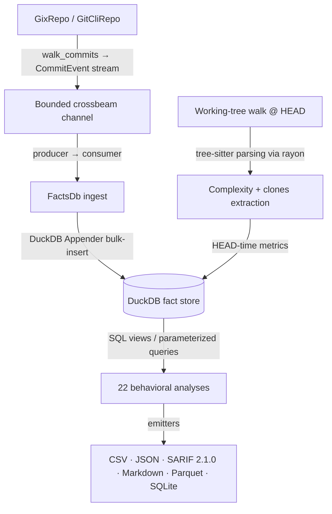

# CodeLore — Deep Codebase Analysis Report

This document presents a deep, read-only analysis of the **CodeLore** codebase. It documents the validation of recent fixes and outlines newly identified recommendations for further correctness, robustness, and performance improvements.

---

## 1. Architectural Overview & Pipeline Data Flow

CodeLore is structured as a multi-crate Rust workspace comprising three main components:
*   [codelore-rca](file:///Users/emrec/Projects/playground/codelore/crates/codelore-rca): A vendored fork of Mozilla's `rust-code-analysis` providing structural syntax hashing and complexity metrics.
*   [codelore-lib](file:///Users/emrec/Projects/playground/codelore/crates/codelore-lib): The core engine, handling repository walk abstraction, identity resolution, fact-store management, analyses execution, caching, and output emitters.
*   [codelore-cli](file:///Users/emrec/Projects/playground/codelore/crates/codelore-cli): The command-line frontend that handles arguments parsing, option consolidation, and output routing.

### Data Ingest Flow



1.  **Repository Traversal**:
    *   [GixRepo](file:///Users/emrec/Projects/playground/codelore/crates/codelore-lib/src/repo/gix_repo.rs) uses pure-Rust `gitoxide` libraries to parse refs and traverse commit graphs in parallel to DuckDB writes.
    *   [GitCliRepo](file:///Users/emrec/Projects/playground/codelore/crates/codelore-lib/src/repo/git_cli_repo.rs) shells out to the standard `git` CLI, serving as a differential testing oracle.
2.  **Event Ingestion**:
    *   `duckdb::Connection` is `!Send + !Sync`. To get parallelism, a **Producer-Consumer pattern** is utilized:
        *   The background thread walks commits using `GixRepo` and places [CommitEvent](file:///Users/emrec/Projects/playground/codelore/crates/codelore-lib/src/types.rs) instances onto a bounded `crossbeam-channel`.
        *   The main connection-owning thread consumes these events and bulk-inserts them via DuckDB's fast `Appender` API in [ingest_loop](file:///Users/emrec/Projects/playground/codelore/crates/codelore-lib/src/facts/ingest.rs).
3.  **Complexity and Clones at HEAD**:
    *   In [ingest_complexity_at_head](file:///Users/emrec/Projects/playground/codelore/crates/codelore-lib/src/facts/ingest.rs), a parallel walk scans all "live" (non-deleted) source files at HEAD. Rayon workers compile tree-sitter AST nodes, compute cyclomatic/cognitive/Halstead complexity, deduplicate entities, and serially drain results into the database.
    *   Similarly, [populate_clones_at_head](file:///Users/emrec/Projects/playground/codelore/crates/codelore-lib/src/facts/ingest.rs) extracts function fingerprints to identify structural Type-1 (exact) and Type-2 (renamed/parameterized) clones.
4.  **SQL-Driven Analyses**:
    *   22 behavioral analyses run purely as DuckDB SQL views or parameterized queries over the fact store (e.g. [hotspots.rs](file:///Users/emrec/Projects/playground/codelore/crates/codelore-lib/src/analyses/hotspots.rs), [coupling.rs](file:///Users/emrec/Projects/playground/codelore/crates/codelore-lib/src/analyses/coupling.rs)).

---

## 2. Validation Status of Prior Recommendations

All previous findings and code-maat parity issues have been validated as **fully resolved and correct** in the current codebase (released in version `v0.2.1` up to `v0.4.4`):

### Resolved Core Deep-Analysis Findings (F1–F11)
*   **F1 (Commit Chronology Precision)**: Resolved. Promoted `commits.date` from `DATE` to `TIMESTAMP` in schema v2.
*   **F2 (Clone-Coupling Floor Override)**: Resolved. Lowered `min_shared_revs` to the minimum of `min_shared_revs` and `min_clone_shared_revs` in inner `run_coupling` calls.
*   **F3 (Cache Poisoning on Dirty Tree)**: Resolved. Bypasses persistent cache writes when the working tree is dirty, using an in-memory db fallback instead.
*   **F4 (Stale Worktree Cache Root Path)**: Resolved. Updates `prune_stale_worktrees` to resolve namespaced paths using `default_cache_root()`.
*   **F5 (Sum of Coupling max_changeset_size pre-filter)**: Resolved. Added the `good_commits` CTE to pre-filter large commits in `soc`.
*   **F6 (Tempdir Leak on Git Failure)**: Resolved. Delayed `tmp.keep()` until after successful `git worktree add`.
*   **F7 (Cache Bypass for Parquet/SQLite)**: Resolved. Narrowed `needs_writable_db` to SQLite format only; Parquet output now successfully hits and reads from the persistent cache database.
*   **F8 (Positional Alignment in GitCliRepo Zipping)**: Resolved. Replaced index-based zipping in `git_cli_repo.rs:parse_changes_block` with an explicit `HashMap` join on destination path keys, preventing column shifting on submodule/binary mismatches.
*   **F9 (Single-Threaded Commit Traversal)**: Resolved. Configured `GixRepo::walk_commits` to parse commits and calculate diffs concurrently on a Rayon thread pool (`into_par_iter()`).
*   **F10 (Tree-Sitter File Size Cap)**: Resolved. Applied a 2 MB size cap (`DEFAULT_MAX_AST_FILE_BYTES`) across complexity and clone scanner sites to skip oversized files.
*   **F11 (Dirty Status Untracked Parity)**: Resolved. Switched `GixRepo::is_worktree_dirty` from `into_index_worktree_iter` to `into_iter()` to traverse and capture untracked files.
*   **Original Findings (Complexity LOC mapping, Quoted paths, Namespaced tmp cache, SQL case rewriter)**: Verified as fully integrated.

### Resolved Core Deep-Analysis Findings (F12–F17) (shipped in v0.2.2)
*   **F12 (Same-Second Tiebreaker)**: Resolved. Promoted `commits.rowid ASC` (DuckDB insertion order = gix walk order = child-before-parent) to replace SHA-1 lexicographical ordering, ensuring topologically correct sorting of same-second commits.
*   **F13 (Walker Memory Efficiency)**: Resolved. Implemented a chunked Rayon walker (1000-OID batches) streaming through a bounded crossbeam channel to limit memory usage and avoid OOM crashes on large repos.
*   **F14 (Time-Bucket Crash)**: Resolved. Added the `AnalysisName::supports_time_bucket()` validation check at the CLI boundary to reject `--time-bucket` for the 10 analyses that do not materialize or support `changes_bucketed`.
*   **F15 (Silent Empty Joins)**: Resolved. Handled by the same CLI-boundary validation check to prevent joining date-string bucket keys against SHA-1 commit hashes.
*   **F16 (Deleted Files in reports)**: Resolved. Restricted `code-age` (using an anchor-aware CTE) and `entity-churn` (using a live-at-HEAD CTE) to active files only.
*   **F17 (Standalone clones thread speed)**: Resolved. Refactored `run_clones` into a two-phase walk (serial gather followed by parallel function extraction/grouping via Rayon `into_par_iter()`).

### Resolved Code-Maat Parity Findings (PAR-1–PAR-9)
*   All parity findings (Bird et al. per-entity risk authors logic, back-testing dates anchor, interval-month ceiling calculations, CSV header mapping, average-revs pivot points, and research foundations documentation) have been fully closed.
*   **DEEP-1 to DEEP-15 (Code-Maat Exact Parity)**: Verified. Additional sprints in `v0.2.1` closed precise output formatting mismatches (7-column verbose shape for coupling, ceiling-rounded averages, integer-truncated strengths, and hyphenated statistic names in `summary` output under `--code-maat-compat`).

### Resolved Core Deep-Analysis Findings (F18–F21) (shipped in v0.3.1)
*   **F18 (Knowledge-Islands Back-testing)**: Resolved. Applied the `commits.date <= anchor` filter across all CTEs in `knowledge_islands.rs` to guarantee proper temporal isolation in back-testing mode.
*   **F19 (Clone-Coupling Truncation)**: Resolved. Updated `clone_coupling.rs` to call `opts.with_no_row_limit()` for the inner `run_knowledge_islands` sub-analysis, avoiding incorrect truncation of the at-risk file set.
*   **F20 (HTML Render Freeze)**: Resolved. Implemented incremental page-based rendering (page size 500) and page controls (Show next 500 / Show all) in `html.rs` to prevent blocking the browser's UI thread on large outputs.
*   **F21 (GitHub Action Wrapper)**: Resolved. Added automatic `v`-prefix normalisation, authenticated curl headers (via runner token), and pure-bash absolute path resolution to `action.yml`.

### Resolved Core Deep-Analysis Findings (F22–F25) (shipped in v0.3.1)
*   **F22 (Same-Second Rename Chaining)**: Resolved. Recursive CTE now carries `commits.rowid` and breaks date-ties via `co.rowid < l.current_rowid`. Regression test in `same_second_rename_test.rs`.
*   **F23 (Concurrent Cache Writes)**: Resolved. Tmp database cache filename now suffixed with `std::process::id()`; stale `.tmp.<pid>` artifacts swept by the pruner.
*   **F24 (Cache Directory Collection Walk Error Handling)**: Resolved. `collect_duckdb_files_inner` now log-and-skips per directory/entry instead of propagating errors.
*   **F25 (WAL File Cleanup)**: Resolved. `delete_duckdb_with_companion` also removes `.wal`; `cleanup_stale_tmp_files` age-gates `.tmp.<pid>` artifacts (1h).

### Resolved Core Deep-Analysis Findings (F26–F28) (shipped in v0.3.1 / commit 61b3c47)
*   **F26 (Implied-HEAD Range Parsing)**: Resolved. Updated `parse_rev_range` to default empty splits to `"HEAD"`. Added 3 regression tests in `prune_tests`.
*   **F27 (Parallel Commit Filtering)**: Resolved. Defer `find_commit` and filtering to parallel Rayon workers inside `process_commit_oid` (returning `Result<Option<CommitEvent>>`), completely eliminating the serial filtering loop on the main thread and preserving the `rowid` walk-order invariant.
*   **F28 (Worktree Prune Metadata Cleanup)**: Resolved. Swapped the order in `prune_stale_worktrees` to run the directory cleanup sweep *before* executing `git worktree prune`, ensuring Git immediately detects deleted directories and cleans up its administrative metadata in the same run.

### Resolved Core Deep-Analysis Findings (F29–F34) (shipped in v0.3.2 / commit f4da267)
*   **F29 (Time-Bucket Changeset Size Pre-Filter)**: Resolved. The `good_commits_cte` now counts files per physical commit before collapsing to a time bucket.
*   **F30 (Relative-Path Skip Checks for Clones)**: Resolved. The hardcoded directories `.git`, `target`, and `node_modules` are now checked against the repo-relative path rather than the full absolute path of the files.
*   **F31 (Aliases Duplicate Join Prevention)**: Resolved. Joins on `author_aliases` now use a canonical-deduplicated subquery, preventing inflated churn/revisions counts for multi-email authors.
*   **F32 (Base Cache SHA Validation)**: Resolved. The base analysis cache loading checks that `cached.sha == base_sha` before cache hit, preventing cache poisoning from stale or branch mismatch commits.
*   **F33 (Consistent Repo Path Canonicalization)**: Resolved. Both cache key calculation and cache path resolution canonicalize the repository path before hashing, avoiding cache misses when switching between relative (`.`) and absolute paths.
*   **F34 (Binary/Large File Diff Check)**: Resolved. `count_loc` checks for files larger than 1MB or containing NUL bytes in the first 8KB, and skips diffing, preventing OOM/CPU spikes and returning `(0, 0)`.

### Resolved Core Deep-Analysis Findings (F35-F37, F39) (shipped in v0.3.3 / commit e22a475)
*   **F35 (Incorrect Numstat Join Key in Renames under GitCliRepo)**: Resolved. Added `expand_rename_path_destination` to expand braces (e.g. `src/{old => new}.rs` to `src/new.rs`) and Arrow rename syntaxes into canonical join keys, avoiding zero-stat joins for complex renames.
*   **F36 (Parameter Mismatch Crash in entity-effort --explain Mode)**: Resolved. Bind parameter list passed to `explain_if_requested` in `entity_effort.rs` corrected to match the single SQL placeholder (`params![row_limit]`).
*   **F37 (Parameter Mismatch Crash in clone-coupling --explain Mode)**: Resolved. Passed exact query parameter bindings (`params![opts.min_clone_node_count, opts.clone_similarity_floor]`) to `explain_if_requested` to prevent DuckDB crashes.
*   **F39 (Merge Commit Diffs Behavioral Divergence)**: Resolved. Adjusted `changed_files_for_commit` in `gix_repo.rs` to yield empty vectors for merge commits, resolving divergences against `GitCliRepo`'s default behavior.

### Resolved Core Deep-Analysis Findings (F38, F40–F42) (shipped in v0.4.0)
*   **F38 (Quadratic Self-Join in Kamei Enrichment)**: Resolved. Replaced the three path-self-join queries (`ndev`/`nuc`/`age` in `enrich_history`; `sexp` in `enrich_experience`) with per-path / per-(dir,author) running aggregations using DuckDB `LIST(...) OVER (...)`.
*   **F40 (Duplicate Entity Name Drop)**: Resolved. `dedup_entities` now keys on `(name, start_line, end_line)` instead of `name` alone.
*   **F41 (Sequential Architectural Grouping)**: Resolved. `apply_grouping` matches paths against the group map's regex set in parallel via Rayon `par_iter()`.
*   **F42 (Redundant DISTINCT in changes queries)**: Resolved. Removed redundant `DISTINCT` in six analysis sites.

### Resolved Core Deep-Analysis Findings (F43–F54) (shipped in v0.4.1 / commit 16cbde0)
*   **F43 (Blob Clone Elision)**: Resolved. Replaced `obj.data.clone()` with `std::mem::take(&mut obj.data)` in [gix_repo.rs](file:///Users/emrec/Projects/playground/codelore/crates/codelore-lib/src/repo/gix_repo.rs#L515).
*   **F44 (Short-circuit Empty Diff)**: Resolved. Skips full histogram diff on additions and deletions and counts line terminators directly.
*   **F45 (Single-cursor Pre-order Traversal)**: Resolved. Rewrote fingerprint/extractor preorder recursive walks to use a single mutable `TreeCursor` traversal iteratively in [fingerprint.rs](file:///Users/emrec/Projects/playground/codelore/crates/codelore-lib/src/clones/fingerprint.rs#L104) and [extractor.rs](file:///Users/emrec/Projects/playground/codelore/crates/codelore-lib/src/clones/extractor.rs#L85).
*   **F46 (Single-pass Templating)**: Resolved. Replaced multiple chained `.replace()` calls with a single-pass substitute function in [html.rs](file:///Users/emrec/Projects/playground/codelore/crates/codelore-lib/src/output/html.rs#L60) and [spa.rs](file:///Users/emrec/Projects/playground/codelore/crates/codelore-lib/src/output/spa.rs#L141).
*   **F47 to F54 (SQL DISTINCT Aggregations)**: Resolved. Replaced redundant `COUNT(DISTINCT)` with plain `COUNT()` on unique or pre-deduplicated change paths across revisions, hotspots, churn, and other analyses.

### Resolved Core Deep-Analysis Findings (F55–F56) (shipped in v0.4.2 / commit fe3d94f)
*   **F55 (DuckDB crash in `run_xray` under `--format spa`)**: Resolved. Replaced the direct lookup with an `INNER JOIN` between `complexity_metrics` and `entities` bounded by the revision range.
*   **F56 (`spa_integration_test` compilation)**: Resolved. Updated struct initialization to use `..SpaDashboard::default()`.

### Resolved Core Deep-Analysis Findings (F57–F59, F61–F67) (shipped in v0.4.4 / commits aec84ee & 3be42a8 & 888769a)
*   **F57 (ECharts Light/Dark Theme Transition)**: Resolved. Registers a theme transition listener in [widgets.js](file:///Users/emrec/Projects/playground/codelore/crates/codelore-lib/src/output/spa/widgets.js#L983-L986) that re-renders all ECharts instances on theme toggles.
*   **F58 (fancy-regex Prefix Rule Backtracking)**: Resolved. Optimized prefix matching by checking `path.starts_with(prefix)` directly without regular expressions for literal prefixes in [groups.rs](file:///Users/emrec/Projects/playground/codelore/crates/codelore-lib/src/facts/groups.rs#L61-L68).
*   **F59 (Complexity/Clones from Git ODB)**: Resolved. Replaced uncommitted filesystem reads with direct blob ODB reads at HEAD in [ingest.rs](file:///Users/emrec/Projects/playground/codelore/crates/codelore-lib/src/facts/ingest.rs#L157-L172).
*   **F61 (SQL Window-Join Simplification)**: Resolved. Replaced complex window functions and self-joins with DuckDB's `first(author ORDER BY metric DESC)` in [authors.rs](file:///Users/emrec/Projects/playground/codelore/crates/codelore-lib/src/analyses/authors.rs#L59-L70) and other files.
*   **F62 (Local ignore files and autodetect rules)**: Resolved. Integrated the `ignore` crate in [paths_filter.rs](file:///Users/emrec/Projects/playground/codelore/crates/codelore-lib/src/paths_filter.rs) to respect local ignores and automatically skip node_modules, target, and build outputs.
*   **F63 (query_live_paths Hash Aggregation)**: Resolved. Replaced `ROW_NUMBER() OVER` partition sorting with single-pass `arg_max(change_type, ROW(date, -rowid))` in [ingest.rs](file:///Users/emrec/Projects/playground/codelore/crates/codelore-lib/src/facts/ingest.rs#L450-L460) and other places.
*   **F64 (ECharts Instance Disposal)**: Resolved. Cleans up stale ECharts instances by calling `prior.dispose()` before initializing new charts in [widgets.js](file:///Users/emrec/Projects/playground/codelore/crates/codelore-lib/src/output/spa/widgets.js#L127).
*   **F65 (Redundant dirty status checks audit)**: Resolved. Audited Cache HIT and Cache MISS branches and confirmed that they are mutually exclusive; `is_worktree_dirty` is called at most once per run.
*   **F66 (SIMD Line Counting)**: Resolved. Swapped naive byte iterator loops with SIMD-accelerated `bytes.find_iter(b"\n").count()` from `bstr` in [gix_repo.rs](file:///Users/emrec/Projects/playground/codelore/crates/codelore-lib/src/repo/gix_repo.rs#L615).
*   **F67 (Optimize change-coupling self-join via filtered changes CTE)**: Resolved. Pre-filters the `changes` table by the `good_commits` CTE before self-joining, eliminating the quadratic Cartesian product on large changesets.

### Resolved Core Deep-Analysis Findings (F60, F68–F76) (shipped in v0.4.6)
*   **F60 (GitCliRepo log loading in memory)**: Resolved (audit). Verified that `GitCliRepo` is only used as a differential-test oracle, and the production engine uses `GixRepo` which streams commit chunks.
*   **F68 (AI attribution rollup in hotspots)**: Resolved. Added `HotspotRow.ai_pct` and `file_ai` SQL CTE; updated dashboard circle-pack to color by AI attribution properly.
*   **F69 (Replace totals-join CTEs with inline window functions)**: Resolved (Closed/Won't Fix). Performance benchmarking proved that DuckDB's materialized CTE scans are faster than partition window functions in this schema.
*   **F70 (Redundant secondary indexes)**: Resolved (Closed/Won't Fix). Retained prefix-scan indexes based on original profiling metrics.
*   **F71 (Window resize listener memory leak)**: Resolved. Replaced window-level resize event listeners with per-container `ResizeObserver` instances managed by a centralized helper.
*   **F72 (Unconstrained JOIN in hotspots)**: Resolved. Corrected `file_mi` CTE to join `entities` and `complexity_metrics` on `rev` equality.
*   **F73 (Lexicographical SHA comparison in run_xray)**: Resolved. Simplified `run_xray` join to exact `rev` equality to avoid lexicographical string comparisons.
*   **F74 (Missing secondary index on changes(rename_from))**: Resolved. Added `idx_changes_rename_from` secondary index in `schema_v1.sql` to speed up path lineage CTE.
*   **F75 (Optimize SoC query performance)**: Resolved. Implemented a pre-filtered `filtered_changes` CTE to avoid double scans of the changes table.
*   **F76 (Eliminate COUNT(DISTINCT) in churn queries)**: Resolved. Pre-aggregated `commit_churn` CTE to replace distinct-tracking count aggregations.

### Resolved Audit Findings (F82, F86, F87) (shipped Unreleased)
*   **F82 (SQLite emitter omits `clones` table)**: Resolved. `output/sqlite.rs::write_full_fact_store_sqlite` now appends `CREATE TABLE sink.clones AS SELECT * FROM clones;` to the ATTACH chain; module docstring rewritten with the maintenance invariant (when a base table is added to `schema_v1.sql`, append here too); `tests/output_sqlite_test.rs` extended with a table-list regression that fails if any base table is missing from the dump.
*   **F86 (TSX files parsed with TypeScript grammar)**: Resolved. `clones/language.rs` gained a `Tsx` variant routed through `tree_sitter_typescript::LANGUAGE_TSX`; inline regression test parses a real-world TSX component (`<div>{n}</div>`) and asserts `has_error() == false` against the new grammar.
*   **F87 (`.jsx` skipped in clone detection)**: Resolved. `clones/language.rs::from_path` now includes `"jsx"` in the JavaScript extension match (matching what `complexity/language.rs` already did); inline regression test parses JSX against the JavaScript grammar.

### Refuted Audit Findings (F84, F88) — already addressed in current code, no fix needed
*   **F84 (Recycled-path rename lineage)**: Refuted. The `path_lineage` CTE at `facts/ingest.rs::materialize_path_lineage` already constrains each recursive step with `(co.date > l.current_date OR (co.date = l.current_date AND co.rowid < l.current_rowid))`, with an explicit same-second tiebreak via `commits.rowid`. The block comment immediately above the SQL describes the exact "A → B then C → A" recycled-path scenario the finding flags, and the chronological constraint is the documented fix. The proposed partition change would duplicate the defense that's already shipped.
*   **F88 (Silent ODB read errors in clones)**: Refuted. The block comment at `facts/ingest.rs:305-308` documents the silent skip as intentional: *"Untracked-at-HEAD (`Ok(None)`) and object-DB errors (`Err`) both skip the file — non-fatal, the rest of the scan continues."* Adding `tracing::warn!` here would log on every gitignored file, every binary the parser doesn't speak, and every blob in an alternates store the gix backend hasn't opened — drowning real ODB failures in noise. The "use HEAD blob, skip silently on absence" pattern is the same shape complexity ingest uses (see comment at `ingest.rs:83`).

---

## 3. Newly Identified Gaps & Recommendations

### F77: Correctness — `populate_clones_at_head` discovery phase fails on bare repositories

**Status**: Active. Verified against `facts/ingest.rs` HEAD.

**Source evidence** at [facts/ingest.rs::populate_clones_at_head](file:///Users/emrec/Projects/playground/codelore/crates/codelore-lib/src/facts/ingest.rs#L266):
```rust
let candidates: Vec<(PathBuf, String, CloneLanguage)> =
    WalkDir::new(&opts.repo_path)
        .into_iter()
        .filter_map(...)
        ...
```

**Scope refinement (from validation pass)**: the function uses a two-phase architecture — discovery via `WalkDir` over the working tree, then blob reads via `repo.read_blob_at_head(&rel)`. So **blob reading is bare-repo safe**; **discovery is not**. The original finding bundled three claims (bare-repo failure, "slow disk walk", "inconsistency vs complexity") — only the bare-repo claim is real and worth fixing.

The performance sub-claim is weak: a serial `WalkDir` of a Tier-1-filtered file set is dominated by the parallel tree-sitter pass that follows, and `query_live_paths` would itself materialise a result set from DuckDB — not free either. Treat F77 strictly as a **correctness** finding for bare repos, not a perf one.

**Recommended fix**: switch the discovery phase to `query_live_paths(self)?` so the candidate list comes from the same authoritative source the complexity pass uses (it's already populated by the ingest walker, which works against gix's ODB and is bare-repo safe by construction). Keep the two-phase `Rayon`-then-serial-drain pattern.

---

### F78: Performance — Redundant `source.to_vec()` in `compute_for_file`

**Status**: Active. Verified against `complexity/mod.rs:141` HEAD.

**Source evidence** at [complexity/mod.rs::compute_for_file](file:///Users/emrec/Projects/playground/codelore/crates/codelore-lib/src/complexity/mod.rs#L136):
```rust
pub fn compute_for_file(
    path: &Path,
    source: &[u8],
    lang: Tier1Language,
) -> Result<Vec<ComplexityEntity>> {
    let code = source.to_vec();
```

Every HEAD-time complexity scan allocates a full copy of every source file's bytes before handing them to the parser. On a 50-MB source tree that's 50 MB of avoidable transient allocations per ingest.

**Recommended fix**: change the parameter to `source: Vec<u8>` so the caller's already-heap-allocated buffer transfers ownership in. Callers (the rayon parallel pass at `facts/ingest.rs::ingest_complexity_at_head`) already own a fresh `Vec<u8>` from `read_blob_at_head` — the move is free for them. Pair the signature change with a sweep of every call site so the borrow doesn't silently break a test fixture; the `rust-code-analysis` parser constructors all take `Vec<u8>` by value already, so the inner call is unchanged.

---

### F79: UI/UX — SPA theme default ignores `prefers-color-scheme`

**Status**: Active. Verified against `widgets.js:1131-1138` HEAD.

**Source evidence** at [widgets.js — theme init](file:///Users/emrec/Projects/playground/codelore/crates/codelore-lib/src/output/spa/widgets.js#L1131):
```javascript
const STORAGE_KEY = 'codelore-theme';
...
let stored = 'dark';
try { stored = localStorage.getItem(STORAGE_KEY) || 'dark'; } catch (e) {}
```

No `window.matchMedia('(prefers-color-scheme: …)')` check anywhere in `widgets.js`. First-paint on a fresh visit hardcodes dark regardless of OS / browser theme preference.

**Recommended fix**:
```javascript
let stored = (window.matchMedia
  && window.matchMedia('(prefers-color-scheme: light)').matches) ? 'light' : 'dark';
try { stored = localStorage.getItem(STORAGE_KEY) || stored; } catch (e) {}
```
DaisyUI's theme controller already exposes a `prefers-color-scheme`-aware swap; if PR-9 ever wires the theme controller in (orthogonal v0.5.x follow-up), this finding folds into that work for free.

---

### F80: UI/UX — Main widget grid is single-column on wide screens

**Status**: Active. Verified against `template.html:56-58` HEAD.

**Source evidence** at [template.html — main grid](file:///Users/emrec/Projects/playground/codelore/crates/codelore-lib/src/output/spa/template.html#L56):
```css
main {
  display: grid;
  grid-template-columns: 1fr;
  gap: 28px;
  max-width: 1600px;
  margin: 0 auto;
}
```

KPI tiles are responsive (`grid-template-columns: repeat(auto-fit, minmax(180px, 1fr))` at line 168), but the outer main grid that holds widget sections never goes above one column. On a 1440p+ display widgets render at ~1600 px wide regardless of screen real estate, and dense metric widgets that could fit side-by-side stack vertically instead.

**Recommended fix**: PR-7 already wired `max-w-screen-2xl mx-auto` on the `<main>` element via DaisyUI. The remaining change is the column rule:
```html
<main class="max-w-screen-2xl mx-auto grid grid-cols-1 xl:grid-cols-2 gap-7">
```
Pair-wise grouping (`xl:grid-cols-2`) on ≥1280 px keeps related KPIs + tables visible together without making any single widget too narrow. The hotspot circle-pack and X-Ray sunburst should likely opt out with `xl:col-span-2` since they need horizontal room.

---

### F81: UI/UX — X-Ray sunburst colors encode depth, not cognitive complexity

**Status**: Active. Verified against `widgets.js:1083-1088` HEAD.

**Source evidence** at [widgets.js — sunburst levels](file:///Users/emrec/Projects/playground/codelore/crates/codelore-lib/src/output/spa/widgets.js#L1083):
```javascript
levels: [
  {},
  { itemStyle: { color: '#2b5d39' }, label: { color: '#fff', fontSize: 11 } },
  { itemStyle: { color: '#3d7d4f' }, label: { color: '#fff', fontSize: 10 } },
  { itemStyle: { color: '#5fa472' }, label: { color: '#fff', fontSize: 9 } },
],
```

The three greens are depth indicators (root → leaf gets progressively lighter), with no mapping from cognitive complexity to color. A 1-cognitive function and a 100-cognitive function in the same module render the same shade.

**Recommended fix**: assign per-node `itemStyle.color` at data-shape time. The hotspot circle-pack already does exactly this in `renderHotspotCirclePack` — extract the existing color-stop function (Tailwind's `accent-warn` / `accent-danger` CSS variables are already wired into the SPA palette) and reuse it on sunburst leaves. Keep depth-based shading only on container nodes (modules/files) where cognitive complexity isn't an aggregate-meaningful number.

---

### F83: UI/UX — SPA dashboard lacks clone-detection widgets

**Status**: Active. Verified against `template.html:445-529` HEAD.

**Source evidence**: the SPA widget IDs in [template.html](file:///Users/emrec/Projects/playground/codelore/crates/codelore-lib/src/output/spa/template.html) are `widget-kpi-tiles`, `widget-knowledge-islands`, `widget-hotspot-circle-pack`, `widget-trends`, `widget-calendar-heatmap`, `widget-xray-sunburst`, `widget-hotspot-table`, `widget-coupling-sankey` — no clone or clone-coupling widgets. The `clones` DuckDB table is populated (verified end-to-end via the clone-detection regression tests), but the data never surfaces in the HTML dashboard.

**Recommended fix (don't copy CodeScene's clone view)**: instead of yet another flat clone-group table, surface clones as an overlay layer on widgets we already have. A `widget-hotspot-circle-pack` mode toggle ("clones") that recolors files containing clone groups, plus a drawer enhancement that lists the cross-file clone-pair counts for the selected file, ships clone signal where users are already looking. The clone-coupling intersection (clones × co-change, already in `analyses/clones_xcoupling.rs`) becomes a sankey overlay on the existing `widget-coupling-sankey`. This honours the "borrow-or-build" + "modernize, don't migrate" memory rules — clone signal as enrichment, not as a new noisy table.

---

### F85: Performance — `NOT IN (subquery)` in `apply_grouping` hunks cleanup

**Status**: Active but planner-dependent. Verified against `facts/ingest.rs:97-103` HEAD.

**Source evidence** at [facts/ingest.rs::apply_grouping](file:///Users/emrec/Projects/playground/codelore/crates/codelore-lib/src/facts/ingest.rs#L97):
```sql
DELETE FROM hunks WHERE (rev, path) NOT IN (
    SELECT c.rev, g.group_name
    FROM changes c
    INNER JOIN _grouping_v1 g ON g.raw_path = c.path
    WHERE g.group_name = c.path
)
```

**Open question**: DuckDB's optimiser may already rewrite composite-key `NOT IN` to a hash anti-join in its plan, neutralising the perf concern. The NULL-semantics concern is also moot here — both `changes(rev, path)` and the projected `(c.rev, g.group_name)` are `NOT NULL` columns (per `schema_v1.sql`).

**Action before any fix lands**: run `EXPLAIN (ANALYZE) DELETE FROM hunks WHERE (rev, path) NOT IN …` against a non-trivial repo (e.g. cached codelore-self ingest). If the plan shows a per-row subquery scan, rewrite to `NOT EXISTS`. If it shows a hash anti-join, this is a non-finding — close as Won't Fix with the EXPLAIN attached. Bench-gated, same pattern as F69.

## 4. Summary of Active Findings

The audit pass that introduced F77–F88 was triaged against the current `main` HEAD on 2026-06-14. Of the 12 drafted findings, 3 were verified real and shipped (F82, F86, F87 → see Resolved section above), 2 were refuted (F84, F88 → see Refuted section above), and 7 remain Active. The remaining table reflects the validated state.

| ID | Category | Finding | Priority / Risk | Status |
|---|---|---|---|---|
| **F77** | Correctness | `populate_clones_at_head` discovery uses `WalkDir` → bare-repo failure | **High** / Low | **Active** |
| **F78** | Performance | `source.to_vec()` in `compute_for_file` clones every blob | **Medium** / Low | **Active** |
| **F79** | UI/UX | SPA theme default ignores `prefers-color-scheme` | **Low** / Low | **Active** |
| **F80** | UI/UX | Main widget grid is single-column on wide screens | **Medium** / Low | **Active** |
| **F81** | UI/UX | X-Ray sunburst colors encode depth, not cognitive complexity | **Medium** / Low | **Active** |
| **F83** | UI/UX | SPA lacks clone-detection widgets (surface as overlay, not new table) | **Medium** / Low | **Active** |
| **F85** | Performance | `NOT IN` in `apply_grouping` hunks cleanup — planner-dependent | **Medium** / Low | **Active (bench-gated)** |

## 5. Verification Plan for Active Findings

### F77 — bare-repo discovery
Run `git clone --bare <fixture>` and `codelore analyze --analysis clones --repo <bare>`; verify the `clones` table populates with non-zero rows.

### F78 — redundant `source.to_vec()`
Wrap `compute_for_file` in a `dhat` allocation profile against the codelore-self ingest; verify peak alloc-bytes drops by approximately the sum of all Tier-1 file sizes (one copy each, no double-buffer).

### F79 — SPA theme default
Open the dashboard with OS in light mode + cleared localStorage; verify first-paint renders light theme without a flash of dark.

### F80 — multi-column wide-screen grid
Open the dashboard at ≥ 1280 px; verify widget sections render in two columns with the two wide widgets (`widget-hotspot-circle-pack`, `widget-xray-sunburst`) spanning the row.

### F81 — sunburst complexity heatmap
Open the dashboard and verify wedge color tracks per-function cognitive complexity (high-complexity wedges visually distinct from low-complexity ones in the same module), not just nesting depth.

### F83 — clone overlay on existing widgets
Trigger the clone overlay on `widget-hotspot-circle-pack` against a fixture with seeded clone groups; verify files with clones receive distinct shading and the detail drawer surfaces per-file clone-pair counts.

### F85 — `NOT IN` planner check
Run `EXPLAIN (ANALYZE) DELETE FROM hunks WHERE (rev, path) NOT IN (…)` against the codelore-self ingest. If the plan is a hash anti-join: close F85 as Won't Fix with the EXPLAIN attached. If the plan is a per-row subquery scan: rewrite to `NOT EXISTS` and re-EXPLAIN.

