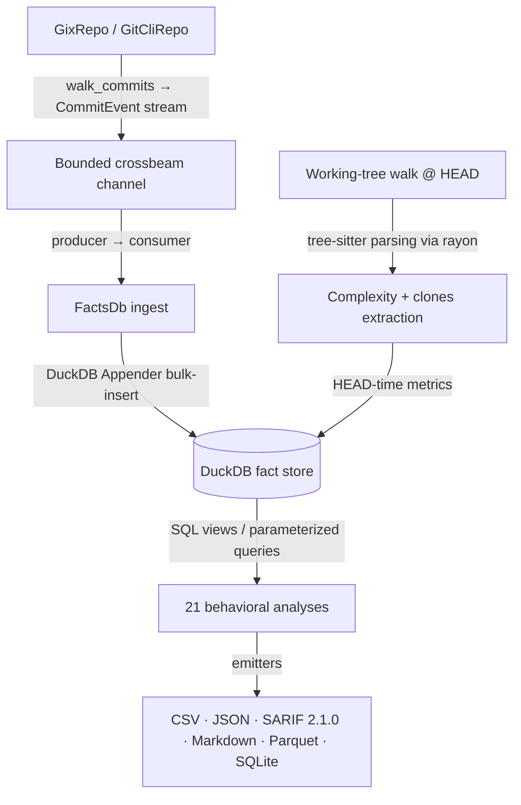

# CodeLore — Deep Codebase Analysis Report

This document presents a deep, read-only analysis of the **CodeLore** codebase. It highlights core architectural patterns, documents the validation status of recent fixes, and outlines remaining and newly identified recommendations for further improvement.

---

## 1. Architectural Overview & Pipeline Data Flow

CodeLore is structured as a multi-crate Rust workspace comprising three main components:
*   [codelore-rca](file:///Users/emrec/Projects/playground/codescene/crates/codelore-rca): A vendored fork of Mozilla's `rust-code-analysis` providing structural syntax hashing and complexity metrics.
*   [codelore-lib](file:///Users/emrec/Projects/playground/codescene/crates/codelore-lib): The core engine, handling repository walk abstraction, identity resolution, fact-store management, analyses execution, caching, and output emitters.
*   [codelore-cli](file:///Users/emrec/Projects/playground/codescene/crates/codelore-cli): The command-line frontend that handles arguments parsing, option consolidation, and output routing.

### Data Ingest Flow



1.  **Repository Traversal**:
    *   [GixRepo](file:///Users/emrec/Projects/playground/codescene/crates/codelore-lib/src/repo/gix_repo.rs) uses pure-Rust `gitoxide` libraries to parse refs and traverse commit graphs in parallel to DuckDB writes.
    *   [GitCliRepo](file:///Users/emrec/Projects/playground/codescene/crates/codelore-lib/src/repo/git_cli_repo.rs) shells out to the standard `git` CLI, serving as a differential testing oracle.
2.  **Event Ingestion**:
    *   `duckdb::Connection` is `!Send + !Sync`. To get parallelism, a **Producer-Consumer pattern** is utilized:
        *   The background thread walks commits using `GixRepo` and places [CommitEvent](file:///Users/emrec/Projects/playground/codescene/crates/codelore-lib/src/types.rs#L44-L57) instances onto a bounded `crossbeam-channel`.
        *   The main connection-owning thread consumes these events and bulk-inserts them via DuckDB's fast `Appender` API in [ingest_loop](file:///Users/emrec/Projects/playground/codescene/crates/codelore-lib/src/facts/ingest.rs#L402-L460).
3.  **Complexity and Clones at HEAD**:
    *   In [ingest_complexity_at_head](file:///Users/emrec/Projects/playground/codescene/crates/codelore-lib/src/facts/ingest.rs#L87-L162), a parallel walk scans all "live" (non-deleted) source files at HEAD. Rayon workers compile tree-sitter AST nodes, compute cyclomatic/cognitive/Halstead complexity, deduplicate entities, and serially drain results into the database.
    *   Similarly, [populate_clones_at_head](file:///Users/emrec/Projects/playground/codescene/crates/codelore-lib/src/facts/ingest.rs#L164-L262) extracts function fingerprints to identify structural Type-1 (exact) and Type-2 (renamed/parameterized) clones.
4.  **SQL-Driven Analyses**:
    *   21 behavioral analyses run purely as DuckDB SQL views or parameterized queries over the fact store (e.g. [hotspots.rs](file:///Users/emrec/Projects/playground/codescene/crates/codelore-lib/src/analyses/hotspots.rs), [coupling.rs](file:///Users/emrec/Projects/playground/codescene/crates/codelore-lib/src/analyses/coupling.rs)).

---

## 2. Newly Identified Critical Gaps & Recommendations

### 🚨 Correctness Bug: Premature SQL `LIMIT` in `coupling` Analysis

**The Problem**:
In [coupling.rs](file:///Users/emrec/Projects/playground/codescene/crates/codelore-lib/src/analyses/coupling.rs#L168-L211), the `rows_limit` parameter is passed directly to the SQL query (`LIMIT ?`). The DuckDB query returns at most `rows_limit` rows (sorted by `degree DESC, average_revs DESC, ...`), which are then post-filtered in Rust by the Fisher exact significance test (`fisher_p < opts.fisher_significance`). If some of the top-N pairs fail the Fisher test, they are discarded, leaving the final output size strictly less than `rows_limit` even if there are other significant coupling pairs in the database.

**The Impact**:
Users get fewer coupling results than they requested (or even zero), and they miss highly significant co-changing pairs that were ranked slightly lower on degree/average_revs but had significant p-values.

**Recommended Fix**:
Remove `LIMIT ?` from the coupling SQL query builder, and instead truncate the results vector in Rust *after* the Fisher exact significance filter is applied (similar to how `clone_coupling` does it).

---

### ⚠️ Usability Issue: Inconsistent short-circuit for Clones analysis in non-CSV formats

**The Problem**:
In [main.rs](file:///Users/emrec/Projects/playground/codescene/crates/codelore-cli/src/main.rs#L173-L181), there is a short-circuit for `clones` analysis:
```rust
if matches!(analysis, AnalysisName::Clones) && format == "csv" {
    let rows = codelore_lib::analyses::clones::run_clones(&opts).context("run clones")?;
    codelore_lib::output::csv::write_clones_csv(&rows, &mut out).context("write csv")?;
    return Ok(());
}
```
This short-circuit bypasses opening the git repo and history ingestion completely because `clones` is a head-only filesystem walk.
However, this check is only active when `format == "csv"`. If the user requests `json`, `markdown`, or `sarif` formats for `clones` analysis, it falls through to the normal path, which opens and ingests the repository.

**The Impact**:
Running clones analysis in formats other than CSV unnecessarily takes much longer (opening/ingesting the git repo history), and fails completely in non-git directories, even though clones analysis does not use git history.

**Recommended Fix**:
Modify the short-circuit in `main.rs` to trigger for `AnalysisName::Clones` regardless of `format`, and match on `format` within the short-circuit block to write output using the corresponding clones emitter (`write_clones_csv`, `write_clones_json`, `write_clones_markdown`, `write_clones_sarif`).

---

### ⚠️ Cache Invalidation Gap: Missing checks for dirty working trees

**The Problem**:
The cache key (computed in `cache_key` in [cache.rs](file:///Users/emrec/Projects/playground/codescene/crates/codelore-lib/src/cache.rs#L30)) is derived from the repository path, HEAD SHA, options/knobs, package version, and schema version. It does NOT include any status of the working tree (whether there are uncommitted/unstaged changes, or a hash of the working tree files).

**The Impact**:
If a user runs `codelore analyze` on a repository with uncommitted changes, they get an analysis of the dirty files. If they then modify the files further (without committing) and run `codelore analyze` again, the cache key remains identical because the HEAD SHA has not changed. The cache hit opens the read-only cached DuckDB file, returning stale metrics that do not reflect the new working tree modifications.

**Recommended Fix**:
Incorporate a fast check of worktree dirtiness (e.g. checking git status or checking mtimes of the monitored directories) or have the CLI warn the user or optionally invalidate cache entries when local modifications are detected.

---

### ⚠️ Functional Gap: Inconsistent Rename-Awareness in `communication` Analysis

**The Problem**:
The Conway's law shared-work author pairs analysis (`communication` analysis) aggregates paths to find co-authorship on the same files (`COUNT(DISTINCT a.path) AS shared`). However, unlike other path-aggregating analyses (e.g. `entity_effort`, `messages`, `ownership`), `run_communication` in [communication.rs](file:///Users/emrec/Projects/playground/codescene/crates/codelore-lib/src/analyses/communication.rs#L62) does NOT materialize the canonical lineage view (`materialize_source`) or call `rewrite` on the SQL query.

**The Impact**:
If a file was renamed, edits before and after the rename are treated as edits to different files (`src/old.rs` vs `src/new.rs`). Therefore, two authors who co-edited the same file (one before the rename, one after) will not be counted as having a shared file in the communication analysis, underestimating the team's shared work.

**Recommended Fix**:
Make `communication` analysis rename-aware by materializing the lineage source and rewriting the SQL query inside `run_communication` (similar to how `entity_effort` or `ownership` does it).

---

### ⚠️ Formula Inconsistency: Score Scale Discrepancy in `hotspots` Analysis

**The Problem**:
The hotspot score formula is defined in the comments of [hotspots.rs](file:///Users/emrec/Projects/playground/codescene/crates/codelore-lib/src/analyses/hotspots.rs#L1-L15) as:
`hotspot_score(entity) = percent_rank(revisions) * percent_rank(cognitive_complexity) * (100 - code_health) / 10`
The comment states that the output range is `[0, 10]`.
However, `code_health` is computed as:
`code_health: 100 * (1 - 0.40 * normalize(cognitive)) ∈ [60.0, 100.0]`
Because `code_health` is always at least 60.0, the term `(100.0 - code_health)` is at most `40.0`.
Therefore, the final `hotspot_score` is mathematically bounded by `[0.0, 4.0]`, not `[0.0, 10.0]`.

**The Impact**:
Hotspot scores will never reach or exceed 4.0, which means the upper range of the scale is underutilized, and the "≈10 = on fire" description in the comments is misleading.

**Recommended Fix**:
To scale the hotspot score to `[0, 10]`, the formula should divide by 4.0 instead of 10.0 (i.e. `(100.0 - code_health) / 4.0`).

---

## Summary of Findings

| Category | Finding / Improvement Point | Priority / Risk | Impact | Status / Fix |
|---|---|---|---|---|
| **Correctness** | Premature SQL `LIMIT` in `coupling` analysis filters rows *before* Fisher exact significance test. | **High** / High | Missing significant coupling pairs and truncated results. | **Fixed** (Unreleased — SQL `LIMIT` removed; truncation applied in Rust post-Fisher) |
| **Usability** | `clones` analysis only short-circuits repository walk/ingest for CSV format. | **Medium** / Low | JSON/Markdown/SARIF clones runs are slow and fail in non-git dirs. | **Active** (Recommended: expand short-circuit to cover all formats) |
| **Caching** | Caching system does not track worktree dirtiness (uncommitted modifications). | **Medium** / Low | Stale cached analysis results on subsequent runs in dirty repositories. | **Active** (Recommended: warn or invalidate cache on local edits) |
| **Functional** | `communication` analysis does not support canonical rename lineage tracking. | **Low** / Low | Misses co-authorship on renamed files. | **Active** (Recommended: apply lineage rewrite) |
| **Formula** | Hotspots score range bounded at `[0.0, 4.0]` instead of documented `[0.0, 10.0]`. | **Low** / Low | Underutilized score scale; misleading "on fire" classification. | **Fixed** (Unreleased — divisor `/10.0 → /4.0`) |
