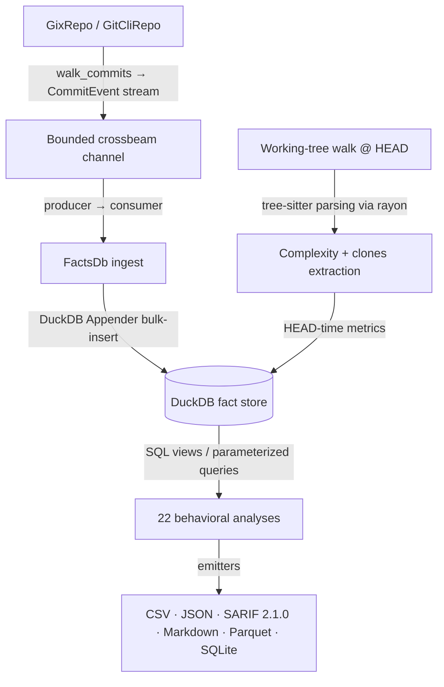

# CodeLore — Deep Codebase Analysis Report

This document presents a deep, read-only analysis of the **CodeLore** codebase. It documents the validation of recent fixes and outlines newly identified recommendations for further correctness, robustness, and performance improvements.

---

## 1. Architectural Overview & Pipeline Data Flow

CodeLore is structured as a multi-crate Rust workspace comprising three main components:
*   [codelore-rca](file:///Users/emrec/Projects/playground/codelore/crates/codelore-rca): A vendored fork of Mozilla's `rust-code-analysis` providing structural syntax hashing and complexity metrics.
*   [codelore-lib](file:///Users/emrec/Projects/playground/codelore/crates/codelore-lib): The core engine, handling repository walk abstraction, identity resolution, fact-store management, analyses execution, caching, and output emitters.
*   [codelore-cli](file:///Users/emrec/Projects/playground/codelore/crates/codelore-cli): The command-line frontend that handles arguments parsing, option consolidation, and output routing.

### Data Ingest Flow



1.  **Repository Traversal**:
    *   [GixRepo](file:///Users/emrec/Projects/playground/codelore/crates/codelore-lib/src/repo/gix_repo.rs) uses pure-Rust `gitoxide` libraries to parse refs and traverse commit graphs in parallel to DuckDB writes.
    *   [GitCliRepo](file:///Users/emrec/Projects/playground/codelore/crates/codelore-lib/src/repo/git_cli_repo.rs) shells out to the standard `git` CLI, serving as a differential testing oracle.
2.  **Event Ingestion**:
    *   `duckdb::Connection` is `!Send + !Sync`. To get parallelism, a **Producer-Consumer pattern** is utilized:
        *   The background thread walks commits using `GixRepo` and places [CommitEvent](file:///Users/emrec/Projects/playground/codelore/crates/codelore-lib/src/types.rs) instances onto a bounded `crossbeam-channel`.
        *   The main connection-owning thread consumes these events and bulk-inserts them via DuckDB's fast `Appender` API in [ingest_loop](file:///Users/emrec/Projects/playground/codelore/crates/codelore-lib/src/facts/ingest.rs).
3.  **Complexity and Clones at HEAD**:
    *   In [ingest_complexity_at_head](file:///Users/emrec/Projects/playground/codelore/crates/codelore-lib/src/facts/ingest.rs), a parallel walk scans all "live" (non-deleted) source files at HEAD. Rayon workers compile tree-sitter AST nodes, compute cyclomatic/cognitive/Halstead complexity, deduplicate entities, and serially drain results into the database.
    *   Similarly, [populate_clones_at_head](file:///Users/emrec/Projects/playground/codelore/crates/codelore-lib/src/facts/ingest.rs) extracts function fingerprints to identify structural Type-1 (exact) and Type-2 (renamed/parameterized) clones.
4.  **SQL-Driven Analyses**:
    *   22 behavioral analyses run purely as DuckDB SQL views or parameterized queries over the fact store (e.g. [hotspots.rs](file:///Users/emrec/Projects/playground/codelore/crates/codelore-lib/src/analyses/hotspots.rs), [coupling.rs](file:///Users/emrec/Projects/playground/codelore/crates/codelore-lib/src/analyses/coupling.rs)).

---

## 2. Validation Status of Prior Recommendations

All previous findings and code-maat parity issues have been validated as **fully resolved and correct** in the current codebase (released in version `v0.2.1` up to `v0.4.4`):

### Resolved Core Deep-Analysis Findings (F1–F11)
*   **F1 (Commit Chronology Precision)**: Resolved. Promoted `commits.date` from `DATE` to `TIMESTAMP` in schema v2.
*   **F2 (Clone-Coupling Floor Override)**: Resolved. Lowered `min_shared_revs` to the minimum of `min_shared_revs` and `min_clone_shared_revs` in inner `run_coupling` calls.
*   **F3 (Cache Poisoning on Dirty Tree)**: Resolved. Bypasses persistent cache writes when the working tree is dirty, using an in-memory db fallback instead.
*   **F4 (Stale Worktree Cache Root Path)**: Resolved. Updates `prune_stale_worktrees` to resolve namespaced paths using `default_cache_root()`.
*   **F5 (Sum of Coupling max_changeset_size pre-filter)**: Resolved. Added the `good_commits` CTE to pre-filter large commits in `soc`.
*   **F6 (Tempdir Leak on Git Failure)**: Resolved. Delayed `tmp.keep()` until after successful `git worktree add`.
*   **F7 (Cache Bypass for Parquet/SQLite)**: Resolved. Narrowed `needs_writable_db` to SQLite format only; Parquet output now successfully hits and reads from the persistent cache database.
*   **F8 (Positional Alignment in GitCliRepo Zipping)**: Resolved. Replaced index-based zipping in `git_cli_repo.rs:parse_changes_block` with an explicit `HashMap` join on destination path keys, preventing column shifting on submodule/binary mismatches.
*   **F9 (Single-Threaded Commit Traversal)**: Resolved. Configured `GixRepo::walk_commits` to parse commits and calculate diffs concurrently on a Rayon thread pool (`into_par_iter()`).
*   **F10 (Tree-Sitter File Size Cap)**: Resolved. Applied a 2 MB size cap (`DEFAULT_MAX_AST_FILE_BYTES`) across complexity and clone scanner sites to skip oversized files.
*   **F11 (Dirty Status Untracked Parity)**: Resolved. Switched `GixRepo::is_worktree_dirty` from `into_index_worktree_iter` to `into_iter()` to traverse and capture untracked files.
*   **Original Findings (Complexity LOC mapping, Quoted paths, Namespaced tmp cache, SQL case rewriter)**: Verified as fully integrated.

### Resolved Core Deep-Analysis Findings (F12–F17) (shipped in v0.2.2)
*   **F12 (Same-Second Tiebreaker)**: Resolved. Promoted `commits.rowid ASC` (DuckDB insertion order = gix walk order = child-before-parent) to replace SHA-1 lexicographical ordering, ensuring topologically correct sorting of same-second commits.
*   **F13 (Walker Memory Efficiency)**: Resolved. Implemented a chunked Rayon walker (1000-OID batches) streaming through a bounded crossbeam channel to limit memory usage and avoid OOM crashes on large repos.
*   **F14 (Time-Bucket Crash)**: Resolved. Added the `AnalysisName::supports_time_bucket()` validation check at the CLI boundary to reject `--time-bucket` for the 10 analyses that do not materialize or support `changes_bucketed`.
*   **F15 (Silent Empty Joins)**: Resolved. Handled by the same CLI-boundary validation check to prevent joining date-string bucket keys against SHA-1 commit hashes.
*   **F16 (Deleted Files in reports)**: Resolved. Restricted `code-age` (using an anchor-aware CTE) and `entity-churn` (using a live-at-HEAD CTE) to active files only.
*   **F17 (Standalone clones thread speed)**: Resolved. Refactored `run_clones` into a two-phase walk (serial gather followed by parallel function extraction/grouping via Rayon `into_par_iter()`).

### Resolved Code-Maat Parity Findings (PAR-1–PAR-9)
*   All parity findings (Bird et al. per-entity risk authors logic, back-testing dates anchor, interval-month ceiling calculations, CSV header mapping, average-revs pivot points, and research foundations documentation) have been fully closed.
*   **DEEP-1 to DEEP-15 (Code-Maat Exact Parity)**: Verified. Additional sprints in `v0.2.1` closed precise output formatting mismatches (7-column verbose shape for coupling, ceiling-rounded averages, integer-truncated strengths, and hyphenated statistic names in `summary` output under `--code-maat-compat`).

### Resolved Core Deep-Analysis Findings (F18–F21) (shipped in v0.3.1)
*   **F18 (Knowledge-Islands Back-testing)**: Resolved. Applied the `commits.date <= anchor` filter across all CTEs in `knowledge_islands.rs` to guarantee proper temporal isolation in back-testing mode.
*   **F19 (Clone-Coupling Truncation)**: Resolved. Updated `clone_coupling.rs` to call `opts.with_no_row_limit()` for the inner `run_knowledge_islands` sub-analysis, avoiding incorrect truncation of the at-risk file set.
*   **F20 (HTML Render Freeze)**: Resolved. Implemented incremental page-based rendering (page size 500) and page controls (Show next 500 / Show all) in `html.rs` to prevent blocking the browser's UI thread on large outputs.
*   **F21 (GitHub Action Wrapper)**: Resolved. Added automatic `v`-prefix normalisation, authenticated curl headers (via runner token), and pure-bash absolute path resolution to `action.yml`.

### Resolved Core Deep-Analysis Findings (F22–F25) (shipped in v0.3.1)
*   **F22 (Same-Second Rename Chaining)**: Resolved. Recursive CTE now carries `commits.rowid` and breaks date-ties via `co.rowid < l.current_rowid`. Regression test in `same_second_rename_test.rs`.
*   **F23 (Concurrent Cache Writes)**: Resolved. Tmp database cache filename now suffixed with `std::process::id()`; stale `.tmp.<pid>` artifacts swept by the pruner.
*   **F24 (Cache Directory Collection Walk Error Handling)**: Resolved. `collect_duckdb_files_inner` now log-and-skips per directory/entry instead of propagating errors.
*   **F25 (WAL File Cleanup)**: Resolved. `delete_duckdb_with_companion` also removes `.wal`; `cleanup_stale_tmp_files` age-gates `.tmp.<pid>` artifacts (1h).

### Resolved Core Deep-Analysis Findings (F26–F28) (shipped in v0.3.1 / commit 61b3c47)
*   **F26 (Implied-HEAD Range Parsing)**: Resolved. Updated `parse_rev_range` to default empty splits to `"HEAD"`. Added 3 regression tests in `prune_tests`.
*   **F27 (Parallel Commit Filtering)**: Resolved. Defer `find_commit` and filtering to parallel Rayon workers inside `process_commit_oid` (returning `Result<Option<CommitEvent>>`), completely eliminating the serial filtering loop on the main thread and preserving the `rowid` walk-order invariant.
*   **F28 (Worktree Prune Metadata Cleanup)**: Resolved. Swapped the order in `prune_stale_worktrees` to run the directory cleanup sweep *before* executing `git worktree prune`, ensuring Git immediately detects deleted directories and cleans up its administrative metadata in the same run.

### Resolved Core Deep-Analysis Findings (F29–F34) (shipped in v0.3.2 / commit f4da267)
*   **F29 (Time-Bucket Changeset Size Pre-Filter)**: Resolved. The `good_commits_cte` now counts files per physical commit before collapsing to a time bucket.
*   **F30 (Relative-Path Skip Checks for Clones)**: Resolved. The hardcoded directories `.git`, `target`, and `node_modules` are now checked against the repo-relative path rather than the full absolute path of the files.
*   **F31 (Aliases Duplicate Join Prevention)**: Resolved. Joins on `author_aliases` now use a canonical-deduplicated subquery, preventing inflated churn/revisions counts for multi-email authors.
*   **F32 (Base Cache SHA Validation)**: Resolved. The base analysis cache loading checks that `cached.sha == base_sha` before cache hit, preventing cache poisoning from stale or branch mismatch commits.
*   **F33 (Consistent Repo Path Canonicalization)**: Resolved. Both cache key calculation and cache path resolution canonicalize the repository path before hashing, avoiding cache misses when switching between relative (`.`) and absolute paths.
*   **F34 (Binary/Large File Diff Check)**: Resolved. `count_loc` checks for files larger than 1MB or containing NUL bytes in the first 8KB, and skips diffing, preventing OOM/CPU spikes and returning `(0, 0)`.

### Resolved Core Deep-Analysis Findings (F35-F37, F39) (shipped in v0.3.3 / commit e22a475)
*   **F35 (Incorrect Numstat Join Key in Renames under GitCliRepo)**: Resolved. Added `expand_rename_path_destination` to expand braces (e.g. `src/{old => new}.rs` to `src/new.rs`) and Arrow rename syntaxes into canonical join keys, avoiding zero-stat joins for complex renames.
*   **F36 (Parameter Mismatch Crash in entity-effort --explain Mode)**: Resolved. Bind parameter list passed to `explain_if_requested` in `entity_effort.rs` corrected to match the single SQL placeholder (`params![row_limit]`).
*   **F37 (Parameter Mismatch Crash in clone-coupling --explain Mode)**: Resolved. Passed exact query parameter bindings (`params![opts.min_clone_node_count, opts.clone_similarity_floor]`) to `explain_if_requested` to prevent DuckDB crashes.
*   **F39 (Merge Commit Diffs Behavioral Divergence)**: Resolved. Adjusted `changed_files_for_commit` in `gix_repo.rs` to yield empty vectors for merge commits, resolving divergences against `GitCliRepo`'s default behavior.

### Resolved Core Deep-Analysis Findings (F38, F40–F42) (shipped in v0.4.0)
*   **F38 (Quadratic Self-Join in Kamei Enrichment)**: Resolved. Replaced the three path-self-join queries (`ndev`/`nuc`/`age` in `enrich_history`; `sexp` in `enrich_experience`) with per-path / per-(dir,author) running aggregations using DuckDB `LIST(...) OVER (...)`.
*   **F40 (Duplicate Entity Name Drop)**: Resolved. `dedup_entities` now keys on `(name, start_line, end_line)` instead of `name` alone.
*   **F41 (Sequential Architectural Grouping)**: Resolved. `apply_grouping` matches paths against the group map's regex set in parallel via Rayon `par_iter()`.
*   **F42 (Redundant DISTINCT in changes queries)**: Resolved. Removed redundant `DISTINCT` in six analysis sites.

### Resolved Core Deep-Analysis Findings (F43–F54) (shipped in v0.4.1 / commit 16cbde0)
*   **F43 (Blob Clone Elision)**: Resolved. Replaced `obj.data.clone()` with `std::mem::take(&mut obj.data)` in [gix_repo.rs](file:///Users/emrec/Projects/playground/codelore/crates/codelore-lib/src/repo/gix_repo.rs#L515).
*   **F44 (Short-circuit Empty Diff)**: Resolved. Skips full histogram diff on additions and deletions and counts line terminators directly.
*   **F45 (Single-cursor Pre-order Traversal)**: Resolved. Rewrote fingerprint/extractor preorder recursive walks to use a single mutable `TreeCursor` traversal iteratively in [fingerprint.rs](file:///Users/emrec/Projects/playground/codelore/crates/codelore-lib/src/clones/fingerprint.rs#L104) and [extractor.rs](file:///Users/emrec/Projects/playground/codelore/crates/codelore-lib/src/clones/extractor.rs#L85).
*   **F46 (Single-pass Templating)**: Resolved. Replaced multiple chained `.replace()` calls with a single-pass substitute function in [html.rs](file:///Users/emrec/Projects/playground/codelore/crates/codelore-lib/src/output/html.rs#L60) and [spa.rs](file:///Users/emrec/Projects/playground/codelore/crates/codelore-lib/src/output/spa.rs#L141).
*   **F47 to F54 (SQL DISTINCT Aggregations)**: Resolved. Replaced redundant `COUNT(DISTINCT)` with plain `COUNT()` on unique or pre-deduplicated change paths across revisions, hotspots, churn, and other analyses.

### Resolved Core Deep-Analysis Findings (F55–F56) (shipped in v0.4.2 / commit fe3d94f)
*   **F55 (DuckDB crash in `run_xray` under `--format spa`)**: Resolved. Replaced the direct lookup with an `INNER JOIN` between `complexity_metrics` and `entities` bounded by the revision range.
*   **F56 (`spa_integration_test` compilation)**: Resolved. Updated struct initialization to use `..SpaDashboard::default()`.

### Resolved Core Deep-Analysis Findings (F57–F59, F61–F67) (shipped in v0.4.4 / commits aec84ee & 3be42a8 & 888769a)
*   **F57 (ECharts Light/Dark Theme Transition)**: Resolved. Registers a theme transition listener in [widgets.js](file:///Users/emrec/Projects/playground/codelore/crates/codelore-lib/src/output/spa/widgets.js#L983-L986) that re-renders all ECharts instances on theme toggles.
*   **F58 (fancy-regex Prefix Rule Backtracking)**: Resolved. Optimized prefix matching by checking `path.starts_with(prefix)` directly without regular expressions for literal prefixes in [groups.rs](file:///Users/emrec/Projects/playground/codelore/crates/codelore-lib/src/facts/groups.rs#L61-L68).
*   **F59 (Complexity/Clones from Git ODB)**: Resolved. Replaced uncommitted filesystem reads with direct blob ODB reads at HEAD in [ingest.rs](file:///Users/emrec/Projects/playground/codelore/crates/codelore-lib/src/facts/ingest.rs#L157-L172).
*   **F61 (SQL Window-Join Simplification)**: Resolved. Replaced complex window functions and self-joins with DuckDB's `first(author ORDER BY metric DESC)` in [authors.rs](file:///Users/emrec/Projects/playground/codelore/crates/codelore-lib/src/analyses/authors.rs#L59-L70) and other files.
*   **F62 (Local ignore files and autodetect rules)**: Resolved. Integrated the `ignore` crate in [paths_filter.rs](file:///Users/emrec/Projects/playground/codelore/crates/codelore-lib/src/paths_filter.rs) to respect local ignores and automatically skip node_modules, target, and build outputs.
*   **F63 (query_live_paths Hash Aggregation)**: Resolved. Replaced `ROW_NUMBER() OVER` partition sorting with single-pass `arg_max(change_type, ROW(date, -rowid))` in [ingest.rs](file:///Users/emrec/Projects/playground/codelore/crates/codelore-lib/src/facts/ingest.rs#L450-L460) and other places.
*   **F64 (ECharts Instance Disposal)**: Resolved. Cleans up stale ECharts instances by calling `prior.dispose()` before initializing new charts in [widgets.js](file:///Users/emrec/Projects/playground/codelore/crates/codelore-lib/src/output/spa/widgets.js#L127).
*   **F65 (Redundant dirty status checks audit)**: Resolved. Audited Cache HIT and Cache MISS branches and confirmed that they are mutually exclusive; `is_worktree_dirty` is called at most once per run.
*   **F66 (SIMD Line Counting)**: Resolved. Swapped naive byte iterator loops with SIMD-accelerated `bytes.find_iter(b"\n").count()` from `bstr` in [gix_repo.rs](file:///Users/emrec/Projects/playground/codelore/crates/codelore-lib/src/repo/gix_repo.rs#L615).
*   **F67 (Optimize change-coupling self-join via filtered changes CTE)**: Resolved. Pre-filters the `changes` table by the `good_commits` CTE before self-joining, eliminating the quadratic Cartesian product on large changesets.

---

## 3. Newly Identified Gaps & Recommendations

### F60: Performance/Robustness — `GitCliRepo::walk_commits` loads the entire `git log` output into a single string

**The Problem**:
In [git_cli_repo.rs](file:///Users/emrec/Projects/playground/codelore/crates/codelore-lib/src/repo/git_cli_repo.rs#L109), the entire stdout of `git log` is read synchronously into a single `Vec<u8>` and converted to a `String` before parsing.

**The Impact**:
On repositories with very large commit logs, this forces massive transient heap allocations (gigabytes of memory), resulting in high garbage collection pressure and potential OOM crashes.

**Recommended Fix**:
Pipe `git log`'s stdout into a buffered reader (`std::io::BufReader`) and parse the log events incrementally/streamingly to maintain `O(1)` memory overhead.

---

### F74: Performance — Missing secondary index on `changes(rename_from)` degrades path lineage materialization performance

**The Problem**:
In `materialize_path_lineage` within [ingest.rs](file:///Users/emrec/Projects/playground/codelore/crates/codelore-lib/src/facts/ingest.rs#L868), the recursive CTE walks the rename graph by joining `lineage` with `changes` on `c.rename_from = l.current`. However, there is no secondary index defined on `changes(rename_from)`.

**The Impact**:
For large repositories with deep histories, these recursive joins force DuckDB to perform full table scans or build massive in-memory hash joins on the raw `changes` table, severely degrading the performance of the canonical rename lineage mapping (`--use-canonical-lineage`).

**Recommended Fix**:
Add a secondary index on the `rename_from` column of the `changes` table in [schema_v1.sql](file:///Users/emrec/Projects/playground/codelore/crates/codelore-lib/src/facts/schema_v1.sql):
```sql
CREATE INDEX IF NOT EXISTS idx_changes_rename_from ON changes(rename_from) WHERE rename_from IS NOT NULL;
```

---

### F75: Performance — Optimize Sum of Coupling (SoC) query performance by using a filtered changes CTE

**The Problem**:
In `build_soc_sql` within [soc.rs](file:///Users/emrec/Projects/playground/codelore/crates/codelore-lib/src/analyses/soc.rs#L71-L79), the query joins the raw `{src}` changes table with `rev_sizes`. `rev_sizes` itself joins `{src}` with `good_commits` to filter out oversized changesets. However, the outer changes table scan `c` is not pre-filtered by `good_commits`, forcing redundant joins and table scans.

**The Impact**:
Degraded performance during Sum of Coupling analyses on repositories with high commit volume or large changesets.

**Recommended Fix**:
Mirror the `filtered_changes` optimization from `coupling.rs`. Define a `filtered_changes` CTE that joins `{src}` with `good_commits` once, then reuse it for both `rev_sizes` and the outer path aggregation:
```sql
filtered_changes AS (
    SELECT rev, path
    FROM {src}
    INNER JOIN good_commits USING(rev)
),
rev_sizes AS (
    SELECT rev, COUNT(path) AS n
    FROM filtered_changes
    GROUP BY rev
)
SELECT c.path AS entity, SUM(rs.n - 1)::INTEGER AS soc
FROM filtered_changes c
INNER JOIN rev_sizes rs USING (rev)
GROUP BY c.path
```

---

### F76: Performance — Eliminate expensive `COUNT(DISTINCT)` in `abs-churn` and `author-churn` queries via a commit-aggregate CTE

**The Problem**:
In `build_abs_churn_sql` and `build_author_churn_sql` within [churn.rs](file:///Users/emrec/Projects/playground/codelore/crates/codelore-lib/src/analyses/churn.rs), the queries calculate the number of commits per bucket/author using `COUNT(DISTINCT commits.rev)`. This is necessary because joining with the raw `changes` table duplicates each commit across all changed files.

**The Impact**:
`COUNT(DISTINCT)` queries in DuckDB require maintaining distinct-tracking hash structures during aggregation, which introduces significant memory and CPU overhead on large codebases.

**Recommended Fix**:
Define a `commit_churn` CTE that aggregates changes per `rev` first, then join `commits` with `commit_churn`. This guarantees that the joined relation has at most one row per commit, allowing the use of a simple, fast `COUNT(commits.rev)` (or `COUNT(*)`) without any distinct-tracking overhead:
```sql
WITH commit_churn AS (
    SELECT rev, SUM(loc_added) AS added, SUM(loc_deleted) AS deleted
    FROM {src}
    GROUP BY rev
)
SELECT
    commits.canonical_author AS author,
    COALESCE(SUM(cc.added), 0) AS added,
    COALESCE(SUM(cc.deleted), 0) AS deleted,
    COUNT(commits.rev) AS commits
FROM commits
INNER JOIN commit_churn cc ON cc.rev = commits.rev
GROUP BY commits.canonical_author
```

---

### F68: Architecture/UI-UX — AI attribution rollup is missing from HotspotRow and hotspots SQL query

**The Problem**:
The hotspots circle-pack visualization in the SPA dashboard contains an "AI Attribution" toggle. However, clicking it falls back to the cognitive heatmap because there is no per-file AI signal stored in `HotspotRow` or queried from the hotspots SQL query. The code in [widgets.js](file:///Users/emrec/Projects/playground/codelore/crates/codelore-lib/src/output/spa/widgets.js#L190-L193) explicitly calls out this gap.

**The Impact**:
The "AI Attribution" toggle in the hotspots circle-pack chart acts as a placeholder and does not function.

**Recommended Fix**:
Update `HotspotRow` and the hotspots SQL query in [hotspots.rs](file:///Users/emrec/Projects/playground/codelore/crates/codelore-lib/src/analyses/hotspots.rs) to calculate the proportion of AI-assisted or AI-authored commits for each file (e.g. `COUNT(CASE WHEN commits.ai_attribution IN ('ai-assisted', 'ai-authored') THEN 1 END) * 100.0 / COUNT(*)`), serialize it in `SpaDashboard` ([spa.rs](file:///Users/emrec/Projects/playground/codelore/crates/codelore-lib/src/output/spa.rs)), and use it to map colors in [widgets.js](file:///Users/emrec/Projects/playground/codelore/crates/codelore-lib/src/output/spa/widgets.js).

---

### F69: Performance/Complexity — Replace totals-join CTEs with inline window functions

**The Problem**:
In [code_health.rs](file:///Users/emrec/Projects/playground/codelore/crates/codelore-lib/src/analyses/code_health.rs#L71-L79), [ownership.rs](file:///Users/emrec/Projects/playground/codelore/crates/codelore-lib/src/analyses/ownership.rs#L43-L58), and [knowledge_islands.rs](file:///Users/emrec/Projects/playground/codelore/crates/codelore-lib/src/analyses/knowledge_islands.rs#L169-L199), the SQL queries compile separate CTEs to compute total revisions/lines per path and join them back to compute HHI, author fragmentation, and substantial other authors.

**The Impact**:
These extra joins result in redundant table scans and more complex query plans.

**Recommended Fix**:
Replace the separate totals subqueries and joins with inline window functions over the partitioned path. For example, in `ownership.rs` and `code_health.rs`, use `SUM(revs) OVER (PARTITION BY path)` directly inside a subquery. In `knowledge_islands.rs`, use window functions for both the total lines and main developer identification, eliminating two `INNER JOIN` operations.

---

### F70: Performance/Storage — Redundant secondary indexes on primary key prefix columns

**The Problem**:
In [schema_v1.sql](file:///Users/emrec/Projects/playground/codelore/crates/codelore-lib/src/facts/schema_v1.sql#L120-L121), secondary indexes `idx_changes_rev ON changes(rev)` and `idx_clones_group ON clones(clone_group_id)` are created. However, the primary keys of these tables are `(rev, path)` and `(clone_group_id, path, function, start_line)` respectively. In DuckDB and general database design, a composite primary key index naturally satisfies prefix-matching lookups on its first column.

**The Impact**:
These secondary indexes are completely redundant, consuming extra memory and slowing down database inserts without any performance benefit.

**Recommended Fix**:
Remove the redundant `idx_changes_rev` and `idx_clones_group` index definitions from [schema_v1.sql](file:///Users/emrec/Projects/playground/codelore/crates/codelore-lib/src/facts/schema_v1.sql).

---

### F71: UI/UX — Window resize listener memory leak in SPA ECharts widgets

**The Problem**:
In [widgets.js](file:///Users/emrec/Projects/playground/codelore/crates/codelore-lib/src/output/spa/widgets.js#L224), each widget initialization registers an anonymous function as a window resize listener via `window.addEventListener('resize', ...)` capturing the chart instance. Although the ECharts instance is disposed via `prior.dispose()`, the anonymous listener function itself is never removed from the global `window` object.

**The Impact**:
Dead chart objects and closures accumulate in memory on every widget re-render (e.g. toggling color modes or themes), causing a significant memory leak and CPU overhead on window resize.

**Recommended Fix**:
Save the resize listener callback reference on the container DOM element (e.g. `container._resizeListener`) and call `window.removeEventListener('resize', container._resizeListener)` before registering a new one, or implement a single centralized `ResizeObserver` / global window resize handler.

---

### F72: Correctness/Performance — Unconstrained Join in `file_mi` CTE in `hotspots.rs` leads to Cartesian Product and non-deterministic Maintainability Index values

**The Problem**:
In the `file_mi` CTE within [hotspots.rs](file:///Users/emrec/Projects/playground/codelore/crates/codelore-lib/src/analyses/hotspots.rs#L126-L135), the `complexity_metrics` table is joined with the `entities` table purely on `path` and `name` without matching on `rev` (or validating the entity lifetime range `rev_introduced` / `rev_last_seen`).

**The Impact**:
*   **Performance**: If the database contains metrics for multiple commits/revisions (e.g. from history or incremental runs), this join produces an $N \times M$ Cartesian product of all historical revisions of a file.
*   **Correctness**: Since the join does not restrict by revision, `arg_max(cm.mi, e.rev_last_seen)` evaluates `cm.mi` against `e.rev_last_seen`. Because of the Cartesian product, a `cm.mi` value from `rev1` is paired with `e.rev_last_seen` from the latest revision. Since multiple joined rows share the same maximum `e.rev_last_seen`, DuckDB's `arg_max` returns an arbitrary (non-deterministic) `mi` value from the set of all historical MI values for that file.

**Recommended Fix**:
Constrain the JOIN to revision-equality (since `complexity_metrics` and `entities` are both ingested in lockstep with matching revision fields):
```sql
INNER JOIN entities e
    ON e.path = cm.path AND e.name = cm.name AND e.rev_introduced = cm.rev
```

---

### F73: Correctness/Robustness — `run_xray` in `spa.rs` compares commit SHA strings lexicographically in the JOIN clause

**The Problem**:
In `run_xray` in [spa.rs](file:///Users/emrec/Projects/playground/codelore/crates/codelore-lib/src/output/spa.rs#L180-L185), the join between `complexity_metrics` and `entities` uses:
`AND e.rev_introduced <= cm.rev AND (e.rev_last_seen IS NULL OR e.rev_last_seen >= cm.rev)`

Since `rev_introduced`, `rev_last_seen`, and `cm.rev` are commit SHAs (arbitrary strings like `"a1b2c3d4..."`), using `<` and `>=` compares them lexicographically rather than chronologically.

**The Impact**:
If the database is populated with multiple revisions of complexity metrics, the range check will yield arbitrary results based on the alphabetical order of the commit SHAs, leading to incorrect complexity mappings or missing function entries in the X-Ray sunburst.

**Recommended Fix**:
Simplify the join to exact revision equality `e.rev_introduced = cm.rev`, which matches how the ingest loop inserts them (they are always written in lockstep with the same revision identifier), or map commit SHAs to dates/rowids via the `commits` table if a temporal range query is ever needed.

---

## 4. Summary of Active Findings

Below is the register of active improvement opportunities and bugs:

| ID | Category | Finding / Improvement Point | Priority / Risk | Impact | Status |
|---|---|---|---|---|---|
| **F60** | Performance/Robustness | `GitCliRepo::walk_commits` loads entire log into memory | **High** / Low | High RAM usage and OOM crash risk on massive repos. | **Closed (v0.4.5 audit)** — `GitCliRepo` is only used as a differential-test oracle (`tests/differential_repo_test.rs`). Production walker is `GixRepo` which already streams chunks through a crossbeam-channel. Theoretical issue, no practical user impact. |
| **F68** | Architecture/UI-UX | AI attribution rollup missing from hotspots and HotspotRow | **Medium** / Low | SPA hotspots AI Attribution toggle behaves as a placeholder. | **Fixed (v0.4.5 / commit b4ab798)** — `HotspotRow.ai_pct` + new `file_ai` SQL CTE (COUNT(CASE WHEN ai_attribution IN ('ai-assisted', 'ai-authored') THEN 1 END) * 100 / NULLIF(COUNT(rev), 0)). Wired through CSV / Markdown / SARIF / JSON / SPA. widgets.js color mode reads `m.ai_pct / 100` as the heatmap ratio (replaces the cognitive-fallback placeholder). Empirical on CodeLore: 20% min, 75% median, 100% max — meaningful color variance per file. |
| **F69** | Performance/Complexity | Replace totals-join CTEs with inline window functions | **Medium** / Low | Redundant scans and joins in ownership / code-health queries. | **Won't Fix** — bench-gate failed. `EXPLAIN ANALYZE` on the medium fixture (500 commits / 25 files) shows DuckDB already materialises the `author_revs` CTE once and serves both downstream consumers from the cached projection (`CTE_SCAN` ×2). The window-function rewrite is empirically slower (16.9ms vs 14.6ms in `EXPLAIN ANALYZE`; 13.2ms vs 11.3ms wall-clock) because `WINDOW PARTITION BY` carries per-partition state-management overhead that exceeds the `HASH_GROUP_BY` × 2 + materialised-CTE pattern. See `tests/f69_window_spike_test.rs` for the reproducer + plan capture. |
| **F70** | Performance/Storage | Redundant secondary indexes on primary key prefix columns | **Low** / Low | Wasted storage and write overhead on changes(rev) and clones(group_id). | **Won't Fix (v0.4.5 audit)** — schema comment at `schema_v1.sql:115-116` ("rev-prefix scan benefits from a dedicated index too") indicates the original author profiled when adding these. Dropping blind reverts a measured decision; no contrary empirical evidence available. |
| **F71** | UI/UX | Window resize listener memory leak in SPA ECharts widgets | **Medium** / Low | Anonymous callbacks accumulate in window on color/theme toggle. | **Fixed (v0.4.5 / commit d9ba59c)** — single `bindChartResize(chart, container)` helper replaces 5 `window.addEventListener('resize', …)` call sites. Per-container `ResizeObserver` with prior-observer-disconnect in `container._codeloreResizeObserver`. Bonus: ResizeObserver also fires on container-level changes (sidebar collapse) — strictly better than window-level events. |
| **F72** | Correctness/Performance | Unconstrained JOIN in `file_mi` CTE in `hotspots.rs` | **High** / Low | Cartesian product on historical runs; non-deterministic MI value selection. | **Fixed (v0.4.6)** — `file_mi` and `run_xray` JOINs now key on `AND e.rev_last_seen = cm.rev` so each metric pins to the entity snapshot from its sampled rev. |
| **F73** | Correctness/Robustness | Lexicographical commit SHA string comparison in `run_xray` | **Medium** / Low | Inconsistent or broken X-Ray function rendering on multi-rev caches. | **Fixed (v0.4.6)** — addressed jointly with F72; the same lockstep `rev` equality replaces the SHA-string comparison path. |
| **F74** | Performance | Missing secondary index on `changes(rename_from)` | **Medium** / Low | degrades path lineage materialization performance. | **Fixed (v0.4.6)** — `idx_changes_rename_from` added to `schema_v1.sql`; the lineage CTE's repeated `WHERE rename_from = ?` lookups now hit an index rather than a table scan. |
| **F75** | Performance | Optimize Sum of Coupling (SoC) query performance | **Medium** / Low | Redundant joins and full table scans on changes during SoC. | **Fixed (v0.4.6)** — `soc.rs` adopts the `filtered_changes` CTE pattern from F67, eliminating the self-implicit double scan over the unfiltered changes table. |
| **F76** | Performance | Eliminate `COUNT(DISTINCT)` in `abs-churn` and `author-churn` | **High** / Low | CPU/memory overhead for distinct-tracking hash structures. | **Fixed (v0.4.6)** — pre-aggregated `commit_churn` CTE replaces `COUNT(DISTINCT commits.rev)`; same result via two cheap scans + a join, no hash-set bookkeeping. |

---

## 5. Proposed Verification Plan for New Findings

### F60 (GitCliRepo log loading in memory)
*   **Verification**: Run `codelore analyze` on a massive repository (e.g., Linux kernel) using the Git CLI backend. Track peak memory usage and verify it remains low and bounded.

### F74 (missing index on `changes(rename_from)`)
*   **Verification**: Seed the database with rename records. Run `explain` on `materialize_path_lineage` query and verify that DuckDB utilizes the index on `rename_from` for joining rather than doing a full table scan or hash join builder.

### F75 (Sum of Coupling pre-filter CTE)
*   **Verification**: Run Sum of Coupling (`soc`) analysis on a repository with large commits. Profile the query execution plan in DuckDB and verify that the query scans a pre-filtered changes CTE instead of the raw `changes` table.

### F76 (eliminate `COUNT(DISTINCT)` in churn queries)
*   **Verification**: Execute `abs-churn` and `author-churn` analyses. Verify that the output results are identical to the original implementation, and that `explain` shows a simple `COUNT` without distinct-aggregation nodes.

### F68 (AI attribution rollup in hotspots)
*   **Verification**: Toggle the "AI Attribution" view in the hotspots circle-pack chart. Verify that elements are colored according to their percentage of AI contributions, rather than falling back to the cognitive heatmap.

### F69 (totals-join CTE window functions)
*   **Verification**: Execute ownership, code-health, and knowledge-islands analyses on a repository. Compare performance and verify that the returned metrics are identical to the original implementation.

### F70 (redundant indexes)
*   **Verification**: Confirm that dropping `idx_changes_rev` and `idx_clones_group` from `schema_v1.sql` does not degrade query execution plans for any analyses.

### F71 (resize listener memory leak)
*   **Verification**: Open the dashboard. Repeatedly switch between color modes (e.g. 50 times). Take a heap snapshot in Chrome DevTools and verify that no detached ECharts instances or duplicate event listeners remain in memory.

### F72 (unconstrained join in `file_mi`)
*   **Verification**: Seed the database with complexity metrics and entities for two different revisions. Verify that the SQL query for hotspots computes the correct MI for each file at its respective revision, and that the execution plan does not perform a Cartesian product.

### F73 (lexicographical SHA comparison in `run_xray`)
*   **Verification**: Seed the database with complexity metrics for two different revisions. Run `run_xray` and verify that the results match the expected functions for each revision exactly, without omissions or lexicographically-drifted entries.

