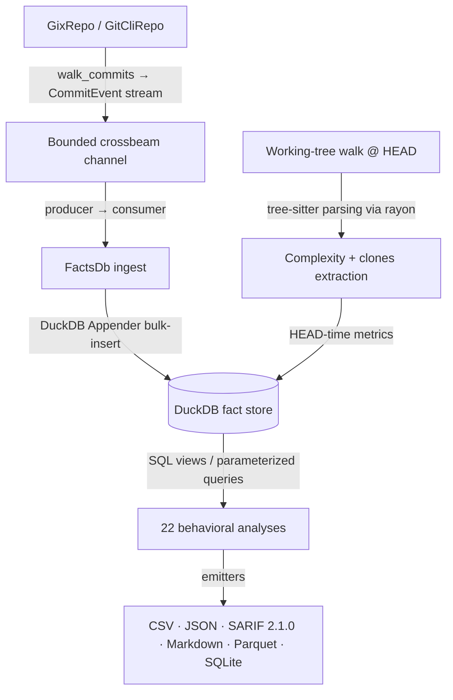

# CodeLore — Deep Codebase Analysis Report

This document presents a deep, read-only analysis of the **CodeLore** codebase. It documents the validation of recent fixes and outlines newly identified recommendations for further correctness, robustness, and performance improvements.

---

## 1. Architectural Overview & Pipeline Data Flow

CodeLore is structured as a multi-crate Rust workspace comprising three main components:
*   [codelore-rca](file:///Users/emrec/Projects/playground/codelore/crates/codelore-rca): A vendored fork of Mozilla's `rust-code-analysis` providing structural syntax hashing and complexity metrics.
*   [codelore-lib](file:///Users/emrec/Projects/playground/codelore/crates/codelore-lib): The core engine, handling repository walk abstraction, identity resolution, fact-store management, analyses execution, caching, and output emitters.
*   [codelore-cli](file:///Users/emrec/Projects/playground/codelore/crates/codelore-cli): The command-line frontend that handles arguments parsing, option consolidation, and output routing.

### Data Ingest Flow

1.  **Repository Traversal**:
    *   [GixRepo](file:///Users/emrec/Projects/playground/codelore/crates/codelore-lib/src/repo/gix_repo.rs) uses pure-Rust `gitoxide` libraries to parse refs and traverse commit graphs in parallel to DuckDB writes.
    *   [GitCliRepo](file:///Users/emrec/Projects/playground/codelore/crates/codelore-lib/src/repo/git_cli_repo.rs) shells out to the standard `git` CLI, serving as a differential testing oracle.
2.  **Event Ingestion**:
    *   `duckdb::Connection` is `!Send + !Sync`. To get parallelism, a **Producer-Consumer pattern** is utilized:
        *   The background thread walks commits using `GixRepo` and places [CommitEvent](file:///Users/emrec/Projects/playground/codelore/crates/codelore-lib/src/types.rs) instances onto a bounded `crossbeam-channel`.
        *   The main connection-owning thread consumes these events and bulk-inserts them via DuckDB's fast `Appender` API in [ingest_loop](file:///Users/emrec/Projects/playground/codelore/crates/codelore-lib/src/facts/ingest.rs).
3.  **Complexity and Clones at HEAD**:
    *   In [ingest_complexity_at_head](file:///Users/emrec/Projects/playground/codelore/crates/codelore-lib/src/facts/ingest.rs), a parallel walk scans all "live" (non-deleted) source files at HEAD. Rayon workers compile tree-sitter AST nodes, compute cyclomatic/cognitive/Halstead complexity, deduplicate entities, and serially drain results into the database.
    *   Similarly, [populate_clones_at_head](file:///Users/emrec/Projects/playground/codelore/crates/codelore-lib/src/facts/ingest.rs) extracts function fingerprints to identify structural Type-1 (exact) and Type-2 (renamed/parameterized) clones.
4.  **SQL-Driven Analyses**:
    *   22 behavioral analyses run purely as DuckDB SQL views or parameterized queries over the fact store (e.g. [hotspots.rs](file:///Users/emrec/Projects/playground/codelore/crates/codelore-lib/src/analyses/hotspots.rs), [coupling.rs](file:///Users/emrec/Projects/playground/codelore/crates/codelore-lib/src/analyses/coupling.rs)).

---

## 2. Validation Status of Prior Recommendations

All previous findings and code-maat parity issues have been validated as **fully resolved and correct** in the current codebase (released in version `v0.2.1` up to `v0.3.3`):

### Resolved Core Deep-Analysis Findings (F1–F11)
*   **F1 (Commit Chronology Precision)**: Resolved. Promoted `commits.date` from `DATE` to `TIMESTAMP` in schema v2.
*   **F2 (Clone-Coupling Floor Override)**: Resolved. Lowered `min_shared_revs` to the minimum of `min_shared_revs` and `min_clone_shared_revs` in inner `run_coupling` calls.
*   **F3 (Cache Poisoning on Dirty Tree)**: Resolved. Bypasses persistent cache writes when the working tree is dirty, using an in-memory db fallback instead.
*   **F4 (Stale Worktree Cache Root Path)**: Resolved. Updates `prune_stale_worktrees` to resolve namespaced paths using `default_cache_root()`.
*   **F5 (Sum of Coupling max_changeset_size pre-filter)**: Resolved. Added the `good_commits` CTE to pre-filter large commits in `soc`.
*   **F6 (Tempdir Leak on Git Failure)**: Resolved. Delayed `tmp.keep()` until after successful `git worktree add`.
*   **F7 (Cache Bypass for Parquet/SQLite)**: Resolved. Narrowed `needs_writable_db` to SQLite format only; Parquet output now successfully hits and reads from the persistent cache database.
*   **F8 (Positional Alignment in GitCliRepo Zipping)**: Resolved. Replaced index-based zipping in `git_cli_repo.rs:parse_changes_block` with an explicit `HashMap` join on destination path keys, preventing column shifting on submodule/binary mismatches.
*   **F9 (Single-Threaded Commit Traversal)**: Resolved. Configured `GixRepo::walk_commits` to parse commits and calculate diffs concurrently on a Rayon thread pool (`into_par_iter()`).
*   **F10 (Tree-Sitter File Size Cap)**: Resolved. Applied a 2 MB size cap (`DEFAULT_MAX_AST_FILE_BYTES`) across complexity and clone scanner sites to skip oversized files.
*   **F11 (Dirty Status Untracked Parity)**: Resolved. Switched `GixRepo::is_worktree_dirty` from `into_index_worktree_iter` to `into_iter()` to traverse and capture untracked files.
*   **Original Findings (Complexity LOC mapping, Quoted paths, Namespaced tmp cache, SQL case rewriter)**: Verified as fully integrated.

### Resolved Core Deep-Analysis Findings (F12–F17) (shipped in v0.2.2)
*   **F12 (Same-Second Tiebreaker)**: Resolved. Promoted `commits.rowid ASC` (DuckDB insertion order = gix walk order = child-before-parent) to replace SHA-1 lexicographical ordering, ensuring topologically correct sorting of same-second commits.
*   **F13 (Walker Memory Efficiency)**: Resolved. Implemented a chunked Rayon walker (1000-OID batches) streaming through a bounded crossbeam channel to limit memory usage and avoid OOM crashes on large repos.
*   **F14 (Time-Bucket Crash)**: Resolved. Added the `AnalysisName::supports_time_bucket()` validation check at the CLI boundary to reject `--time-bucket` for the 10 analyses that do not materialize or support `changes_bucketed`.
*   **F15 (Silent Empty Joins)**: Resolved. Handled by the same CLI-boundary validation check to prevent joining date-string bucket keys against SHA-1 commit hashes.
*   **F16 (Deleted Files in reports)**: Resolved. Restricted `code-age` (using an anchor-aware CTE) and `entity-churn` (using a live-at-HEAD CTE) to active files only.
*   **F17 (Standalone clones thread speed)**: Resolved. Refactored `run_clones` into a two-phase walk (serial gather followed by parallel function extraction/grouping via Rayon `into_par_iter()`).

### Resolved Code-Maat Parity Findings (PAR-1–PAR-9)
*   All parity findings (Bird et al. per-entity risk authors logic, back-testing dates anchor, interval-month ceiling calculations, CSV header mapping, average-revs pivot points, and research foundations documentation) have been fully closed.
*   **DEEP-1 to DEEP-15 (Code-Maat Exact Parity)**: Verified. Additional sprints in `v0.2.1` closed precise output formatting mismatches (7-column verbose shape for coupling, ceiling-rounded averages, integer-truncated strengths, and hyphenated statistic names in `summary` output under `--code-maat-compat`).

### Resolved Core Deep-Analysis Findings (F18–F21) (shipped in v0.3.1)
*   **F18 (Knowledge-Islands Back-testing)**: Resolved. Applied the `commits.date <= anchor` filter across all CTEs in `knowledge_islands.rs` to guarantee proper temporal isolation in back-testing mode.
*   **F19 (Clone-Coupling Truncation)**: Resolved. Updated `clone_coupling.rs` to call `opts.with_no_row_limit()` for the inner `run_knowledge_islands` sub-analysis, avoiding incorrect truncation of the at-risk file set.
*   **F20 (HTML Render Freeze)**: Resolved. Implemented incremental page-based rendering (page size 500) and page controls (Show next 500 / Show all) in `html.rs` to prevent blocking the browser's UI thread on large outputs.
*   **F21 (GitHub Action Wrapper)**: Resolved. Added automatic `v`-prefix normalisation, authenticated curl headers (via runner token), and pure-bash absolute path resolution to `action.yml`.

### Resolved Core Deep-Analysis Findings (F22–F25) (shipped in v0.3.1)
*   **F22 (Same-Second Rename Chaining)**: Resolved. Recursive CTE now carries `commits.rowid` and breaks date-ties via `co.rowid < l.current_rowid`. Regression test in `same_second_rename_test.rs`.
*   **F23 (Concurrent Cache Writes)**: Resolved. Tmp database cache filename now suffixed with `std::process::id()`; stale `.tmp.<pid>` artifacts swept by the pruner.
*   **F24 (Cache Directory Collection Walk Error Handling)**: Resolved. `collect_duckdb_files_inner` now log-and-skips per directory/entry instead of propagating errors.
*   **F25 (WAL File Cleanup)**: Resolved. `delete_duckdb_with_companion` also removes `.wal`; `cleanup_stale_tmp_files` age-gates `.tmp.<pid>` artifacts (1h).

### Resolved Core Deep-Analysis Findings (F26–F28) (shipped in v0.3.1 / commit 61b3c47)
*   **F26 (Implied-HEAD Range Parsing)**: Resolved. Updated `parse_rev_range` to default empty splits to `"HEAD"`. Added 3 regression tests in `prune_tests`.
*   **F27 (Parallel Commit Filtering)**: Resolved. Defer `find_commit` and filtering to parallel Rayon workers inside `process_commit_oid` (returning `Result<Option<CommitEvent>>`), completely eliminating the serial filtering loop on the main thread and preserving the `rowid` walk-order invariant.
*   **F28 (Worktree Prune Metadata Cleanup)**: Resolved. Swapped the order in `prune_stale_worktrees` to run the directory cleanup sweep *before* executing `git worktree prune`, ensuring Git immediately detects deleted directories and cleans up its administrative metadata in the same run.

### Resolved Core Deep-Analysis Findings (F29–F34) (shipped in v0.3.2 / commit f4da267)
*   **F29 (Time-Bucket Changeset Size Pre-Filter)**: Resolved. The `good_commits_cte` now counts files per physical commit before collapsing to a time bucket.
*   **F30 (Relative-Path Skip Checks for Clones)**: Resolved. The hardcoded directories `.git`, `target`, and `node_modules` are now checked against the repo-relative path rather than the full absolute path of the files.
*   **F31 (Aliases Duplicate Join Prevention)**: Resolved. Joins on `author_aliases` now use a canonical-deduplicated subquery, preventing inflated churn/revisions counts for multi-email authors.
*   **F32 (Base Cache SHA Validation)**: Resolved. The base analysis cache loading checks that `cached.sha == base_sha` before cache hit, preventing cache poisoning from stale or branch mismatch commits.
*   **F33 (Consistent Repo Path Canonicalization)**: Resolved. Both cache key calculation and cache path resolution canonicalize the repository path before hashing, avoiding cache misses when switching between relative (`.`) and absolute paths.
*   **F34 (Binary/Large File Diff Check)**: Resolved. `count_loc` checks for files larger than 1MB or containing NUL bytes in the first 8KB, and skips diffing, preventing OOM/CPU spikes and returning `(0, 0)`.

### Resolved Core Deep-Analysis Findings (F38, F40–F42) (Fixed unreleased / commits c74a643 & 8f42dba, slated for v0.4.0)
*   **F38 (Quadratic Self-Join in Kamei Enrichment)**: Resolved. Replaced the three path-self-join queries (`ndev`/`nuc`/`age` in `enrich_history`; `sexp` in `enrich_experience`) with per-path / per-(dir,author) running aggregations using DuckDB `LIST(...) OVER (... RANGE BETWEEN UNBOUNDED PRECEDING AND CURRENT ROW EXCLUDE CURRENT ROW)`. The RANGE frame preserves Kamei's same-day inclusion semantic exactly. Per-commit DISTINCT counts come from `LIST_DISTINCT(FLATTEN(LIST(...)))` across the commit's paths. Complexity moves from `O(K²)` per hot path to `O(K log K)`. Regression test in `kamei_test.rs` validates the windowed semantic produces the expected `ndev`, `nuc`, `sexp` on a hot-path fixture.
*   **F40 (Duplicate Entity Name Drop)**: Resolved. `dedup_entities` now keys on `(name, start_line, end_line)` instead of `name` alone. Tree-sitter walkers report multiple anonymous functions per file with identical names (`<anonymous>` or empty for closures/lambdas), which were previously silently dropped, leaving zero `complexity_metrics` rows for closures-heavy files. The line-range tuple is the closest thing to stable identity for unnamed entities, allowing closures to retain their own metrics rows.
*   **F41 (Sequential Architectural Grouping)**: Resolved. `apply_grouping` matches paths against the group map's regex set in parallel via Rayon `par_iter()`. Pre-fix, this ran sequentially on the main thread, dominating wall-clock time for monorepos with paths × rules in the millions. The serial INSERT into the temp database table happens after the parallel collect.
*   **F42 (Redundant DISTINCT in changes queries)**: Resolved. Removed redundant `DISTINCT` in six analysis sites (revisions, hotspots, code_health, coupling, main_dev, communication). Since `(rev, path)` is the primary key of the `changes` table, the `rev` column is already unique within each group, and `COUNT(rev)` equals `COUNT(DISTINCT rev)` but avoids DuckDB's distinct-tracking overhead.

### Resolved Core Deep-Analysis Findings (F35-F37, F39) (shipped in v0.3.3 / commit e22a475)
*   **F35 (Incorrect Numstat Join Key in Renames under GitCliRepo)**: Resolved. Added `expand_rename_path_destination` to expand braces (e.g. `src/{old => new}.rs` to `src/new.rs`) and Arrow rename syntaxes into canonical join keys, avoiding zero-stat joins for complex renames.
*   **F36 (Parameter Mismatch Crash in entity-effort --explain Mode)**: Resolved. Bind parameter list passed to `explain_if_requested` in `entity_effort.rs` corrected to match the single SQL placeholder (`params![row_limit]`).
*   **F37 (Parameter Mismatch Crash in clone-coupling --explain Mode)**: Resolved. Passed exact query parameter bindings (`params![opts.min_clone_node_count, opts.clone_similarity_floor]`) to `explain_if_requested` to prevent DuckDB crashes.
*   **F39 (Merge Commit Diffs Behavioral Divergence)**: Resolved. Adjusted `changed_files_for_commit` in `gix_repo.rs` to yield empty vectors for merge commits, resolving divergences against `GitCliRepo`'s default behavior.

---

## 3. Newly Identified Gaps & Recommendations

### F43: Performance — Redundant `clone()` of Blob Data in `count_loc`

**The Problem**:
In [gix_repo.rs:515](file:///Users/emrec/Projects/playground/codelore/crates/codelore-lib/src/repo/gix_repo.rs#L515), `read_blob` returns `obj.data.clone()`. Since `obj` is an owned `gix::Object` loaded inside the closure, returning `obj.data` directly (which is an owned `Vec<u8>`) moves the buffer and avoids copying up to 1MiB of bytes for every changed file in every commit.

**The Impact**:
Ingestion wall-clock time is inflated by constant heap allocation and byte-copying of large file buffers on active repos.

**Recommended Fix**:
Change `Ok(obj.data.clone())` to `Ok(obj.data)` to move the vector.

---

### F44: Performance — Redundant Diff Computation for Additions and Deletions

**The Problem**:
In [gix_repo.rs:535](file:///Users/emrec/Projects/playground/codelore/crates/codelore-lib/src/repo/gix_repo.rs#L535), `count_loc` runs a full `diff_with_slider_heuristics` histogram diff on additions and deletions (where `old_oid` or `new_oid` is `None`). This can be optimized.

**The Impact**:
Unnecessary compute overhead. Diffing against an empty buffer is mathematically equivalent to scanning the non-empty buffer and counting newlines.

**Recommended Fix**:
When `old_oid` is `None`, skip `diff_with_slider_heuristics` entirely, count the lines in the new buffer, and return `(line_count, 0)`. Apply the converse when `new_oid` is `None`.

---

### F45: Performance — Recursive `TreeCursor` Creation in AST Walks

**The Problem**:
In [fingerprint.rs:104](file:///Users/emrec/Projects/playground/codelore/crates/codelore-lib/src/clones/fingerprint.rs#L104) (`walk_preorder_internal`) and [extractor.rs:85](file:///Users/emrec/Projects/playground/codelore/crates/codelore-lib/src/clones/extractor.rs#L85) (`visit`), a new `TreeCursor` is allocated via `node.walk()` at every node of the AST preorder walk.

**The Impact**:
Thousands of transient heap allocations and deallocations per file tree traversal, causing high CPU cache pressure and slower clone-detection walks.

**Recommended Fix**:
Walk the AST iteratively using a single mutable `TreeCursor` and native traversal methods (`goto_first_child`, `goto_next_sibling`, `goto_parent`).

---

### F46: Performance — Multiple String Replacement Passes on HTML Report Emitter

**The Problem**:
In [html.rs:60](file:///Users/emrec/Projects/playground/codelore/crates/codelore-lib/src/output/html.rs#L60), the payload HTML is assembled by chaining `.replace` on `HTML_TEMPLATE` in memory, injecting a large JSON payload (which can be multi-megabytes) before subsequent replace passes.

**The Impact**:
Multiple copies and heap allocations of large HTML/JSON strings.

**Recommended Fix**:
Write the template segments and replaced tokens sequentially to the writer `w` directly, avoiding in-memory template duplication.

---

### F47: Performance — Redundant `COUNT(DISTINCT a.rev)` in Coupling Pairs CTE

**The Problem**:
In [coupling.rs:209](file:///Users/emrec/Projects/playground/codelore/crates/codelore-lib/src/analyses/coupling.rs#L209), the query calculates `COUNT(DISTINCT a.rev) AS shared`. Because `(rev, path)` is the changes table primary key, a path pair can appear at most once per `rev`.

**The Impact**:
Unnecessary hash-distinct aggregation overhead on the largest Cartesian join in CodeLore.

**Recommended Fix**:
Replace `COUNT(DISTINCT a.rev)` with `COUNT(*)` or `COUNT(a.rev)`.

---

### F48: Performance — Redundant `COUNT(DISTINCT c.rev)` in Entity-Churn

**The Problem**:
In [churn.rs:96](file:///Users/emrec/Projects/playground/codelore/crates/codelore-lib/src/analyses/churn.rs#L96), `COUNT(DISTINCT c.rev)` is computed under a `GROUP BY c.path`.

**The Impact**:
Redundant distinct tracking since `(rev, path)` is already unique in changes.

**Recommended Fix**:
Replace with `COUNT(c.rev)` or `COUNT(*)`.

---

### F49: Performance — Redundant `COUNT(DISTINCT c.rev)` in Code-Health Author-Revisions

**The Problem**:
In [code_health.rs:63](file:///Users/emrec/Projects/playground/codelore/crates/codelore-lib/src/analyses/code_health.rs#L63), the CTE groups by `(c.path, author)` and distinct-counts `rev`.

**The Impact**:
Redundant hashing since a single author touches a file at most once per commit.

**Recommended Fix**:
Replace with `COUNT(c.rev)`.

---

### F50: Performance — Redundant `COUNT(DISTINCT changes.rev)` in Ownership

**The Problem**:
In [ownership.rs:35](file:///Users/emrec/Projects/playground/codelore/crates/codelore-lib/src/analyses/ownership.rs#L35), author-revisions are computed with a distinct count on `changes.rev`.

**The Impact**:
Unnecessary aggregation overhead.

**Recommended Fix**:
Replace with `COUNT(changes.rev)`.

---

### F51: Performance — Redundant `COUNT(DISTINCT changes.rev)` in Code-Age

**The Problem**:
In [code_age.rs:104](file:///Users/emrec/Projects/playground/codelore/crates/codelore-lib/src/analyses/code_age.rs#L104), path revision counts are computed via `COUNT(DISTINCT changes.rev)`.

**The Impact**:
Unnecessary distinct checking on the unique changes primary key.

**Recommended Fix**:
Replace with `COUNT(changes.rev)`.

---

### F52: Performance — Redundant `COUNT(DISTINCT a.path)` in Communication Pairs

**The Problem**:
In [communication.rs:71](file:///Users/emrec/Projects/playground/codelore/crates/codelore-lib/src/analyses/communication.rs#L71), the `pairs` CTE groups by `(a.author, b.author)` and distinct-counts `a.path`.

**The Impact**:
Unnecessary distinct-aggregation. Since `author_files` is already deduplicated (`SELECT DISTINCT`), paths are unique per author.

**Recommended Fix**:
Replace with `COUNT(a.path)`.

---

### F53: Performance — Redundant `COUNT(DISTINCT cls.author)` in Authors Analysis

**The Problem**:
In [authors.rs:128-132](file:///Users/emrec/Projects/playground/codelore/crates/codelore-lib/src/analyses/authors.rs#L128-L132), the final select uses `COUNT(DISTINCT)` on `cls.author`. Since `classified` groups by `(path, author)`, each author is unique per path.

**The Impact**:
Unnecessary distinct count tracking.

**Recommended Fix**:
Replace with `COUNT(cls.author)` and `SUM` or `COUNT` filters.

---

### F54: Performance — Redundant `COUNT(DISTINCT path)` in Sum of Coupling

**The Problem**:
In [soc.rs:68](file:///Users/emrec/Projects/playground/codelore/crates/codelore-lib/src/analyses/soc.rs#L68), `rev_sizes` CTE groups by `rev` and counts `DISTINCT path`.

**The Impact**:
Redundant aggregation. Since `path` is unique per `rev` in the `changes` table, it is already distinct.

**Recommended Fix**:
Replace with `COUNT(path)`.

---

## 4. Summary of Active Findings

Below is the register of active improvement opportunities and bugs:

| ID | Category | Finding / Improvement Point | Priority / Risk | Impact | Status |
|---|---|---|---|---|---|
| **F43** | Performance | Redundant `clone()` of blob data in `count_loc` | **Medium** / Low | High heap allocation overhead on active repositories. | Active |
| **F44** | Performance | Redundant diff computation for additions and deletions | **Medium** / Low | Extra CPU cycles running histogram diff against empty inputs. | Active |
| **F45** | Performance | Recursive `TreeCursor` creation in AST preorder walks | **High** / Low | Thousands of transient/dynamic allocations during tree traversal. | Active |
| **F46** | Performance | Multiple string replacements on large JSON HTML outputs | **Low** / Low | High memory footprint and GC pressure during HTML report emission. | Active |
| **F47** | Performance | Redundant `COUNT(DISTINCT a.rev)` in coupling pairs CTE | **High** / Low | High DuckDB distinct-aggregation overhead on the hot-path self-join. | Active |
| **F48** | Performance | Redundant `COUNT(DISTINCT c.rev)` in entity-churn | **Medium** / Low | Unnecessary aggregation overhead. | Active |
| **F49** | Performance | Redundant `COUNT(DISTINCT c.rev)` in code-health | **Medium** / Low | Unnecessary aggregation overhead. | Active |
| **F50** | Performance | Redundant `COUNT(DISTINCT changes.rev)` in ownership | **Medium** / Low | Unnecessary aggregation overhead. | Active |
| **F51** | Performance | Redundant `COUNT(DISTINCT changes.rev)` in code-age | **Medium** / Low | Unnecessary aggregation overhead. | Active |
| **F52** | Performance | Redundant `COUNT(DISTINCT a.path)` in communication | **Medium** / Low | Unnecessary aggregation overhead. | Active |
| **F53** | Performance | Redundant `COUNT(DISTINCT cls.author)` in authors | **Medium** / Low | Unnecessary aggregation overhead. | Active |
| **F54** | Performance | Redundant `COUNT(DISTINCT path)` in sum-of-coupling | **Medium** / Low | Unnecessary aggregation overhead. | Active |

---

## 5. Proposed Verification Plan for New Findings

### F43 (Redundant blob data clone) & F44 (Redundant diff on empty input)
*   **Verification**: Measure execution time of commit walks on a repository with large histories of additions/deletions. Confirm that processing speed improves and memory footprint decreases.

### F45 (Recursive TreeCursor allocation)
*   **Verification**: Run a heap profiler (e.g. `dhat` or `valgrind`) on clones/fingerprint walks and verify that the number of allocated `TreeCursor` structures drops to 1 per file/function subtree.

### F46 (String replacements in HTML emitter)
*   **Verification**: Run `codelore analyze --format html` on a massive codebase. Compare peak memory usage during HTML write against the previous implementation.

### F47 to F54 (Redundant SQL COUNT DISTINCT queries)
*   **Verification**: Run `EXPLAIN` on all the rewritten SQL queries in DuckDB. Confirm that DuckDB does not construct distinct hash-aggregation pipelines, resulting in a cleaner and faster execution plan. Compare the outputs of the analyses on a test database to ensure they produce bit-identical results.
