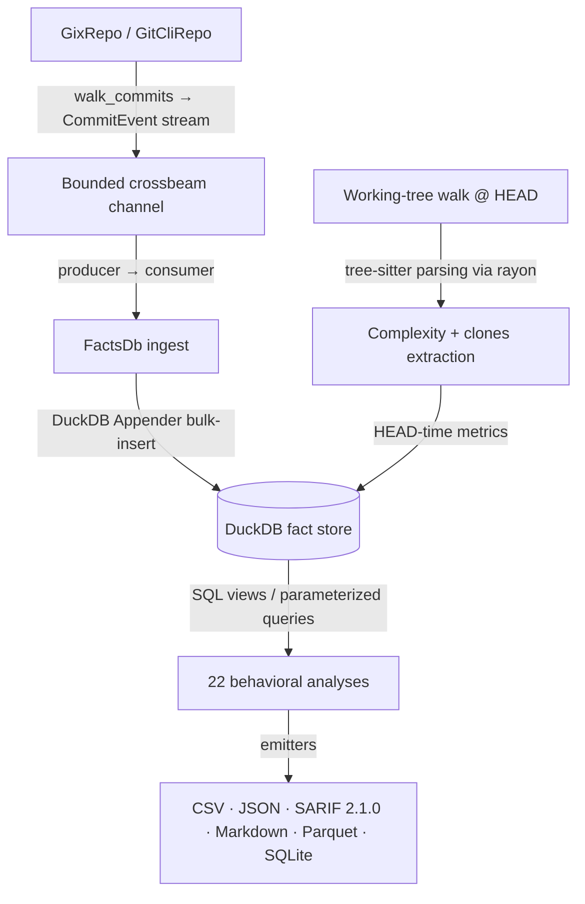

# CodeLore — Deep Codebase Analysis Report

This document presents a deep, read-only analysis of the **CodeLore** codebase. It documents the validation of recent fixes and outlines newly identified recommendations for further correctness, robustness, and performance improvements.

---

## 1. Architectural Overview & Pipeline Data Flow

CodeLore is structured as a multi-crate Rust workspace comprising three main components:
*   [codelore-rca](file:///Users/emrec/Projects/playground/codelore/crates/codelore-rca): A vendored fork of Mozilla's `rust-code-analysis` providing structural syntax hashing and complexity metrics.
*   [codelore-lib](file:///Users/emrec/Projects/playground/codelore/crates/codelore-lib): The core engine, handling repository walk abstraction, identity resolution, fact-store management, analyses execution, caching, and output emitters.
*   [codelore-cli](file:///Users/emrec/Projects/playground/codelore/crates/codelore-cli): The command-line frontend that handles arguments parsing, option consolidation, and output routing.

### Data Ingest Flow

1.  **Repository Traversal**:
    *   [GixRepo](file:///Users/emrec/Projects/playground/codelore/crates/codelore-lib/src/repo/gix_repo.rs) uses pure-Rust `gitoxide` libraries to parse refs and traverse commit graphs in parallel to DuckDB writes.
    *   [GitCliRepo](file:///Users/emrec/Projects/playground/codelore/crates/codelore-lib/src/repo/git_cli_repo.rs) shells out to the standard `git` CLI, serving as a differential testing oracle.
2.  **Event Ingestion**:
    *   `duckdb::Connection` is `!Send + !Sync`. To get parallelism, a **Producer-Consumer pattern** is utilized:
        *   The background thread walks commits using `GixRepo` and places [CommitEvent](file:///Users/emrec/Projects/playground/codelore/crates/codelore-lib/src/types.rs) instances onto a bounded `crossbeam-channel`.
        *   The main connection-owning thread consumes these events and bulk-inserts them via DuckDB's fast `Appender` API in [ingest_loop](file:///Users/emrec/Projects/playground/codelore/crates/codelore-lib/src/facts/ingest.rs).
3.  **Complexity and Clones at HEAD**:
    *   In [ingest_complexity_at_head](file:///Users/emrec/Projects/playground/codelore/crates/codelore-lib/src/facts/ingest.rs), a parallel walk scans all "live" (non-deleted) source files at HEAD. Rayon workers compile tree-sitter AST nodes, compute cyclomatic/cognitive/Halstead complexity, deduplicate entities, and serially drain results into the database.
    *   Similarly, [populate_clones_at_head](file:///Users/emrec/Projects/playground/codelore/crates/codelore-lib/src/facts/ingest.rs) extracts function fingerprints to identify structural Type-1 (exact) and Type-2 (renamed/parameterized) clones.
4.  **SQL-Driven Analyses**:
    *   22 behavioral analyses run purely as DuckDB SQL views or parameterized queries over the fact store (e.g. [hotspots.rs](file:///Users/emrec/Projects/playground/codelore/crates/codelore-lib/src/analyses/hotspots.rs), [coupling.rs](file:///Users/emrec/Projects/playground/codelore/crates/codelore-lib/src/analyses/coupling.rs)).

---

## 2. Validation Status of Prior Recommendations

All previous findings and code-maat parity issues have been validated as **fully resolved and correct** in the current codebase (released in version `v0.2.1` and `v0.2.2`):

### Resolved Core Deep-Analysis Findings (F1–F11)
*   **F1 (Commit Chronology Precision)**: Resolved. Promoted `commits.date` from `DATE` to `TIMESTAMP` in schema v2.
*   **F2 (Clone-Coupling Floor Override)**: Resolved. Lowered `min_shared_revs` to the minimum of `min_shared_revs` and `min_clone_shared_revs` in inner `run_coupling` calls.
*   **F3 (Cache Poisoning on Dirty Tree)**: Resolved. Bypasses persistent cache writes when the working tree is dirty, using an in-memory db fallback instead.
*   **F4 (Stale Worktree Cache Root Path)**: Resolved. Updates `prune_stale_worktrees` to resolve namespaced paths using `default_cache_root()`.
*   **F5 (Sum of Coupling max_changeset_size pre-filter)**: Resolved. Added the `good_commits` CTE to pre-filter large commits in `soc`.
*   **F6 (Tempdir Leak on Git Failure)**: Resolved. Delayed `tmp.keep()` until after successful `git worktree add`.
*   **F7 (Cache Bypass for Parquet/SQLite)**: Resolved. Narrowed `needs_writable_db` to SQLite format only; Parquet output now successfully hits and reads from the persistent cache database.
*   **F8 (Positional Alignment in GitCliRepo Zipping)**: Resolved. Replaced index-based zipping in `git_cli_repo.rs:parse_changes_block` with an explicit `HashMap` join on destination path keys, preventing column shifting on submodule/binary mismatches.
*   **F9 (Single-Threaded Commit Traversal)**: Resolved. Configured `GixRepo::walk_commits` to parse commits and calculate diffs concurrently on a Rayon thread pool (`into_par_iter()`).
*   **F10 (Tree-Sitter File Size Cap)**: Resolved. Applied a 2 MB size cap (`DEFAULT_MAX_AST_FILE_BYTES`) across complexity and clone scanner sites to skip oversized files.
*   **F11 (Dirty Status Untracked Parity)**: Resolved. Switched `GixRepo::is_worktree_dirty` from `into_index_worktree_iter` to `into_iter()` to traverse and capture untracked files.
*   **Original Findings (Complexity LOC mapping, Quoted paths, Namespaced tmp cache, SQL case rewriter)**: Verified as fully integrated.

### Resolved Core Deep-Analysis Findings (F12–F17) (shipped in v0.2.2)
*   **F12 (Same-Second Tiebreaker)**: Resolved. Promoted `commits.rowid ASC` (DuckDB insertion order = gix walk order = child-before-parent) to replace SHA-1 lexicographical ordering, ensuring topologically correct sorting of same-second commits.
*   **F13 (Walker Memory Efficiency)**: Resolved. Implemented a chunked Rayon walker (1000-OID batches) streaming through a bounded crossbeam channel to limit memory usage and avoid OOM crashes on large repos.
*   **F14 (Time-Bucket Crash)**: Resolved. Added the `AnalysisName::supports_time_bucket()` validation check at the CLI boundary to reject `--time-bucket` for the 10 analyses that do not materialize or support `changes_bucketed`.
*   **F15 (Silent Empty Joins)**: Resolved. Handled by the same CLI-boundary validation check to prevent joining date-string bucket keys against SHA-1 commit hashes.
*   **F16 (Deleted Files in reports)**: Resolved. Restricted `code-age` (using an anchor-aware CTE) and `entity-churn` (using a live-at-HEAD CTE) to active files only.
*   **F17 (Standalone clones thread speed)**: Resolved. Refactored `run_clones` into a two-phase walk (serial gather followed by parallel function extraction/grouping via Rayon `into_par_iter()`).

### Resolved Code-Maat Parity Findings (PAR-1–PAR-9)
*   All parity findings (Bird et al. per-entity risk authors logic, back-testing dates anchor, interval-month ceiling calculations, CSV header mapping, average-revs pivot points, and research foundations documentation) have been fully closed.
*   **DEEP-1 to DEEP-15 (Code-Maat Exact Parity)**: Verified. Additional sprints in `v0.2.1` closed precise output formatting mismatches (7-column verbose shape for coupling, ceiling-rounded averages, integer-truncated strengths, and hyphenated statistic names in `summary` output under `--code-maat-compat`).

### Resolved Core Deep-Analysis Findings (F18–F21) (shipped in v0.3.1)
*   **F18 (Knowledge-Islands Back-testing)**: Resolved. Applied the `commits.date <= anchor` filter across all CTEs in `knowledge_islands.rs` to guarantee proper temporal isolation in back-testing mode.
*   **F19 (Clone-Coupling Truncation)**: Resolved. Updated `clone_coupling.rs` to call `opts.with_no_row_limit()` for the inner `run_knowledge_islands` sub-analysis, avoiding incorrect truncation of the at-risk file set.
*   **F20 (HTML Render Freeze)**: Resolved. Implemented incremental page-based rendering (page size 500) and page controls (Show next 500 / Show all) in `html.rs` to prevent blocking the browser's UI thread on large outputs.
*   **F21 (GitHub Action Wrapper)**: Resolved. Added automatic `v`-prefix normalisation, authenticated curl headers (via runner token), and pure-bash absolute path resolution to `action.yml`.

### Resolved Core Deep-Analysis Findings (F22–F25) (shipped in v0.3.1)
*   **F22 (Same-Second Rename Chaining)**: Resolved. Recursive CTE now carries `commits.rowid` and breaks date-ties via `co.rowid < l.current_rowid`. Regression test in `same_second_rename_test.rs`.
*   **F23 (Concurrent Cache Writes)**: Resolved. Tmp database cache filename now suffixed with `std::process::id()`; stale `.tmp.<pid>` artifacts swept by the pruner.
*   **F24 (Cache Directory Collection Walk Error Handling)**: Resolved. `collect_duckdb_files_inner` now log-and-skips per directory/entry instead of propagating errors.
*   **F25 (WAL File Cleanup)**: Resolved. `delete_duckdb_with_companion` also removes `.wal`; `cleanup_stale_tmp_files` age-gates `.tmp.<pid>` artifacts (1h).

### Resolved Core Deep-Analysis Findings (F26–F28) (shipped in v0.3.1 / commit 61b3c47)
*   **F26 (Implied-HEAD Range Parsing)**: Resolved. Updated `parse_rev_range` to default empty splits to `"HEAD"`. Added 3 regression tests in `prune_tests`.
*   **F27 (Parallel Commit Filtering)**: Resolved. Defer `find_commit` and filtering to parallel Rayon workers inside `process_commit_oid` (returning `Result<Option<CommitEvent>>`), completely eliminating the serial filtering loop on the main thread and preserving the `rowid` walk-order invariant.
*   **F28 (Worktree Prune Metadata Cleanup)**: Resolved. Swapped the order in `prune_stale_worktrees` to run the directory cleanup sweep *before* executing `git worktree prune`, ensuring Git immediately detects deleted directories and cleans up its administrative metadata in the same run.

### Resolved Core Deep-Analysis Findings (F29–F34)
*   **F29 (Time-Bucket Changeset Size Pre-Filter)**: Resolved. The `good_commits_cte` now counts files per physical commit before collapsing to a time bucket.
*   **F30 (Relative-Path Skip Checks for Clones)**: Resolved. The hardcoded directories `.git`, `target`, and `node_modules` are now checked against the repo-relative path rather than the full absolute path of the files.
*   **F31 (Aliases Duplicate Join Prevention)**: Resolved. Joins on `author_aliases` now use a canonical-deduplicated subquery, preventing inflated churn/revisions counts for multi-email authors.
*   **F32 (Base Cache SHA Validation)**: Resolved. The base analysis cache loading checks that `cached.sha == base_sha` before cache hit, preventing cache poisoning from stale or branch mismatch commits.
*   **F33 (Consistent Repo Path Canonicalization)**: Resolved. Both cache key calculation and cache path resolution canonicalize the repository path before hashing, avoiding cache misses when switching between relative (`.`) and absolute paths.
*   **F34 (Binary/Large File Diff Check)**: Resolved. `count_loc` checks for files larger than 1MB or containing NUL bytes in the first 8KB, and skips diffing, preventing OOM/CPU spikes and returning `(0, 0)`.

---

## 3. Newly Identified Gaps & Recommendations

### F35: Correctness — Incorrect Numstat Join Key in Renames under `GitCliRepo`

**The Problem**:
In [git_cli_repo.rs:527](file:///Users/emrec/Projects/playground/codelore/crates/codelore-lib/src/repo/git_cli_repo.rs#L527), `parse_numstat_with_key` splits the path on `" => "` to find the destination file key. However, Git formats directory or shared-prefix renames with curly braces or parentheses (e.g., `src/{old => new}.rs` or `src/{ => new}/foo.rs`). When this occurs, the split returns a key containing parts of the braces (like `new.rs}`), which does not match the actual path in the raw line stream (e.g., `src/new.rs`).

**The Impact**:
The join between the numstat and raw streams fails for complex renames, silently returning `(0, 0)` line counts for those files.

**Recommended Fix**:
Implement a robust rename path parser in `parse_numstat_with_key` that expands curly braces / parenthesized rename paths (e.g. `path/{old => new}/file.ext` to `path/new/file.ext`) to align the join key with the destination path.

### F36: Correctness / Robustness — Parameter Mismatch Crash in `entity-effort` `--explain` Mode

**The Problem**:
In [entity_effort.rs:48](file:///Users/emrec/Projects/playground/codelore/crates/codelore-lib/src/analyses/entity_effort.rs#L48), `explain_if_requested` is invoked with `params![opts.min_revs, row_limit]`. However, the SQL query used in `entity-effort` only contains a single `?` placeholder (for `LIMIT`).

**The Impact**:
Running `codelore analyze --analysis entity-effort --explain` crashes with a fatal query error (`Got 2, needed 1`).

**Recommended Fix**:
Update the parameter list passed to `explain_if_requested` in `entity_effort.rs` to only bind `params![row_limit]`.

### F37: Correctness / Robustness — Parameter Mismatch Crash in `clone-coupling` `--explain` Mode

**The Problem**:
In [clone_coupling.rs:172](file:///Users/emrec/Projects/playground/codelore/crates/codelore-lib/src/analyses/clone_coupling.rs#L172), `explain_if_requested` is invoked with `[]` (no parameters). However, the query `CLONE_PAIRS_SQL` contains two `?` placeholders (for `node_count >= ?` and `similarity >= ?`).

**The Impact**:
Running `codelore analyze --analysis clone-coupling --explain` crashes with a fatal query error (`Got 0, needed 2`).

**Recommended Fix**:
Pass `params![opts.min_clone_node_count, opts.clone_similarity_floor]` to `explain_if_requested` in `clone_coupling.rs`.

### F38: Performance — Quadratic Complexity in Kamei History and Experience Enrichment

**The Problem**:
In [kamei/mod.rs:130](file:///Users/emrec/Projects/playground/codelore/crates/codelore-lib/src/kamei/mod.rs#L130) and [kamei/mod.rs:214](file:///Users/emrec/Projects/playground/codelore/crates/codelore-lib/src/kamei/mod.rs#L214), Kamei features (`ndev`, `nuc`, `sexp`) are enriched using cross-commit joins on path matching (`pchg.path = cchg.path`) and directory matching. For very active files (e.g. `package.json`, `Cargo.toml`) changed thousands of times, the join produces a quadratic number of rows (`O(changes_per_path^2)`).

**The Impact**:
Analyzing large repositories with highly active files can lead to severe slowdowns, high memory overhead, and potential DuckDB temporary file/disk space exhaustion.

**Recommended Fix**:
Optimize the history and experience enrichment logic by utilizing pre-aggregates or staging temporary tables rather than full self-joins on historical changes.

### F39: Correctness — Merge Commit Diffs Behavioral Divergence in `GixRepo` vs `GitCliRepo`

**The Problem**:
When `--include-merges` is enabled, `GixRepo` calculates file changes for merge commits by diffing the merge commit's tree against its first parent's tree. However, `GitCliRepo` relies on `git log --raw --numstat` which by default omits diffs for merge commits entirely.

**The Impact**:
Significant discrepancies in results (such as hotspots scores, churn, and coupling metrics) between the `GixRepo` and `GitCliRepo` backends when merge commits are included.

**Recommended Fix**:
Ensure behavior convergence by either passing the `-m` flag to `git log` inside `GitCliRepo` (to force merge diffs against the first parent), or skipping diff generation for merge commits in `GixRepo` when matching standard Git log behavior.

---

## 4. Summary of Active Findings

Below is the register of active improvement opportunities and bugs:

| ID | Category | Finding / Improvement Point | Priority / Risk | Impact | Status |
|---|---|---|---|---|---|
| **F35** | Correctness | Incorrect rename path key parsing for braces/parentheses under `GitCliRepo`. | **High** / Medium | Silence-yield of `(0, 0)` line counts for complex/directory renames. | Active |
| **F36** | Correctness | Parameter mismatch crash in `entity-effort` `--explain` mode. | **Medium** / Low | Fatal database query crash when executing entity-effort analysis with `--explain`. | Active |
| **F37** | Correctness | Parameter mismatch crash in `clone-coupling` `--explain` mode. | **Medium** / Low | Fatal database query crash when executing clone-coupling analysis with `--explain`. | Active |
| **F38** | Performance | Quadratic self-join complexity in Kamei history and experience enrichment. | **Medium** / Medium | Large CPU/disk overhead on massive repositories with highly active files. | Active |
| **F39** | Correctness | Merge commit changes divergence between `GixRepo` and `GitCliRepo`. | **High** / Medium | Mismatched analysis metrics when merges are included in the walk. | Active |

---

## 5. Proposed Verification Plan for New Findings

### F35 (GitCliRepo rename path key parsing)
*   **Verification**: Run a diff/log analysis under `GitCliRepo` on a repository with a directory rename (e.g. `src/{old_dir => new_dir}/file.rs`). Verify that the parsed line additions and deletions are correctly associated with the file instead of falling back to `(0, 0)`.

### F36 (entity-effort explain mode)
*   **Verification**: Run `codelore analyze --analysis entity-effort --explain`. Verify that the execution prints the DuckDB EXPLAIN plan instead of crashing with a parameter count mismatch.

### F37 (clone-coupling explain mode)
*   **Verification**: Run `codelore analyze --analysis clone-coupling --explain`. Verify that the execution prints the DuckDB EXPLAIN plan instead of crashing with a parameter count mismatch.

### F38 (Kamei enrichment performance)
*   **Verification**: Run `codelore` JIT Kamei feature enrichment on a repository with a large commit history containing a file modified >5,000 times. Monitor processing time and verify it finishes within acceptable limits without massive memory leaks or disk blowup.

### F39 (Merge commit changes divergence)
*   **Verification**: Run both `GixRepo` and `GitCliRepo` analyses on a repository with `--include-merges` enabled and compare the change counts for a merge commit. Ensure that both backends report identical lists of changed files and line counts.
