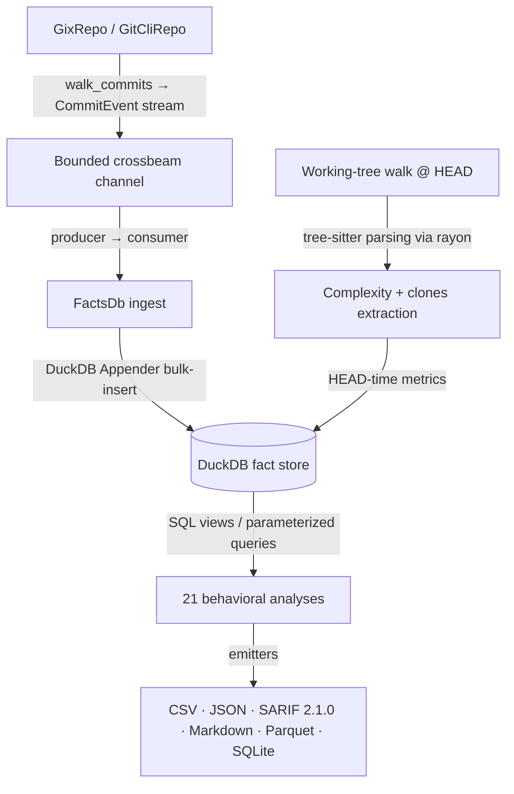

# CodeLore — Deep Codebase Analysis Report

This document presents a deep, read-only analysis of the **CodeLore** codebase. It highlights core architectural patterns, documents the validation status of recent fixes, and outlines remaining and newly identified recommendations for further improvement.

---

## 1. Architectural Overview & Pipeline Data Flow

CodeLore is structured as a multi-crate Rust workspace comprising three main components:
*   [codelore-rca](file:///Users/emrec/Projects/playground/codescene/crates/codelore-rca): A vendored fork of Mozilla's `rust-code-analysis` providing structural syntax hashing and complexity metrics.
*   [codelore-lib](file:///Users/emrec/Projects/playground/codescene/crates/codelore-lib): The core engine, handling repository walk abstraction, identity resolution, fact-store management, analyses execution, caching, and output emitters.
*   [codelore-cli](file:///Users/emrec/Projects/playground/codescene/crates/codelore-cli): The command-line frontend that handles arguments parsing, option consolidation, and output routing.

### Data Ingest Flow



1.  **Repository Traversal**:
    *   [GixRepo](file:///Users/emrec/Projects/playground/codescene/crates/codelore-lib/src/repo/gix_repo.rs) uses pure-Rust `gitoxide` libraries to parse refs and traverse commit graphs in parallel to DuckDB writes.
    *   [GitCliRepo](file:///Users/emrec/Projects/playground/codescene/crates/codelore-lib/src/repo/git_cli_repo.rs) shells out to the standard `git` CLI, serving as a differential testing oracle.
2.  **Event Ingestion**:
    *   `duckdb::Connection` is `!Send + !Sync`. To get parallelism, a **Producer-Consumer pattern** is utilized:
        *   The background thread walks commits using `GixRepo` and places [CommitEvent](file:///Users/emrec/Projects/playground/codescene/crates/codelore-lib/src/types.rs#L44-L57) instances onto a bounded `crossbeam-channel`.
        *   The main connection-owning thread consumes these events and bulk-inserts them via DuckDB's fast `Appender` API in [ingest_loop](file:///Users/emrec/Projects/playground/codescene/crates/codelore-lib/src/facts/ingest.rs#L402-L460).
3.  **Complexity and Clones at HEAD**:
    *   In [ingest_complexity_at_head](file:///Users/emrec/Projects/playground/codescene/crates/codelore-lib/src/facts/ingest.rs#L87-L162), a parallel walk scans all "live" (non-deleted) source files at HEAD. Rayon workers compile tree-sitter AST nodes, compute cyclomatic/cognitive/Halstead complexity, deduplicate entities, and serially drain results into the database.
    *   Similarly, [populate_clones_at_head](file:///Users/emrec/Projects/playground/codescene/crates/codelore-lib/src/facts/ingest.rs#L164-L262) extracts function fingerprints to identify structural Type-1 (exact) and Type-2 (renamed/parameterized) clones.
4.  **SQL-Driven Analyses**:
    *   21 behavioral analyses run purely as DuckDB SQL views or parameterized queries over the fact store (e.g. [hotspots.rs](file:///Users/emrec/Projects/playground/codescene/crates/codelore-lib/src/analyses/hotspots.rs), [coupling.rs](file:///Users/emrec/Projects/playground/codescene/crates/codelore-lib/src/analyses/coupling.rs)).

---

## 2. Newly Identified Critical Gaps & Recommendations

### 🚨 Correctness Bug (Regression): CLI Exit Code Mismatch on Pre-flight Failures

**The Problem**:
In the recently introduced pre-flight banner validation inside [main.rs](file:///Users/emrec/Projects/playground/codescene/crates/codelore-cli/src/main.rs#L741-L843), checks for repository path presence (`!args.repo.exists()`), empty repository (`repo.head_sha()`), and output directory writability (`!parent.exists()`) return generic `anyhow::Error`s via `anyhow::bail!`. Because these errors are not typed or wrapped in `codelore_lib::CodeLoreError` (e.g. `CodeLoreError::Repo` or `CodeLoreError::Output`), the CLI's `main` exit code mapping logic falls back to exit code `1` instead of returning code `3` (for repository errors) or `5` (for output/I/O errors). This breaks the `invalid_repo_exits_with_code_3` integration test and violates spec §6.6.

**The Impact**:
Tool orchestrators, scripts, and test environments expecting standardized exit codes receive `1` on pre-flight errors, causing validation failures and breaking backwards-compatibility.

**Recommended Fix**:
In [main.rs](file:///Users/emrec/Projects/playground/codescene/crates/codelore-cli/src/main.rs), return `Err(codelore_lib::CodeLoreError::Repo(...).into())` or `Err(codelore_lib::CodeLoreError::Output(...).into())` instead of utilizing `anyhow::bail!`.

---

### 🚨 Correctness Bug: Rename Lineage CTE Ignores Chronological Ordering on Name Reuse

**The Problem**:
In [ingest.rs](file:///Users/emrec/Projects/playground/codescene/crates/codelore-lib/src/facts/ingest.rs#L735-L767), the `materialize_path_lineage` function builds a rename graph via a recursive CTE `lineage` that joins on `c.rename_from = l.current`. However, it does not join on or filter by the commit date/chronology. If a filename is reused over time (e.g., file `A` is renamed to `B` in commit 1, and much later in commit 10 a new/different file `C` is renamed to `A`), the recursive query joins the lineage of `C` with the historical rename of `A -> B`, producing a false lineage trace of `C -> A -> B`.

**The Impact**:
Rename-aware aggregations will erroneously merge the metrics/revision counts of chronologically distinct files that happened to share a recycled path, distorting hotspot scoring and change coupling.

**Recommended Fix**:
Incorporate commit ordering/dates in `materialize_path_lineage`'s recursive join to ensure that renames are only joined if the destination rename occurred chronologically after the current path's introduction.

---

### ⚡ Performance Bottleneck: `GixRepo` Walk Lacks Date-Filter Pruning

**The Problem**:
In [gix_repo.rs](file:///Users/emrec/Projects/playground/codescene/crates/codelore-lib/src/repo/gix_repo.rs#L24-L83), applying `after` and `before` date filters requires walking the entire repository commit history (`repo.rev_walk([head]).all()`) and checking each commit's date in Rust. In contrast, the `GitCliRepo` oracle passes date filters directly to `git log` (e.g. `--after`), letting Git prune the commit graph traversal.

**The Impact**:
For large repositories with hundreds of thousands of commits, running an analysis with a date filter (e.g., `--after 2026-06-01` to check the last week) takes virtually the same time as walking the entire repo history, negating the expected performance gain of date filtering.

**Recommended Fix**:
Leverage gitoxide's graph-filtering/pruning facilities in `GixRepo::walk_commits` to cut off or prune the traversal once commits fall outside the requested date range, rather than loading every historic commit object.

---

### ⚠️ Usability Issue: Inconsistent short-circuit for Clones analysis in non-CSV formats

**The Problem**:
In [main.rs](file:///Users/emrec/Projects/playground/codescene/crates/codelore-cli/src/main.rs#L173-L181), there is a short-circuit for `clones` analysis:
```rust
if matches!(analysis, AnalysisName::Clones) && format == "csv" {
    let rows = codelore_lib::analyses::clones::run_clones(&opts).context("run clones")?;
    codelore_lib::output::csv::write_clones_csv(&rows, &mut out).context("write csv")?;
    return Ok(());
}
```
This short-circuit bypasses opening the git repo and history ingestion completely because `clones` is a head-only filesystem walk.
However, this check is only active when `format == "csv"`. If the user requests `json`, `markdown`, or `sarif` formats for `clones` analysis, it falls through to the normal path, which opens and ingests the repository.

**The Impact**:
Running clones analysis in formats other than CSV unnecessarily takes much longer (opening/ingesting the git repo history), and fails completely in non-git directories, even though clones analysis does not use git history.

**Recommended Fix**:
Modify the short-circuit in `main.rs` to trigger for `AnalysisName::Clones` regardless of `format`, and match on `format` within the short-circuit block to write output using the corresponding clones emitter (`write_clones_csv`, `write_clones_json`, `write_clones_markdown`, `write_clones_sarif`).

---

### ⚠️ Cache Invalidation Gap: Missing checks for dirty working trees

**The Problem**:
The cache key (computed in `cache_key` in [cache.rs](file:///Users/emrec/Projects/playground/codescene/crates/codelore-lib/src/cache.rs#L30)) is derived from the repository path, HEAD SHA, options/knobs, package version, and schema version. It does NOT include any status of the working tree (whether there are uncommitted/unstaged changes, or a hash of the working tree files).

**The Impact**:
If a user runs `codelore analyze` on a repository with uncommitted changes, they get an analysis of the dirty files. If they then modify the files further (without committing) and run `codelore analyze` again, the cache key remains identical because the HEAD SHA has not changed. The cache hit opens the read-only cached DuckDB file, returning stale metrics that do not reflect the new working tree modifications.

**Recommended Fix**:
Incorporate a fast check of worktree dirtiness (e.g. checking git status or checking mtimes of the monitored directories) or have the CLI warn the user or optionally invalidate cache entries when local modifications are detected.

---

### ⚠️ Functional Gap: Inconsistent Rename-Awareness in `communication` Analysis

**The Problem**:
The Conway's law shared-work author pairs analysis (`communication` analysis) aggregates paths to find co-authorship on the same files (`COUNT(DISTINCT a.path) AS shared`). However, unlike other path-aggregating analyses (e.g. `entity_effort`, `messages`, `ownership`), `run_communication` in [communication.rs](file:///Users/emrec/Projects/playground/codescene/crates/codelore-lib/src/analyses/communication.rs#L62) does NOT materialize the canonical lineage view (`materialize_source`) or call `rewrite` on the SQL query.

**The Impact**:
If a file was renamed, edits before and after the rename are treated as edits to different files (`src/old.rs` vs `src/new.rs`). Therefore, two authors who co-edited the same file (one before the rename, one after) will not be counted as having a shared file in the communication analysis, underestimating the team's shared work.

**Recommended Fix**:
Make `communication` analysis rename-aware by materializing the lineage source and rewriting the SQL query inside `run_communication` (similar to how `entity_effort` or `ownership` does it).

---

## Summary of Findings

| Category | Finding / Improvement Point | Priority / Risk | Impact | Status / Fix |
|---|---|---|---|---|
| **Correctness** | Pre-flight error handling returns exit code `1` instead of `3`/`5` due to generic `anyhow::bail!`. | **High** / Medium | Fails `invalid_repo_exits_with_code_3` test; violates exit code spec §6.6. | **Fixed** (Unreleased — pre-flight bails now return typed `CodeLoreError::Repo` / `Output` so `main()`'s chain-walk picks them up) |
| **Correctness** | Rename lineage CTE ignores chronological ordering, tracing spurious lineages on path reuse. | **High** / Medium | Distorts analysis metrics for recycled paths. | **Fixed** (Unreleased — `materialize_path_lineage` CTE joins `commits.date` and constrains recursion with `co.date > l.current_date`) |
| **Performance** | `GixRepo` date-range walk filters in memory instead of pruning graph traversal. | **Medium** / Low | Walking with `--after`/`--before` is slow on large history repos. | **Fixed** (Unreleased — `--after` now uses gix `Sorting::ByCommitTimeCutoff` for graph pruning; `--before` retains the in-memory filter since gix has no symmetric primitive) |
| **Usability** | `clones` analysis only short-circuits repository walk/ingest for CSV format. | **Medium** / Low | JSON/Markdown/SARIF clones runs are slow and fail in non-git dirs. | **Fixed** (Unreleased — short-circuit guard now covers all 4 supported formats: csv/json/markdown/sarif) |
| **Caching** | Caching system does not track worktree dirtiness (uncommitted modifications). | **Medium** / Low | Stale cached analysis results on subsequent runs in dirty repositories. | **Fixed** (Unreleased — cache hits on dirty worktrees emit a `tracing::warn!` pointing the user at `--no-cache`; uses gix `Repository::status` for `GixRepo` and `git status --porcelain` for `GitCliRepo`. Auto-invalidation via worktree-hash deferred — adding bytes to the cache key on every run carries a perf cost the warn approach avoids.) |
| **Functional** | `communication` analysis does not support canonical rename lineage tracking. | **Low** / Low | Misses co-authorship on renamed files. | **Fixed** (Unreleased — added `materialize_if_needed` + `lineage::rewrite` pair mirroring peer analyses) |
