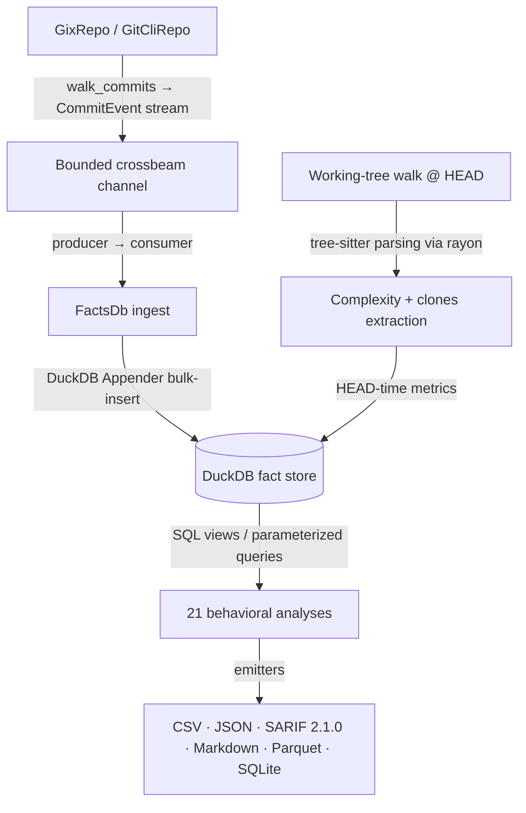

# CodeLore — Deep Codebase Analysis Report

This document presents a deep, read-only analysis of the **CodeLore** codebase. It highlights core architectural patterns, documents the validation status of recent fixes, and outlines remaining and newly identified recommendations for further improvement.

---

## 1. Architectural Overview & Pipeline Data Flow

CodeLore is structured as a multi-crate Rust workspace comprising three main components:
*   [codelore-rca](file:///Users/emrec/Projects/playground/codescene/crates/codelore-rca): A vendored fork of Mozilla's `rust-code-analysis` providing structural syntax hashing and complexity metrics.
*   [codelore-lib](file:///Users/emrec/Projects/playground/codescene/crates/codelore-lib): The core engine, handling repository walk abstraction, identity resolution, fact-store management, analyses execution, caching, and output emitters.
*   [codelore-cli](file:///Users/emrec/Projects/playground/codescene/crates/codelore-cli): The command-line frontend that handles arguments parsing, option consolidation, and output routing.

### Data Ingest Flow



1.  **Repository Traversal**:
    *   [GixRepo](file:///Users/emrec/Projects/playground/codescene/crates/codelore-lib/src/repo/gix_repo.rs) uses pure-Rust `gitoxide` libraries to parse refs and traverse commit graphs in parallel to DuckDB writes.
    *   [GitCliRepo](file:///Users/emrec/Projects/playground/codescene/crates/codelore-lib/src/repo/git_cli_repo.rs) shells out to the standard `git` CLI, serving as a differential testing oracle.
2.  **Event Ingestion**:
    *   `duckdb::Connection` is `!Send + !Sync`. To get parallelism, a **Producer-Consumer pattern** is utilized:
        *   The background thread walks commits using `GixRepo` and places [CommitEvent](file:///Users/emrec/Projects/playground/codescene/crates/codelore-lib/src/types.rs#L44-L57) instances onto a bounded `crossbeam-channel`.
        *   The main connection-owning thread consumes these events and bulk-inserts them via DuckDB's fast `Appender` API in [ingest_loop](file:///Users/emrec/Projects/playground/codescene/crates/codelore-lib/src/facts/ingest.rs#L402-L460).
3.  **Complexity and Clones at HEAD**:
    *   In [ingest_complexity_at_head](file:///Users/emrec/Projects/playground/codescene/crates/codelore-lib/src/facts/ingest.rs#L87-L162), a parallel walk scans all "live" (non-deleted) source files at HEAD. Rayon workers compile tree-sitter AST nodes, compute cyclomatic/cognitive/Halstead complexity, deduplicate entities, and serially drain results into the database.
    *   Similarly, [populate_clones_at_head](file:///Users/emrec/Projects/playground/codescene/crates/codelore-lib/src/facts/ingest.rs#L164-L262) extracts function fingerprints to identify structural Type-1 (exact) and Type-2 (renamed/parameterized) clones.
4.  **SQL-Driven Analyses**:
    *   21 behavioral analyses run purely as DuckDB SQL views or parameterized queries over the fact store (e.g. [hotspots.rs](file:///Users/emrec/Projects/playground/codescene/crates/codelore-lib/src/analyses/hotspots.rs), [coupling.rs](file:///Users/emrec/Projects/playground/codescene/crates/codelore-lib/src/analyses/coupling.rs)).

---

## 2. Newly Identified Gaps & Recommendations

### 🚨 Correctness Bug: `GitCliRepo` Mailmap Name+Email Parity Gap

**The Problem**:
In [git_cli_repo.rs](file:///Users/emrec/Projects/playground/codescene/crates/codelore-lib/src/repo/git_cli_repo.rs#L107), `GitCliRepo` resolves author aliases during commit walking by calling `self.resolve_alias(&event.author_email)`. The `resolve_alias` function format-wraps ONLY the email address as `<{email}>` and runs `git check-mailmap`.
However, `GixRepo` resolves mailmap aliases inside [gix_repo.rs](file:///Users/emrec/Projects/playground/codescene/crates/codelore-lib/src/repo/gix_repo.rs#L147) using a `gix::actor::SignatureRef` which contains **both** the author's name and email address.

**The Impact**:
For `.mailmap` rules that match on name-and-email combinations (e.g., `Canonical Name <canonical@email.com> Old Name <old@email.com>`), `GixRepo` matches the rule successfully using the name, whereas `GitCliRepo` passes only the email and fails to match the rule. This leads to a differential testing mismatch where `GitCliRepo` and `GixRepo` produce different canonical authors for the same commit history.

**Recommended Fix**:
Modify the `resolve_alias` signature (or introduce a new identity resolution method) in the [Repo](file:///Users/emrec/Projects/playground/codescene/crates/codelore-lib/src/repo/mod.rs) trait to accept both name and email, and change `GitCliRepo` to call `git check-mailmap` passing the full formatted `"Name <email>"` identity.

---

### 🚨 Correctness / Functional Bug: Nested Functions Ignored in Clones Analysis AST Walk

**The Problem**:
In the tree-sitter walk inside [extractor.rs](file:///Users/emrec/Projects/playground/codescene/crates/codelore-lib/src/clones/extractor.rs#L51-L88), the `visit` function returns early immediately upon hitting any function-like node kind (e.g., `function_item` in Rust, `function_definition` in Python):
```rust
    if func_kinds.contains(node.kind()) {
        ...
        out.push(FunctionFingerprint { ... });
        return; // Early return prevents traversing subtree
    }
```
Although the comment suggests that nested functions become separate entries via an outer-loop walk, there is actually no outer walk. The early return completely stops traversal for that subtree.

**The Impact**:
Any helper functions, nested functions, or closures defined inside the body of an outer function are completely skipped and are not extracted as separate clone candidates.

**Recommended Fix**:
Rather than returning early, continue traversing the children nodes (or specifically search the function body's subtree) for nested function declarations, while ensuring that the outer function's fingerprint sequence still captures them as structure.

---

### ⚠️ Robustness Issue: Query Rewriter Heuristics Vulnerable to Case Discrepancies

**The Problem**:
The regex-based query rewriter in [lineage.rs](file:///Users/emrec/Projects/playground/codescene/crates/codelore-lib/src/analyses/lineage.rs#L93) identifies table aliases using a case-based heuristic:
```rust
let needs_alias = next.is_empty() || next.chars().next().is_some_and(char::is_uppercase);
```
It assumes that keywords following `FROM changes` (e.g. `GROUP BY`, `WHERE`) are capitalized.

**The Impact**:
If any SQL query uses lowercase keywords (e.g., `from changes group by`), the rewriter will classify `group` as a table alias, rewriting the query to `FROM changes_lineage group BY ...`, which leads to DuckDB parsing/syntax errors.

**Recommended Fix**:
Improve the rewriter heuristic by explicitly matching against known SQL keywords case-insensitively, rather than relying on character case rules.

---

## Summary of Active Findings

| Category | Finding / Improvement Point | Priority / Risk | Impact | Status |
|---|---|---|---|---|
| **Correctness** | `GitCliRepo` calls `git check-mailmap` with only email, missing Name+Email mailmap rules matched by `GixRepo`. | **High** / Medium | Causes mismatch between backends on complex mailmaps. | **Fixed** (Unreleased — `Repo::resolve_alias` trait now takes `(name, email)`; both impls fixed; new mailmap test + differential parity test extended with paired-name probes) |
| **Correctness** | Clones AST extraction skips recursing into function bodies, ignoring nested/inner helper functions. | **High** / Medium | Misses inner/nested function clones entirely. | **Fixed** (Unreleased — removed the early `return;` in `clones/extractor.rs::visit`; nested helpers now get separate fingerprint entries; existing outer-level clone detection unchanged) |
| **Robustness** | Query rewriter regex assumes uppercase SQL keywords, breaking on lowercase syntax. | **Low** / Low | Potential parser/syntax errors for lowercase queries. | **Active — deferred to v0.1.4** (theoretical: all current SQL uses uppercase keywords; no live trigger; latent risk if future contributor adds lowercase SQL. Fix is a case-insensitive keyword whitelist in the regex post-processing.) |
