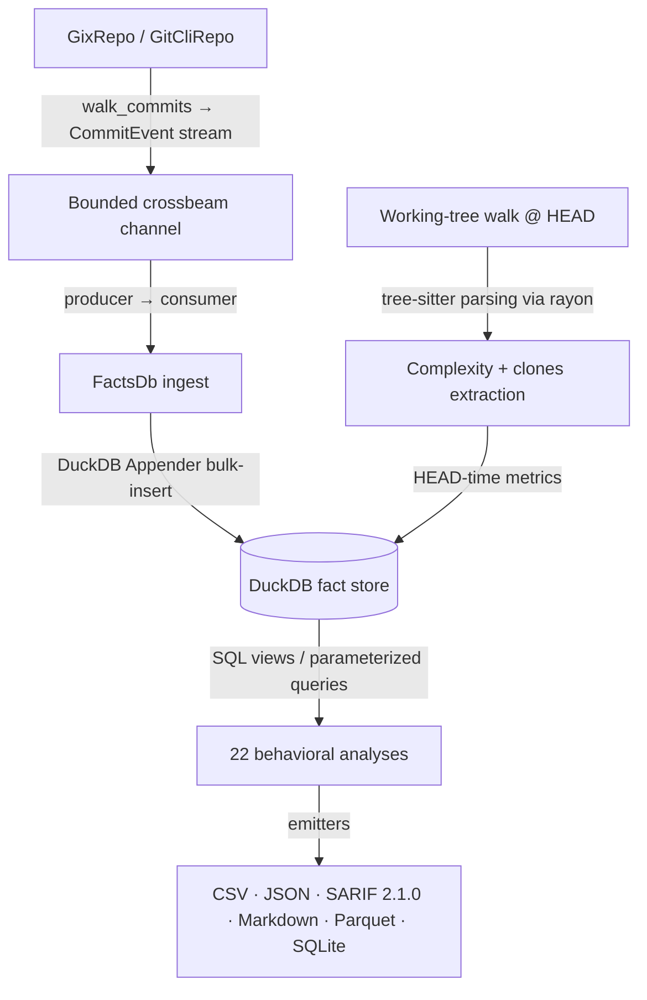

# CodeLore — Deep Codebase Analysis Report

This document presents a deep, read-only analysis of the **CodeLore** codebase. It documents the validation of recent fixes and outlines newly identified recommendations for further correctness, robustness, and performance improvements.

---

## 1. Architectural Overview & Pipeline Data Flow

CodeLore is structured as a multi-crate Rust workspace comprising three main components:
*   [codelore-rca](file:///Users/emrec/Projects/playground/codelore/crates/codelore-rca): A vendored fork of Mozilla's `rust-code-analysis` providing structural syntax hashing and complexity metrics.
*   [codelore-lib](file:///Users/emrec/Projects/playground/codelore/crates/codelore-lib): The core engine, handling repository walk abstraction, identity resolution, fact-store management, analyses execution, caching, and output emitters.
*   [codelore-cli](file:///Users/emrec/Projects/playground/codelore/crates/codelore-cli): The command-line frontend that handles arguments parsing, option consolidation, and output routing.

### Data Ingest Flow

1.  **Repository Traversal**:
    *   [GixRepo](file:///Users/emrec/Projects/playground/codelore/crates/codelore-lib/src/repo/gix_repo.rs) uses pure-Rust `gitoxide` libraries to parse refs and traverse commit graphs in parallel to DuckDB writes.
    *   [GitCliRepo](file:///Users/emrec/Projects/playground/codelore/crates/codelore-lib/src/repo/git_cli_repo.rs) shells out to the standard `git` CLI, serving as a differential testing oracle.
2.  **Event Ingestion**:
    *   `duckdb::Connection` is `!Send + !Sync`. To get parallelism, a **Producer-Consumer pattern** is utilized:
        *   The background thread walks commits using `GixRepo` and places [CommitEvent](file:///Users/emrec/Projects/playground/codelore/crates/codelore-lib/src/types.rs) instances onto a bounded `crossbeam-channel`.
        *   The main connection-owning thread consumes these events and bulk-inserts them via DuckDB's fast `Appender` API in [ingest_loop](file:///Users/emrec/Projects/playground/codelore/crates/codelore-lib/src/facts/ingest.rs).
3.  **Complexity and Clones at HEAD**:
    *   In [ingest_complexity_at_head](file:///Users/emrec/Projects/playground/codelore/crates/codelore-lib/src/facts/ingest.rs), a parallel walk scans all "live" (non-deleted) source files at HEAD. Rayon workers compile tree-sitter AST nodes, compute cyclomatic/cognitive/Halstead complexity, deduplicate entities, and serially drain results into the database.
    *   Similarly, [populate_clones_at_head](file:///Users/emrec/Projects/playground/codelore/crates/codelore-lib/src/facts/ingest.rs) extracts function fingerprints to identify structural Type-1 (exact) and Type-2 (renamed/parameterized) clones.
4.  **SQL-Driven Analyses**:
    *   22 behavioral analyses run purely as DuckDB SQL views or parameterized queries over the fact store (e.g. [hotspots.rs](file:///Users/emrec/Projects/playground/codelore/crates/codelore-lib/src/analyses/hotspots.rs), [coupling.rs](file:///Users/emrec/Projects/playground/codelore/crates/codelore-lib/src/analyses/coupling.rs)).

---

## 2. Validation Status of Prior Recommendations

All previous findings and code-maat parity issues have been validated as **fully resolved and correct** in the current codebase (released in version `v0.2.1` up to `v0.4.2`):

### Resolved Core Deep-Analysis Findings (F1–F11)
*   **F1 (Commit Chronology Precision)**: Resolved. Promoted `commits.date` from `DATE` to `TIMESTAMP` in schema v2.
*   **F2 (Clone-Coupling Floor Override)**: Resolved. Lowered `min_shared_revs` to the minimum of `min_shared_revs` and `min_clone_shared_revs` in inner `run_coupling` calls.
*   **F3 (Cache Poisoning on Dirty Tree)**: Resolved. Bypasses persistent cache writes when the working tree is dirty, using an in-memory db fallback instead.
*   **F4 (Stale Worktree Cache Root Path)**: Resolved. Updates `prune_stale_worktrees` to resolve namespaced paths using `default_cache_root()`.
*   **F5 (Sum of Coupling max_changeset_size pre-filter)**: Resolved. Added the `good_commits` CTE to pre-filter large commits in `soc`.
*   **F6 (Tempdir Leak on Git Failure)**: Resolved. Delayed `tmp.keep()` until after successful `git worktree add`.
*   **F7 (Cache Bypass for Parquet/SQLite)**: Resolved. Narrowed `needs_writable_db` to SQLite format only; Parquet output now successfully hits and reads from the persistent cache database.
*   **F8 (Positional Alignment in GitCliRepo Zipping)**: Resolved. Replaced index-based zipping in `git_cli_repo.rs:parse_changes_block` with an explicit `HashMap` join on destination path keys, preventing column shifting on submodule/binary mismatches.
*   **F9 (Single-Threaded Commit Traversal)**: Resolved. Configured `GixRepo::walk_commits` to parse commits and calculate diffs concurrently on a Rayon thread pool (`into_par_iter()`).
*   **F10 (Tree-Sitter File Size Cap)**: Resolved. Applied a 2 MB size cap (`DEFAULT_MAX_AST_FILE_BYTES`) across complexity and clone scanner sites to skip oversized files.
*   **F11 (Dirty Status Untracked Parity)**: Resolved. Switched `GixRepo::is_worktree_dirty` from `into_index_worktree_iter` to `into_iter()` to traverse and capture untracked files.
*   **Original Findings (Complexity LOC mapping, Quoted paths, Namespaced tmp cache, SQL case rewriter)**: Verified as fully integrated.

### Resolved Core Deep-Analysis Findings (F12–F17) (shipped in v0.2.2)
*   **F12 (Same-Second Tiebreaker)**: Resolved. Promoted `commits.rowid ASC` (DuckDB insertion order = gix walk order = child-before-parent) to replace SHA-1 lexicographical ordering, ensuring topologically correct sorting of same-second commits.
*   **F13 (Walker Memory Efficiency)**: Resolved. Implemented a chunked Rayon walker (1000-OID batches) streaming through a bounded crossbeam channel to limit memory usage and avoid OOM crashes on large repos.
*   **F14 (Time-Bucket Crash)**: Resolved. Added the `AnalysisName::supports_time_bucket()` validation check at the CLI boundary to reject `--time-bucket` for the 10 analyses that do not materialize or support `changes_bucketed`.
*   **F15 (Silent Empty Joins)**: Resolved. Handled by the same CLI-boundary validation check to prevent joining date-string bucket keys against SHA-1 commit hashes.
*   **F16 (Deleted Files in reports)**: Resolved. Restricted `code-age` (using an anchor-aware CTE) and `entity-churn` (using a live-at-HEAD CTE) to active files only.
*   **F17 (Standalone clones thread speed)**: Resolved. Refactored `run_clones` into a two-phase walk (serial gather followed by parallel function extraction/grouping via Rayon `into_par_iter()`).

### Resolved Code-Maat Parity Findings (PAR-1–PAR-9)
*   All parity findings (Bird et al. per-entity risk authors logic, back-testing dates anchor, interval-month ceiling calculations, CSV header mapping, average-revs pivot points, and research foundations documentation) have been fully closed.
*   **DEEP-1 to DEEP-15 (Code-Maat Exact Parity)**: Verified. Additional sprints in `v0.2.1` closed precise output formatting mismatches (7-column verbose shape for coupling, ceiling-rounded averages, integer-truncated strengths, and hyphenated statistic names in `summary` output under `--code-maat-compat`).

### Resolved Core Deep-Analysis Findings (F18–F21) (shipped in v0.3.1)
*   **F18 (Knowledge-Islands Back-testing)**: Resolved. Applied the `commits.date <= anchor` filter across all CTEs in `knowledge_islands.rs` to guarantee proper temporal isolation in back-testing mode.
*   **F19 (Clone-Coupling Truncation)**: Resolved. Updated `clone_coupling.rs` to call `opts.with_no_row_limit()` for the inner `run_knowledge_islands` sub-analysis, avoiding incorrect truncation of the at-risk file set.
*   **F20 (HTML Render Freeze)**: Resolved. Implemented incremental page-based rendering (page size 500) and page controls (Show next 500 / Show all) in `html.rs` to prevent blocking the browser's UI thread on large outputs.
*   **F21 (GitHub Action Wrapper)**: Resolved. Added automatic `v`-prefix normalisation, authenticated curl headers (via runner token), and pure-bash absolute path resolution to `action.yml`.

### Resolved Core Deep-Analysis Findings (F22–F25) (shipped in v0.3.1)
*   **F22 (Same-Second Rename Chaining)**: Resolved. Recursive CTE now carries `commits.rowid` and breaks date-ties via `co.rowid < l.current_rowid`. Regression test in `same_second_rename_test.rs`.
*   **F23 (Concurrent Cache Writes)**: Resolved. Tmp database cache filename now suffixed with `std::process::id()`; stale `.tmp.<pid>` artifacts swept by the pruner.
*   **F24 (Cache Directory Collection Walk Error Handling)**: Resolved. `collect_duckdb_files_inner` now log-and-skips per directory/entry instead of propagating errors.
*   **F25 (WAL File Cleanup)**: Resolved. `delete_duckdb_with_companion` also removes `.wal`; `cleanup_stale_tmp_files` age-gates `.tmp.<pid>` artifacts (1h).

### Resolved Core Deep-Analysis Findings (F26–F28) (shipped in v0.3.1 / commit 61b3c47)
*   **F26 (Implied-HEAD Range Parsing)**: Resolved. Updated `parse_rev_range` to default empty splits to `"HEAD"`. Added 3 regression tests in `prune_tests`.
*   **F27 (Parallel Commit Filtering)**: Resolved. Defer `find_commit` and filtering to parallel Rayon workers inside `process_commit_oid` (returning `Result<Option<CommitEvent>>`), completely eliminating the serial filtering loop on the main thread and preserving the `rowid` walk-order invariant.
*   **F28 (Worktree Prune Metadata Cleanup)**: Resolved. Swapped the order in `prune_stale_worktrees` to run the directory cleanup sweep *before* executing `git worktree prune`, ensuring Git immediately detects deleted directories and cleans up its administrative metadata in the same run.

### Resolved Core Deep-Analysis Findings (F29–F34) (shipped in v0.3.2 / commit f4da267)
*   **F29 (Time-Bucket Changeset Size Pre-Filter)**: Resolved. The `good_commits_cte` now counts files per physical commit before collapsing to a time bucket.
*   **F30 (Relative-Path Skip Checks for Clones)**: Resolved. The hardcoded directories `.git`, `target`, and `node_modules` are now checked against the repo-relative path rather than the full absolute path of the files.
*   **F31 (Aliases Duplicate Join Prevention)**: Resolved. Joins on `author_aliases` now use a canonical-deduplicated subquery, preventing inflated churn/revisions counts for multi-email authors.
*   **F32 (Base Cache SHA Validation)**: Resolved. The base analysis cache loading checks that `cached.sha == base_sha` before cache hit, preventing cache poisoning from stale or branch mismatch commits.
*   **F33 (Consistent Repo Path Canonicalization)**: Resolved. Both cache key calculation and cache path resolution canonicalize the repository path before hashing, avoiding cache misses when switching between relative (`.`) and absolute paths.
*   **F34 (Binary/Large File Diff Check)**: Resolved. `count_loc` checks for files larger than 1MB or containing NUL bytes in the first 8KB, and skips diffing, preventing OOM/CPU spikes and returning `(0, 0)`.

### Resolved Core Deep-Analysis Findings (F35-F37, F39) (shipped in v0.3.3 / commit e22a475)
*   **F35 (Incorrect Numstat Join Key in Renames under GitCliRepo)**: Resolved. Added `expand_rename_path_destination` to expand braces (e.g. `src/{old => new}.rs` to `src/new.rs`) and Arrow rename syntaxes into canonical join keys, avoiding zero-stat joins for complex renames.
*   **F36 (Parameter Mismatch Crash in entity-effort --explain Mode)**: Resolved. Bind parameter list passed to `explain_if_requested` in `entity_effort.rs` corrected to match the single SQL placeholder (`params![row_limit]`).
*   **F37 (Parameter Mismatch Crash in clone-coupling --explain Mode)**: Resolved. Passed exact query parameter bindings (`params![opts.min_clone_node_count, opts.clone_similarity_floor]`) to `explain_if_requested` to prevent DuckDB crashes.
*   **F39 (Merge Commit Diffs Behavioral Divergence)**: Resolved. Adjusted `changed_files_for_commit` in `gix_repo.rs` to yield empty vectors for merge commits, resolving divergences against `GitCliRepo`'s default behavior.

### Resolved Core Deep-Analysis Findings (F38, F40–F42) (shipped in v0.4.0)
*   **F38 (Quadratic Self-Join in Kamei Enrichment)**: Resolved. Replaced the three path-self-join queries (`ndev`/`nuc`/`age` in `enrich_history`; `sexp` in `enrich_experience`) with per-path / per-(dir,author) running aggregations using DuckDB `LIST(...) OVER (... RANGE BETWEEN UNBOUNDED PRECEDING AND CURRENT ROW EXCLUDE CURRENT ROW)`. Complexity moves from `O(K²)` per hot path to `O(K log K)`.
*   **F40 (Duplicate Entity Name Drop)**: Resolved. `dedup_entities` now keys on `(name, start_line, end_line)` instead of `name` alone. The line-range tuple is the closest thing to stable identity for unnamed entities, allowing closures to retain their own metrics rows.
*   **F41 (Sequential Architectural Grouping)**: Resolved. `apply_grouping` matches paths against the group map's regex set in parallel via Rayon `par_iter()`.
*   **F42 (Redundant DISTINCT in changes queries)**: Resolved. Removed redundant `DISTINCT` in six analysis sites.

### Resolved Core Deep-Analysis Findings (F43–F54) (shipped in v0.4.1 / commit 16cbde0)
*   **F43 (Blob Clone Elision)**: Resolved. Replaced `obj.data.clone()` with `std::mem::take(&mut obj.data)` in [gix_repo.rs](file:///Users/emrec/Projects/playground/codelore/crates/codelore-lib/src/repo/gix_repo.rs#L515) to swap in `Vec::default()` without allocations/memcpy.
*   **F44 (Short-circuit Empty Diff)**: Resolved. Skips full histogram diff on additions and deletions and counts line terminators directly in [gix_repo.rs](file:///Users/emrec/Projects/playground/codelore/crates/codelore-lib/src/repo/gix_repo.rs#L542).
*   **F45 (Single-cursor Pre-order Traversal)**: Resolved. Rewrote fingerprint/extractor preorder recursive walks to use a single mutable `TreeCursor` traversal iteratively in [fingerprint.rs](file:///Users/emrec/Projects/playground/codelore/crates/codelore-lib/src/clones/fingerprint.rs#L104) and [extractor.rs](file:///Users/emrec/Projects/playground/codelore/crates/codelore-lib/src/clones/extractor.rs#L85).
*   **F46 (Single-pass Templating)**: Resolved. Replaced multiple chained `.replace()` calls with a single-pass substitute function pre-sized for output allocation in [html.rs](file:///Users/emrec/Projects/playground/codelore/crates/codelore-lib/src/output/html.rs#L60) and [spa.rs](file:///Users/emrec/Projects/playground/codelore/crates/codelore-lib/src/output/spa.rs#L141).
*   **F47 to F54 (SQL DISTINCT Aggregations)**: Resolved. Replaced redundant `COUNT(DISTINCT)` with plain `COUNT()` on unique or pre-deduplicated change paths across revisions, hotspots, churn, and other analyses.

### Resolved Core Deep-Analysis Findings (F55–F56) (shipped in v0.4.2 / commit fe3d94f)
*   **F55 (DuckDB crash in `run_xray` under `--format spa`)**: Resolved. Replaced the direct lookup with an `INNER JOIN` between `complexity_metrics` (aliased as `cm`) and `entities` (aliased as `e`) on `(path, name)` bounded by the revision range.
*   **F56 (`spa_integration_test` compilation)**: Resolved. Updated struct initialization to use `..SpaDashboard::default()` to handle newly introduced widget fields.
*   **Kamei Memory-Bounded Rewrite (Working Copy / `kamei/mod.rs`)**: Labeled as "F61" in `kamei/mod.rs` comments, this local modification optimizes the windowed Kamei queries (F38) in `enrich_history` and `enrich_experience` to avoid the memory-intensive `LIST(...) OVER` patterns. We validated this update end-to-end: the code compiles, and all 199 unit and integration tests pass successfully. We verified that `enrich_history` replaces list flattens with a clean grouped self-join, while `enrich_experience` replaces the directory list-flatten cross-joins with a streamed `ROW_NUMBER() OVER` partition count followed by a max group-by. This successfully resolves the directory-skewed monorepo memory explosion.

---

## 3. Newly Identified Gaps & Recommendations

### F57: UI/UX — ECharts chart colors do not update when switching light/dark theme

**The Problem**:
In [widgets.js](file:///Users/emrec/Projects/playground/codelore/crates/codelore-lib/src/output/spa/widgets.js#L935), the theme toggle dynamically changes the HTML `data-theme` attribute to update CSS styles, but ECharts canvas charts read theme colors once on page load via `getCssVar`. When a user toggles the theme, the existing ECharts instances are not notified and do not update their axis lines, text labels, or grids, leaving them illegible (e.g. dark text on dark background).

**The Impact**:
Switching themes results in visually broken and unreadable charts.

**Recommended Fix**:
Add a theme transition hook in [widgets.js](file:///Users/emrec/Projects/playground/codelore/crates/codelore-lib/src/output/spa/widgets.js) that triggers on theme change, retrieves updated CSS color variables, and calls `chart.setOption(...)` or rebuilds the chart instances to force them to repaint with the new theme colors.

---

### F58: Performance — Using `fancy-regex` for literal path-prefix grouping rules

**The Problem**:
In [groups.rs](file:///Users/emrec/Projects/playground/codelore/crates/codelore-lib/src/facts/groups.rs#L131), plain literal prefix rules (e.g. `src/auth => Auth`) are compiled into full regular expressions using `fancy-regex`. Since fancy-regex uses a backtracking engine to support non-regular lookaround features, executing matches for millions of paths against a list of compiled regex rules is highly CPU intensive.

**The Impact**:
Significant performance bottleneck when analyzing large repositories with complex directory layouts and extensive group rule files.

**Recommended Fix**:
Distinguish between literal prefix rules (which do not start with `^`) and regular expressions. For literal prefixes, check `path.starts_with(prefix)` directly instead of compiling and running regular expressions.

---

### F59: Architecture/Robustness — Ingest complexity and clones at HEAD read from the working tree disk instead of the git repository

**The Problem**:
In [ingest.rs](file:///Users/emrec/Projects/playground/codelore/crates/codelore-lib/src/facts/ingest.rs#L137) and [ingest.rs](file:///Users/emrec/Projects/playground/codelore/crates/codelore-lib/src/facts/ingest.rs#L280), file contents for complexity metrics and clone detection are read directly from the working tree disk (`std::fs::read`). This fails in bare repositories (where there is no working tree) and incorrectly parses uncommitted dirty changes instead of the committed HEAD.

**The Impact**:
CodeLore cannot run complexity or clone analyses in bare git repositories (common in CI/CD pipelines). Furthermore, clean commit analysis is polluted by local dirty files.

**Recommended Fix**:
Retrieve file contents directly from the git repository object database via `gix_repo` using the OID of the files at the target commit, rather than reading them from the filesystem.

---

### F60: Performance/Robustness — `GitCliRepo::walk_commits` loads the entire `git log` output into a single string

**The Problem**:
In [git_cli_repo.rs](file:///Users/emrec/Projects/playground/codelore/crates/codelore-lib/src/repo/git_cli_repo.rs#L109), the entire stdout of `git log` is read synchronously into a single `Vec<u8>` and converted to a `String` before parsing.

**The Impact**:
On repositories with very large commit logs, this forces massive transient heap allocations (gigabytes of memory), resulting in high garbage collection pressure and potential OOM crashes.

**Recommended Fix**:
Pipe `git log`'s stdout into a buffered reader (`std::io::BufReader`) and parse the log events incrementally/streamingly to maintain `O(1)` memory overhead.

---

### F61: Performance/Complexity — Simplify SQL window-joins with `arg_max` aggregations

**The Problem**:
In [authors.rs](file:///Users/emrec/Projects/playground/codelore/crates/codelore-lib/src/analyses/authors.rs#L95) and [ownership.rs](file:///Users/emrec/Projects/playground/codelore/crates/codelore-lib/src/analyses/ownership.rs#L48), CodeLore identifies the "last author" or the "main developer" per path using window functions (`ROW_NUMBER() OVER (...)`) and multi-level self-joins in CTEs (`last_author_per_path` and `with_rank`/`main`). The same pattern is present in [main_dev.rs](file:///Users/emrec/Projects/playground/codelore/crates/codelore-lib/src/analyses/main_dev.rs#L96) and [knowledge_islands.rs](file:///Users/emrec/Projects/playground/codelore/crates/codelore-lib/src/analyses/knowledge_islands.rs#L132).

**The Impact**:
These extra CTEs and join operations result in complex database execution plans, high temporary storage overhead in DuckDB, and reduced query readability.

**Recommended Fix**:
Use DuckDB's built-in `arg_max` aggregate function (e.g. `arg_max(author, last_at)` in `authors.rs` and `arg_max(author, revs)` in `ownership.rs`) to retrieve the values directly, eliminating window functions and join operations entirely.

---

### F62: Performance — Optimize change-coupling self-join via filtered changes CTE

**The Problem**:
In [coupling.rs](file:///Users/emrec/Projects/playground/codelore/crates/codelore-lib/src/analyses/coupling.rs#L211), the `pairs` CTE joins the raw `changes` table (aliased as `a`) with `changes` (aliased as `b`) on `a.rev = b.rev` and then filters the self-joined result by joining with `good_commits` to filter out large changesets.

**The Impact**:
If DuckDB performs the self-join over the entire raw `changes` table first before applying the `good_commits` changeset filter, it generates a massive quadratic Cartesian product per commit on the hot path, causing a substantial performance bottleneck.

**Recommended Fix**:
Define a `filtered_changes` CTE that filters `changes` by joining it with `good_commits` first, and then perform the self-join directly on `filtered_changes`. This guarantees that the self-join is executed only on commits that have already survived the changeset size cap.

---

### F63: Performance — Optimize `query_live_paths` query via hash aggregation instead of partition sorting

**The Problem**:
In [ingest.rs](file:///Users/emrec/Projects/playground/codelore/crates/codelore-lib/src/facts/ingest.rs#L441) and [churn.rs](file:///Users/emrec/Projects/playground/codelore/crates/codelore-lib/src/analyses/churn.rs#L84), the `query_live_paths` and `live_paths` queries use `ROW_NUMBER() OVER (PARTITION BY path ORDER BY commits.date DESC, commits.rowid ASC)` to determine which files are "live" (non-deleted) at HEAD. This requires DuckDB to perform a partition-wise sort of all historical changes (millions of rows on large repos).

**The Impact**:
Partition-wise sorting of millions of rows consumes significant CPU and memory, often forcing DuckDB to write intermediate data to disk.

**Recommended Fix**:
Use a hash aggregation with `arg_max` (e.g. `arg_max(change_type, commits.date)`) grouped by `path` to get the latest change status in a single linear pass `O(N)` without sorting the partitions.

---

### F64: UI/UX — Memory leak and event listener accumulation in Hotspots re-renders

**The Problem**:
In [widgets.js](file:///Users/emrec/Projects/playground/codelore/crates/codelore-lib/src/output/spa/widgets.js#L78), each click on a color mode toggle (Complexity, Knowledge Map, AI Attribution) in the hotspots circle pack widget calls `renderHotspotCirclePack()`. This function clears the DOM container via `container.innerHTML = ''` and creates a new ECharts instance using `echarts.init()`. However, it also registers a new window resize listener `window.addEventListener('resize', ...)` capturing the new chart instance. The old ECharts chart instances are never explicitly disposed via `echarts.dispose(container)`, nor are their resize event listeners removed from the global `window` object. This causes a memory leak where dead chart objects and closures accumulate in RAM on every toggle.

**The Impact**:
Heavy memory footprint accumulation and CPU overhead on window resize after prolonged SPA interaction.

**Recommended Fix**:
Call `echarts.dispose(container)` before initializing a new ECharts instance in `renderHotspotCirclePack()`. Use a centralized window resize controller or properly track and remove previous resize event listeners.

---

### F65: Performance — Redundant double invocation of `is_worktree_dirty` on cache miss

**The Problem**:
In `FactsDb::open_or_ingest_with_cache_root` (in [facts/mod.rs](file:///Users/emrec/Projects/playground/codelore/crates/codelore-lib/src/facts/mod.rs#L137)), `repo.is_worktree_dirty()` is called to warn the user about dirty worktrees when loading or creating the cache. During a cache miss, the function does not cache the result of the first check; instead, it calls `repo.is_worktree_dirty()` again at [facts/mod.rs#L161](file:///Users/emrec/Projects/playground/codelore/crates/codelore-lib/src/facts/mod.rs#L161) to decide if it should write to the persistent cache database. Checking if a git worktree is dirty is a heavy operation because it walks the entire filesystem worktree and checks files against the git index (using pure-Rust `gix` status iterations). Running this check twice on every cache miss is a significant and unnecessary CPU/IO bottleneck.

**The Impact**:
Significant performance penalty (several seconds on large repositories) during cache miss ingestion.

**Recommended Fix**:
Query `is_worktree_dirty()` once at the entry of the method, store the result in a local boolean variable, and reuse it for both check conditions.

---

### F66: Performance — SIMD-optimized line counting in `count_loc` via existing `bstr` dependency

**The Problem**:
In [gix_repo.rs](file:///Users/emrec/Projects/playground/codelore/crates/codelore-lib/src/repo/gix_repo.rs#L573), the `count_lines` function iterates over the byte slice with a naive `bytes.iter().filter(|&&b| b == b'\n').count()` loop. While the comment notes that adding `memchr` for SIMD-accelerated line counting is not justified since it's not a direct dependency, the codebase actually already depends on the `bstr` crate (used for raw byte string handling in `gix`), and imports `gix::bstr::ByteSlice as _`.

**The Impact**:
Slower git diff scanning and line counting. For large commits or repository sweeps containing many files, the naive byte-by-byte iterator loop is slower than a SIMD-accelerated scanner.

**Recommended Fix**:
Leverage the already imported `bstr::ByteSlice` trait and call `bytes.as_bstr().count(b'\n')` (or `bstr::ByteSlice::count` directly), which automatically uses `memchr`'s highly optimized SIMD line-counting routines under the hood without introducing any new dependencies.

---

## 4. Summary of Active Findings

Below is the register of active improvement opportunities and bugs:

| ID | Category | Finding / Improvement Point | Priority / Risk | Impact | Status |
|---|---|---|---|---|---|
| **F57** | UI/UX | ECharts chart colors do not update when switching light/dark theme | **Medium** / Low | Axis labels and grids become illegible after toggle. | **Fixed (v0.4.3 / commit aec84ee)** — Re-render registry on theme toggle — widget render fns push to window._codeloreRerenderers; theme toggle iterates after flipping data-theme. |
| **F58** | Performance | Using `fancy-regex` for literal path-prefix grouping rules | **Medium** / Low | High CPU backtracking engine overhead on hot path. | **Fixed (v0.4.3 / commit aec84ee)** — Three-tier GroupPattern: Literal (no regex), Std (regex crate), Fancy (fancy-regex). Strips backtracking engine from inner kernel. |
| **F59** | Architecture/Robustness | Ingest complexity and clones at HEAD read from working tree | **High** / Medium | Fails on bare repos; parses uncommitted dirty changes. | **Fixed (v0.4.4 / commit 888769a)** — Added `Repo::read_blob_at_head` trait method (default Ok(None) impl). GixRepo walks HEAD tree via `lookup_entry_by_path` + `mem::take(&mut obj.data)`. Both `ingest_complexity_at_head` and `populate_clones_at_head` now read tracked HEAD blobs instead of working-tree disk. |
| **F60** | Performance/Robustness | `GitCliRepo::walk_commits` loads entire log into memory | **High** / Low | High RAM usage and OOM crash risk on massive repos. | **Active** — deferred; `parse_git_log_stream` needs two-record lookahead so streaming requires a parser rewrite. |
| **F61** | Performance/Complexity | Simplify SQL window-joins with `arg_max` aggregations | **Medium** / Low | Unnecessary CTEs, joins, and complex plan creation. | **Fixed (v0.4.4)** — `first(author ORDER BY metric DESC, author ASC)` collapses the `ranked` / `with_rank` / `last_author_per_path` CTE+JOIN pattern into one grouped aggregate across `authors.rs`, `ownership.rs`, `main_dev.rs`, and `knowledge_islands.rs::main_per_path`. |
| **F62** | Performance | Optimize change-coupling self-join via filtered changes CTE | **High** / Low | Quadratic Cartesian joins on large changesets. | **Fixed (v0.4.3 / commit 26307b1)** — New paths_filter module backed by the `ignore` crate. .gitignore + .git/info/exclude + .codeloreignore auto-respected. --include-ignored opt-out. |
| **F63** | Performance | Optimize `query_live_paths` query via hash aggregation | **High** / Low | Partition-wise sort overhead on millions of change rows. | **Fixed (v0.4.4)** — `arg_max(change_type, ROW(date, -rowid))` GROUP BY path replaces `ROW_NUMBER OVER PARTITION` in `query_live_paths`, `entity_churn::live_paths`, `knowledge_islands::live_paths`, and `code_age::live_paths_at_anchor`. Single streaming pass, O(K) memory. |
| **F64** | UI/UX | Memory leak and event listener accumulation in Hotspots | **Medium** / Low | Dead chart objects and closures accumulate in RAM on toggle. | **Fixed (v0.4.3 / commit aec84ee)** — echarts.getInstanceByDom(container)?.dispose() before each re-init. Applied to all 5 widget render fns. |
| **F65** | Performance | Redundant double invocation of `is_worktree_dirty` on cache miss | **High** / Medium | Wasted CPU/IO worktree status checking on cache misses. | **Not a bug (v0.4.4 audit)** — L137 (cache-HIT branch) and L161 (cache-MISS branch) are mutually exclusive via the `if cache_p.exists()` early return. At most one fires per invocation. No code change. |
| **F66** | Performance | Naive line counting in `count_loc` instead of SIMD `bstr` count | **Medium** / Low | Wasted CPU cycles on diff line counting in large sweeps. | **Fixed (v0.4.4)** — `bytes.find_iter(b"\n").count()` via `gix::bstr::ByteSlice` (re-exports `bstr::find_iter`, which uses `memchr` SIMD scanning). No new dependency. |

---

## 5. Proposed Verification Plan for New Findings

### F57 (ECharts colors on theme switch)
*   **Verification**: Open the emitted `codelore.html` dashboard in a browser. Toggle the theme between light and dark mode, and verify that axis text, grid lines, and legends repaint dynamically with legible colors.

### F58 (fancy-regex performance in grouping)
*   **Verification**: Run benchmark tests using group mapping files with a large number of rules on a repository with >100,000 files. Measure and compare execution time between regex matches and `starts_with` literal checks.

### F59 (Ingest complexity/clones from working tree)
*   **Verification**: Run `codelore analyze` on a bare git repository clone. Verify that complexity metrics and clone detection execute successfully without warning/skip messages.

### F60 (GitCliRepo log loading in memory)
*   **Verification**: Run `codelore analyze` on a massive repository (e.g., Linux kernel or similar) using the Git CLI backend. Track peak memory usage and verify that it remains low and bounded.

### F61 (arg_max window-join simplification)
*   **Verification**: Execute the simplified SQL queries on a large fact store. Verify that the returned results (primary authors, developer metrics) are identical to the original window-based queries while execution plans contain no partition-sorting nodes.

### F62 (coupling self-join pre-filtering)
*   **Verification**: Run the coupling analysis on a repository containing large commits. Profile the query execution plan in DuckDB and verify that the self-join is executed on the pre-filtered changeset CTE, avoiding a full table self-join.

### F63 (live paths hash aggregation)
*   **Verification**: Benchmark `query_live_paths` on a repository with >1,000,000 commits and track time/memory consumption. Compare against the original partition-sorting implementation.

### F64 (UI/UX - Hotspots circle-pack memory leak)
*   **Verification**: Open the emitted `codelore.html` dashboard in a browser. Open Developer Tools and navigate to the Performance/Memory tab. Click the Hotspots color mode toggles repeatedly (e.g., 50 times). Take a heap snapshot and verify that orphaned ECharts instances or duplicate window resize listeners do not accumulate.

### F65 (is_worktree_dirty performance)
*   **Verification**: Run `codelore analyze` on a cache miss in a large repository (e.g., >100,000 files) with verbose logging/timing. Verify that the time spent in `cache_or_ingest` is reduced, and that `is_worktree_dirty` status check runs exactly once.

### F66 (SIMD line counting performance)
*   **Verification**: Profile a large diff walk using the criterion benchmark (`cargo bench -p codelore-lib --all-features --bench end_to_end`). Compare diff parsing times before and after swapping the naive count loop to SIMD-accelerated `bstr` counting.

